# Bio-Analog CPU

The math model for a bio-inspired analog chip that learns on-chip — online, local, forward-only, with no backward pass that ever leaves it.

(_Working title, deliberately unsettled — a placeholder I'll rename once the architecture is final (and not a claim about instruction-set CPUs). It's the least-decided thing in the repo, and out of scope until the work is done._)

## The frame, up front

We are **not building a real analog chip** — no silicon, no circuits, no fabrication. The analog substrate is the
**constraint that shapes all the math**: weights that never leave their cells, learning that runs forward-only, noise
and energy priced by physics. The whole architecture is designed to survive that substrate, and is proven in
**behavioral simulation first** — eleven phases, ~70 controlled experiments. The idea it chases: build the chip so that
brain-like computation is the _cheap_ path. _(The full frame — what the constraint buys and what it deliberately leaves
out — is [below the results](#the-analog-frame).)_

## The bet

**Direction is the one genuinely expensive thing in learning.** Working out _how much_ a weight matters (the magnitude) is cheap — the substrate measures it as physical current, for free. Working out _which way_ it should move (the sign) is what costs a backward pass, a transpose, a chain of dependencies. So draft 6.0 splits the brain
by cost — **two brains on one substrate:**

- ~**80 % — the cheap brain (SCFF).** _Self-Contrastive Forward-Forward_ ([the paper lineage behind every borrowed
  method](draft6.0/research/papers/README.md)): local, label-free, forward-only. It
  organizes the structure of the world for free — no labels, no backward pass — by learning to tell a coherent
  input from a mash-up of two.
- ~**20 % — the precise brain (the "namer").** A small module that puts _our_ labels on the structure the cheap
  brain found.

You pay for direction **once**, where it counts, and get everything else cheaply. _(The twist the experiments delivered: the committed chip's namer turned out to need **no gradient descent at all** — it is closed-form. More
below.)_

## The object in one breath

Four parts on one substrate — enough to read every result below; the full part-by-part is [The machine that ran the race](#the-machine-that-ran-the-race).

- **The bulk** — 12 forward-only SCFF layers that learn structure from _every_ input, unsupervised. The cheap brain.
- **The namer** — a small closed-form head (SLDA) that puts _our_ labels on that structure. No gradient descent.
- **The gate** — a drift detector that fires the namer only when the world shifts; firing more forgets more, so it doubles as a safety brake.
- **The sleep** — a periodic closed-form re-fit of the namer over a small prototype memory ("grid-N" = every N stream segments), re-anchoring labels to wherever the bulk has drifted.

## How to read this

The tour below runs in order — each part stands on its own and links deeper if you want it:

1. [**The showcase**](#the-showcase--one-frozen-model-vs-tuned-backprop-from-several-angles) — one frozen model vs a tuned backprop baseline, read from five angles.
2. [**The limit**](#the-limit--the-same-frozen-model-on-real-data) — the same frozen model on real data and at scale: where it wins, where it loses, and where the data itself is uninformative.
3. [**The analog frame**](#the-analog-frame) — what the constraint buys, and what it deliberately leaves out.
4. [**Eleven phases**](#what-we-built-and-what-it-found--eleven-phases) — how the object was built, one wound at a time.
5. [**The north star**](#the-north-star--what-this-is-building-toward) — the one organ this is, and the thinking-loop it is building toward.

And two maps for navigating the rest:

- [**The project in one look**](#the-project-in-one-look) — the folder tree, and the eleven-phase arc in one line.
- [**The reading ladder**](#start-here--the-reading-ladder) — every layer from this page down to the raw
  per-experiment records, each a valid stopping point.

Stop at the limit and you have the shape of the project. The complete record is **three self-sufficient volumes** —
each phase's full story, figures, numbers, and revised hypotheses, readable without opening anything deeper — walked
**build → freeze → judge:**

- [**Stage 1** — the cheap brain, built and hardened (Phases 1–6)](draft6.0/src/stage1-report.md)
- [**Stage 2** — the namer, the economy, the freeze (Phases 7–9)](draft6.0/src/stage2-report.md)
- [**The validation** — the frozen object on trial: the race + the limit map (Phases 10–11)](draft6.0/src/validation-report.md)

_And the whole model in one self-contained file:_ [**Phase9 final architecture (Freeze before validation)**](draft6.0/src/phase9-final-architecture.md).

---

## The showcase — one frozen model vs tuned backprop, from several angles

The proving ground is **continual learning**: data arrives as a stream, the world keeps shifting, and nothing is
ever revisited as a training set. This is the regime that makes ordinary backprop **catastrophically forget** — and
it is the regime this architecture was built for.

The comparison is set up to be demanding on both sides:

- **The model under test — grid-4.** The committed two-brain object: a 12-layer **forward-only, unsupervised
  bulk** that learns from every input, plus a tiny **closed-form namer** that fires only when a drift gate trips
  and is consolidated by a periodic _sleep_ (every 4 stream segments — hence "grid-4"). It contains **no gradient
  descent**. It was **frozen at a commit hash before any baseline number existed**, and it runs untouched
  throughout.
- **The baseline — ER-strong.** Experience-replay backprop is the baseline recent continual-learning benchmarks
  (Prabhu et al. 2023; Ghunaim et al. 2023) find outperforms the more elaborate methods under a matched budget. It
  is given the same memory (byte-matched to the model's store, 196,800 B), tuned on a held-out seed with its own
  validation split, and allowed its own best architecture. It is a tuned baseline, not a default one.
- **The protocol.** Verdict shapes were fixed **before** the run (recorded blind in each phase's `design.md`); 5
  seeds; a tie band δ = 0.02 declared in advance; 14 bit-exact reproducibility guards checked on every rung. The
  model is frozen first and judged second, so no comparison can feed back into its design.

### The money figure — five shifting worlds, no catastrophic forgetting

Five digit-recognition worlds arrive in sequence — identity → permuted → rotated → covariate-shifted → noised —
each overwriting the last. The learner has to keep _all five_, without re-storing the old worlds as training data.

All five are the **same ten handwritten digits** (scikit-learn's 8×8 `digits` set, pixels scaled to [0, 1]) — what changes is the lens
the world is seen through. Per image `x`:

| #   | World         | Transform                                                                   | What it does to the learner                                                                                                                |
| --- | ------------- | --------------------------------------------------------------------------- | ------------------------------------------------------------------------------------------------------------------------------------------ |
| 1   | **identity**  | `x′ = x`                                                                    | the clean world — the pure digit shapes, undistorted                                                                                       |
| 2   | **permuted**  | `x′[i] = x[π(i)]` — one frozen random shuffle `π` of the 64 pixel positions | every spatial neighborhood destroyed; the information is all still there, the _layout_ is alien                                            |
| 3   | **rotated**   | `x′ = rot90(x)` — the 8×8 image turned 90°                                  | the same shapes in a new orientation                                                                                                       |
| 4   | **covariate** | `x′ = 3·x + 4`                                                              | a global gain + offset (a lighting / sensor shift); per-sample normalization removes it by construction — a raw net has to learn around it |
| 5   | **noised**    | `x′ = x + 0.6·ε`, `ε ~ N(0, 1)` per pixel                                   | iid Gaussian at RMS 0.6 against a [0, 1] signal — the digit drowned in noise as large as itself                                            |

_(Every domain then passes through the same frozen random projection to the bulk's 40-D input, and the ten class
labels never change — true domain-incremental learning: one shared head, five lenses.)_

This table is the key to reading the forward and reversed graphs below. **Forward** is the merciful curriculum:
learn the clean `x′ = x` world first, then meet each distortion as a variation on shapes already learned.
**Reversed** is the hard one: build the _first_ representation inside the noise-drowned world 5, then walk toward
data never seen clean. Testing both orders separates a learner that memorized a curriculum from one that extracts
structure from whatever arrives.

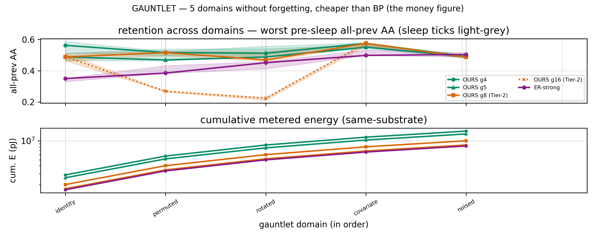

_The checkpoint read: worst-moment accuracy over all worlds seen so far (top) and cumulative metered energy
(bottom), the model's cadence family ("grid-N" = sleep every N stream segments) vs ER-strong. (n = 5 seeds,
median + IQR.)_ _Anchors for every accuracy here: 10-way chance = 0.1; the offline joint-training ceiling on this
stream family = 0.870._

- **Steadier retention.** The model holds worst-point all-previous accuracy at **0.490** across the whole stream;
  the tuned backprop baseline sags to **0.350** mid-gauntlet as it chases the newest world. Anytime accuracy is
  **0.519 vs 0.433**, and the final scores _tie_ (0.490 vs 0.504, inside δ).
- **Under an asymmetry that favors the baseline.** The model runs one frozen configuration across all five worlds;
  ER is given its own best tuned config. The frozen substrate is the steadier of the two.

A single checkpoint curve can mislead, so the same result is examined from four more angles.

### Angle 2 — batch by batch: the crash-and-relearn cycle

The checkpoint read above samples the stream at domain ends. Reading **every single batch** shows the mechanism
behind the difference, not just the score:

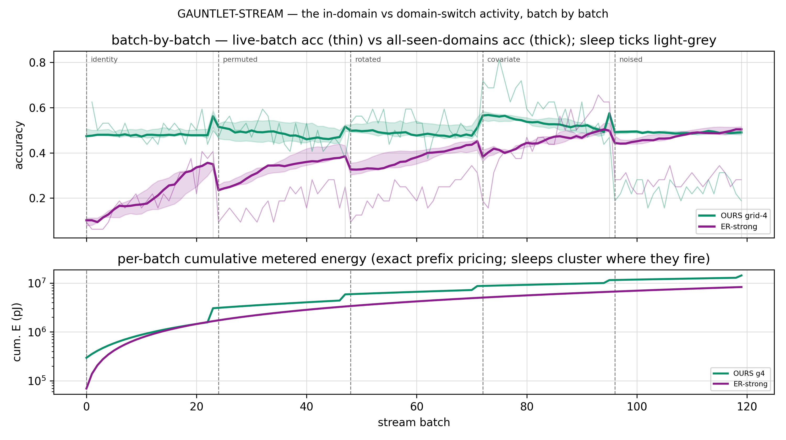

_Thick lines = accuracy over all domains seen so far; thin lines = accuracy on the live batch; grey ticks = sleeps
and domain boundaries._

ER's accuracy **crashes at every domain onset and re-climbs** — the saw-tooth of an end-to-end learner re-fitting
its whole representation to each new world (its live-batch accuracy drops to ~0.1 on arrival, mean 0.273 across the
stream). The model barely moves (live mean 0.469): the unsupervised bulk extracts usable structure from whatever
arrives, and only the namer re-anchors, at each sleep. The two systems reach a similar final score by different
routes — ER by re-learning each world, the model by never losing the earlier ones. Which half of the model produces
that steadiness is decomposed later (Phase 11). The bottom panel is the per-batch energy: a sleep _staircase_ for
the model, a smooth every-step ramp for ER.

### Angle 3 — reverse the world order

Running the identical gauntlet **backwards** — the noise-drowned world (`x′ = x + 0.6·ε`) first — forces the learner
to build its first representation from digits it has **never seen clean**:

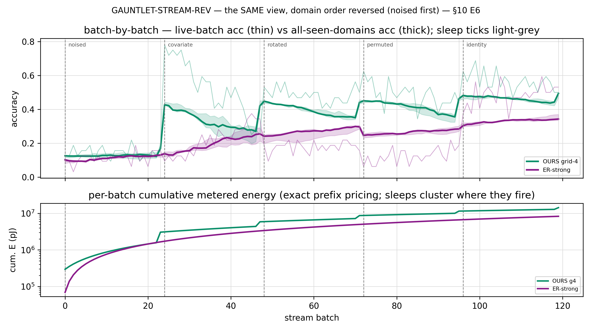

ER does not recover: **0.504 forward → 0.343 reversed.** Its network and replay buffer are shaped by noise early,
and every later world is learned on that base. The model lands at the same endpoint either way (**0.490 forward,
0.494 reversed**) — the bulk extracts structure even from an all-noisy opener, and each sleep re-anchors the namer.
The forward gauntlet was therefore ER's _favorable_ ordering; a lifelong learner does not choose the order the world
arrives in.

### Angle 4 — break the schedule

The committed stream had one structural convenience: the domain length (24 steps) equaled the sleep period, so every
sleep landed on a domain's final step — one consolidation just before every switch. To test whether the flat line
depended on that timing, the alignment is **broken deliberately**: long randomized domain lengths, sleeps landing
mid-domain, plus an aligned-length control to separate "alignment broke" from "domains got longer":

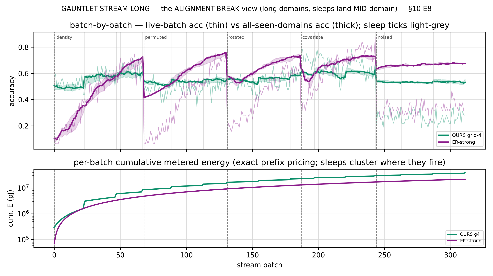

Sleep/boundary alignment is **not a factor**: the aligned control ties the misaligned run at a paired gap of
**+0.002**, and the model's retention _rises_ with the longer worlds (0.533). This angle also fixes the scope of the
result precisely: given ~68 steps per world, ER has time to fully re-converge before every checkpoint and finishes
higher (0.675). **The retention advantage belongs to the rapid-switch regime** — where the world shifts faster than
a plastic learner can re-fit. The model itself is order-invariant, alignment-invariant, and length-stable in every
layout tested; what changes with block length is the ranking, because the baseline's re-convergence time is what the
block length trades against.

### Angle 5 — reverse _and_ lengthen: a predicted mechanism, tested

In the reversed views the model's curve has a signature: it sags _within_ each block, then recovers at each sleep.
The mechanism is that the namer's frozen frame goes **stale** while the bulk keeps learning underneath it, so a sleep
landing _mid-domain_ should catch the sag mid-fall and pull it back. That is a falsifiable prediction, and the
reversed-long layout tests it directly (2–3 sleeps now land inside every world):

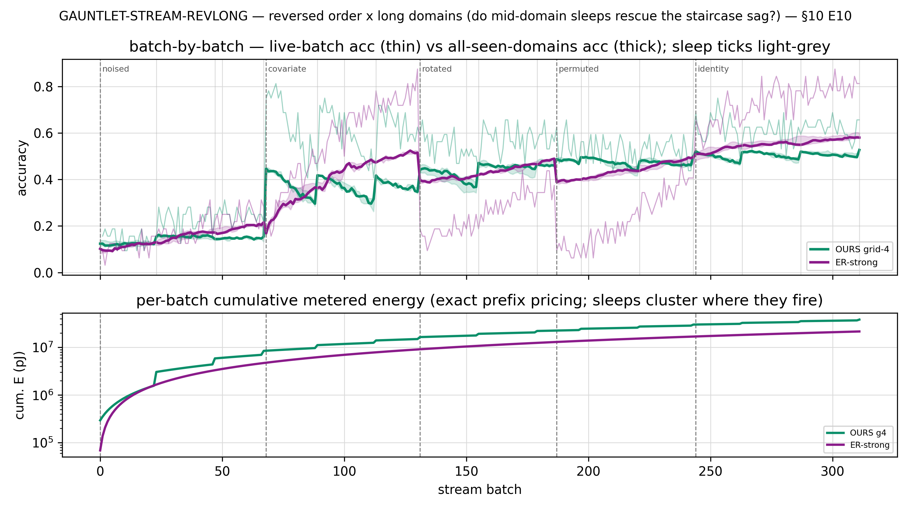

Mid-domain sleeps recover the sag in **5/5 seeds** (median jump +0.052 at each sleep tick), the floors between
sleeps _climb_ rather than run down, and the model is order-invariant at the long scale too (0.527 vs 0.533). The
result is banked as **supported rather than confirmed**: one confirming sub-cut was mis-specified (equal inter-sleep
segments measure rotation _rate_, not cumulative run-down), and a small bulk-level decay component remains flagged.
ER stays order-sensitive even at length (0.580 reversed vs 0.675 forward).

The reversed runs also identify **a limit of the model's own representation.** When it never sees the pure world
first, it does not collapse the way ER does — the endpoint is order-invariant — but it runs **thinner**: a
noisy-world-to-noisy-world stream offers far less pattern to anchor on, so the representation grown there holds its
classes on narrow margins, the between-sleep sags run deeper, and the whole curve climbs from lower ground. The
sleeps recover it; the margins widen only as clean-ish structure accumulates. This defines the next capability the
project targets: **a bulk that can recover the pure structure _itself_ from a noisy stream** — the clean data it was
never given — so accuracy holds regardless of arrival order. A deployed chip does not get a merciful curriculum.

**Across the five angles the retention result is consistent: the mechanism is visible batch-by-batch, it is
order-invariant and schedule-invariant, and its scope (rapid-switch streams) is measured rather than assumed.** The
one regime where the representation runs thin is identified, and the next phase is aimed at it. Full narrative behind
all five figures: [`draft6.0/src/phase10/phase10-report.md`](draft6.0/src/phase10/phase10-report.md) §P10.3.

---

## The rest of the benchmark — every axis, wins and losses

The gauntlet is the showcase; Phase 10 measured the whole object on every axis it claims, including the two it
loses.

### The head-to-head comparison on the lifelong stream

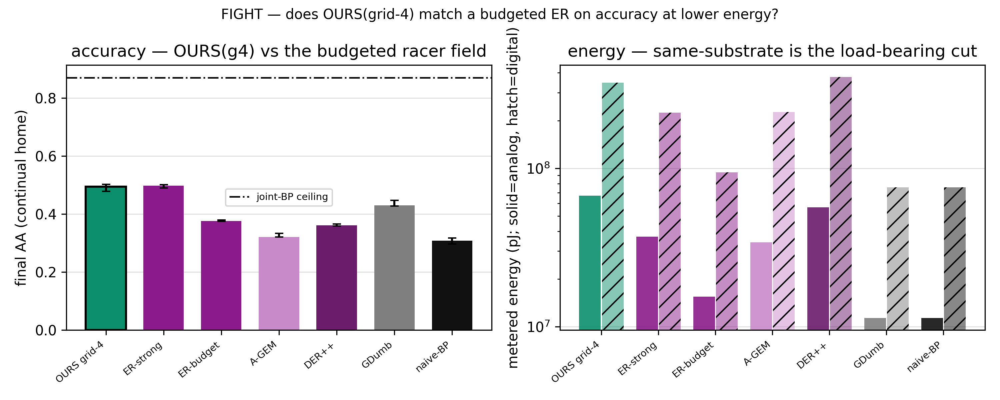

On the long lifelong stream the raw accuracy is a **tie** (0.494 vs 0.498, inside δ; the model wins 3/5 seeds) —
both far above the rest of the continual-learning field (A-GEM 0.320, DER++ 0.360, naive backprop 0.308) and below
the offline joint-training ceiling (0.870). The separation is in **worst-case forgetting: −0.028 vs −0.272.** The
tuned ER recovers by stream-end — which is what a final-score read hides — but at its worst mid-stream point it
forgets about **10× more.** For a system that must stay reliable while it keeps learning, that worst-case number is
the operative one.

### Noise — every held-out channel

The model is designed for analog hardware, so it was noise-hardened during training (Phase 6) and then tested on a
**held-out** noise battery — levels disjoint from anything used to tune, channels re-parameterized from the
training-era battery (a confirmation at new levels rather than a structurally novel attack):

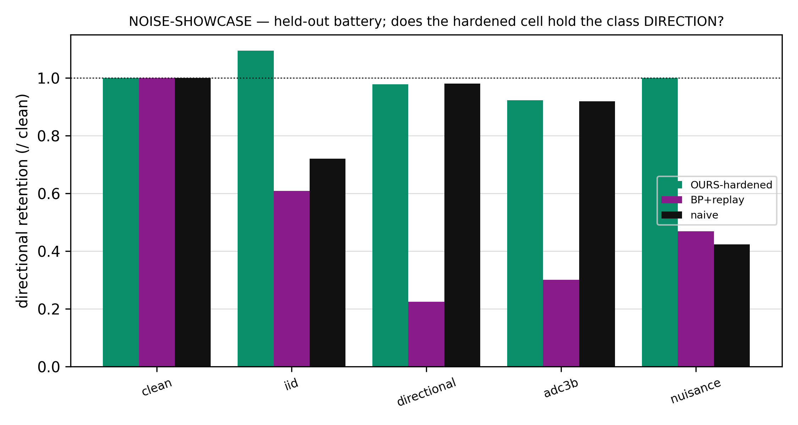

The model holds **0.92–1.10 retention on every channel** (retention here = accuracy under noise ÷ clean accuracy;
above 1.0 means the noise _helps_) — it _improves_ under iid noise, a side-effect of the noise-augmented training
objective — while the same BP+replay opponent collapses to **0.23–0.61**. A small residual on the directional/ADC
channels remains; it is the first work item of the future device-physics (SPICE/PVT) layer.

### Energy — where the advantage comes from

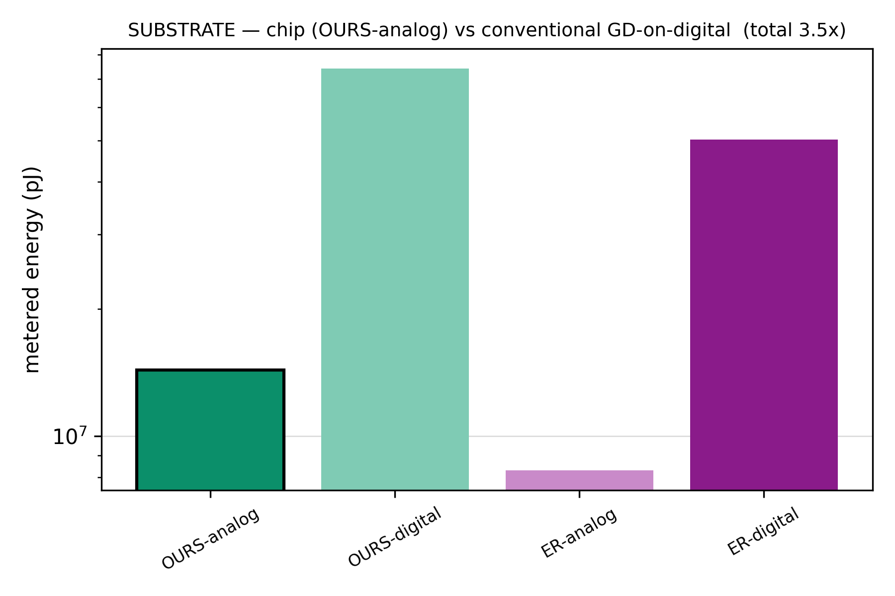

Both learners were metered on both substrates with a behavioral, ADC-centred macro-model — relative picojoules, not
SPICE, every per-op parameter and its literature source logged in
[`ref-report/methods.md`](draft6.0/src/ref-report/methods.md). The decomposition matters because it locates the
advantage precisely: **on the same digital substrate the algorithm _loses_** (≈1.5× more energy — a 12-layer bulk
forwarded on every input is not free against a small tuned net), and **the chip wins ≈3.4× because the analog
crossbar prices those bulk MACs near zero.** The energy edge is therefore **substrate-realized** — a property of the
chip, not of the algorithm. This is the concrete content of "why analog": this is the architecture that _needs_ the
crossbar, and the crossbar is what makes it cheap.

### The Pareto trade-off

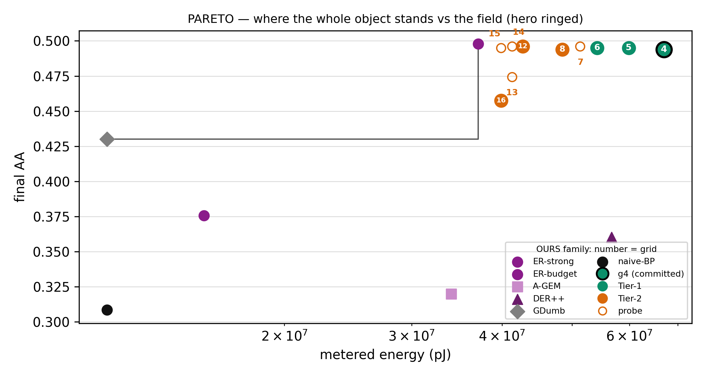

On a plain (accuracy × energy) frontier, a small tuned ER **dominates** this model — higher accuracy _and_ lower
same-substrate energy. This is the clearest single statement of what the object is and is not: for a plain
accuracy–energy trade-off a small tuned baseline is the better choice, and the model's genuine advantages —
worst-case safety, noise survival, the substrate floor — are on axes this plot does not have. The numbered line
across the top is the model's operating range along its _one_ runtime dial (the sleep cadence, declared in advance):
a ~0.49-accuracy plateau with its two cliffs mapped — worst-case safety degrades past grid-6, average accuracy
past grid-16
([`phase10-report.md`](draft6.0/src/phase10/phase10-report.md) §P10.2).

### The scorecard

| Axis                                      | Model (grid-4)           | Best fair opponent             | Verdict                                 |
| ----------------------------------------- | ------------------------ | ------------------------------ | --------------------------------------- |
| Final accuracy — continual home           | 0.494                    | ER-strong 0.498                | **tie** (inside δ)                      |
| Anytime accuracy — continual home         | 0.392                    | ER-strong 0.503                | **loss** (the sparse-sleep anytime tax) |
| Worst-case forgetting — lifelong          | **−0.028**               | ER-strong −0.272               | **win** (≈10× safer)                    |
| Worst-point retention — 5-domain gauntlet | **0.490**                | ER-strong 0.350                | **win** (rapid-switch regime)           |
| Order-robustness — reversed gauntlet      | **0.494** (vs 0.490 fwd) | ER-strong 0.343 (vs 0.504 fwd) | **win** (order-invariant)               |
| Noise retention — held-out battery        | **0.92–1.10**            | BP+replay 0.23–0.61            | **win** (every channel)                 |
| Final accuracy — easy natural digits      | 0.879                    | ER-strong 0.950                | **loss** (not a static competitor)      |
| Energy — same digital substrate           | 3.46e8 pJ                | ER-strong 2.25e8 pJ            | **loss** (1.5×, the deep bulk)          |
| Energy — chip vs conventional GD          | **6.70e7 pJ (analog)**   | ER-on-digital 2.25e8 pJ        | **win** (3.4×, substrate-realized)      |

**What the model does _not_ claim** — the scope is part of the characterization:

- **Not a static-accuracy competitor.** On short, easy, stationary data a tuned backprop wins (0.950 vs 0.879 on
  natural digits — scikit-learn's 8×8 set — and it forgets slightly less there, −0.019 vs −0.051): there is nothing
  there for the sleep loop to protect. The model's accuracy value is _lifelong stability on hard, long, shifting
  streams_.
- **The retention win is switch-frequency-scoped.** Given long stationary stretches, a plastic learner re-converges
  (Angle 4). The claim is exactly what a continual-learning substrate should make, and no more.
- **The algorithm alone does not win the energy race** — the substrate does. Same-substrate, the model costs 1.5×
  more.
- **Behavioral simulation only** — numpy, ideal floats, an analog-noise and analog-energy model (ADC-centred,
  literature-calibrated), but **no SPICE and no silicon yet**. That layer is future work.

---

## The limit — the same frozen model, on real data

Everything above is measured on data **we built.** The natural question is whether the results generalize to data
the project did not design, and it was the first one the project's own review raised: _do the wins live on toy
data?_ Three specific sub-questions follow: **(1)** the namer (SLDA) is off-the-shelf — _how much does the rest of
the architecture add over it?_ **(2)** the synthetic drift is _ours_ — _what happens on real-world drift?_ **(3)**
one width, one depth, one input size, ten classes — _does the behavior hold with scale?_ Phase 11 answers all three
with measurements. The deliverable is not a single verdict but a **map** that marks where the model wins, where it
loses, and where the data itself is uninformative.

The evaluation keeps the same disciplines as the showcase, with the asymmetry pushed _further_ toward the baseline:

- **Arm A — the frozen recipe.** The committed object, **bit-for-bit** (a guard verifies it reproduces the freeze
  arrays exactly), forced through a **40-dimensional random porthole** so every arena — an 8-D electricity stream
  or a 784-D image — enters at the exact width the object was frozen at. Nothing tuned. _Does the committed object
  survive contact with real data?_
- **Arm B — the scaling rule.** The same architecture rebuilt to one **pre-registered size law** (input
  D = min(native, 160), width 1.6·D, depth 12) — declared _before any run_, fitted to nothing. _How much of the
  porthole loss returns at native scale?_
- **The opponent** — the same ER-strong, now **re-tuned separately for every arena** on a held-out seed, while the
  model stays frozen. The recipe is fixed; the baseline is fitted to each world, so a win by the frozen recipe is a
  conservative one.
- **The verdict grid** — every (arena × capability) cell is **win / tie / loss / FLOOR**, thresholds pinned in
  advance. A **FLOOR** marks a cell where _no method_ — the model or the baseline — beats the trivial predictor, so
  the comparison there is uninformative rather than favorable or unfavorable.

### Decomposition — what the learned bulk adds over the namer

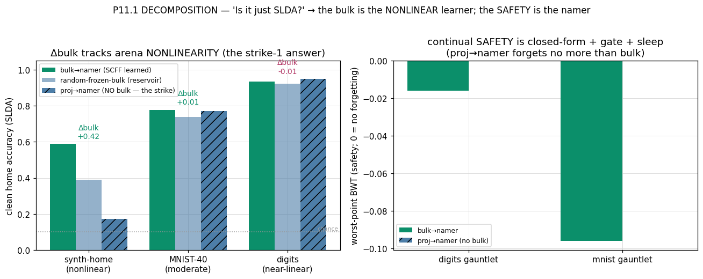

The test feeds the _same_ closed-form namer either the learned 12-layer bulk's features or a plain random projection
of the raw input, and measures the difference (**Δbulk**) across arenas from linear-easy to nonlinear-hard, with a
**random-frozen 12-layer stack** (a reservoir) as the control that separates "learned structure" from "12 nonlinear
layers merely exist."

- **Where a linear head is at chance, the learned bulk is decisive:** it lifts the namer from 0.172 to 0.589
  (**Δbulk +0.417**), and it clears the random reservoir (0.389) by a wide margin — so the lift is **learned**,
  not depth as such. On noise, at matched clean accuracy, the bulk adds +0.086/+0.215 — the noise-augmented
  training acting through a channel a random projection cannot reach.
- **Where a linear head already saturates** (easy digits, raw-SLDA 0.950), the bulk is **redundant** (−0.014): it
  adds nothing where nothing is needed, which is the expected behavior of a feature learner on linearly-separable
  data.
- **The safety channel attributes differently:** a namer with _no bulk at all_ forgets no more than the full
  object — so the continual safety lives in the **closed-form namer + gate + sleep**, not in the bulk.

The decomposition answers the question with a division of labor: the **bulk is the nonlinear feature learner**,
decisive where the data is nonlinear and redundant where it is not (and demonstrably learned rather than incidental
depth); the **continual safety is the closed-form loop.** Both halves are measured, not asserted.

### Real-world drift — the gas-sensor stream

The four real streams are worlds where the drift is not injected by anyone — sensors age, subjects change, prices
move, terrain shifts. The read is **prequential accuracy** (predict every batch _before_ training on it — the online
read), and every learner is compared against the **no-change** baseline: predict the previous label.

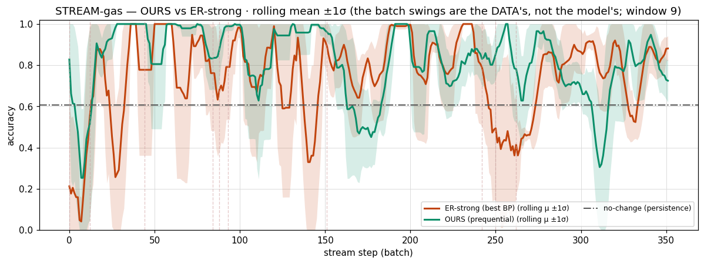

On gas-sensor drift — a benchmark where sensors chemically age over months — the frozen recipe, untouched and
through the porthole, is the strongest online learner in the comparison: **0.789 vs the per-arena-tuned ER's 0.756**,
both far above persistence (0.605). It pulls ahead in the late stream, where the sensors have aged most. Sensor aging
is a coherent covariate shift, which is the drift the unsupervised bulk + sleep re-anchoring was built to track while
the closed-form namer does not catastrophically forget. The scaled Arm B reaches **0.856**. The volatility bands
overlap — ER's line swings as wide as the model's — so the swings reflect the _data's_ difficulty rather than the
sleep loop.

### Where no learner wins — the persistence floor

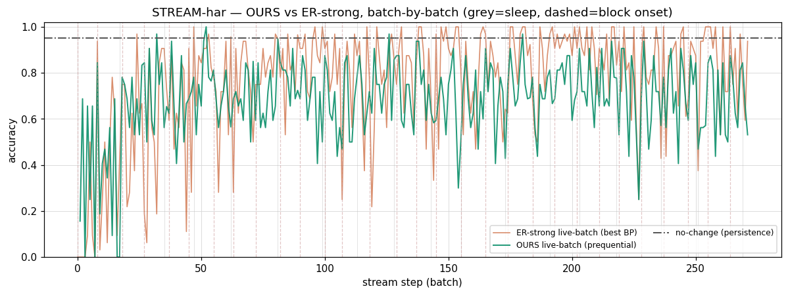

On the other three streams (activity recognition, electricity, forest cover) **no method wins** — not the model, not
the tuned ER, not anything that reads the features — because the labels barely change between consecutive samples, so
"predict the previous label" scores 0.65–0.95 and sits above every model. This is a documented property of these
benchmark streams (the ELEC2 autocorrelation trap; Souza et al. 2020), a property of the data rather than of any
model, so the map marks those cells **FLOOR**. Two facts inside the grey are worth stating: the field leads the
model by ~0.07 within the floor, and **the synthetic gauntlet's near-zero forgetting does not carry to continuous
natural drift** — nature drifts between every sleep rather than in blocks, so the namer's frame goes stale mid-stream
(gas worst-point forgetting −0.333). This is why prequential accuracy, not worst-BWT, is the reported headline read
on real streams.

The separation this draws is the useful result: **drift-difficulty vs data-difficulty.** Where the drift carries
information (gas), the design pays off and the frozen recipe wins. Where the difficulty is label autocorrelation,
every model floors together, and the map reports that regime as uninformative rather than dropping the datasets.

### The safety signature on real MNIST

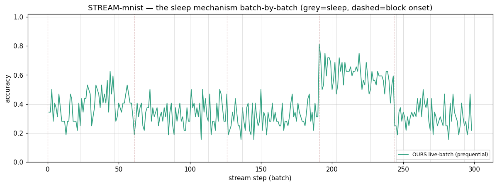

The showcase gauntlet, rebuilt on real MNIST: same shape, real pixels. **ER rides higher _inside_ each stationary
world and crashes toward ~0.1 at every switch; the model rides lower but far flatter and does not collapse at a
switch.** The frozen object forgets less at its worst moment in **every cell** of the rung — **~4–16× less on the
long-block primary read** (~2–10× on rapid switches) than the per-arena-tuned ER — wins retention on long blocks, and
is order-invariant (|forward − reversed| ≤ 0.011). Static accuracy trails, because the 40-D porthole discards most of
MNIST's spatial structure and the object is not a static competitor; but the **pre-registered scaling rule recovers
it on schedule**: doubling the porthole lifts accuracy 0.284 → 0.421 and retention 0.223 → 0.314 with the safety
intact. The identity measured on synthetic data is not an artifact of synthetic data.

### Changing the kind of data mid-stream

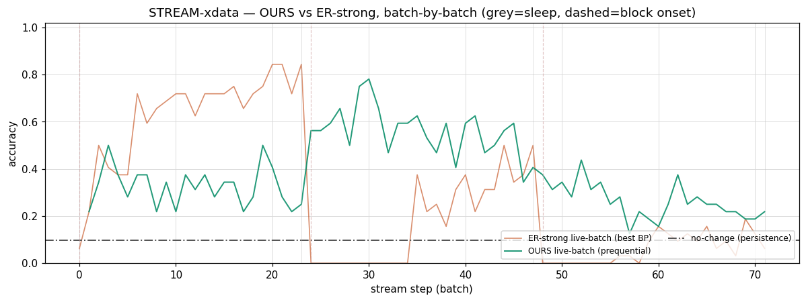

The most demanding test in the phase: **MNIST → Fashion → CIFAR-gray as one 30-class stream**, through a front end
fitted only on the first source, so the object never re-fits when the _kind_ of data changes. ER learns the first
block to a higher accuracy than the model, then **collapses to ≈0 at each data-type switch** — its trained head has
never seen the new classes and its replay buffer is shaped by the old world. The model **degrades gracefully**, rides
_above_ ER through the entire second block, and keeps **all three data types alive** to the end — even the weakest
(CIFAR-gray) holds ~4× chance while the label space grows to 30-way. Order-invariance holds even across data _types_
(|Δ| ≤ 0.007), a direct consequence of the closed-form namer: there is no gradient path an ordering can bias. One
cell is a loss with a known cure: at the frozen porthole width, worst-point retention trails ER (0.415 vs 0.534); the
pre-registered scaled instance reverses it (**0.581 ≥ 0.551**).

### Scaling — three reads, one of them against a prior guess

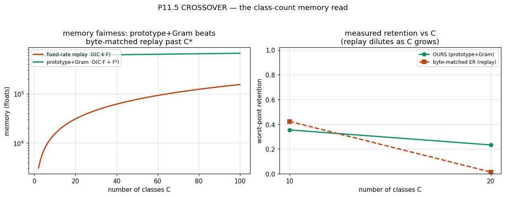

- **Memory, both halves.** On raw bytes the closed-form namer **does not** beat a replay buffer — it carries a large
  fixed cost (per-class means + a shared covariance), shown in the left panel. But on worst-point retention as
  classes accumulate, it **crosses at C = 20**: the byte-matched replay buffer splits its budget 1/C per class and
  **dilutes to ≈0 retention (0.014)** while the namer holds (0.233), because an exact running mean does not dilute.
  A replay buffer forgets by _crowding_; a prototype memory does not.

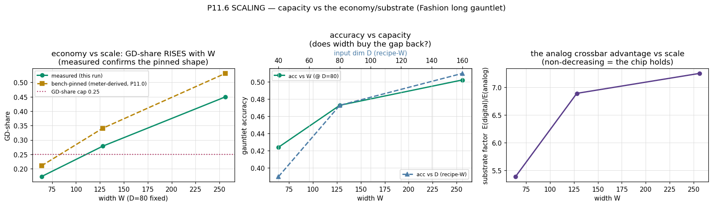

- **The economy — a pre-registered guess, revised by the data.** The plan expected the 80/20 energy split to
  _improve_ with width. The meter's own algebra predicted the opposite before any run (the closed-form solve is the
  worst-scaling term), and the runs confirmed it: GD-share — the namer's metered energy share (a historical name;
  the deployed namer is closed-form) — **rises** with width, crossing the 0.25 cap (the pre-registered ceiling for
  that share). The revised result is reported alongside the wins, which is the purpose of pre-registration.
- **The substrate advantage grows with width: 5.4× → 7.4×** across the sweep — the crossbar prices the extra bulk
  MACs near zero exactly where a digital machine pays the most for them. The larger the model, the stronger the case
  for the analog substrate. Capacity itself behaves as expected (accuracy 0.42 → 0.50 over width, 0.39 → 0.51 over
  input size, safety intact throughout).
- **Real-time throughput, scoped.** On the gas stream, at a shared compute budget, the retention-tuned ER must
  **drop ~31 % of the stream** to keep pace while the frozen recipe processes everything — a regime advantage that
  _inverts_ on the synthetic home where the model is the heavier one, so the throughput economy is arena-dependent
  rather than universal.

### The limit map — the deliverable

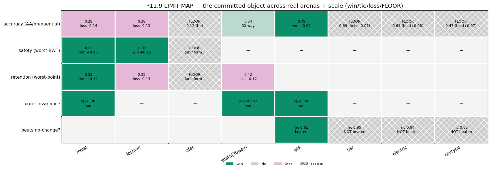

Everything above collapses into the picture the phase was for — **8 arenas × 5 channels, every cell scored:**

- **Wins (teal):** continual **safety** on every non-floor arena · **order-invariance** everywhere it is measured,
  even across data types · **gas** — a real-drift accuracy win over a per-arena-tuned opponent · and every scaling
  read (the substrate factor that grows, the C=20 retention crossover, the gas throughput regime).
- **Losses (pink):** static accuracy on MNIST and Fashion (a continual learner, not a static one — the same loss the
  showcase reported, reproduced at scale) · retention on two arenas at the frozen porthole width (both recovered by
  the pre-registered Arm B).
- **Floors (grey):** CIFAR-gray (a native-resolution floor — the joint-training _ceiling_ there is 0.199, so no
  learner separates) · the three autocorrelated streams (the persistence trap — the field floors alongside the
  model and leads ~0.07 inside it).

**The limit map bounds what the showcase claimed: the wins hold off the synthetic bench — real drift, real pixels,
real type-shifts, growing scale — and every place the model loses or the data is uninformative is drawn on the same
sheet.** The map states where the behavior is a win, a loss, or uninformative, which is the intended deliverable. Full
narrative, rung by rung:
[`draft6.0/src/phase11/phase11-report.md`](draft6.0/src/phase11/phase11-report.md); the two trials (the race + the
map) as one arc: [`draft6.0/src/validation-report.md`](draft6.0/src/validation-report.md).

_That is the result. Below: what the model is, how eleven phases produced it, and where to read deeper — stop here
and you have the shape of it, or descend._

> **What this is.** A solo research project (evenings and weekends) that rebuilt a small piece of a field from the
> substrate up. The current architecture — **draft 6.0** — is validated across **eleven phases of behavioral
> simulation** (~70 controlled experiments, 5 seeds each, every figure regenerable from saved arrays). What follows
> is the whole story, told with the same discipline as the benchmark above: failures are data, scope is part of the
> claim.

---

## The analog frame

Everything above is behavioral simulation — numpy, ideal floats, an ADC-centred noise-and-energy model, no SPICE and
no silicon. This is the frame it all sits in, stated in full.

The analog chip is the **constraint-giver and the destination, not the deliverable** — no cleanroom, no op-amp
schematics; solo evenings don't buy one, and the project never needed one. What we build
is the learning architecture that _would survive that substrate_: weights that never leave their cells, no global
backward pass, noise treated as a fact of life, energy priced by physics. Every analog reference in this repo exists
to import a **constraint** into the math — the question is "if we wanted this on a chip, what should the model be?",
answered in simulation first, in plain binary, before anyone melts sand.

The method underneath is one line: **copy the brain's _function_, cheat the _implementation_.** You can't simulate a
real neuron one-to-one, so don't — reproduce _what it does_, and pay for each principle with whatever is cheap here:
analog physics where physics is cheaper, modern ML math where math is cheaper.

The physical picture whose constraints the math honors — the capacitor weights, the crossbar, the single forward
sweep — is the substrate just below.

## The substrate (the chip)

- **The atom — the Scap.** One synapse's weight: **magnitude as analog charge on a capacitor, sign as one SRAM
  bit.** A Scap is a _wire_, not a neuron — its current already encodes pre × post.
- **Compute in the wires.** A **crossbar** of Scaps performs the multiply-accumulate as physical current; hardwired
  op-amps do add / multiply / ReLU directly on charge. There is no ALU moving data around — _the computation is
  where the weights physically are._ The field calls this **compute-in-memory**.
- **Mono-forward.** A single forward sweep carries a _positive_ and a _negative_ world side by side through the
  _same_ crossbar, so the contrastive learning costs one charge cycle, not two — only the cheap activation buffers
  double, not the weights.
- **Committed properties:** **online · sparse · continuous · resident-weight** (weights never leave the chip during
  operation).
- **Naming and scope.** Biological names in this repo are **labels for circuit roles** — "hippocampus LUT" names the
  organ's job (store & replay), not a biology claim. And the substrate's physics debts — capacitor leakage, write
  precision, PVT — are **named as deferred device physics** in
  [the frozen architecture file](draft6.0/src/phase9-final-architecture.md); they are the first work items of the
  analog-constraint (SPICE-grade, simulation-only) pass, and no result on this page depends on ignoring them (noise
  is already modeled behaviorally — see the noise showcase above).

---

## The machine that ran the race

The committed object, part by part — each of these was _chosen by an experiment_, not assumed:

- **The bulk:** 12 layers of SCFF under a sharpened contrastive objective (InfoNCE, two views, temperature 0.2, a
  2-layer coordination window), with one view noise-corrupted during training. Forward-only, label-free, learns
  from **every** input, never written to by anything downstream.
- **The namer:** **SLDA** ([its lineage, and every method's, in the glossary](draft6.0/src/ref-report/papers.md)) —
  closed-form streaming class prototypes over the bulk's features. No gradient, no
  backward pass; metered **69× cheaper** than the runner-up, and it _ties_ gradient-trained heads on accuracy.
- **The gate:** a drift detector decides when the namer fires at all. Metered live, naming is ~11–18 % of substrate
  energy — the 80/20 is real, and the gate is a **safety** mechanism: firing more forgets more.
- **The sleep:** every 4 stream segments, a closed-form re-fit of the namer over a small prototype memory (the
  "hippocampus LUT", class-balanced eviction) re-anchors the labels to wherever the bulk has rotated to.

_The whole model — every part, every equation, every decision that chose it — in one self-contained file:_
[`draft6.0/src/phase9-final-architecture.md`](draft6.0/src/phase9-final-architecture.md).

## What we built, and what it found — eleven phases

Draft 6.0 was walked down a simulation ladder one rung at a time, under one rule: **failures are data — never tune
until it passes.** Each phase picks up the wound the last one left, so the eleven read as one story. **Stage 1**
built and hardened the cheap brain; **Stage 2** built the precise namer and froze the whole object; **the
validation** raced the frozen object against a fair opponent, then took it to real data.

**Stage 1 — the cheap brain (Phases 1–6):**

1. **Structure.** One block generalizes better than backprop (smaller memorization gap) at ~10 % of the backward
   cost — but its real home is the **continual** regime, where a periodic _sleep_ recovers what online backprop
   catastrophically forgets. The wound it opens — SCFF clusters by **density, not class** — drives the next four phases.
2. **Depth, round 1.** A deep stack of the cheap learner _can't_ earn depth — not even a perfect label oracle bends
   the curve. (Depth, it turns out, comes from boosted _shallow_ blocks.)
3. **Depth, round 2 — the big correction.** The wall wasn't locality; it was the _objective_. Swap energy-goodness
   for a **contrastive** objective + a cross-layer **coordination window**, and depth composes. _This is adopted._
4. **Characterization.** A capability map against a _genuinely-tuned_ backprop across seven axes
   ([the map](draft6.0/src/phase4/figs_summary/CAPABILITY_MAP.png)): **wins** continual, nuisance-dimensional input,
   depth-composition, and depth-is-cheap; **trails** static accuracy and many-class; one **negative** on
   eval-time weight noise. No hidden bug.
5. **SCFF close-out.** The map's one open wound — the representation _decays_ past ~layer 5 — was **direction**
   (density ≠ class, a fifth time), and it was **curable**: a sharper objective earns the depth back until the
   readout _beats_ a genuinely-tuned backprop, and a short fixed reader reads it ~8× cheaper. _The cheap brain's
   learning is finished._
6. **Noise-hardening.** Before handing it on, the cheap brain is hardened against the noise it will meet on analog
   hardware — a forward-only, noise-augmented objective that _improves_ clean accuracy and keeps the continual win.

**Stage 2 — the precise namer (Phases 7–9):**

7. **The readout — it is NOT gradient descent.** A bake-off of "namers" was won by a **closed-form** analytic head
   (RanPAC / SLDA) — no gradient, no backward pass. So the "20 % GD" is a _role_, not a _method_: **the committed
   chip contains no gradient descent at all.**
8. **The economy, run live.** Both brains ran together for the first time; a drift **gate** meters the 80/20 for
   real (the namer is ~12 % of substrate energy) and — the surprise — the gate is a **safety** mechanism: _firing
   more forgets more._ Against the like-for-like BP+replay it was metered on, the model cost ≈ **half** the energy;
   _(Phase 10's smaller, harder-tuned ER later turns that same-substrate comparison into the 1.5× loss in the
   scorecard, which is exactly why the energy claim is banked as substrate-realized, not algorithmic.)_
9. **Freeze.** The founding assumption, finally _measured_: the cheap brain **rotates but does not forget**, so
   sleep stays cheap. The lifelong maintenance loop was tuned on internal signals only, then **locked at a commit
   hash** for the final race.

**The validation — the frozen object on trial (Phases 10–11):**

10. **The race.** Everything in the showcase above — the frozen object vs a fair, budgeted, _tuned_
    experience-replay backprop, verdicts pinned in advance. It **ties** on the hard continual home, **trails** on
    natural digits, and **wins** continual safety (≈10× less forgetting), the gauntlet, and noise (every held-out
    channel).
11. **The limit map.** Everything in _The limit_ above — the same frozen object on eight real arenas and scale:
    the decomposition of bulk vs namer, **gas** a real-drift win over a per-arena-tuned opponent, the
    safety signature surviving real MNIST and cross-dataset streams, and the substrate advantage **growing** with
    width — with every loss and floor on the same map.

## The verdict

A **substrate-native continual learner** — competitive on its home, decisively **safer**, far more **noise-robust**,
and with an energy edge over conventional GD that is **substrate-realized** (the analog crossbar), not algorithmic.
It is _not_ a static-accuracy competitor, and it was never optimized to be one, which is what makes the _tie_ on the
home a genuine result rather than a target. And it carries its own punchline: a project set out to be "brain-function,
cheap-implementation" **ended with no gradient descent anywhere.**

On a same-substrate energy-vs-accuracy Pareto a small tuned baseline _dominates_ this model — plotted above, next to
the axes it _does_ win. Every result is reported with its scope, its confounds, and what it does _not_ show, because
that is how the project reaches conclusions it can trust.

---

## The north star — what this is building toward

Everything above is **one organ.** Placed on its own, the benchmark can read as one more continual-learning pipeline
built from known parts. The destination is what makes it a program, and it is stated here in the words the project
started from ([the essence](docs/essence/the-essence2.md), where it is told in full):

> Underneath the chip is a question I sat with from 1 a.m. to 8 a.m: **how do I know I'm
> right?** Not how a network classifies — how **I** know. When I work out what I owe, when I'm sure 1+1=2 — nobody
> hands me a label. There's a _feeling_. An "I get it," sitting in the same place as tired or sad. And I wasn't
> born with it; I learned what correct feels like from my mother and father, the way I learned hot soup is hot.
> **Correctness is a feeling, and the feeling is taught.** And a mind isn't a lookup — it's a loop. Ask me whether
> a car is orange and I don't calculate: an apple surfaces first — held against the car — no, not that red; the
> next pass carries _and not apple-red_, and searches again, until _orange fruit_ surfaces and something quietly
> says _yes._ Not certain — just close enough. **Hold a little in front of you, call the rest from memory,
> compare, reject, search again, until the feeling says stop.** That loop, kept running for a whole life, never
> frozen, is the thing I'm actually building toward.

Stated as architecture: an **unsupervised recurrent network that thinks to itself** — heterogeneous brain parts on
one loop. A cortex that organizes the world without labels. A hippocampus that stores, replays, and talks back. A
recurrent thread that holds the current thought and interrogates memory with it, halting on a **self-generated
feeling of correctness** — a feeling a teacher _taught_ it, without a single label. In that picture, everything
"supervised" is just the **translation brain** at the boundary: the small organ that converts between our labels
and the loop's internal structure. **The intelligence is unsupervised; supervision is I/O.** _(And far beyond the
current mental model — a body in a physics world, where the only label is natural law — named once here, and left
alone.)_

Where that road stands:

- **The neocortex — built.** The organ this whole page validates: unsupervised bulk + drift-gated closed-form
  namer + sleep. Eleven phases, limits mapped.
- **The hippocampus — next.** Today it is deliberately a stand-in: a pure prototype LUT that stores, evicts, and
  replays but does not _learn_. Growing it into a real organ — one that consolidates, generalizes, and talks back
  to the cortex — is the next build.
- **The loop — after the organs.** Not specced yet (**simple intelligence first**), but its seeds are already
  inside the frozen object on purpose: the drift gate is a _halt_ that fires on a direction, never a confidence
  magnitude (Phase 8), and the spine-clean cosine margin survives as the candidate for the feeling itself
  (Phase 7). The research dossier for the loop:
  [`research/north-star/`](draft6.0/research/north-star/README.md).

**How firmly to read this — a compass, not a roadmap.** The destination is fixed; the route is not. This section is
here for **inspiration and rough research direction**, not a plan committed 1:1 — each organ gets built only if the
experiments say it can be, and the loop especially is a **hypothesis, not a promise.** If the next stage — growing
the hippocampus into a real learning organ — comes back saying the path is impossible, then the path changes,
without apology. That is not hypothetical: the neocortex above only reached its final shape after the plan was
re-cut more times than I can count. Read this as where the work is _pointed_, not what it is guaranteed to _ship_.

On the fair question — _is the baby neocortex just known theories, composed?_ — the decomposition above is the
answer: **partly, and the map measures which part is whose** (the continual safety is the closed-form loop; the
learned bulk earns its keep where the data is nonlinear). What is not on a shelf is the composition under substrate
constraints, its measured identity, and this organ's place in the loop.

## The horizon (near-term)

- **The hippocampus organ** — the first north-star step (above).
- **The noise-first limit (named by Angle 5):** a representation grown without ever seeing clean data runs on thin
  margins. The capability target: a bulk that recovers the pure structure _itself_ from a noisy stream, so
  accuracy holds regardless of arrival order.
- **The analog-constraint sharpening pass (SPICE-grade, in simulation):** the PVT / device-noise realism the
  ladder deferred until the ideal converged (it now has); the named directional/ADC residual from the noise
  showcase is its first work item. _A simulation-realism layer, not a fabrication step._

---

## The project in one look

```
Bio-AnalogCPU/
├── README.md              ← you are here — the front page
├── CLAUDE.md · AGENTS.md  the agent operating context (how to work in this repo)
├── docs/
│   ├── essence/           the soul — the-essence2.md (the grown spine) + the-essence.md (the seed)
│   └── draft/             the project history, drafts 1 → 6
├── draft6.0/              ★ the live line — the validated architecture
│   ├── README.md          the draft's whole story (why 5 died, what 6.0 is)
│   ├── context.md         the cold-start dump for an agent
│   ├── idea/              the design + the N1–S15 decision record
│   ├── research/          the papers behind it (+ the north-star dossier)
│   └── src/               ★ the results: the three report volumes (stage1 · stage2 · validation) · phase1..11/ · phase9-final-architecture.md
├── draft5.0/              the superseded attribution era (pre-pivot history)
├── draft-journey/         every earlier draft (1.0 → 5.1) in full
└── post/                  build-in-public writeups
```

**The eleven-phase arc, one line:** P1 structure · P2 the depth-wall · P3 the objective-reframe (contrast supersedes
energy) · P4 the capability map · P5 depth cured · P6 noise-hardened — _the cheap brain, Stage 1_ — then P7 the
readout (it is **not** gradient descent) · P8 the economy (the gate is _safety_) · P9 freeze — _the namer,
Stage 2_ — then P10 the race → **the verdict, S14** · P11 **the limit map** takes the frozen object to real
data + scale (real streams, gas a genuine win, honest floors) → **S15** — _the validation._
(S-numbers = verdicts banked in the [decision record](draft6.0/idea/main.ideas.v1.md).) Discipline throughout:
_freeze in P9, judge in P10._

---

## Start here — the reading ladder

Every layer is written to be a valid stopping point: each one gives a true, complete picture at its own depth, and
each one links down to the next. Descend only as far as you care to.

| Depth | Read                                                                                                                                                                    | What you get                                                                                                                                                                 |
| ----- | ----------------------------------------------------------------------------------------------------------------------------------------------------------------------- | ---------------------------------------------------------------------------------------------------------------------------------------------------------------------------- |
| **0** | this README                                                                                                                                                             | the result + the shape of the whole project                                                                                                                                  |
| **1** | [`draft6.0/README.md`](draft6.0/README.md)                                                                                                                              | the draft's whole story — why draft 5 died, what 6.0 is, what eleven phases found                                                                                            |
| **2** | [`stage1-report.md`](draft6.0/src/stage1-report.md) · [`stage2-report.md`](draft6.0/src/stage2-report.md) · [`validation-report.md`](draft6.0/src/validation-report.md) | the three executive volumes — the cheap brain built (P1–6) · the namer built + frozen (P7–9) · the frozen object on trial (P10–11); each phase's full story, self-sufficient |
| **3** | [`phaseN/README.md`](draft6.0/src/README.md) → `phaseN/phaseN-report.md`                                                                                                | one phase's verdict at a glance → the deep narrative with every figure                                                                                                       |
| **4** | `phaseN/expK/experiment-K.md` · `RESULTS.md`                                                                                                                            | the raw per-experiment record — every number, no narrative                                                                                                                   |

**Reproduce:** every figure regenerates from saved arrays — each phase ships a `plot_pN.py` with a
`regen <run-dir>` mode (numpy stack; see any `draft6.0/src/phaseN/` folder).

And the side doors, for readers with a specific question:

| If you want…                                                                           | Go to                                                                                    |
| -------------------------------------------------------------------------------------- | ---------------------------------------------------------------------------------------- |
| **The whole model in one self-contained file**                                         | [`draft6.0/src/phase9-final-architecture.md`](draft6.0/src/phase9-final-architecture.md) |
| **The real-data limit map**                                                            | [`draft6.0/src/phase11/phase11-report.md`](draft6.0/src/phase11/phase11-report.md)       |
| **The soul — why this exists (the human story)**                                       | [`docs/essence/the-essence2.md`](docs/essence/the-essence2.md)                           |
| **The north star — the thinking-loop destination (the research dossier)**              | [`draft6.0/research/north-star/`](draft6.0/research/north-star/README.md)                |
| The committed design decisions (N1–S15)                                                | [`draft6.0/idea/`](draft6.0/idea/README.md)                                              |
| The simulation code (per phase, regenerable)                                           | [`draft6.0/src/`](draft6.0/src/) (`phase1..11/`)                                         |
| The papers behind it                                                                   | [`draft6.0/research/papers/`](draft6.0/research/papers/README.md)                        |
| The whole project, cold, for an AI agent                                               | [`draft6.0/context.md`](draft6.0/context.md) · [`AGENTS.md`](AGENTS.md)                  |
| How the architecture evolved (drafts 1 → 6)                                            | [`docs/draft/project-history.md`](docs/draft/project-history.md)                         |
| The superseded draft-5 (attribution) era — _pre-pivot history, not the current design_ | [`draft5.0/`](draft5.0/CLAUDE.md)                                                        |

---

## How this is built — human + AI

We build this in the open, and with a lot of help. The repo has a `.claude/` folder and a dozen-plus `CLAUDE.md` files sitting in plain sight — nothing hidden — so let us just say it: **this project is built in close collaboration with AI agents (Claude and others).** They help us **write the code, run down the research, and draft most of the reports.** We're a undergraduate and we don't yet have deep expertise in half the fields this touches; the AI is how we cover that gap and move at the pace.

What the AI does **not** do is decide what is true. Every result, every number, every claim on this page we **re-derive, re-run, and re-read myself** before it stays — and we have thrown out plenty that did not survive that. The architecture decisions, the experiment designs, and the "does this actually hold up?" judgments are mine. So: **AI-assisted and human-verified — not vibe-coded.** I would rather state that plainly here than have anyone feel they have "caught" it.

---

## Scope & status

- **What this is:** the **math model** for an analog learning chip — a learning architecture designed and
  validated _under the chip's constraints_ (resident weights, forward-only, per-sample, noise as a given, energy
  priced by physics), in numpy behavioral simulation on small classification / statistics tasks.
- **What this is not (by choice, not omission):** circuit design, computer architecture, ALU/ISA work, SPICE
  decks, or fabrication. Every analog reference in this repo imports a **constraint** into the math; none of them
  promises silicon. Also not SOTA-benchmark-chasing — small tasks are probes, not claims. _(The repo keeps its
  original working title — the object is a compute-substrate design target, not a CPU in the instruction-stream
  sense.)_
- **Done:** the neocortex organ — both brains, characterized, validated, **frozen, and raced** (Stage 1 build =
  P1–6, Stage 2 build = P7–9; the validation = P10–11, _freeze in P9, judge in P10_; S14). The founding bet is
  **refined, not inflated.** And then **validated on real data + scale** — Phase 11, the limit map (S15): the
  frozen object across eight real arenas (real drift streams, cross-dataset, scale sweeps), every cell win / tie /
  loss / **FLOOR**.
- **The bet stays chip-shaped, not chip-promised:** that brain-like computation can be made the _cheap_ path on
  the right substrate — proven first where a solo student can prove it: in simulation, in binary, before anyone
  melts sand. **Next build: the hippocampus organ** (the north star, above).
