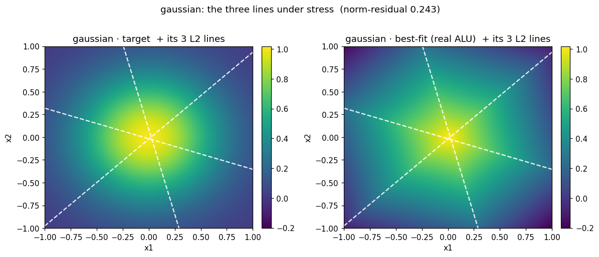
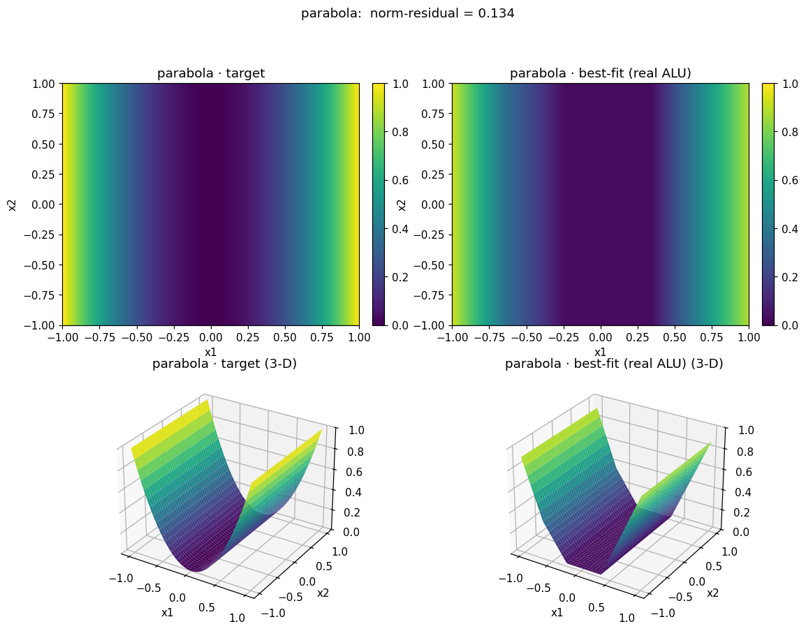
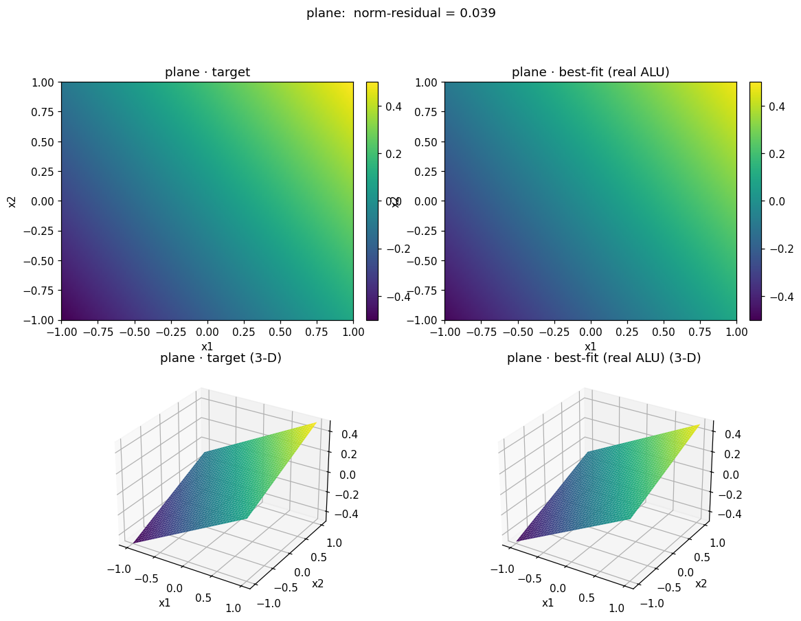

# Rung-0 · Step-2 reachability (target | best-fit) + stress (xor, gaussian)

### gaussian.png

### gaussian_lines.png

### parabola.png

### paraboloid.png

### plane.png

### saddle.png

### xor.png

### xor_lines.png

