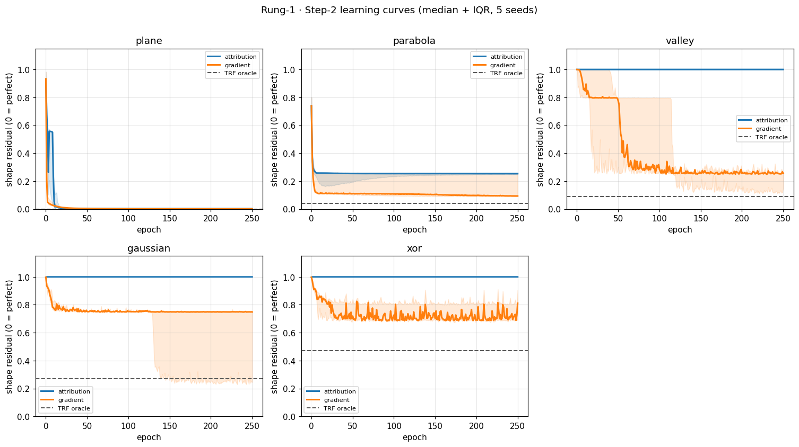
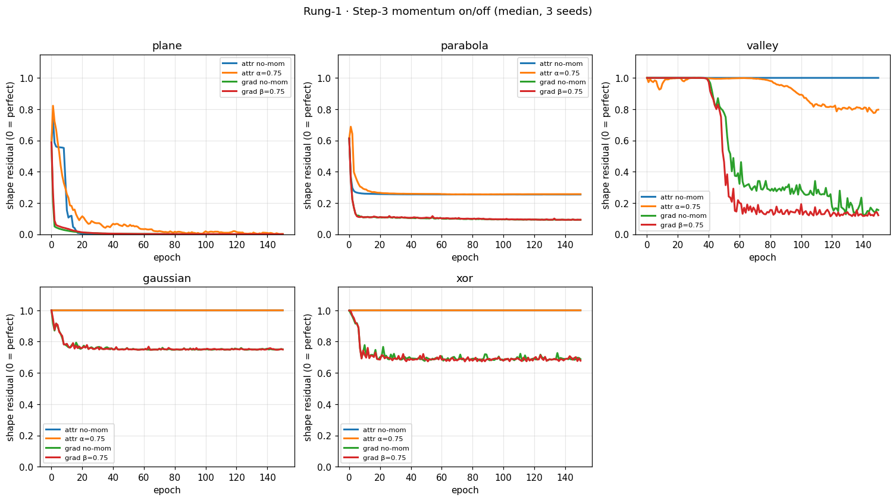
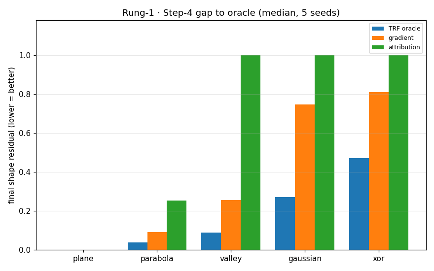

# Rung 1 — Can it *learn* the shapes? (attribution vs gradient)

> Read rung 0 first — it shows what one Ganglion *is* (creases + flat ramps) and what it *could*
> represent (the oracle ceiling). This rung asks: can a **real learning rule** get there — the chip's
> own attribution rule vs textbook gradient descent?

## The one-line result

> **Attribution learns any *monotonic* shape — a tilt, even a curved rise — but cannot carve an
> *interior fold*.** The plane and a rising parabola it nails; the *same* parabola folded into a valley,
> a gaussian bump, and xor it can't — it flattens them out. Gradient carves the folds (up to its own
> seed-luck). And under **noise** the order inverts: gradient is precise-but-fragile, attribution
> coarse-but-robust.

The dividing line is **monotonic vs interior-fold**, not linear-vs-curved — that's the key, and it's
clean evidence for *why the architecture needs a hierarchy*. See "How to read this."

## What changed since rung 0

Rung 0 used an **oracle** (TRF, free weights) — a ceiling, not a learner. Rung 1 swaps in two learners:

- **Gradient descent (the reference).** Exact `∂loss/∂w` through all 3 layers. Not what the chip does.
  **Numpy**, standalone (the analog lib can't do exact backprop). EMA momentum `v = βv + (1−β)g`
  (NOT Adam — no `v_t` RMS term).
- **Attribution (the chip's rule, the bet).** No routed gradient: each weight watches its own `|a·W|`
  (an EMA = its momentum), the Brainstem broadcasts **one global pulse + one feedback sign**, each
  weight nudges by `pulse × contribution × direction`. **Run on our own library**
  (`Brainstem.train_step` → the Scap update). *(A verified pure-numpy replica `AttributionNP` exists for
  fast experiments — identical to the lib to ~1e-15.)*

## Two setup details that turned out load-bearing

- **Positive inputs.** A negative input flips an L2 wire's `sign(x·W)` sample-to-sample, so its updates
  cancel and the layer dies to a flat sheet (`0·x + b`). With inputs `[0,2]`, `sign(x·W)=sign(W)` is
  constant per wire → coherent L2 learning. (This is why an early `[-1,1]` run couldn't even learn the
  plane.) Some shapes are then **centered** so their fold sits inside the positive domain.
- **monotonic vs fold.** A rising `x1²` over `[0,2]` is *monotonic* (no interior crease) — attribution
  learns it. Center it to `(x1−1)²` and it's a *fold* — attribution can't. Same base shape; the crease
  is the whole difference.

## The honest caveat

This is the **lean baseline**: one global pulse, one feedback sign, no per-level normalized diffusion
(the §22 #3/#6 deviation; `context.md §7`). The "can't fold" result is a property of *this* baseline —
the gap the spec's hierarchical credit is meant to fill — not a verdict on attribution-the-architecture.

## The five shapes (spanning the dividing line)

| shape | kind | attribution | gradient | oracle |
| --- | --- | --- | --- | --- |
| **plane** | monotonic (linear) | **0.00** ✅ | 0.00 | 0.00 |
| **parabola** | monotonic (curved rise) | **0.25** ✅ learns it | 0.09 | 0.04 |
| **valley** | interior fold (parabola, centered) | **1.00** ✗ | 0.26 | 0.09 |
| **gaussian** | interior bump (fold) | **1.00** ✗ | 0.75 (hard local min) | 0.27 |
| **xor** | quadrants (fold) | **1.00** ✗ | 0.81 (the wall) | 0.47 |

*(scale-free shape residual: 0 = nailed, ~1 = flat. 5 seeds, median. `parabola` vs `valley` — same base
shape, 0.25 vs 1.00 — is the crispest statement of the line.)*

---

## Step 1 — Watch the surface form (the film) ★ the headline

Both learners from the **same** init; surface snapshotted 0 → 250, shown as **heatmap + 3-D** (4 rows:
attribution heat/3-D, gradient heat/3-D), display-normalized (shape).

The **parabola** (monotonic) — attribution **learns it** (3-D rise, 0.25), gradient cleaner (0.09):


The **valley** (same shape, folded) — attribution **un-folds it to a flat ramp**, gradient carves the
trough. The contrast with the parabola above *is* the rung:


(plane / gaussian / xor in the gallery.) **With momentum** the surfaces shift — it lets attribution
*scratch* the valley fold and helps gradient slightly (`film_mom_*.png`, and Step 3).

## Step 2 — The learning curves

Shape residual vs epoch, multi-seed (median + IQR), oracle floor dashed.



The dividing line, in motion: **plane and parabola** both ride down (attribution included); **valley,
gaussian, xor** show attribution flat at 1.0 while gradient descends (with real seed spread — valley's
wide IQR, gaussian's local min, xor's wall).

## Step 3 — Momentum (corrected: EMA, not heavy-ball)

Momentum on/off, both rules. Attribution = EMA of `|a·W|` (α); gradient = EMA velocity `v=βv+(1−β)g`
(β). Same number 0.75, different mechanism — NOT Adam.



- **Momentum lets attribution scratch the easiest fold:** valley **1.00 → 0.79** (averaging accumulates
  a weak crease signal). Still not a carve, and nothing for gaussian/xor — but the first fold-dent.
- **Momentum helps gradient too** (valley 0.16 → 0.12), modestly. *(An earlier version used heavy-ball
  `v=βv+g`, which secretly multiplies the step by ~1/(1−β)=4× and made gradient blow up — that was a
  scale bug, not momentum. The EMA form fixes it.)*

## Step 4 — The gap to the oracle

Final residual, three bars: oracle | gradient | attribution.



Plane and parabola: attribution near the others. Every fold: attribution's bar **at 1.0**, gradient
between oracle and 1.0. The picture is the verdict.

## Step 5 — Noise: precise-fragile vs coarse-robust ★

Same analog jitter (gaussian on every stored weight, every step) into both, dialed up. Compared on the
shapes both learn (plane, parabola) + a fold (valley).


**The order inverts under noise.** At σ=0 gradient is ahead; as noise rises **gradient collapses fast**
(→~1.0 by σ≈0.05) while **attribution degrades gently** — on the parabola attribution is actually the
*better* learner for σ ≈ 0.02–0.1. *The rule that was never precise to begin with shrugs off the noise
that makes exact-gradient thrash* — the analog bet, visible. (On the valley attribution is flat with or
without noise; noise just erases gradient's win.)


> Caveat: at high σ both are bad — a crossover in *who's less wrong*, not a win. But precision-vs-
> robustness is clearly a real axis, which is the whole reason to be analog.

---

## The takeaway

1. **Attribution sets level and learns monotonic shapes** (plane 0.00, rising parabola 0.25) — even
   curved ones. The earlier "tilt only" was too narrow.
2. **It cannot carve an interior fold** (valley/gaussian/xor → 1.0). Robust to **lr** (swept to 0.001 at
   1500 epochs), to **init** (uniform/xavier alike), and unmoved by momentum beyond a scratch. One
   global feedback sign can't give a crease its "push-left-vs-right" credit — the §22 #3/#6 gap made
   visible, the case for the hierarchy.
3. **Gradient is a real, imperfect learner** — seed spread, a hard gaussian min, the xor wall; momentum
   (done right) helps it a little.
4. **Precision vs robustness is real.** Under noise, gradient (precise/fragile) and attribution
   (coarse/robust) cross over — the first glimpse of the analog payoff.

## How to read this (don't over-claim)

Per §22 #2 attribution's open question is **scale/hierarchy, not validity**. Rung 1 states it cleanly: a
single Ganglion with no hierarchical credit learns monotonic shapes but can't fold. The next move is
**not** to abandon it or tune this baseline until it folds (§20.2 #5) — it's to test whether the spec's
per-level differentiated credit lets it carve. Later rung / Phase 2, with this as the baseline to beat.

---

## What's built (all ✅, ran)

| piece | status |
| --- | --- |
| **attribution (lib)** | `Brainstem.train_step` → the Scap update. Source of truth; default in every step. |
| **attribution (numpy)** | `AttributionNP` — wire-free replica for fast experiments, verified == lib (~1e-15). `run_pair(..., attr_backend="numpy")`. |
| **gradient** | numpy `GradientMLP` on the 2-3-3-2 mirror. **EMA momentum `v=βv+(1−β)g`**, not Adam. |
| **momentum toggle (attr)** | Scap `ALPHA` configurable (α=0 = off), behavior-preserving lib change. |
| **init** | `make_inits(seed, "uniform"|"xavier")`. Default uniform (matches the lib / run_xor); Xavier available — both give the same fold finding. |
| **per-learner lr** | `lr_attr` / `lr_grad` (decoupled; both tuned to 0.1). |
| **positive-input setup** | `_target` over `[0,2]`, folds centered; the fix that lets attribution learn the tilt. |
| **noise** | gaussian jitter on every stored weight each step, same model both learners. |
| **steps** | `step1_film` (heatmap+3D, ±momentum) · `step2_curves` · `step3_momentum` · `step4_gap` · `step5_noise`. |

Learning runs on the real lib; pictures/residuals use the fast `reach.mirror_out0` (== ALU).

## Methodology

- **One thing changed:** the learning rule (each extra axis — momentum, noise, init — its own sweep).
- **Fair-lr:** each rule frozen at its own multi-seed best (both 0.1), independent knobs, never re-tuned.
- **Failures are data, robustly:** "can't fold" characterized across 5 shapes × 5 seeds, cross-checked
  vs `run_xor`, and shown unmoved by **lr** (to 0.001 / 1500 ep) and **init** (uniform/xavier). Nothing
  was tuned to make attribution fold.
- **Multi-seed:** `[42, 137, 271, 314, 1729]` (3 for the heavier momentum/noise sweeps).

## Run it yourself

```bash
python -m src.experiment.phase1_new.rung1.step1_film      # heatmap+3D film, ±momentum  (Step 1)
python -m src.experiment.phase1_new.rung1.step2_curves    # loss vs epoch               (Step 2)
python -m src.experiment.phase1_new.rung1.step3_momentum  # momentum on/off             (Step 3)
python -m src.experiment.phase1_new.rung1.step4_gap       # final fit vs TRF oracle     (Step 4)
python -m src.experiment.phase1_new.rung1.step5_noise     # noise sweep                 (Step 5)
```

Figures → `figures/step1…5/` (+ `gallery.md`). Tools one level up: `trainers.py` (both learners + the
numpy replica + the loop), `harness.py`, `reach.py`, `plots.py`.
