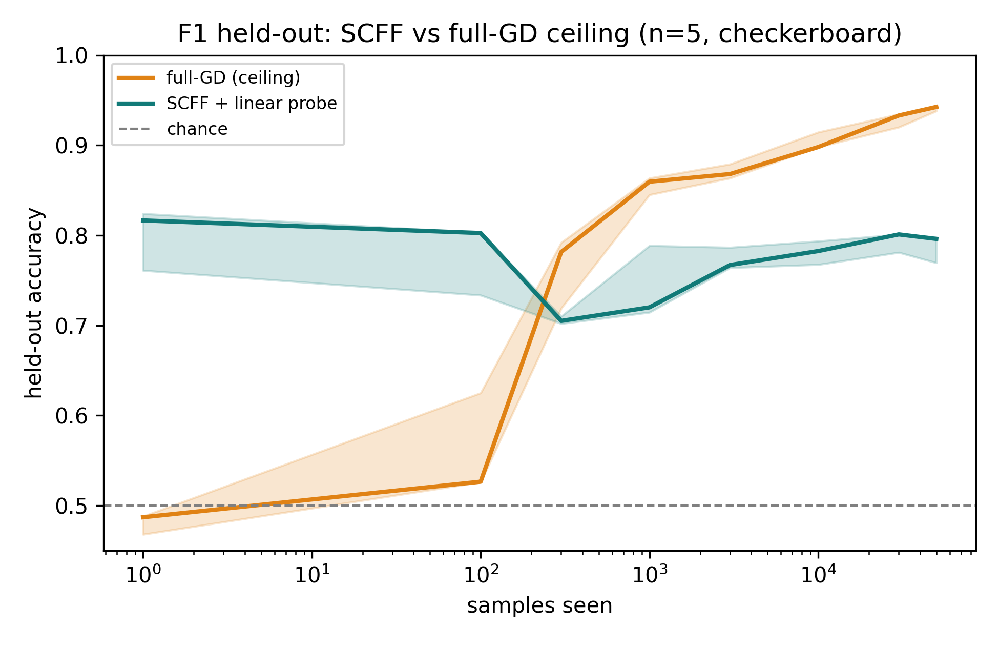
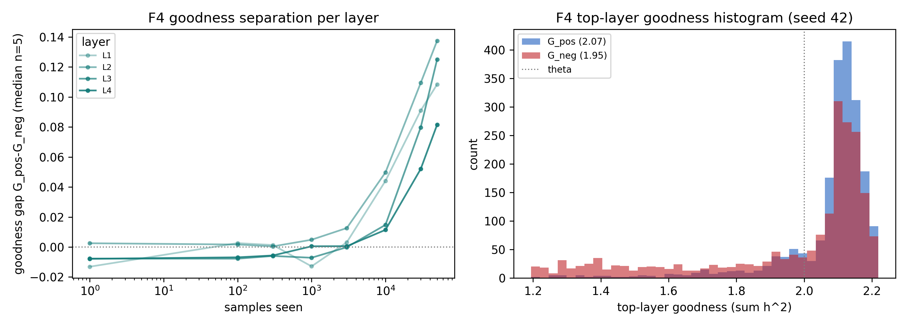
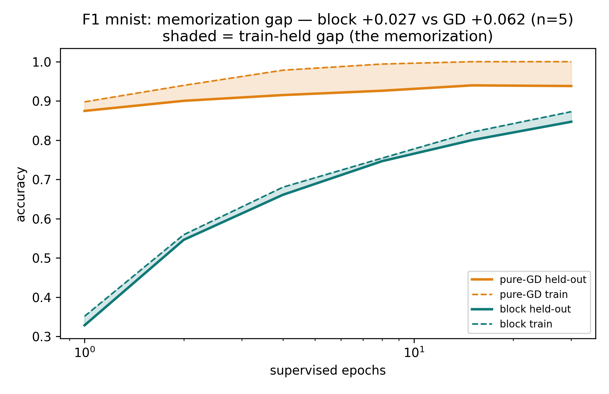
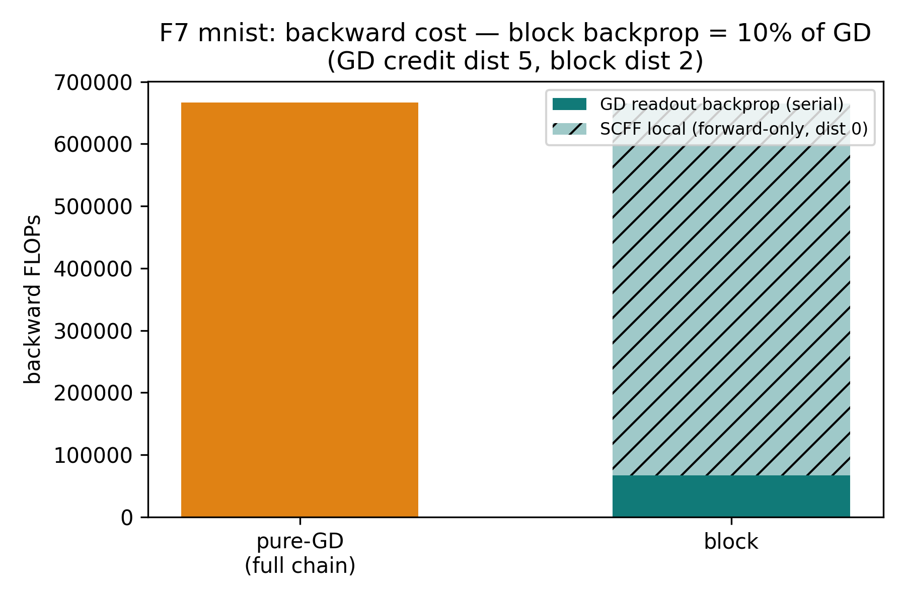
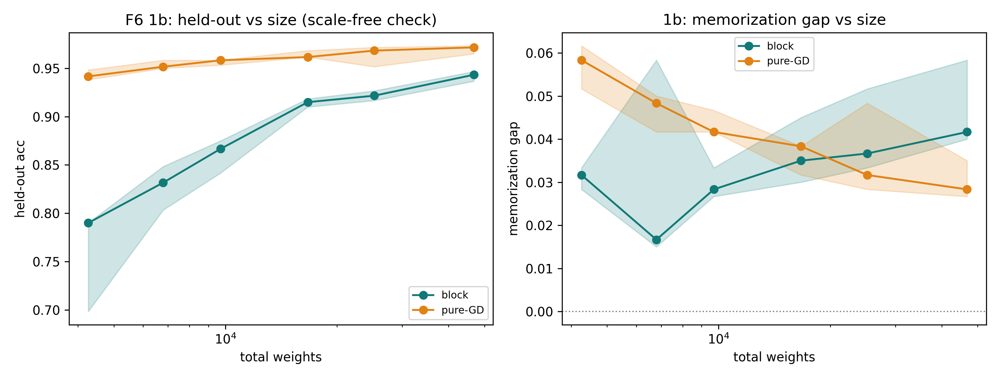
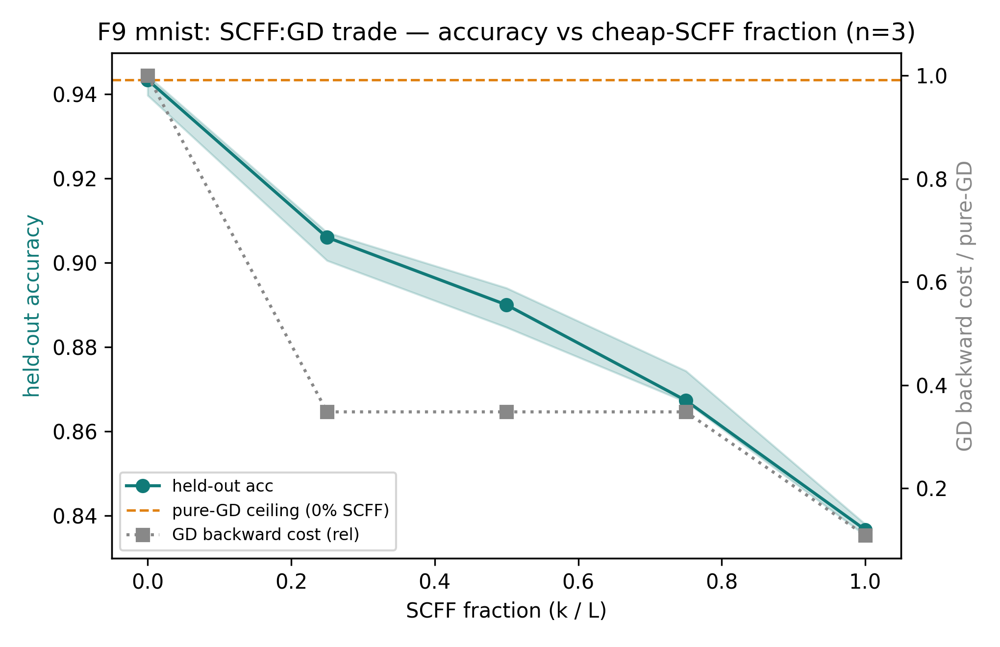
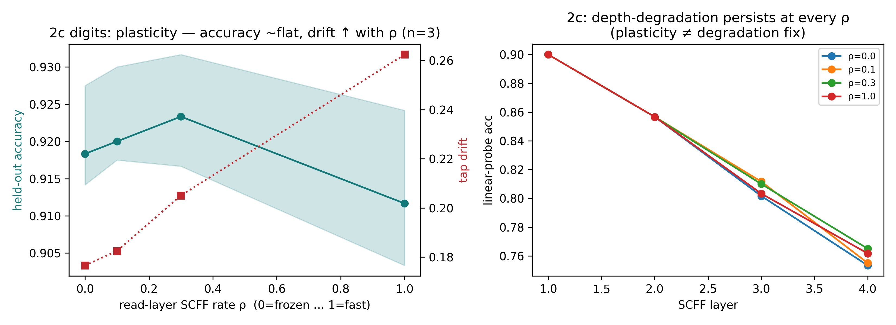
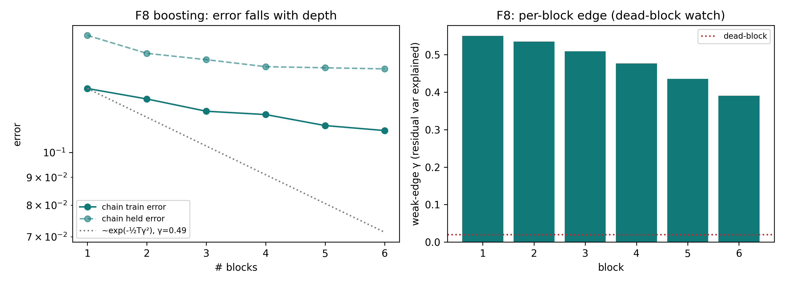

# Phase 1 — building the cell, and finding where it wins (the report)

> **Status:** Complete (2026-06-20, exp0 → exp4). **Voice:** first-person "we" research log.
> **What this is:** the reader-facing narrative of Phase 1 — why we ran each rung, what broke, what the sim
> said (often overruling the plan), and the decision it set. Figures and scalar tables inline.
> **Draws from:** [`phase1-summarize.md`](phase1-summarize.md) · [`RESULTS.md`](RESULTS.md) · the
> `expK/experiment-K.md` cards · house style [`result-format.md`](result-format.md).
> **Terms & metrics:** [`../ref-report/`](../ref-report/README.md). **Plan/decisions:**
> [`../../idea/main.ideas.v1.md`](../../idea/main.ideas.v1.md).

---

## 1 · Why this phase

Draft 6.0 committed a spine on paper — a cheap, unsupervised [SCFF](../ref-report/methods.md#scff--self-contrastive-forward-forward)
front that organizes the world for free, and a small, precise [gradient-descent](../ref-report/methods.md#taps--gd-reads-all-scff-layers-never-writes)
back that maps those features to real labels — but not a single simulation had run. Phase 1 is where we stopped
arguing the theory and let the behavioral sim talk.

We were deliberate about the question. It was **not** "does this beat backprop on accuracy" — that is backprop's
game, on a substrate built for it. The question was **where does a cheap, local, forward-only learner actually
earn its keep?** A block that costs a fraction of backprop's credit-assignment work is only worth building if it
buys something backprop can't. Phase 1's job was to find that something, or to fail honestly.

The stack is numpy-only: SCFF's update is a closed-form *local* gradient, so there is no autograd and no backward
pass that crosses a layer. We probe representations with frozen [linear probes](../ref-report/metrics.md#linear-probe),
report 5 seeds `[42,137,271,314,1729]` as median + IQR, and call a difference
[real](../ref-report/metrics.md#calling-a-difference-real-n5) only when the IQR bands are disjoint and the sign
holds in ≥4/5 seeds.

## 2 · What we built to test it

- **Cell under test:** one *block* — an SCFF feature stack (4 layers, width 64, ReLU, mandatory inter-layer
  normalization, [mono-forward dual-rail](../ref-report/methods.md#mono-forward-dual-rail--our-forward-scheme)) with a
  small GD readout that [taps every SCFF layer](../ref-report/methods.md#taps--gd-reads-all-scff-layers-never-writes).
- **Tasks:** a 2-D 4×4 checkerboard of Gaussian clusters (for *visualization* — you can look at the boundary),
  `load_digits` (64-D), and MNIST (784-D, the high-D track where SCFF's value is real).
- **Baselines:** a matched-weight-budget pure-GD MLP (the precision *ceiling*); an untrained random projection
  (the *null* — in low-D, a brutally strong one).
- **Metrics:** [held-out accuracy](../ref-report/metrics.md#held-out-accuracy), the
  [memorization gap](../ref-report/metrics.md#memorization-gap), [AAA](../ref-report/metrics.md#aaa--anytime-average-accuracy),
  [backward cost](../ref-report/metrics.md#backward-cost-substrate-credit-assignment-work),
  [goodness](../ref-report/metrics.md#goodness-the-scff-energy), and (for exp4) [BWT](../ref-report/metrics.md#bwt--backward-transfer).

## 3 · The arc, experiment by experiment

### exp0 — does SCFF separate at all? (the gate)

Before anything downstream means anything, SCFF has to *separate*: its goodness must pull positives above
negatives, and its features must be linearly classifiable. exp0 is the gate. It is also the cleanest example in
the whole stage of **the sim overruling the plan** — the gate run forced three spec changes, each backed by a
sweep, before we were allowed to trust a single number.

1. **Goodness must be the *sum* `Σ‖h‖²`, not the paper's mean `/M`.** Under unit-norm inputs the mean starves
   deeper layers to ~`1/M`, far below θ=2.0, so plain online SGD can never reach the threshold (the FF references
   only get there with Adam × 1000 epochs). The sum is ~1 at init, width-independent, and substrate-faithful.
2. **The gate task had to be a *cluster* task, not the spiral.** SCFF clusters by **density**, not class — it
   makes coherent inputs loud and blends quiet, so it learns *where the data is*. On the 2-arm spiral, two
   equal-density interleaved arms, SCFF-alone sits at ~0.55 across every config we swept. We moved to a
   16-cluster checkerboard, which is density-separated *and* too hard for random features.
3. **The input is normalized to unit length at layer 1 too.** Without it the raw-input magnitude head-start
   suppresses 64–91% of layer-1 units under θ=2.0. Normalizing kills the unit death and gives a uniform goodness
   scale — at the cost of the magnitude head-start, which we flagged for ratification rather than silently locking.

**Figure — the cheap-vs-precise crossover.**

*SCFF hands the readout ~0.80 features almost instantly (no training needed in 2-D); pure GD starts at chance,
crosses SCFF at ~300 samples, and climbs to the 0.943 ceiling — the cheap-but-capped vs expensive-but-precise
trade, drawn. (n=5, 2-D checkerboard, ~16.6k weights.)*

**Figure — goodness separates.**

*Per-layer `G_pos − G_neg` climbs from ~0 to +0.10…+0.14 over training across all four layers — weak but real
separation. (n=5, 2-D checkerboard.)*

**Result (held-out, checkerboard; linear probe).**

| cell | linear probe | note |
| --- | --- | --- |
| 0c full-GD ceiling | **0.943** [0.938, 0.943] | the number exp1–3 quote; memorization gap ≈ +0.001 (≈0 by construction) |
| 0a SCFF two-sided | 0.796 [0.769, 0.798] | the locked objective |
| 0a SCFF contrast | 0.791 [0.788, 0.796] | ≈ two-sided (within noise) → keep two-sided |
| 0b random projection | 0.817 [0.761, 0.824] | **≥ SCFF, within noise** — in 2-D, random is too strong |

The headline finding of exp0 is itself a correction: **on low-D synthetic tasks SCFF does not beat a random
projection.** Johnson–Lindenstrauss already solves 2-D/3-D clusters with random nonlinear features, so SCFF's
*learning* adds nothing there. The decisive control was high-D: on 64-D `load_digits`, SCFF **does** beat random
(0.841 vs 0.780 at width 64; 0.917 vs 0.898 at width 256). SCFF's learning only pays off when the input is high
enough dimensional that random features fail — which forced a plan change: bring a high-D task (MNIST) forward to
exp1, and keep the 2-D checkerboard for visualization only.

**What it said.** SCFF separates (gate passed), but it is a *density* learner and a *weak low-D* learner; its value is
a high-D bet that GD can read. **Decision:** goodness = sum, θ=2.0, input-norm on, two-sided loss; GD ceiling
0.943; add the high-D probe at exp1.

### exp1 — one block vs pure GD

This is the thesis comparison. We match a single block against a pure-GD MLP at the same weight budget and ask
whether the block trades a little ceiling accuracy for a *smaller memorization gap* at a *fraction of the backward
cost*. The [gap](../ref-report/metrics.md#memorization-gap) is the headline because it measures whether a model
*understands* (generalizes) versus *memorizes*.

**Figure — the memorization gap (headline).**

*The block keeps a smaller train−held-out gap than same-budget GD: MNIST block +0.027 vs GD +0.062 (disjoint IQR,
5/5 seeds). The block generalizes more honestly. (n=5, MNIST flat-MLP, matched budget.)*

**Figure — backward cost / locality.**

*Measured backward op-counts: the block's serial backprop is ≈ 10% of GD's; the SCFF bulk is forward-only with
credit-distance 0. (n=5, MNIST.)*

**Figure — scale-free (the H=64 decision).**

*As the budget grows 4k→47k weights, the block closes on GD (held-out 0.79→0.94, the gap Δ shrinking 0.15→0.03):
evidence that "approaches GD" is real and the basis for the default H=64. (n=5, digits.)*

**Result.**

| metric | block | GD |
| --- | --- | --- |
| held-out (MNIST) | 0.850 | 0.938 |
| memorization gap (MNIST) | **+0.027** | +0.062 |
| held-out (digits) | 0.927 | 0.968 |
| backward cost | ~10% | 100% |

**What it said.** A single block reaches near-GD accuracy with a *smaller* gap at ~10% of the backward cost —
the cheap-and-generalizes story is real. But the per-layer probe also showed SCFF features **degrade with depth**
(each *added* SCFF layer re-optimizes its own goodness and sheds class-relevant directions — so a 4-layer stack is
already enough to see it), which is why the readout must tap *all* layers, not the last `n` (the spec's S3 was
reading the worst ones).
**Decision:** default H=64; the depth degradation is exp2's job.

### exp2 — inside the block (ratio + plasticity)

Two questions about the block's interior. First (2a): is there a free-lunch SCFF:GD *ratio* — can we make most of
the block cheap SCFF for nearly free? Second (2c): does slowing the read-layers' plasticity fix the depth
degradation exp1 exposed?

**Figure — the trade curve.**

*Held-out accuracy declines *monotonically* as the SCFF fraction rises (digits 0.965→0.920, MNIST 0.943→0.837) —
there is no sweet spot. The cost saving concentrates in the expensive *input* layer (on MNIST, 25% SCFF saves 65%
of the backprop for −3.7 pts). (n=5, matched budget.)*

**Figure — plasticity.**

*Slow read-layers (ρ≈0.3) are marginally best (0.923 vs 0.912 fast) with lower drift — but the depth degradation
persists at *every* ρ. Plasticity is a drift fix, not a depth fix. (n=5, digits.)*

**What it said.** There is no "80% deep SCFF nearly free" — accuracy falls with SCFF fraction, and the only real
saving is the costly input layer. [Plasticity slowdown](../ref-report/methods.md#plasticity-gradient--slow-read-layers-n2)
buys a little drift robustness but cannot rescue depth. **Decision:** keep SCFF *shallow*; if depth is to be had,
it must come from the chain (exp3), not from a deeper SCFF stack.

### exp3 — the residual-boosting chain

If a deep SCFF stack can't earn depth, maybe a *chain* of shallow GD-corrected blocks can — each block a weak
corrector of the residual the last one left, which is exactly [BoostResNet's](../ref-report/papers.md#boostresnet)
telescoping sum. We chain shallow blocks and watch the training error against the boosting bound.

**Figure — the boosting shape.**

*The chain beats a single block and approaches GD (digits 0.950 vs single ~0.92, GD 0.970) — but the error
*saturates after ~2 blocks*; there is no exponential boosting decay. (n=5, with the e^{−½Tγ²} bound overlaid.)*

The ε-diagnostic resolved the mechanism: **boosting wants diverse weak learners, not preserved-identical
features.** Full residual ε=1 — where the per-block features individually degrade — gives the best ensemble;
preserving features (small ε) collapses the diversity and *lowers* the final accuracy.

**Result.** Chain: digits 0.950 (gap +0.028) ≈ GD 0.970; MNIST 0.858 (gap +0.033) vs single-block 0.850, GD
0.943. Saturates ~2 blocks.

**What it said.** Depth-via-boosting is real but **modest and saturating** — and on MNIST it barely moves. The
"deep brain matches GD on static accuracy" story is *not* the win. **Decision:** N3 boosting confirmed, full
residual ε=1, the Ch9 linear delta stays off; the real home is the continual regime (exp4).

### exp4 — the continual regime (gate + sleep) — *the win*

Everything so far characterized the *static* substrate, where GD is simply better. exp4 is the regime the
substrate was actually built for: a non-stationary, class-incremental stream, learned online. Here the question
flips — not "how accurate" but "what survives when the world keeps changing."

**Figure — rot vs sleep (the win).**

*Online learning ROTS to chance (catastrophic forgetting: digits 0.18, MNIST 0.19); a periodic
[sleep](../ref-report/methods.md#sleep-consolidation) consolidation recovers to the static ceiling (0.935 / 0.865);
and the SCFF probe stays *flat* the whole way — the features never forget. (n=5, class-incremental stream.)*

**Result.**

| condition | digits | MNIST |
| --- | --- | --- |
| online (rot) | 0.18 | 0.19 |
| no-sleep readout | 0.086 | — |
| sleep recover (full history) | 0.935 | 0.865 |
| sleep recover (LUT, ⅓ store) | 0.898 | 0.863 |
| **SCFF probe (doesn't forget)** | **0.90** | **0.75** |

> *Why the mechanism row matters:* the flat SCFF probe is *why* sleep works at all. The features stay
> class-separable for every class the whole way through the stream; only the small supervised readout drifts to
> the current task. So we don't need to protect the bulk — we just re-fit the readout in sleep over a cheap
> [prototype LUT](../ref-report/methods.md#lut-prototype-memory-the-hippocampus-stub).

**What it said.** SCFF is **forgetting-robust**: because it clusters unsupervised, new classes *add* clusters
instead of overwriting old ones. Catastrophic forgetting lives entirely in the readout, and a cheap sleep over a
small prototype store fixes it — the LUT recovers nearly as well at a third of the store. **Decision:** sleep and
LUT confirmed; **continual is the architecture's validated home.**

## 4 · The cross-cutting discoveries

Each of these was forced by a sim, not argued from theory:

1. **Goodness must be the SUM `Σ‖h‖²`, not the paper's mean** — or θ=2.0 is unreachable under plain online SGD.
2. **SCFF clusters by *density*, not *class*** — it recovers classes only when classes are density clusters; the
   equal-density spiral defeats it.
3. **SCFF is a weak low-D learner** — a random projection ties it in 2-D (JL); its value needs high-D input.
4. **SCFF features degrade with depth**, and the readout must tap *all* layers (the last ones are the worst).
5. **No "80% deep SCFF nearly free"** — accuracy falls with SCFF fraction; the saving is the input layer only.
6. **Boosting wants diversity, not preservation** — full residual ε=1 beats feature-preserving small ε.
7. **The win: SCFF is forgetting-robust**, which makes cheap continual learning work via sleep + LUT.

> **Through-line (density ≠ class):** exp0 found the wound — SCFF's energy goodness learns *where the data is
> dense*, which is class only when classes are density clusters. This is what the next **three** phases chase: it
> degrades with depth (Phase 2), the *objective* turns out to be the lever (Phase 3), and the capability map
> reads the whole cell as a density/structure learner with a cheap class-namer on top (Phase 4). The spine of
> Stage 1 opens here.

## 5 · What this phase set (spec deltas)

goodness = **sum `Σ‖h‖²`** · θ=2.0 · **input-norm on** · **tap ALL SCFF layers** (corrects S3's "last n") ·
two-sided loss (≈ contrast within noise) · **full residual ε=1** (N3 boosting; Ch9 delta off) · **slow
read-layers** ρ≈0.3 (N2 — a drift fix, not a depth fix) · default **H=64**. Sleep (S7) + LUT (S8) confirmed.

## 6 · Honest scope & caveats

- **The memorization gap only means something on a repeating / seen-buffer.** Under a fresh-draw single pass it
  is ~0 by construction (there is nothing to memorize), so we measure it on a rolling buffer of already-seen
  samples. An outside reader will trip here; the definition is pinned in [`result-format.md`](result-format.md).
- **Small tasks** (2-D checkerboard / digits / MNIST), chosen as probes, not benchmarks.
- **SCFF is a weak low-D learner** — its win over random is a *high-D* property; don't judge it on 2-D alone.
- **"Rises with depth" is untestable** on a task one layer captures (it needs a high-D hierarchy — Phase 2/3).
- **The sleep cadence and the Ch7 gate are not built** — the gate is named and deferred to Phase 5; exp4 used a
  fixed sleep schedule, not a tuned one.

## 7 · The bridge to Phase 2

Phase 1 answered *where* the cell wins — the non-stationary, online, continual regime — and flagged the wound
that the rest of Stage 1 chases: **SCFF degrades with depth.** That collides with the substrate's economics: the
Scap crossbar's cheap axis is *depth*, but SCFF's strength is *width*. Phase 2 goes straight at it — can we move
SCFF's success onto depth, or is the wall real?

## Reproducibility

Every run writes `figs_*/manifest.json` (git commit + resolved config + medians + versions) and
`figs_*/arrays.npz`; figures regenerate from saved data with no retraining (`python exp0/plot.py <run-dir>`,
`exp1/plot_exp1.py`). Runs are seeded and deterministic. Entry points: `exp0/run_exp0.py` (+ `scff_gate.py`),
`exp1/run_exp1.py {digits,mnist}` + `run_exp1b.py`, `exp2/run_exp2a.py` + `run_exp2c.py`, `exp3/run_exp3.py`,
`exp4/run_exp4.py`. Run heavy jobs single-threaded (`OMP_NUM_THREADS=1` + `python -u`) — sklearn/OpenMP
phantom-hangs in a backgrounded process on this machine.
