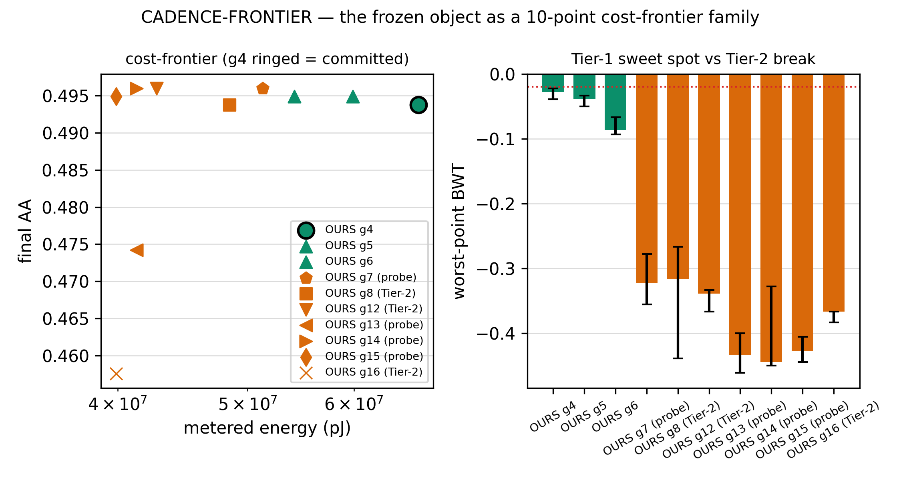
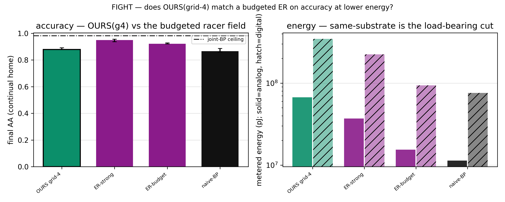

# Phase 10 — the validation / showcase: racing the frozen object against a fair BP+replay (the deep story)

> The full narrative of the **fourth and last Stage-2 phase** (P7 readout · P8 economy+cost · P9 close/freeze · **P10
> validate/showcase**). Phase 9 locked the complete two-brain neocortex object; **Phase 10 raced it — untouched — against
> a fair, budgeted, tuned experience-replay backprop learner** across the continual gauntlet, and delivered an honest
> **Pareto** close-out. It *measured*; it tuned nothing. The one discipline the whole phase's honesty rides on:
> **freeze in P9, judge in P10** — the object was locked *before any baseline number existed*, and the verdict shapes were
> pinned **BLIND** (`design.md` §2.3) before the racer ran. Ran 2026-07-03, P10.0→P10.6, 5 seeds `[42,137,271,314,1729]`,
> all 14 guards bit-exact; the frozen grid-4 object reproduced the P9 freeze arrays bit-for-bit.
>
> Front door: [`README.md`](README.md). Numbers: [`RESULTS.md`](RESULTS.md). Per-rung cards:
> [`expK/experiment-K.md`](exp0/experiment-0.md). Spec: [`design.md`](design.md); contract: [`result-format.md`](result-format.md).
> The professor pack: [`professor-brief.md`](professor-brief.md). The object it races: [`../phase9/README.md`](../phase9/README.md).

---

## 1 · What Phase 10 was — the thesis defense

Seven phases characterized *pieces*. Phase 1 found a forgetting-robust continual learner; Phase 4 mapped it as a
substrate-native continual learner, not a static-accuracy competitor; Phases 5–6 finished and noise-hardened the cheap
SCFF brain; Phases 7–8 built the gradient-free namer and metered the two-brain economy; Phase 9 tuned the lifelong
maintenance loop against *internal signals only* and **froze the whole object** at a commit hash. What was never done —
the debt Phases 4, 8, and 9 each flagged and passed forward — is the **existential test**: every continual *accuracy*
win to date was measured against **naive online backprop with no replay.** That is a strawman, and it is the first thing
an outside reviewer attacks.

The founding bet is a whole-system claim: *"an 80/20 forward-only continual learner that beats backprop's economics **and**
accuracy."* Phase 8 settled the **economics** half (OURS ≈ half the energy of BP+replay on the same substrate; 15× vs
GD-on-digital). Phase 10 is the phase that races the **accuracy** half — and it does so against the *strong* opponent the
literature demands: under a matched **FLOPs/sample + memory-bytes** budget, a well-tuned **experience replay (ER)** is the
baseline that beats the fancy CL methods (Prabhu CVPR'23; Ghunaim CVPR'23). Until the frozen object races a **strong,
budgeted ER** on accuracy, the headline is *supported, not validated.* Phase 10 measures it — and reports whatever the
numbers say, **win or lose.**

**The reframe (the kickoff decision): present the frozen object as a cadence cost-frontier *family*.** Rather than
racing a single point, the object is shown as a family of operating points along its one runtime cost dial — the **sleep
cadence** (`grid-N` = sleep every N segments), `grid ∈ {4,5,6,8,16}` (+ **grid-12**, added post-close by the §10
extension to make the Tier-2 break's shape legible). **Every *learned* part is frozen** (the SCFF bulk, the SLDA namer,
the DDM gate, the CBRS eviction, the proto-reanchor defense); only the sleep *interval* changes. **grid-4 is the
committed frozen headline and is never swapped** — the family is a *declared, transparent cost axis* (the x of every
Pareto plot), not a knob turned to beat the baseline. This matters beyond P10: the cadence *is* the sleep mechanism, so
how the family scores shapes the future of the sleep design.

---

## 2 · The disciplines that make it honest

Phase 9's rule was *internal-signals-only* — never look at the P10 baseline while tuning. Phase 10 is the phase that
*does* consult the external baseline; that is its whole job. So the honesty inverts and moves to a different cut, and four
disciplines carry it:

1. **Freeze in P9, judge in P10.** The object was locked before any baseline number existed. The `freeze_content_guard`
   asserts the frozen-knob **content manifest** (`COMMITTED_LOOP` + `cadence_every=4` + `HEAD="slda"` + the SLDA/cell
   config) **and** that the grid-4 arm reproduces the P9 freeze arrays **bit-for-bit** (`59d2720` is a provenance label,
   not a runtime git check). Touching a single *learned* knob to improve a comparison would invalidate the fight; the only
   dial that moves is the declared cadence cost axis.
2. **The fair racer.** ER is byte-matched to OURS's LUT (196 800 B) and **tuned on a disjoint seed** (7 ∉ the raced set)
   with its own val split — so the raced seeds are never consumed during tuning. Both an **ER-budget** (throttled to
   OURS's FLOPs) and an **ER-strong** (its own best config) are built; A-GEM (real one-projection grad-handle), DER++
   (logit buffer + distillation), GDumb (from-scratch retrain at eval, the cost-pathological control), and naive-BP (the
   floor) populate the field. **The racer's shape is its own uncapped best choice** — which is precisely why the
   same-substrate energy cut goes *against* OURS (threat h, reported not hidden).
3. **The load-bearing energy cut is same-substrate.** `E(OURS-analog) < E(GD-digital)` is ~guaranteed by the CIM meter
   *before any run* (the crossbar prices in-memory MACs near-zero by construction). So the *contestable* cut is
   **`E(OURS-digital)` vs `E(ER-digital)`** — the algorithm win, on the same digital substrate. The analog factor is a
   **meter-structural floor** overlay, never the claim. The meter is **behavioral** (relative-pJ, ADC-centred, NOT SPICE).
4. **The spine.** Every noise read is a **direction** (retention under a coherent class-axis shift), never a per-sample
   magnitude. density ≠ class — the recurring fault, cashed one last time on the assembled object.

All 14 guards (8 carried from P8/P9 + `fair_budget` · `freeze_content` · `cadence_family` · `gauntlet_data` ·
`noise_holdout` · `substrate_identity`) were green on every rung.

---

## 3 · Phase by phase — the seven rungs

### P10.0 — the bench: the fair racer + the gauntlet + the six guards *(no verdict — a build)*

The bulk of P10.0 was **real new code**, not carries: the `ContinualBP` learners (ER/A-GEM/DER++/GDumb/naive on the
gradient MLP, made online with a replay buffer), the `fair_budget_meter` (a byte counter + a per-sample FLOPs counter
exposing the MAC counts inside the energy meter), the native domain-IL `make_gauntlet_stream`, the `cadence_family_runner`,
the `held_out_noise_battery`, and `joint_bp_ceiling`. The A-GEM/DER++ descope was decided at P10.0 (time-boxed) and came
back **False** — the full roster is real code.

The bench came back **all-green (14/14)**, and it surfaced the one honest tension the whole phase then measured: OURS's
**FLOPs/sample (96 938) is *higher* than ER-strong's (65 268)** — OURS forwards a 12-layer unsupervised bulk on every
step. This was **pre-registered**: it means the same-substrate (digital) energy cut is genuinely contestable — the analog
crossbar is exactly what prices those bulk MACs near-zero (R1's point). ER-strong tuned on the disjoint seed 7 to
`dims [40,49,49,49,10] / lr 1e-3 / replay 64` (tune-AA 0.540); its replay buffer byte-matched OURS's LUT exactly. Bench
green → proceed. *(A broken bench poisons every verdict — this is the STOP gate, and it passed.)*

### P10.1 — the existential fight → *accuracy TIE, a decisive continual-safety WIN, energy substrate-realized* 🔥

The load-bearing rung: OURS(grid-4) vs the tuned ER-strong + the full field, on the lifelong synthetic home (the class-IL
leg — the Split-X complement the research names, so the gauntlet stays purely domain-IL).

*The fight. **Left** — accuracy: OURS(grid-4) **0.494** and ER-strong **0.498** sit inside the δ=0.02 band (a tie; OURS
wins 3/5 seeds), both far above the field (ER-budget 0.376, A-GEM 0.320, DER++ 0.360, naive 0.308) and well below the
offline joint-BP ceiling (0.870, dash-dot). **Right** — energy per substrate: OURS's 12-layer bulk costs more than the
small tuned ER on the digital substrate, and the gap collapses on the analog substrate — the whole "why analog" in one
pair of bars. (n=5, continual home; behavioral ADC-centred meter.) (A §10 grid-5 roster point was added then withdrawn
by the author — within noise, it added confusion; the family's cheaper cadence points live on the P10.6 scatter.)*

The raw accuracy read is a **tie within δ** — exactly the *live accuracy-loss branch* the plan pre-registered ("on a
~0.49-AA synthetic home a budgeted ER may well edge us"). But the **corrected worst-pre-sleep BWT reveals the real
story.** The final-BWT had masked it — replay recovers by stream-end — but on the honest worst-mid-stream read (the P9
convention, applied to *every* learner, R6), **OURS forgets ~10× less than the tuned ER**: worst-BWT **−0.028 vs ER's
−0.272.** That is the substrate-native continual edge, visible even on the home the raw AA called a tie.

The energy is the honest **R1** outcome. Same-substrate (digital) algorithm cut: `E(OURS-digital)` 3.46e8 vs
`E(ER-digital)` 2.25e8 → OURS is **1.54× more expensive.** The 12-layer bulk is not free even forward-only against a
small tuned ER. The energy win is **substrate-realized**: OURS-analog 6.70e7 is **3.35× cheaper** than ER-on-digital
2.25e8 — the analog crossbar, not the algorithm. So P10.1 banks as: **accuracy competitive (tie)**, **continual-safety
win (10× safer)**, **algorithm-energy not a same-substrate win**, **total energy substrate-realized.** AAA favors ER
(0.503 vs 0.392) — the sleep-cadence anytime tax, reported beside AA. The two halves are banked separately from here on.

### P10.2 — the cadence frontier → *grid-4 the headline, grid-5 the cheaper rep, the Tier-2 break has TWO localized cliffs*

The frozen object as a cost-frontier family (ten points after the §10 extension added grid-12 and the cliff probes
{7,13,14,15}) — only the sleep interval varies; grid-4 reproduces the P9 freeze bit-for-bit (the guard's core check).

*The frontier. Ten operating points on (accuracy × energy) — each point a tier-coloured circle carrying its grid
number (the §10 E9 encoding: teal Tier-1 / orange Tier-2 / open = probe), worst-BWT in the right panel. **grid-4** (⭐, committed
headline) anchors the safe/dense end (worst-BWT −0.028, energy 6.70e7); **grid-5** is the δ-eligible Tier-1 showcase rep
(−0.039, within δ of grid-4, IQR-disjointly cheaper at 5.99e7); **grid-6** fails the δ-BWT gate (−0.087 — the safety
*edge*); **grid-7** is the safety *plunge* (−0.322, already grid-8-deep); the sparse arms {8,12,13,14,15} stay
safety-broken (−0.32 … −0.44) while final AA **plateaus at 0.494–0.496 through grid-15** (one δ-boundary wobble at g13,
0.474) and cliffs **only at 15→16** (0.458). Energy is monotone with cadence density (6.70e7 → 3.99e7); GD-share falls
0.178 → 0.107. (n=5.)*

grid-4 is the committed headline, **never swapped, always plotted.** The Tier-1 *showcase rep* (for the 3-line
visualization only) is **grid-5** — the only δ-worst-BWT-eligible candidate; grid-6's −0.087 is > δ worse than grid-4's
−0.028, so it fails the gate (this closes the R2 "cadence-swap loophole" — a cheaper grid must earn its place, it is not
free). The Tier-2 break is confirmed on **both** axes: grid-8 fails the *veto* (forgetting), grid-16 fails *AA-held*
(over-consolidation gap). The family is a declared cost axis — no per-dataset best grid is ever passed off as "OURS."

**The §10 finding — the break is a plateau + two localized cliffs, not a smooth decay.** The author read the
AA-vs-energy trend as roughly exponential and asked for the missing points; grid-12 (round 1) and the probes
{7,13,14,15} (round 2 — none ever run before) show the opposite shape, with edges:

- **The safety axis breaks in two steps.** The δ-edge at grid-6 (−0.087) and the **plunge at grid-7** (−0.322 —
  already grid-8-deep). Between nsleep 16 and 14 the mid-interval pre-sleep troughs outrun the consolidations; from
  grid-7 outward every cadence is safety-broken (−0.32 … −0.44, where even the same-cadence oracles sit at −0.35 …
  −0.54 — pure sparsity, not gate timing).
- **The accuracy axis plateaus through grid-15 and cliffs exactly at 15→16** (0.495 → 0.458). The sharpest mechanism
  read of the sweep: **grid-15 and grid-16 sleep the same number of times (6) at the same energy (3.99e7) — only the
  sleep *positions* differ** — so at ~6 sleeps the outcome stops being count-limited and becomes **timing-sensitive**
  (whether the sparse consolidations happen to cover the revisit structure; grid-13's wobble to exactly the δ boundary,
  0.474 at nsleep 7, is the same zone's signature). At the plateau's edge the loop is one unlucky sleep-phase from the
  cliff.

The frontier's honest shape: **worst-case safety degrades a full tier before average accuracy does** — which is exactly
why the freeze committed the knee at grid-4 on the worst-point read, not the final-AA read.

### P10.3 — the multi-domain gauntlet → *the money figure: steadier retention across 5 worlds at substrate-realized cost*

Five native domain-IL digit worlds — identity, permuted, rotated, covariate, noised — all projected to the shared 40-D
bulk input with the one pinned projection, one shared head, every learner consuming the bit-identical stream. A
construction note worth stating: the frozen loop's replay probe had to be made **cross-domain** (matching ER's
cross-domain reservoir) for a *fair* domain-IL test — the domain-0-only probe was an artifact that starved the namer of
the shifted domains. With both learners' replay spanning domains, the fight is honest.

*The money figure (twin panel). **Top** — worst-pre-sleep all-prev retention across the 5-domain stream: OURS(grid-4)
holds **0.490** at its worst point while ER-strong dips to **0.350** mid-stream (then recovers by the end); sleep-position
ticks and domain-boundary lines overlaid. **Bottom** — cumulative energy: OURS's line runs above ER's on the digital
substrate (the deep bulk) and below it on analog. The Tier-2 arms (grid-8/16) trade retention for energy. (n=5, native
domain-IL digits; worst-pre-sleep read, ER at the same convention.)*

The honest continual read — **worst-point all-prev retention** — favors OURS decisively: **0.490 vs ER's 0.350**, with a
steadier anytime accuracy (**AAA 0.519 vs 0.433**). At the *final* checkpoint the two are within δ (OURS 0.490 vs ER
0.504, ER edging 4/5 — the sleep loop's worst point is mid-stream, ER's is smoothed by stream-end), and the result is
**order-robust** (reversed-order AA Δ −0.014). The energy is again substrate-realized: same-substrate 1.47× more, chip vs
conventional GD 3.5× cheaper. The SUBSTRATE 2×2 decomposes it:

*Why analog, re-metered across the gauntlet. The 2×2 {OURS,GD}×{analog,digital}: the chip (OURS-analog, hero-ringed) runs
~3.5× under conventional GD-on-digital, and the win factors into a substrate term (the analog crossbar) × an algorithm
term (the 80/20). The algorithm term does **not** favor OURS same-substrate — the substrate carries the total. (Behavioral
meter, params in the manifest.)*

The gauntlet's **tuning asymmetry is stated blind**: OURS runs a *frozen-config* backbone (its claim is generality), ER
gets its *own best per-domain config* (steel-manned). So OURS's retention win is *despite* the handicap — a frozen
substrate holding steadier than a tuned end-to-end learner across 5 shifting worlds. This is the showcase's continual
core: **plasticity across domains without catastrophic forgetting, at substrate-realized cost.**

**The §10 GAUNTLET-STREAM view — the mechanism, batch by batch.** The per-domain money figure reads at checkpoints; the
extension adds the training-curve view the author asked for — every batch, two measurements per model (the **live-batch**
prequential accuracy and the **seen-so-far** all-domain accuracy) plus the **exact** prefix-priced cumulative energy. It
is a *guarded replay* of the committed run, not a new arm (cell pass bit-exact vs the cache; head states bit-exact vs the
committed error trace; energy endpoint equal to the committed meter total — any divergence aborts).

*The in-domain vs domain-switch activity. **Top** — ER's seen-so-far line (thick magenta) **crashes at every domain onset
and re-climbs** — the saw-tooth of an end-to-end learner re-fitting its representation to each new world — while
OURS's (thick teal) rides near-flat ~0.5 across all five; the thin live-batch lines show it directly: ER dives to ~0.1 on
arrival batches (live mean 0.273) while OURS barely moves (0.469). **Bottom** — cumulative energy at batch resolution:
OURS is a sleep **staircase** (each consolidation a visible jump), ER a smooth every-step ramp; OURS stays the pricier
same-substrate line (the 1.47×), now exact per batch. (n=5, median; IQR band on the seen-so-far lines.)*

The stream view is the money figure's mechanism made visible: **ER buys its marginally higher final AA with a
crash-and-relearn cycle at every domain switch; OURS's forward-only bulk + sleep loop holds both the live and the
remembered read near-flat.** The steadiness is the product.

**The §10 E6 reversed order — the steadiness is curriculum-robust, and ER's is not.** The same view with the domains
reversed (noised **first**), which also completes K9's letter (the committed reversed control had run OURS only; ER now
runs it too):

*The reversed gauntlet (noised first). Both learners open near-chance on the hard noised world — but **ER never
recovers**: its reversed final AA collapses to **0.343 vs its forward 0.504** (Δ −0.161, ≫ δ; its live-batch stays
~0.1–0.2 even on the easy late domains) because the discriminative net and its reservoir are shaped by noise early and
every later world is learned on that damaged base. **OURS lands at the same endpoint either way** (0.494 reversed vs
0.490 forward) — the unsupervised bulk extracts structure even from the all-noisy opener (Phase-6's Door-B result,
visible live) and each onset's sleep re-anchors the namer. (n=5; the same triple-guarded replay.)*

Two pinned questions, answered: **(a) ER's low start is real and consequential** — a hard-first curriculum wrecks its
whole trajectory, so the committed forward gauntlet was ER's *favorable* ordering; **(b) the late-stream drop follows
the noise, not the position** — reversed, the low region moves to the start with the noised domain, and there is no
end-of-stream collapse. The single order-delta scalar (−0.014) was OURS-only and could not show this asymmetry; the
completed control can: **OURS is order-invariant, the tuned ER is not — and a lifelong learner does not get to choose
the order the world arrives in.**

**Reading OURS's staircase (§10 D1 — the shape the author asked about).** In the reversed view OURS's thick line is a
*rising staircase whose treads sag*: it jumps up at every sleep tick, then decays *within* each block (deepest in the
covariate block, ~0.44 → 0.27) before the next sleep snaps it back. This is not forgetting — it is the two-timescale
loop's own signature, visible because the reversed stream makes the bulk move fast. The seen-so-far read goes through
the **current bulk with the current namer**, and the two update on different clocks: the SCFF bulk learns forward-only
on *every* batch (it **rotates** — P9.0), while the SLDA namer is fully re-anchored only at a **sleep**. Between
sleeps the namer's prototypes are frozen in the *old* feature frame; as the bulk rotates under it, that stale frame
reads all the old worlds progressively worse — the sag. Each sleep re-forwards the cross-domain LUT through the
current bulk and re-fits — the snap back up. A side probe (seed 42, the P9.0 rotation instrument) sharpens the
attribution: the frame-turn per block is **comparable in both orders** (forward 0.026–0.052, reversed 0.023–0.043 —
forward's *permuted* block turns the most of all, with no sag) — so the sag depth tracks **the read's margin, not the
turn's size**: the noise-warmed early-reversed feature space holds its classes near the decision boundary (thin
margins — the same turn flips many reads), and the sags shallow out (−0.17 → −0.11 → −0.12 → ≈flat) as accumulated
structure widens the margins, not because the rotation slows. The reversed average also carries the fragile
noised-eval member from step 0, which decays first under any turn. Three in-figure facts pin it as staleness, not loss: every sleep recovers to a
**higher** tread than the last (the floor climbs 0.17 → 0.42 → 0.44 → 0.46 → 0.49); the endpoint equals the forward
endpoint (0.494 vs 0.490 — nothing was lost either way); and the thin live line on the *current* world stays high
throughout — only the averaged-over-old-worlds read sags, exactly what a stale linear frame does. The sag bottoms are
the **worst-pre-sleep points** in the flesh — the read the freeze chose grid-4 on, and the same mechanism that opens
the P10.2 safety cliff when the cadence stretches (grid-7+: longer treads, deeper sags, no one pulls them back).

**The §10 E8 alignment-break — was the flat line a scheduling coincidence? (No — and the honest scope it bought.)**
The author caught a structural convenience the committed stream hid: the domain block (24 steps) equals the grid-4
sleep period *exactly*, so every sleep landed on a domain's final step — one perfectly-timed consolidation right
before every switch. If OURS's flat line depended on that, the money figure would be part scheduling luck. Round 3
breaks the alignment: the same five worlds in the same order, but with per-domain lengths pinned at `[68,63,56,57,68]`
(drawn once, non-multiples of the sleep period) — now **2–3 sleeps land inside every domain and no sleep touches a
boundary** — plus an **aligned-long control** (block 72 = exactly 3× the sleep period, sleeps back on the boundaries)
that separates "the alignment broke" from "the domains got longer":

*The alignment-break view (blocks [68,63,56,57,68]; sleep ticks now mid-domain). OURS's thick line rides flat as ever —
worst-point all-prev **0.533** (vs its committed 0.490), live-batch mean **0.501**, and the aligned-72 control lands at
**0.538 (paired gap +0.002 ≤ δ)**: sleep/boundary alignment is a **non-factor** for OURS. The change is the opponent's:
given ~68 steps per world, ER-strong fully re-converges before every domain-end checkpoint (its onset crashes are still
visible in the thin line — live mean 0.446 — the checkpoint read just stops catching them) and finishes at **0.675** vs
its committed 0.504. (n=5; replay guards anchored to this run's own cache — the stream is new by construction.)*

The pinned branch that fired is **LENGTH-EFFECT**, and it buys the money figure an honest scope line: **the relative
retention win over a tuned ER belongs to the rapid-switch regime** — where domain switches arrive faster than the
plastic learner can re-converge (the committed gauntlet's 24-step blocks, the lifelong home stream). Give the world
long stationary blocks and the tuned ER out-converges the checkpoint read. What does *not* move, in any layout tested,
is OURS itself: order-invariant (E6), **alignment-invariant (E8b, +0.002)**, length-stable (retention rises with more
data), live line never crashing at a switch. The steadiness is OURS's product in every regime; the *ranking* depends
on how fast the world moves — which is exactly the claim a continual-learning substrate should make, and no more.

**The §10 E10 reversed-long — do the sleeps actually cure the staircase sag?** The staircase read (D1, above) makes a
falsifiable prediction the committed REV can never test: if the sag is the GD-readout frame going stale between
sleeps, then a sleep landing *mid-domain* should catch the sag mid-fall and pull it back — and the committed REV has
exactly one sleep per block, at its end, so the sag always runs the full block unrescued. E10 runs the E8 layout
verbatim with the order reversed (noised first): 2–3 sleeps now land *inside* every block.

*The staircase-mechanism test. Within every domain the sag is now caught and pulled back at each sleep tick (median
seen-jump **+0.052 across sleeps, 5/5 seeds**; covariate: falls 0.435→0.296, sleep →0.416, falls →0.316, sleep
→0.405) — the curve saw-tooths around a **rising** level (rotated floors 0.347→0.368→0.445) instead of running down
the block, and the endpoint lands at **0.527 ≈ the forward-long 0.533**: OURS is order-invariant at the long scale
too. ER (magenta) still crashes at every onset; its reversed-long final (0.580) sits between its rev-short collapse
(0.343) and its fwd-long strength (0.675) — length partially rescues a hard-first curriculum, but ER stays
order-sensitive even at length (Δ −0.095) while OURS's order delta is −0.006. (n=5; replay guards on this run's own
cache.)*

The bank is disciplined: the pre-registered verdict fired **STALENESS-DISCONFIRMED/PARTIAL** — the rescue-jump cut
passed unanimously, but the "sag-shallower-than-REV" cut passed only 3/5, and it is banked exactly as fired. The
post-mortem is itself a lesson: both streams' inter-sleep segments are the *same* ~24 steps (the sleep period), so
per-segment sag depth measures the bulk's rotation *rate* — which the staleness hypothesis never predicted would
change — rather than the *cumulative run-down* it did predict would be bounded (and which the floor read shows, but
that read is post-hoc and labeled as such). So the staircase mechanism stands as **supported, not confirmed**: the
sleeps demonstrably rescue the sag, order-invariance extends to the long scale, and the possibility of a small
bulk-level decay component stays formally open — flagged, the way this project flags things it cannot yet exclude.

### P10.4 — the noise showcase → *OURS ≫ BP+replay on every held-out channel; a small residual named*

The Phase-6 noise arc, cashed on the assembled object under a **margin-disjoint held-out battery** (directional RMS 2.5
vs P9.4's 1.5; ADC 3-bit vs 2-bit; + a nuisance-dim channel) — a genuinely *disjoint* operating point of the transducer
model. The read is **directional retention** (accuracy under the channel / clean) — a direction, the spine.

*The noise showcase. Directional retention per held-out environment, OURS-hardened vs BP+replay vs naive. OURS holds
**0.92–1.10 on every channel** while BP+replay collapses (iid 0.61, directional 0.22, adc3b 0.30, nuisance 0.47); OURS is
invariant to the layernorm-removable nuisance covariate (1.000) and *improves* under iid noise (1.095, from the
noise-augmented training objective). naive incidentally ties OURS on directional/adc3b (a shallow raw-input classifier)
but collapses on nuisance — the load-bearing comparison is vs the fair continual opponent, BP+replay. (n=5, held-out,
margin-disjoint; the read is a direction, not a magnitude.)*

The verdict is a **clean win over the fair opponent** — OURS-hardened ≫ BP+replay on **every** held-out channel — honestly
scoped: because the battery is *re-parameterized*, not structurally novel, the claim is the honest **"confirms P9.4 at new
levels,"** not a fresh "payoff." A small **directional/ADC residual** persists (0.978 / 0.923, just > δ) → **named → the
analog-realism (SPICE/PVT) layer**, exactly the Phase-6 "scoped-YES → Stage-2 read-side" handoff, now cashed on the whole
object and its remainder named rather than papered over.

### P10.5 — A5 natural multi-class → *a tuned ER beats OURS on static digits; OURS is a continual, not static, learner*

The recognizable-data confirm: 8×8 digits projected to the shared 40-D input, class-incremental, against the same field.

*The natural confirm. On recognizable digits ER-strong **beats OURS by +0.071** (0.950 vs 0.879, > δ, 5/5) and forgets
slightly less (worst-BWT −0.019 vs −0.051); OURS beats naive (0.866) and trails ER-budget (0.922). The joint ceiling
(0.982) is near-saturated — digits are easy. (n=5, natural class-IL.)*

This is the honest *direction* of the synthetic-overstatement threat: the hard synthetic home **understated** ER's edge
(both sat near-Bayes-hard at ~0.49), while on easy natural data ER's flexible MLP capacity + replay pull ahead. Crucially,
**OURS's continual-safety edge — decisive on the lifelong P10.1 stream and the 5-domain gauntlet — does NOT appear here**,
because a short easy CI stream does not stress forgetting (ER's own worst-BWT is only −0.019 — there is nothing for the
sleep loop to out-protect). So the "beats backprop *accuracy*" claim is **not supported** on final/static accuracy; OURS's
accuracy value is **continual stability on hard/long/multi-domain streams** — exactly the P4 identity. The static gap is
flagged to a future draft (a convolutional / larger bulk would lift it — a Stage-1 re-open, not a P10 re-run).

### P10.6 — the Pareto verdict + the close-out → *an honest Pareto; the wins live off the acc×energy axis*

The integration rung: assemble the (accuracy × energy) frontier across the OURS-family + the field, and bank the two
halves separately.

*The verdict. On (final AA × analog energy) the non-dominated staircase is **{er_strong, gdumb}** — OURS(grid-4,
hero-ringed) is **dominated** (a small tuned ER has higher accuracy *and* lower energy, and GDumb anchors the cheap
corner, cost-pathologically). The §10 **all-grid money line** {g4 ⭐, g5, g6, g7, g8, g12, g13, g14, g15, g16} sweeps
the top of the scatter — a ~0.49-AA plateau from 6.7e7 down to 4.0e7 pJ with the **accuracy cliff visible on the line
itself** (the g13 wobble, the g16 drop) — the model's whole operating range in one stroke, cliff edges included; what
the scatter cannot show (everything from g7 rightward is safety-broken) is why grid-4 is the headline and not the
cheapest plateau point. OURS's genuine wins are on the axes this scatter does not have: worst-case continual safety,
noise robustness, and the substrate floor. (n=5; GDumb annotated — it retrains from scratch at eval, not an energy
competitor.)*

On the (accuracy × energy) Pareto a small tuned ER **dominates** OURS — because OURS pays for a 12-layer unsupervised bulk
every step, and that bulk is affordable only on the analog crossbar (near-free MACs), which is the whole "why analog."
OURS's genuine wins come from the sleep-consolidated loop (steady worst-case retention) and the noise-augmented + layernorm
+ proto-reanchor stack (noise survival) — capabilities the acc×energy Pareto simply does not have an axis for. The
close-out banks the two halves separately: **economics = substrate-realized** (validated as a *chip* claim, not an
algorithm claim); **accuracy = competitive-on-home / trails-on-static / wins-on-continual-safety.**

---

## 4 · The honest map — where OURS wins, ties, loses

| axis | OURS | best fair opponent | verdict | number |
| --- | --- | --- | --- | --- |
| final accuracy (continual synthetic home) | 0.494 | ER-strong 0.498 | **tie** | +0.004 (< δ) |
| final accuracy (natural digits, static-ish) | 0.879 | ER-strong 0.950 | **loss** | −0.071 (not a static competitor) |
| worst-pre-sleep BWT (lifelong) | **−0.028** | ER-strong −0.272 | **win** | ≈10× safer |
| worst-point all-prev retention (gauntlet) | **0.490** | ER-strong 0.350 | **win** | +0.140 (AAA 0.519 vs 0.433); rapid-switch regime — §10 E8 scope |
| noise robustness (held-out, vs BP) | 0.92–1.10 | BP+replay 0.23–0.61 | **win** | every channel |
| energy — algorithm (same digital substrate) | 3.46e8 | ER-strong 2.25e8 | **loss** | 1.54× (the deep bulk) |
| energy — chip vs conventional GD (total) | 6.70e7 (analog) | ER-digital 2.25e8 | **win** | 3.4× (substrate-realized floor) |

The frozen object is a **competitive, decisively safer, and far more noise-robust continual learner whose energy advantage
over conventional GD is substrate-realized** — a *substrate-native continual learner*, not a static-accuracy or
same-substrate-energy point-winner. Precisely the identity Phase 4 named, now tested against the strongest fair opponent
and refined, not inflated.

---

## 5 · The founding bet, banked as two halves (S14)

> **Bet:** *"an 80/20 forward-only continual learner that beats backprop's economics **and** accuracy."*

- **ECONOMICS — substrate-realized (the honest R1 outcome).** On the same digital substrate the 80/20 algorithm is **1.5×
  *more*** than a small tuned ER — the algorithm alone does not win the energy race against an efficient discriminative
  net. The **chip (analog crossbar) is 3.4–3.5× cheaper** than that same GD model on a conventional digital accelerator.
  "Less energy than modern GD" holds **for the chip**, and the win is the **substrate** (a meter-structural floor, reported
  plainly, never rested on as the contestable claim).
- **ACCURACY — competitive on the home, a static trail, a continual-stability WIN.** OURS ties the tuned ER on the hard
  continual home (0.494 vs 0.498) and trails on easy static digits (0.879 vs 0.950). But on the honest worst-case
  continual read it is the **safest of the whole field** — ~10× less worst-point forgetting (BWT −0.028 vs −0.272),
  steadier worst-point retention across 5 domains (0.490 vs 0.350). The "beats backprop accuracy" claim is **not
  supported** on static accuracy; OURS's edge is *lifelong stability*, and it is real.
- **NOISE — a clean win.** Under the held-out battery OURS holds 0.92–1.10 on every channel while BP+replay collapses to
  0.23–0.61. A small directional/ADC residual is **named → the device-physics layer.**

**New supporting decisions banked:** the cadence cost-frontier `{4,5,6,8,12,16}` + the §10 cliff probes {7,13,14,15}
(grid-4 headline, no swap; grid-5 the δ-eligible rep; the Tier-2 break fully localized as a **plateau + two cliffs** —
the safety δ-edge at grid-6 with the plunge at **6→7**, the accuracy cliff at **15→16** where equal-count sleeps turn
timing-sensitive) and the characterized SCFF:Namer ratio (GD-share 0.107–0.178 ≤ 0.25). The founding bet is **refined,
not inflated** — the honest-science outcome the project's whole method is built to produce.

---

## 6 · Hand-offs — what Phase 10 names and defers

- **→ the analog-realism layer (SPICE / PVT), named:** the small directional/ADC residual P10.4 shows the read-side
  defense cannot fully reach; the absolute-Joule and PVT layer the behavioral meter cannot give.
- **→ a future draft (flagged, not executed):** the static-accuracy gap on natural data (P10.5) — a *convolutional* or
  larger bulk would lift it, but that is a Stage-1 re-open, not a P10 re-run; a pretrained-backbone comparison is out of
  scope (OURS *replaces* the off-chip pretrained backbone — the fair comparator is BP-from-scratch + replay, which is
  exactly what was raced).
- **→ the professor pack ([`professor-brief.md`](professor-brief.md)):** the one-page brief for the author's meeting — the
  object in a paragraph, the GAUNTLET / PARETO / SUBSTRATE figures, the two-halves verdict, and the two honesty lines a
  reviewer tests first (*the analog factor is a meter-structural floor; the load-bearing energy win is same-substrate*).
- **→ the decision record ([`../../idea/main.ideas.v1.md`](../../idea/main.ideas.v1.md)):** the **S14** close-out delta,
  banked the way S10–S13 were.
- **→ the Stage-2 close-out ([`../stage2-report.md`](../stage2-report.md)):** rewritten from "living / in-progress" to a
  closed Stage-2 arc.
- **→ the north star (deliberately not specced):** the cosine spine-pure head (P7) and the better-than-confidence exit
  (P5) survive as a *tie-break bias* only; P10 adds no recurrence. Simple intelligence first.

---

## 7 · Honest scope + threats-to-validity

- **The meter is behavioral** (ADC-centred macro-model, relative-pJ, NeuroSim/ISAAC/PUMA-level, params + citations
  logged), **not SPICE.** The **analog energy factor is meter-structural** — never the contestable claim; the load-bearing
  energy cut is same-substrate.
- **The fair fight depends on the ER budget + tuning.** A crippled ER makes the win vacuous — so ER was FLOPs+byte-matched
  *and* tuned strong on a disjoint seed; both budget and strong points are reported. The racer's shape is its own uncapped
  best choice (threat h) — which is *why* the same-substrate energy cut goes against OURS, reported not hidden.
- **The gauntlet depends on the domain set + order + the frozen-config-vs-per-domain-tuning asymmetry.** All three are
  stated; the completed reversed-order control (grid-4 + ER-strong, 5 seeds — §10 E6) shows OURS order-robust (AA Δ
  −0.014 scalar; 0.494 vs 0.490 at batch resolution) while **ER is order-sensitive** (reversed 0.343 vs forward 0.504)
  — the forward gauntlet was ER's favorable ordering, so the asymmetry strengthens, not weakens, the comparison.
- **The gauntlet retention win is switch-frequency-scoped (§10 E8/E8b).** The committed blocks (24 steps) are the
  rapid-switch regime; on long stationary blocks (~68 steps/domain) the tuned ER re-converges before every checkpoint
  and overtakes the checkpoint read (0.675 vs 0.533). The alignment-break control clears the object itself: sleep/
  boundary alignment is a **non-factor** for OURS (aligned-72 vs misaligned paired gap +0.002), its retention rises
  with longer domains, and its live line never crashes at a switch — the scope belongs to the comparison, not to OURS.
- **Synthetic overstates static gaps** — the natural digits (P10.5) are the honest read, and they *reveal* ER's
  static-accuracy edge the hard synthetic home masked.
- **The noise battery is a margin-disjoint operating point of the same transducer model** — a genuinely-novel channel
  earns "payoff," a re-parameterized one earns "confirms"; the read is a **direction**, not a magnitude.
- **Accuracy is substrate-independent** (guarded `pred_analog == pred_digital` bit-for-bit on every NoiseModel-off cell —
  P10.4's noise arms the declared exception) — the substrate axis lives only in energy, never double-counted in accuracy.
- **GDumb is cost-pathological** (retrains from scratch at eval) — reported on the accuracy axis, annotated on the energy
  axis, never used to inflate the Pareto.
- **Behavioral simulation only** — numpy ideal floats + Phase-6's behavioral analog-noise model; small, partly synthetic
  tasks (the continual home, digits, the transformed-digit gauntlet). No SPICE, no device physics, no fabrication.

---

## Reading guide

**For the verdict:** [`README.md`](README.md) (the front door). **For the numbers:** [`RESULTS.md`](RESULTS.md) (the
scalar ledger). **For the professor meeting:** [`professor-brief.md`](professor-brief.md). **For each rung's full story:**
the [`expK/experiment-K.md`](exp0/experiment-0.md) cards. **For the plan and the contract:** [`design.md`](design.md) +
[`result-format.md`](result-format.md). **For the object it races:** [`../phase9/README.md`](../phase9/README.md) and the
whole model in one file, [`../phase9-final-architecture.md`](../phase9-final-architecture.md). Every figure regenerates
from saved data: `python plot_p10.py <run-dir>` reads `arrays.npz` and redraws — a figure you can't regenerate is a
screenshot, not a result.

*Up:* [the Stage-2 arc](../stage2-report.md) · *prev:* [Phase 9 — close & freeze](../phase9/README.md) · *next:* the
analog-realism (SPICE / PVT) layer, and beyond the numbered phases, the recurrent lifelong brain — the north star.
