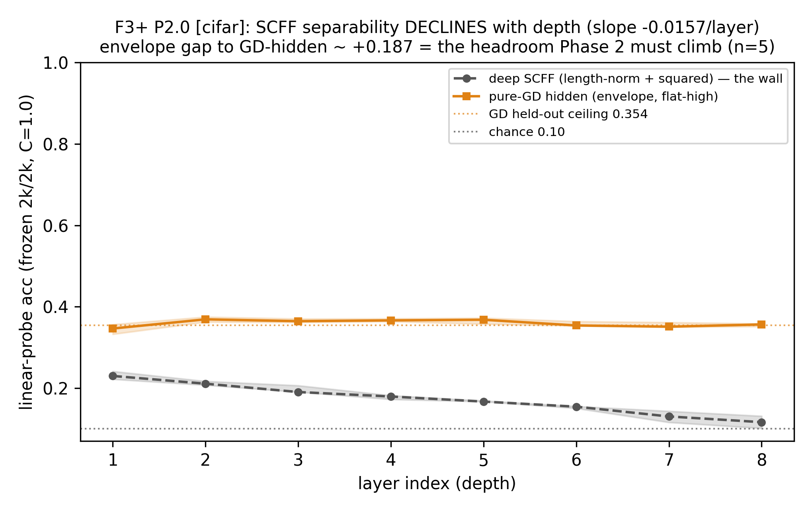

# Phase 2 — depth is not SCFF's lever (and the cheap survivor)

> **✅ Complete (2026-06-21, P2.0 → P2.6; P2.3/P2.4 skipped as moot).** The front door to Phase 2 — the navigable
> overview. The deep story with every figure is **[`phase2-report.md`](phase2-report.md)**; the scalars are
> **[`RESULTS.md`](RESULTS.md)**; the pre-run design is **[`design.md`](design.md)**.
>
> **Verdict in one line:** a deep SCFF stack **cannot earn depth** — and every escape hatch is closed (not
> transmission, not the objective, *not even a perfect label-oracle*). Depth instead comes cheaply from **boosted
> ensembles of shallow SCFF blocks with tiny GD readouts** (`read`, never `write`) — ~85% of GD accuracy at ~1/6
> the backward cost — and that recipe **preserves the continual win.**

---

## The problem

Phase 1 left a sharp finding and a sharper collision. The finding: SCFF features **degrade with depth**. The
collision: SCFF's strength is **width**, but the Scap substrate's cheap axis is **depth** — a deep crossbar is what
the chip wants to build, a deep SCFF stack is what the algorithm seems to refuse. So Phase 2 has one job: **can we
move SCFF's success onto depth?** We resolved to close *every* escape hatch before accepting the wall — because
"SCFF just can't go deep" is the kind of conclusion that is usually a tuning failure in disguise.

## What we did

- **Cell under test:** a deep (8-layer) SCFF stack — the wall — then the boosted-block recipe (the survivor).
- **Tasks:** CIFAR-10-flat (3072-D, where the wall is real), synth Tier-B (the dial, *no* wall — a control),
  digits (the continual veto).
- **The decisive control:** **selectivity** = trained probe minus an untrained random projection — does a deep
  layer merely *entangle* class info (recoverable) or genuinely *lose* it?

## What we found

The wall is real, and the deep features are **lost, not entangled**:

*On CIFAR-flat the deep-SCFF wall reproduces cleanly: the per-layer probe falls 0.23→0.117, slope −0.018, all 5
seeds negative. The selectivity control returns deep SCFF (0.294) ≈ a random projection (0.298) — the features fall
*below* random. (n=5, CIFAR-10-flat, 8 layers.)*

The arc that closed every hatch, then found the survivor:

- **P2.0:** reproduce the wall; the selectivity control settles **lost, not entangled** (dead-units 0→0.47, rank
  39→11). The synth control (flat slope) proves it's a real CIFAR property, not a probe artifact.
- **P2.1 (transmission):** the literature's DeeperForward fix (linear goodness + length-norm) works **mechanically**
  — dead-units → 0, rank restored — but class-separability never rises with depth. **0/7 learning cells reach slope
  ≥ 0.** Transmission is necessary but not sufficient. (Durable side-win: threshold-free **contrast** ≈ doubles the
  deep-layer probe vs the two-sided θ — the loss matters, the threshold is a liability.)
- **P2.2 (objective — the decisive rung):** **even a perfect label ORACLE** negative doesn't bend the depth-slope
  on CIFAR. The same oracle *does* lift on synth (+0.027, where classes really are clusters) — so the CIFAR null is
  real, not a broken mechanism. **Decisive negative.**
- **P2.3 / P2.4 — skipped (moot):** both refine a deep SCFF stack that P2.1+P2.2 had just ruled out. The skip is
  part of the result. *(No `exp3/`/`exp4/` — the gap is intentional.)*
- **P2.5 (the constructive answer):** boosted *shallow* blocks. `read` (boost the per-block readouts) beats
  pure-SCFF where deep SCFF can't (+0.010, 5/5) at **~85% of GD accuracy for ~17% of its backward cost**; `write`
  (re-inject the GD-corrected rep) **fails** — a class-collapsed rep destroys the rich features.
- **P2.6 (the continual veto — closes the phase):** the boosted-read recipe + sleep recovers to 0.932 (BWT −0.034)
  ≈ single-block, and is **continual-safe by construction** (per-sample norm, no batch statistics).

## What it set (decisions)

The surviving recipe = `[SCFF×k → GD-readout]×N` — **read** (not write), per-block SCFF = the healthy
**layer-norm + linear + contrast** cell, sleep-consolidated, **few blocks suffice**. **Depth = block-count, not
SCFF-layer-count.** Contrast > two-sided θ. Drift measured for the Phase-5 gate.

**The load-bearing caveat (handed to Phase 3):** the in-the-moment conclusion "intrinsic to forward-only
**locality**" is *one word too strong*. Every energy-goodness result here stands — but Phase 3 narrows the wall to
"intrinsic to the **energy objective `Σh²`**," and there *are* forward-only unsupervised learners (GIM, CLAPP) that
compose depth. Phase 3 re-opens depth on the one lever Phase 2 never touched: the objective *family*.

## Read next

| For | Go to |
| --- | --- |
| The full story, every figure, the per-rung reads | [`phase2-report.md`](phase2-report.md) |
| The scalar ledger (numbers + decisions) | [`RESULTS.md`](RESULTS.md) |
| The pre-run design (why each hatch, the build spec) | [`design.md`](design.md) |
| The run-cards | `exp0/1/2/5/6/` `experiment-*.md` (P2.0/1/2/5/6) |
| Figure/house style | [`result-format.md`](result-format.md) → [`../result-format.md`](../result-format.md) |
| The Stage-1 arc | [`../stage1-report.md`](../stage1-report.md) · **Prev:** [Phase 1](../phase1/README.md) · **Next:** [Phase 3](../phase3/README.md) |
