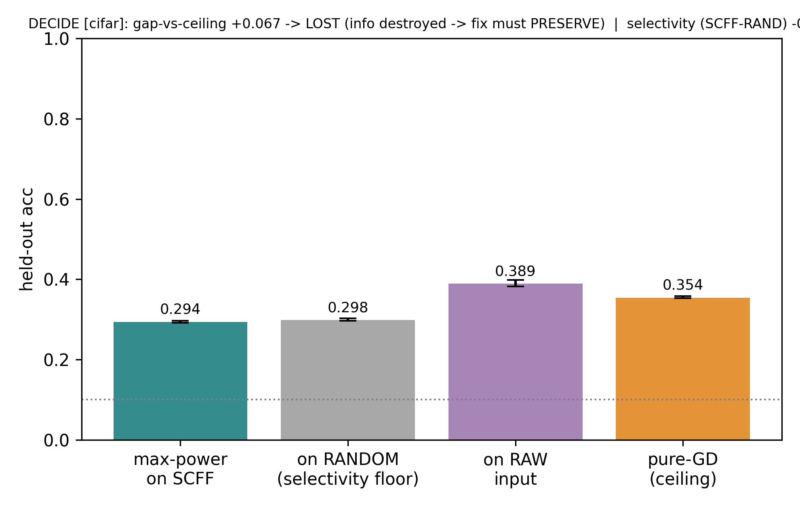
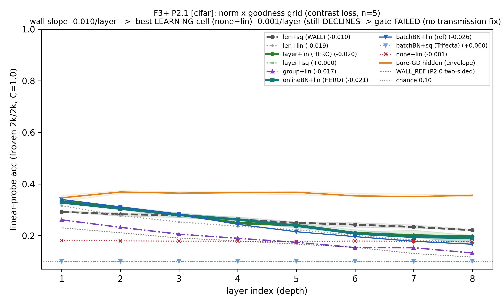
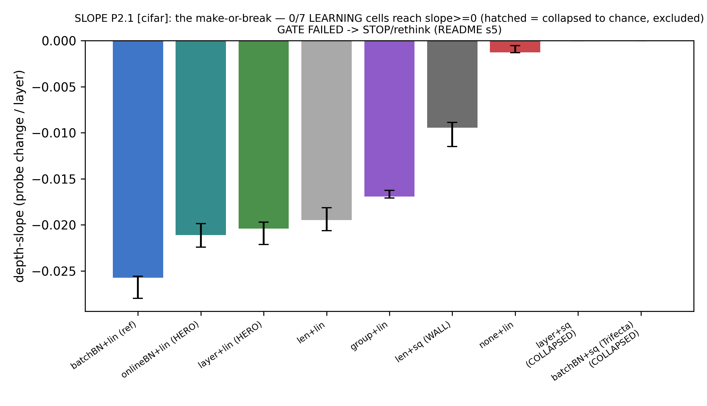
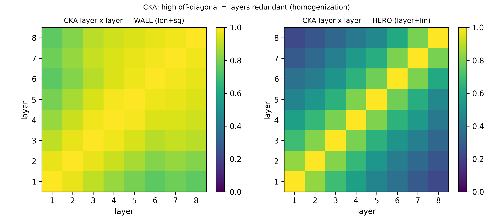
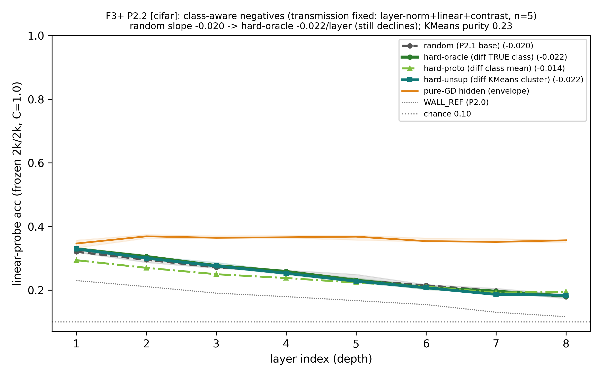
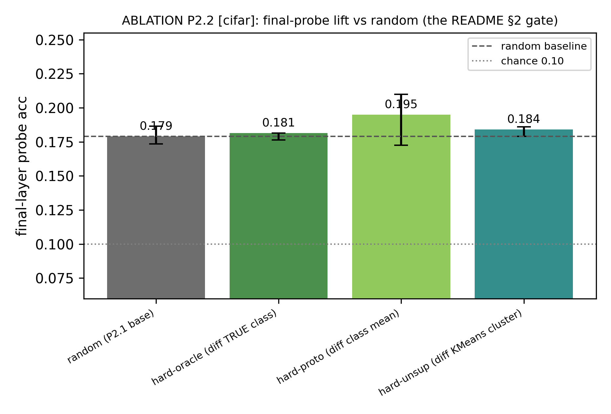
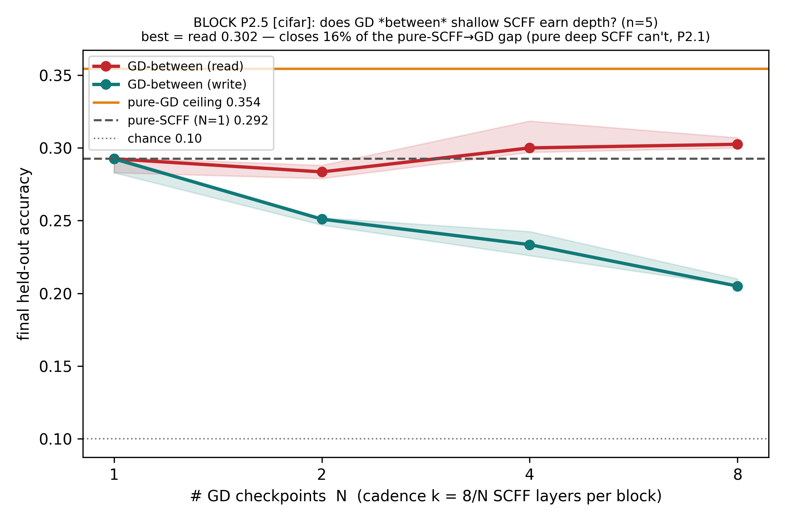
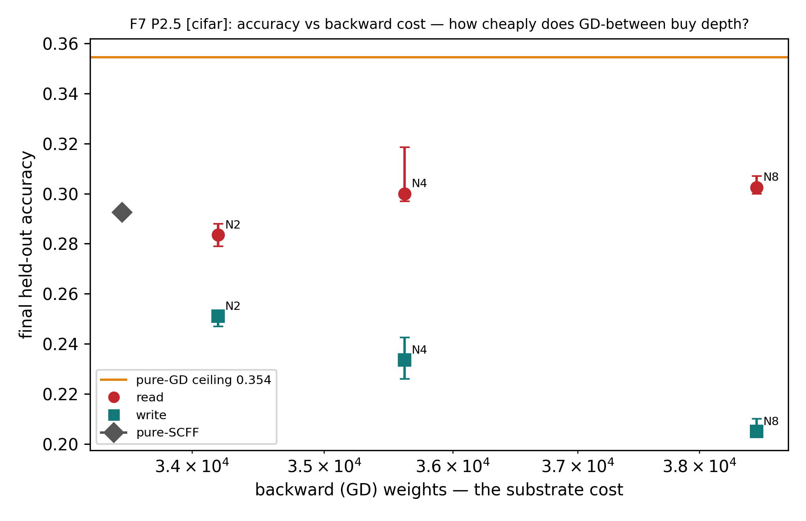
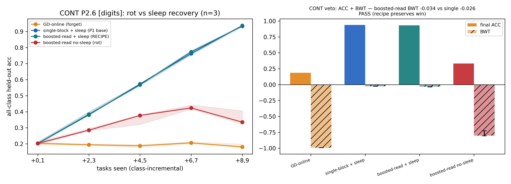
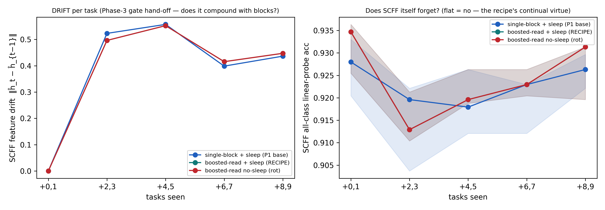

# Phase 2 — depth is not SCFF's lever (the report)

> The reader-facing narrative of Phase 2 (P2.0 → P2.6, June 2026): the depth question, every closed escape
> hatch, and the cheap survivor. The sims said *no*, decisively — and proving that **is** the result. A
> first-person research log, figures and tables inline. Terms and metrics are defined in
> [`../ref-report/`](../ref-report/README.md); the terser source it draws from is the
> [`RESULTS.md`](RESULTS.md) ledger and the `expK/experiment-K.md` cards; the navigable overview is the [`README.md`](README.md).

---

## 1 · The wound we inherited

Phase 1 left us with a sharp finding and a sharper collision. The finding: SCFF features **degrade with depth** —
each layer re-optimizes its own goodness and sheds class-relevant directions. The collision (README §0): SCFF's
strength is **width**, but the Scap substrate's cheap axis is **depth**. A deep crossbar is what the chip wants to
build; a deep SCFF stack is what the algorithm seems to refuse.

So Phase 2 has one job: **can we move SCFF's success onto depth?** If yes, the substrate and the algorithm agree
and we build deep. If no, we need depth from somewhere else. We resolved to close every escape hatch before
accepting the wall — because "SCFF just can't go deep" is the kind of conclusion that is usually a tuning failure
in disguise.

The bench is CIFAR-10-flat (where the depth wall is real), a synthetic Tier-B task (a dial, with *no* wall — a
sanity control), and digits (the continual veto). We read every layer with a frozen linear probe and lean
hardest on one control: [selectivity](../ref-report/metrics.md#selectivity), the trained probe minus an untrained
random projection of the same architecture. It tells us whether deep features are merely *entangled* (recoverable)
or genuinely *lost*.

## 2 · What we built to test it

- **Cell under test:** a deep SCFF stack (8 layers) — the wall — and then the boosted-block recipe (the survivor).
- **Tasks:** CIFAR-10-flat (3072-D, the depth probe), synth Tier-B (the dial), digits (the continual veto).
- **Baselines:** the GD-hidden probe envelope (ceiling); an untrained random projection (the selectivity control).
- **Metrics:** [depth-slope](../ref-report/metrics.md#depth-slope) · final-layer [probe](../ref-report/metrics.md#linear-probe) ·
  [effective rank / dead-units](../ref-report/metrics.md#effective-rank-erank--dead-units) · [CKA](../ref-report/metrics.md#cka) ·
  [backward cost](../ref-report/metrics.md#backward-cost-substrate-credit-assignment-work) · [BWT](../ref-report/metrics.md#bwt--backward-transfer).

## 3 · The arc, rung by rung

### P2.0 — re-establish the wall + the decisive fork

First we reproduce the wall cleanly, then we fork: are the deep features *lost* or merely *entangled*? The
selectivity control settles it.

**Figure — the wall.**

*On CIFAR-flat the deep-SCFF wall reproduces cleanly: the per-layer probe falls 0.23→0.117, slope −0.018, all 5
seeds negative. (n=5, CIFAR-10-flat, 8 layers.)*

**Figure — DECIDE (lost vs entangled).**

*The selectivity control returns LOST, not entangled: deep SCFF (0.294) ≈ a random projection (0.298), selectivity
−0.005 — the features fall *below* random. (n=5, CIFAR-flat.)*

The cause is *both* axes failing at once: dead-units climb 0→0.47 and effective rank collapses 39→11. The synth
control is the tell that this is a real CIFAR property and not a probe artifact: on synth the wall is **flat**
(slope −0.0005) and the max-power probe solves from raw input, so synth is the dial, not the headline.

**What it said.** The wall is real and the features are lost. **Decision:** → P2.1, the normalization × goodness
grid; the wall curve is the thing every later rung must bend upward.

### P2.1 — the normalization × goodness grid (make-or-break gate)

Is the wall a **transmission** problem — are good shallow features simply not surviving the trip up the stack? The
literature's answer is [DeeperForward](../ref-report/papers.md#deeperforward): swap *squared* goodness for *linear*,
keep per-sample length-norm. We ran the full grid as a make-or-break gate: any learning cell must reach slope ≥ 0.

**Figure — the grid.**

*The norm × goodness grid on CIFAR-flat — 9 cells, of which **7 actually learn** (the other 2 are non-learning
controls), which is why the gate is read as "0/7 learners". (n=5, contrast loss.)*

**Figure — slope (gate failed).**

*GATE FAILED — 0/7 learning cells reach slope ≥ 0. The DeeperForward-style heroes (layer-norm+linear,
online-BN+linear) decline *faster* than the wall (−0.020, −0.021): better shallow features, lost by L8. (n=5,
CIFAR-flat.)*

**Figure (optional) — mechanism fixed, class not.**

*Visual proof the transmission fix worked *mechanically* — rank held, units alive — while class-separability never
rose with depth. (n=5, CIFAR-flat.)*

This is the rung's whole lesson. The transmission fix **works at the mechanism level**: linear goodness takes
dead-units 0.25→0.00, effective rank 19→46–50, the L1 probe 0.29→0.33. But none of that becomes depth-*rising*
**class** separability. We also learned a sharp negative: *squared* goodness with a *mean-zero* norm is total unit
death (dead 1.00, rank 0) — the FF "layer norm" survives only because it keeps the mean. And one durable side-win:
the threshold-free [contrast](../ref-report/methods.md#contrast-objective-infonce-two-mask-views) loss roughly
*doubles* the deep-layer probe (0.221 vs 0.116) versus the two-sided θ — the loss matters, the threshold is a
liability.

**What it said.** Transmission is **necessary but not sufficient** — the bottleneck is the objective (density ≠
class), not the plumbing. **Decision:** carry the healthy cell (layer-norm + linear + contrast); STOP/rethink →
promote P2.2 ahead of the transmission-adjacent rungs.

### P2.2 — the objective: class-aware (hard) negatives (the decisive rung)

If transmission isn't the lever, maybe the *objective* is — specifically, the negatives. SCFF's negative is just
a random partner. What if it were class-aware? We tested the strongest possible version: a perfect label
**oracle** (true labels choose the negative), plus a prototype and an unsupervised KMeans variant.

**Figure — negatives.**

*Even a perfect ORACLE negative doesn't bend the depth-slope: all variants decline ≈ identically (random −0.020,
oracle −0.022, prototype −0.015). (n=5, CIFAR-flat, healthy cell.)*

**Figure — the control that proves it's real.**

*Synth control: the same oracle *does* lift where classes genuinely exist (+0.027, disjoint-IQR ✓) — so the CIFAR
null is a real result, not a broken mechanism. (n=5, synth vs CIFAR.)*

There is no real probe lift over random anywhere on CIFAR (oracle +0.003, but the disjoint-IQR margin is −0.010 — not a real lift). The KMeans
purity is 0.226 — it clusters by appearance, not class — which is the density≠class wound restated. And the synth
control is decisive: where classes *are* the clusters, the oracle lifts the slope by a real +0.027. So the
mechanism works; CIFAR's flat-MLP simply has no class structure for an unsupervised local rule to compose.

**What it said.** **Decisive negative.** Transmission (P2.1) *and* objective (P2.2, even an oracle) both fail ⇒
the wall is intrinsic to SCFF's forward-only **locality**: composing class features across depth needs cross-layer
coordination that local learning structurally cannot supply — which is exactly what the GD 20% exists to provide.
**Decision:** the deep-SCFF static path is **CLOSED**; route to P2.5.

### P2.3 / P2.4 — not run

P2.3 (cross-layer collaboration) and P2.4 (the read-interface) both refine a *deep SCFF stack* — and P2.1 + P2.2
had just proved that stack shouldn't exist. They would have been tuning a structure already ruled out. We skipped
them as moot, and the skip is part of the result: once both the transmission and the objective levers are dead,
there is nothing left on the deep-SCFF axis to refine.

### P2.5 — multi-block: GD *between* shallow SCFF (the constructive answer)

If deep SCFF can't earn depth, can boosted *shallow* blocks? We chain shallow SCFF blocks with small GD readouts
and test two couplings: `read` (boost the per-block GD readouts into an ensemble) vs `write` (re-inject the
GD-corrected representation back into the SCFF stream).

**Figure — block.**

*`read` (boosting the readouts) beats pure-SCFF by a disjoint-IQR margin (N8 0.292→0.302, +0.010, 5/5) where deep
SCFF can't — but saturates ~2–4 blocks. `write` FAILS monotonically (−0.04→−0.09): a class-collapsed rep destroys
the rich features. (n=5, CIFAR-flat.)*

**Figure — backward cost.**

*The real prize is cost: `read` reaches ~85% of pure-GD accuracy (0.302 / 0.354) at ~17% of its backward cost
(38k / 230k) — the SCFF bulk is forward-only; only the tiny readouts pay backward. (n=5, CIFAR-flat.)*

**What it said.** Depth is bought by *blocks*, not SCFF layers — and only by **reading** (boosting), never
*writing*. The accuracy gain is modest and saturating; the win is the ~6× backward saving, which is the
cheap-brain thesis restated. **Decision:** the recipe is `read`, not `write`; few blocks suffice; → P2.6.

### P2.6 — the substrate filter + the continual veto (closes Phase 2)

A static recipe is not enough — Phase 1's win was *continual*. The deliverable rung asks: does the boosted-read
recipe preserve that win, and is it continual-safe on the substrate?

**Figure — continual veto.**

*VETO PASSED: the boosted-read recipe + sleep recovers to 0.932 (BWT −0.034) ≈ single-block (0.938 / −0.026), far
above online-rot (0.33) and GD-online (0.19); the SCFF probe stays flat (0.935→0.931, doesn't forget). (n=3,
class-incremental digits.)*

**Figure — drift.**

*Drift is measured and compounds slightly with block count (boosted BWT a hair worse than single-block, −0.008,
disjoint-IQR but negligible) — the number the Phase-5 gate will be tuned against. (n=3, digits.)*

The recipe is **continual-safe by construction**: per-sample normalization carries no batch statistics, so the
Continual-Normalization rot worry never applies. The honest caveat is that multi-block drift compounds slightly —
which is exactly the drift the maintenance phase exists to bound.

**What it said.** The cheap shape survives the continual regime. **Decision:** Phase 2 closes; the surviving recipe
is `[SCFF×k → GD-readout]×N` (read, healthy cell, sleep-consolidated, few blocks), with its drift measured.

## 4 · The cross-cutting discoveries

1. **Depth is intrinsically not SCFF's lever** — not transmission (P2.1), not objective (P2.2, even an oracle).
2. **The literature's depth fix is the right mechanism for the wrong problem** — DeeperForward's linear goodness
   cures deactivation and rank-collapse, but on *unsupervised flat-MLP* SCFF that fixes the symptom, not the
   disease. (Their depth comes from *supervised* per-layer CE on *CNNs* — a different regime.)
3. **Squared goodness + mean-zero norm = catastrophic death;** length-norm survives only because it keeps the mean.
4. **Contrast (threshold-free) > two-sided θ** for deep SCFF (~2× the deep probe).
5. **Depth is bought by *blocks*, not SCFF layers — and only by *reading*, never *writing*.**
6. **The cheap-brain shape is real and continual-safe** — forward-only SCFF bulk + tiny sleep-consolidated GD
   heads (~17% backward), no batch statistics anywhere.

> **Through-line (density ≠ class):** the wall *is* density not composing across depth — each deep layer
> re-clusters by energy and sheds class directions, and no negative-selection saves it, *even a label oracle*.
> That is the setup for Phase 3's question: if the *objective* is the problem, change the objective.

## 5 · What this phase set (spec deltas)

The surviving recipe = `[SCFF×k → GD-readout]×N`, **read** (not write), per-block SCFF = the healthy
**layer-norm + linear + contrast** cell, sleep-consolidated, **few blocks suffice**. **Depth = block-count, not
SCFF-layer-count.** Contrast > two-sided θ. Drift measured for the Phase-5 gate.

## 6 · Honest scope & caveats

- **CIFAR-flat is the wall, but a hard regime** — a flat MLP on raw pixels with no class structure for an
  unsupervised rule to compose; the wall reproduces there, the dial (synth) has none.
- **P2.2's "intrinsic to forward-only locality" is one word too strong.** This is the load-bearing caveat: the
  literature pass in `research/papers/` (and Phase 3) narrow it to "intrinsic to the *energy* objective." Every energy-goodness
  result here still stands — Phase 3 tests a different objective *family*, not a re-run.
- **The literature earns depth with *supervised* per-layer CE on *CNNs*** — a genuinely different regime from our
  unsupervised flat-MLP; reading their success as a refutation of our wall would be a category error.

## 7 · The bridge to Phase 3

Phase 2 found *what depth costs and how to buy it cheaply* — and confirmed the continual win survives. But it
also handed Phase 3 a loose thread: the conclusion "intrinsic to forward-only locality" was almost right. The
literature says the wall is intrinsic to the **energy objective `Σh²`**, not to locality — and there are
forward-only, unsupervised learners (GIM, CLAPP) that *do* compose depth. Phase 3 re-opens depth on the one lever
Phase 2 never touched: the objective family.

## Reproducibility

Every rung writes `figs_*/manifest.json` + `figs_*/arrays.npz`; figures regenerate with no retraining
(`python expN/plot_expN.py <dir>`). Seeded/deterministic. Entry points: `exp0/run_exp0.py` (wall + DECIDE),
`exp1/run_exp1.py` (norm × goodness), `exp2/run_exp2.py` (negatives), `exp5/run_exp5.py` (GD-between),
`exp6/run_exp6.py` (continual veto). *(No exp3/exp4 — P2.3/P2.4 skipped, moot per P2.1+P2.2.)* Run heavy jobs
single-threaded (`OMP_NUM_THREADS=1` + `python -u`).
