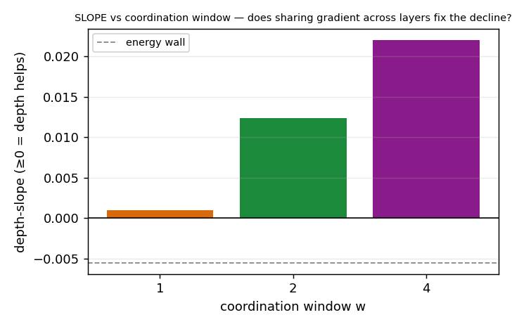

# Phase 3 — the objective reframe: forward-only learning earns depth (ADOPTED)

> **✅ Complete (2026-06-22, P3.0 → P3.3) — the adopted upgrade.** The front door to Phase 3 — the navigable
> overview. The deep story with every figure is **[`phase3-report.md`](phase3-report.md)**; the scalars are
> **[`RESULTS.md`](RESULTS.md)**; the pre-run design is **[`design.md`](design.md)**; the literature behind the reframe
> is **[`../../research/papers/phase3/`](../../research/papers/phase3/README.md)**.
>
> **Verdict in one line:** Phase 2 closed the wrong thing — the depth wall is intrinsic to the **energy objective
> `Σh²`**, *not* to forward-only locality. Swap energy-goodness for a **contrastive (InfoNCE) objective** + a
> **cross-layer coordination window (w≥2)** and depth **composes** (on a task with the headroom to show it), while
> re-earning and slightly *improving* the continual win. **This is adopted; it supersedes energy-goodness as the
> SCFF objective for draft 6.0.**
>
> *↑ In the arc:* **Phase 3** of the eleven-phase story ([map](../README.md) · [Stage 1](../stage1-report.md)) — the spine under all of it: [`the-essence2`](../../../docs/essence/the-essence2.md).

---

## The problem

Phase 2 ended confident: *"the wall is intrinsic to SCFF's forward-only locality."* Then the literature pass caught
the one word that was too strong. Phase 2 only ever varied the objective *inside one family* — energy goodness
`Σh²`, asking each layer the same **density** question. But a *different kind* of objective composes with depth
forward-only, gradient-isolated, *and* unsupervised: Greedy InfoMax / CLAPP train each module to **preserve the
information** of its input, and a Jan-2026 benchmark tests **SCFF by name** and shows the predictive local-SSL
family *matches end-to-end backprop-SSL* on CIFAR-10. So: **is the wall intrinsic to locality, or only to the
energy objective?**

## What we did

- **Cell under test:** the Phase-2 healthy cell with a **pluggable objective** — energy vs masked-reconstruction
  vs **contrast (InfoNCE, two-mask views)** — and a cross-layer **coordination window `w`** (the author's "a layer
  learns to help the *next* layer" idea, supplied forward-only).
- **Tasks:** CIFAR-flat (the wall), a **built depth-headroom synth task** (so "rising" is achievable at all),
  digits (the continual veto).
- **The decisive read:** **selectivity** (trained probe − random projection) and the per-layer probe **slope**.

## What we found

Given a task with depth headroom, the contrastive objective + coordination genuinely **composes depth** — and
coordination is the decisive lever:

*On a task where depth genuinely helps, w1 is myopic (+0.001, rises then drifts down), w2 +0.012 rises, and **w4
+0.022 rises monotonically to 0.569 at L8 — above the fixed-budget GD ceiling**, selectivity +0.181, 5/5 seeds.
This overturns P2.2's "intrinsic to locality." (n=5, headroom synth, L=8.)*

The arc:

- **P3.0 (objective swap — make-or-break):** three objectives split cleanly. **Energy** decays through the random
  floor; **reconstruction** flattens but sits *below* random (it preserves pixel/**density** info — the density≠class
  trap re-incurred); **contrast** stays *above* random at every depth (it preserves **class** info) but still
  declines. The objective *family* is the lever; reconstruction is **rejected**.
- **P3.1 (coordination):** the window eases contrast's decline (w1 → w2 ~33% flatter). The unlock was diagnostic:
  flat-CIFAR has **no depth headroom for anyone** (GD-hidden is itself flat there), so "slope ≥ 0" was the wrong
  bar — we were hitting the *task's* ceiling. → build a headroom task.
- **P3.2 (headroom confirmation — decisive):** on a task where GD-hidden *rises*, contrast + coordination composes
  depth (figure above). **P2.2 overturned.**
- **P3.3 (continual veto — closes the phase):** the worry was InfoNCE biasing toward the current task. It didn't:
  the contrastive cell is per-sample, continual-safe by construction, and **improves** the win — BWT **−0.017** vs
  energy's −0.026 (disjoint-IQR, 3/3); the all-class probe stays flat. **ADOPT.**

## What it set (decisions)

The SCFF objective = **contrast (InfoNCE, two-mask views, temp 0.5)** + **cross-layer coordination window w≥2**
(w=2 the cheapest sufficient; larger windows help more where headroom is large), sleep-consolidated, per-sample
(continual-safe). **This supersedes energy-goodness `Σh²` as the SCFF objective for draft 6.0.**

**Honest scope, kept front and center:** the depth-composition is a **rising *slope* on a built synthetic headroom
task vs a fixed-budget GD baseline** — the slope is the claim, *not* a GD-beat. w4 exceeding GD's ~0.52 is against
*this* fixed-budget from-scratch GD, not a tuned maximum. Flat-CIFAR remains capped (no headroom); natural-data /
scale is an open follow-up, not a blocker.

## Read next

| For | Go to |
| --- | --- |
| The full story, every figure, the per-rung reads | [`phase3-report.md`](phase3-report.md) |
| The scalar ledger (numbers + decisions) | [`RESULTS.md`](RESULTS.md) |
| The pre-run design + the objective-reframe writeup | [`design.md`](design.md) · [`../../research/papers/phase3/`](../../research/papers/phase3/README.md) |
| The run-cards | `exp0/1/2/3/` `experiment-*.md` (P3.0–P3.3) |
| Figure/house style | [`result-format.md`](result-format.md) → [`../result-format.md`](../result-format.md) |
| The Stage-1 arc | [`../stage1-report.md`](../stage1-report.md) · **Prev:** [Phase 2](../phase2/README.md) · **Next:** [Phase 4](../phase4/README.md) |
