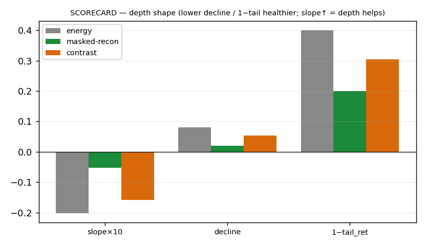
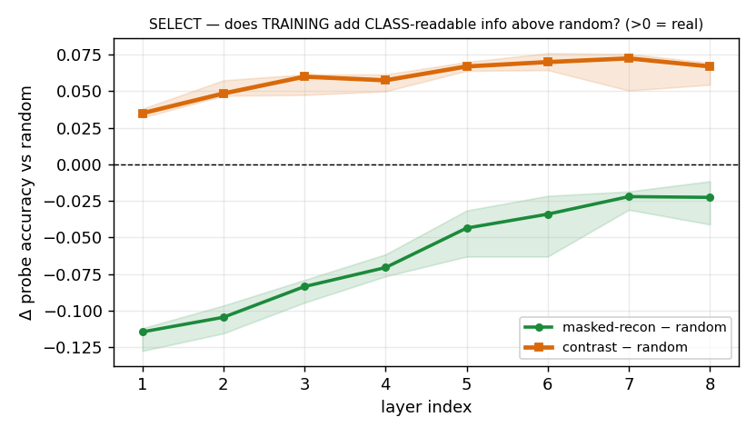
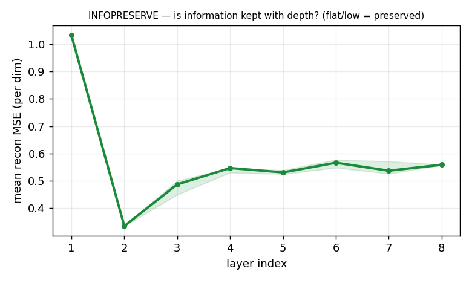
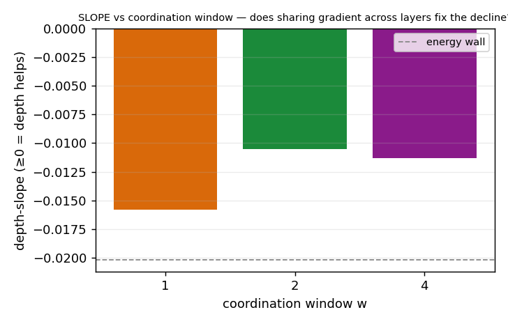
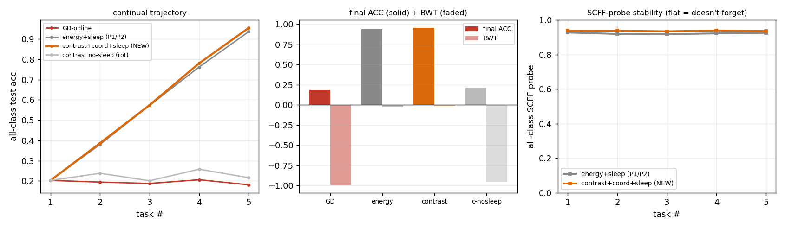

# Phase 3 — the objective reframe: how forward-only learning earns depth (the report)

> The reader-facing narrative of Phase 3 (P3.0 → P3.3, June 2026): Phase 2 closed the wrong thing; we swap the
> objective, add the user's coordination idea, and win depth (forward-only, unsupervised), then prove it doesn't
> cost the continual win — **adopted; it supersedes energy-goodness.** A first-person research log, figures and
> tables inline. Terms and metrics are defined in [`../ref-report/`](../ref-report/README.md); the literature
> behind the reframe is [`../../ref2/`](../../ref2/README.md); the terser source it draws from is the
> [summary](phase3-summarize.md), the [`RESULTS.md`](RESULTS.md) ledger, and the `expK/experiment-K.md` cards.

---

## 1 · The wound we inherited — and the one word that was too strong

Phase 2 ended with a clean, confident sentence: the depth wall is *"intrinsic to SCFF's forward-only locality."*
We almost believed it. Then the literature pass ([`../../ref2/`](../../ref2/README.md)) caught the one word that
was too strong. Phase 2 only ever varied the objective *inside one family* — the energy goodness `Σh²`, changing
*which negative* gets blended in. Every cell still asked each layer the same question: *"are you loud on the
coherent input and quiet on the mixture?"* — a density question.

The literature has tested a *different kind* of objective, and it composes with depth — forward-only,
gradient-isolated, *and* unsupervised. [Greedy InfoMax](../ref-report/papers.md#gim) is the existence proof: each
module trained with a local InfoNCE loss to *preserve the information* of its input, and the per-layer accuracy
*rises* across depth. A January-2026 benchmark ([2601.21683](https://arxiv.org/abs/2601.21683)) tests **SCFF by
name** and shows the predictive local-SSL family (CLAPP++) **matches end-to-end backprop-SSL** on CIFAR-10 (80.51
vs 80.49). So Phase 2 was right that no negative-selection saves energy-goodness — and *also* there is a lever it
never touched. Phase 3 is the test of that lever: **is the wall intrinsic to locality, or only to the energy
objective?**

## 2 · What we built to test it

- **Cell under test:** the Phase-2 healthy cell (layer-norm + linear) with a **pluggable objective** — energy,
  [masked-reconstruction](../ref-report/methods.md#masked-reconstruction), or
  [contrast (InfoNCE, two-mask views)](../ref-report/methods.md#contrast-objective-infonce-two-mask-views) — and a
  cross-layer [coordination window `w`](../ref-report/methods.md#coordination-window-w-olu--direction-1).
- **Tasks:** CIFAR-10-flat (the wall), a **built depth-headroom synth task** (so "rising" is achievable at all),
  digits (the continual veto).
- **Baselines:** GD-hidden (the ceiling — a *fixed-budget* from-scratch baseline); random projection (the
  [selectivity](../ref-report/metrics.md#selectivity) control).
- **Metrics:** [depth-slope](../ref-report/metrics.md#depth-slope) · [selectivity](../ref-report/metrics.md#selectivity) ·
  decline-shape / tail-retention · [BWT](../ref-report/metrics.md#bwt--backward-transfer).

## 3 · The arc, rung by rung

### P3.0 — the objective swap (the make-or-break)

We run three unsupervised objectives on the identical CIFAR-flat bench and read each with the selectivity control.
The question is whether the *objective family* — not the normalization, not the negative-selection — is the lever.

**Figure — the scorecard.**

*Three objectives, three behaviours: **energy** decays *through* the random floor (slope −0.020);
**masked-reconstruction** flattens (−0.005) but sits *below* random; **contrast** stays *above* random at every
depth but still declines (−0.016). (n=5, CIFAR-flat.)*

**Figure — selectivity (the decisive read).**

*Reconstruction selectivity −0.062 (it preserves pixel/**density** info — the density≠class trap re-incurred in the
*reconstruction target*); contrast +0.060, 5/5, *growing* with depth (it preserves **class** info). (n=5,
CIFAR-flat.)*

**Figure — info preserved (density vs class).**

*The decisive read of the phase: reconstruction preserves *all* of it (density); contrast preserves the
*discriminative* part (class). This is why every depth-composing local learner (GIM/CLAPP) is contrastive, not an
autoencoder. (n=5, CIFAR-flat.)*

The two needed properties split cleanly: reconstruction is **flat-but-wrong** (it preserves the wrong information),
contrast is **right-but-declining** (it preserves the right information, but each layer re-discriminates myopically).

**What it said.** The objective family *is* the lever, and the right one is **discriminative preservation**
(contrastive). The residual decline is a *coordination* gap, not an objective gap. **Decision:** carry the
contrastive objective; masked-reconstruction is rejected (it proves preservation-alone preserves the wrong thing);
→ P3.1.

### P3.1 — cross-layer coordination (the user's Direction 1)

The decline that contrast leaves is the cross-layer coordination P2.2 named as missing — and the user's own idea
(a layer learns to help the *next* layer, not just itself) is exactly that, supplied forward-only. We add a
coordination *window* `w`: layers trained in joint groups, gradient shared then detached (`w=1` reproduces P3.0
contrast exactly — the regression guard).

**Figure — slope (CIFAR).**

*Coordination eases the decline monotonically: w1 −0.0158 → w2 −0.0105 (~33% flatter), deep endpoint 0.230→0.254,
selectivity +0.066; w4 saturates. But on flat-CIFAR it never reaches flat. (n=5, CIFAR-flat.)*

The diagnosis that unlocked the phase: on synth (which *has* headroom) the same window *rises* — w1 −0.005 → w2
+0.002 → w4 +0.008 — but flat-CIFAR has **no depth headroom for anyone**: GD-hidden is itself flat at ~0.36 there.
So "slope ≥ 0" was the wrong bar — we were hitting the *task's* ceiling, not the method's.

**What it said.** Coordination is a real, correct lever — but flat-CIFAR cannot *show* "rising" because nothing
rises there. **Decision:** build a task with headroom to prove it → P3.2.

### P3.2 — the depth-headroom confirmation (decisive)

We scanned the `make_tierb` generator for a flat-MLP task where **GD-hidden rises** with depth, and locked one
(`grid=4, n_active=3, overlap=0.6`, 64 clusters; GD-hidden rises 0.39→0.51). On a task where depth genuinely
helps, does contrast + coordination compose depth?

> *Figure location:* the headroom-run figures live under **`exp1/figs_p3_1_headroom/`** (P3.1 and P3.2 shared the
> headroom run), not in `exp2/`.

**Figure — the overturn (headroom slope).**

*Given headroom, the method composes depth — and coordination is the decisive lever: w1 is myopic (+0.001, rises to
L3 then drifts down), w2 +0.012 rises, and **w4 +0.022 rises monotonically to 0.569 at L8 — above the fixed-budget
GD ceiling**, selectivity +0.181, 5/5 seeds. (n=5, headroom synth, L=8.)*

**Result (n=5 median, probe L1 → L8).**

| cell | probe L1 → L8 | slope/layer | tail-ret | selectivity |
| --- | --- | --- | --- | --- |
| energy-wall | 0.39 → 0.34 | −0.0055 (the wall) | — | ~0 |
| contrast w1 (no coord) | 0.41 → 0.46 | +0.0010 (rise-to-L3, then falls) | 0.86 | +0.153 |
| contrast w2 (coordination) | 0.41 → 0.52 | +0.0124 (rises) | 0.94 | +0.175 |
| **contrast w4** (more coordination) | 0.41 → **0.569** | **+0.0220** (rises, monotone) | **0.99** | **+0.181** |
| GD-hidden ceiling | 0.39 → ~0.51 | +0.02 (rises — headroom ✓) | — | — |

_(`tail-ret` = [tail-retention](../ref-report/metrics.md#tail-retention): deep-layer probe relative to its peak —
0.99 means w4 keeps essentially all its separability to L8. Intermediate `tail-ret` / `selectivity` columns are from
the [P3.2 card](exp2/experiment-2.md), not author-filled.)_

**What it said.** Given depth headroom, the discriminative-contrastive objective + cross-layer coordination makes
forward-only *unsupervised* learning genuinely *compose* depth — and coordination is the decisive lever (w1 myopic
vs w4 climbing). **This overturns P2.2:** the wall was intrinsic to the *energy* objective, not to forward-only
locality. **Decision:** the static-depth question is answered *yes (with headroom)*; carry `contrast +
coordination (w≥2)` → P3.3.

### P3.3 — the continual veto (the adoption-deciding rung; closes Phase 3)

A better static objective is only worth adopting if it keeps the architecture's home — the continual win from
Phase 1. The veto: does `contrast + coordination` re-earn it?

**Figure — continual veto.**

*VETO PASSED — and improved: contrast+coord+sleep reaches final 0.954 / BWT −0.017 [−0.020,−0.015] vs energy-SCFF
0.938 / −0.026 [−0.027,−0.022] (disjoint-IQR, 3/3); the contrast all-class probe stays flat (0.938→0.936, doesn't
forget); sleep is decisive (no-sleep rots to 0.214; GD-online 0.186 / −0.992). (n=3, class-incremental digits.)*

The worry going in was that InfoNCE might bias toward the current task and hurt retention. It didn't materialize:
the contrastive cell is per-sample with no batch statistics, so it is continual-safe by construction — the same
virtue energy-SCFF had, and the better static objective helps continual too.

**What it said.** The reframe is a strict upgrade — it composes depth *and* improves the continual win.
**Decision:** **ADOPT.** Phase 3 closes.

## 4 · The cross-cutting discoveries

1. **The objective *family* is the lever** — not normalization or negative-selection (Phase 2's energy-family
   knobs, both dead). Swapping energy → discriminative-contrastive changes everything.
2. **Reconstruction preserves the *wrong* information** (all of it = density); **contrast preserves the *right*
   part** (class) — which is why every depth-composing unsupervised local learner is contrastive, not an autoencoder.
3. **Coordination converts "preserved" into "composed."** Contrast alone re-discriminates myopically (rises then
   drifts); the window lets a layer serve the next's discrimination → monotone rise.
4. **P2.2's "depth intrinsic to forward-only locality" is overturned** — it was intrinsic to the *energy objective*.
5. **Flat-CIFAR has no depth headroom for *anyone*** — the methodological unlock was *building a headroom task*;
   without it, P3.1 looked like a method failure when it was a task ceiling.
6. **The contrastive objective is forgetting-robust like energy-SCFF** — the reframe doesn't cost the continual
   win; it slightly improves it.

> **Through-line (density ≠ class) — the resolution:** contrast preserves **class** (composes); reconstruction
> preserves **density** (rejected, below random); coordination converts preserved → composed. This is where the
> spine that opened in Phase-1 exp0 finally turns — the wall was the *energy objective*, not the locality.

## 5 · What this phase set (spec deltas)

The SCFF objective = **contrast (InfoNCE, two-mask views, temp 0.5)** + **cross-layer coordination window w≥2**
(w=2 the cheapest sufficient; larger windows help more where headroom is large), sleep-consolidated, per-sample
(continual-safe). **This supersedes energy-goodness `Σh²` as the SCFF objective for draft 6.0.**

## 6 · Honest scope & caveats

This is the most load-bearing scope section in the set, so we state it as the spine, not a footnote:

- **The depth-composition is on a *built synthetic headroom task* with a *fixed-budget GD baseline*.** The
  **rising *slope* is the claim — NOT the GD-beat.** w4 exceeding GD's ~0.52 is against *this* fixed-budget,
  from-scratch GD, not a tuned maximum; the load-bearing result is the monotone rise, full stop.
- **Flat-CIFAR remains capped** (no headroom) — P3.2 explains that PARTIAL, it doesn't change it.
- **Natural data / scale is untested** — the headroom result is synthetic and small; confirming it on a real
  depth-needing task is an open follow-up, not a blocker.
- **Direct-feedback (global top-down coordination)** — the 2026 CLAPP++ winner — is untested; the window sufficed,
  so "is global cheaper than a window?" stays an optional refinement.

## 7 · The bridge to Phase 4

Phase 1 found *where* this architecture wins (continual). Phase 2 found energy-goodness can't earn depth. Phase 3
found *how it can* — a different objective plus the user's coordination idea — and proved it doesn't cost the
continual win. The cheap brain now has a better objective end-to-end: it composes depth *and* doesn't forget,
forward-only and per-sample. Phase 4 stops *improving* the cell and starts *characterizing* it — a gap-to-backprop
capability map across seven controlled axes, on a cell we finally trust.

## Reproducibility

Every run writes `figs_*/manifest.json` + `figs_*/arrays.npz`; figures regenerate with no retraining
(`python plot_*.py <dir>`). Seeded/deterministic. Entry points: `exp0/run_p3_0.py` (objectives),
`exp1/run_p3_1.py {cifar,headroom}` (coordination), `exp2/scan_headroom.py` (the headroom hunt),
`exp3/run_p3_3.py` (continual veto). New cells: `p3lib.py` (`SCFFRecon`, `SCFFContrast`, `SCFFContrastOLU`). Run
single-threaded (`OMP_NUM_THREADS=1` + `python -u`); and note a backgrounded run only saves after *all* seeds, so
a mid-run laptop sleep loses it (the P3.1 first launch died this way — re-ran clean; per-seed checkpointing is the fix).
