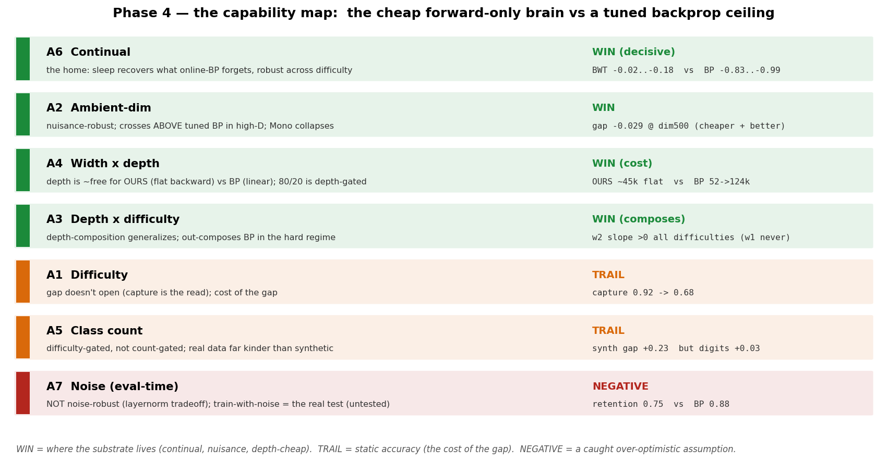

# Phase 4 — the capability map: characterizing the adopted cell

> **✅ Complete (2026-06-22; P4.3 re-run + extended 2026-06-24).** The front door to Phase 4 — the navigable
> overview. The deep story with every figure is **[`phase4-report.md`](phase4-report.md)** (the authoritative
> account, especially for P4.3); the scalars are **[`RESULTS.md`](RESULTS.md)**; the pre-run design + methodology
> canon is **[`design.md`](design.md)**.
>
> **Verdict in one line:** a gap-to-*genuinely-tuned*-backprop map across seven controlled axes says it plainly —
> **a substrate-native continual learner, not a static-accuracy competitor.** No algorithm bug hid in the breadth.
>
> *↑ In the arc:* **Phase 4** of the ten-phase story ([map](../README.md) · [Stage 1](../stage1-report.md)) — the spine under all of it: [`the-essence2`](../../../docs/essence/the-essence2.md).

---

## The problem

By the end of Phase 3 we trusted the cell on *two* axes (continual + depth-composition). Two axes is not a map.
Before the maintenance loop is optimized on top of this cell (that is Stage 2's job), we wanted the whole orthogonal scorecard — run
for **coverage, not triage** — because a breadth sweep is the cheapest place to catch a latent algorithm bug
before any optimization is built on a flaw. **Characterize before optimize.** (It earned the framing twice:
the breadth caught a latent OOM bug *and* refuted the plan's optimistic noise-win — the pre-flight gate working.)

## What we did

- **Cell under test (OURS):** `[contrast (InfoNCE, two-mask) + coordination w=2] SCFF bulk + all-tap
  sleep-consolidated readout` — the Phase-3 adopted cell.
- **Racers:** OURS vs a **genuinely-tuned BP** ceiling (the gap to it is the headline) vs **Mono-Forward** (the
  strongest forward-only *supervised* bar — racing it is more honest than racing BP alone).
- **Bench:** a controlled Gaussian generator with **exact Bayes error** (the difficulty dial *and* the true
  ceiling), plus real anchors (digits, CIFAR-flat).
- **Seven axes (A1–A7 = P4.0–P4.6):** difficulty · ambient-dim · depth×difficulty · width×depth · class-count ·
  continual · noise. P4.7 = the synthesis (map assembly), not an 8th axis.

## What we found

The deliverable is the map, not a verdict:

*WIN where the substrate lives (continual, nuisance-dim, depth-cheap, depth-composition); TRAIL on static accuracy
(the cost of the gap); one honest NEGATIVE on eval-time noise. (OURS vs a genuinely-tuned BP ceiling, 7 axes; the continual WIN is vs **naive
online-BP without replay** — the fairer same-budget BP+replay baseline is Phase-6 work.)*

| axis | dial | verdict | the number |
| --- | --- | --- | --- |
| **A6 continual** | class-incr × difficulty | **DECISIVE WIN** | BWT −0.02→−0.18 vs online-BP −0.83→−0.99 (robust across difficulty) |
| **A2 ambient-dim** | nuisance dim 8→500 | **WIN** | OURS crosses *above* BP by dim 500 (gap −0.029); Mono collapses |
| **A4 width×depth** | iso-budget L2→L12 + ctrl | **WIN (cost)** | OURS/OLD backward flat in depth vs BP linear (1.3×→6.8×); see the honest caveat ↓ |
| **A3 depth×difficulty** | headroom, overlap 0.4→1.2 | **WIN (composes)** | w2 probe-slope >0 all difficulties (w1 never); representation-level |
| **A1 difficulty** | Bayes 0.02→0.37 | **TRAIL** | capture 0.92→0.68 (gap doesn't open) |
| **A5 class count** | C 2→20 | **TRAIL** | synth gap +0.23 but real digits +0.03 (difficulty-gated) |
| **A7 noise** | weight σ 0→0.4 (eval) | **NEGATIVE** | retention 0.75 vs BP 0.88 |

**The P4.3 (A4) story, stated honestly — this is the corrected one.** At iso-weight budget, both forward-only
methods' backward cost is **flat in depth** while BP's grows **linearly** (52→169k) → the 80/20 cost advantage is
real but **depth-gated** (~1.3× shallow, **~6.8× at L12**). The re-run added the **energy-Σh² baseline** (it
collapses with depth — the wall, made legible), measured at the **last-layer readout** (all-tap had *masked* the
wall by reading the good early layers), and a **fixed-width W64 control**. Result: contrast **flattens but does not
abolish** the wall — OURS composes to ~**L3–L5** and beats BP L2–L6 on headroom, then **decays** (loses L8–L12);
the W64 control proves the dip is **depth-DECAY, not the width-shrink**. So the deployed **all-tap / boosting
readout is load-bearing** (a single deep head is the wrong design), and energy-Σh² is decisively closed as a depth
substrate. *(A follow-up names the cause: local-objective drift off the class manifold past ~layer 5 — not
capacity; widening doesn't fix it. Fix = preservation. Useful composition ≈ 5 layers. Caveat: depth-scaled
training untested.)*

## What it set (the hand-off brief)

Picked from data, not guesses. In the final numbering these split: the open wound this map flagged — the **depth
decay** past ~layer 5 — became **Phase 5** (the SCFF close-out); the **noise-hardening** became **Phase 6** (closing Stage 1);
and the **maintenance-loop optimizations** below became **Stage 2** (Phases 7–10 — the GD namer, the economy, the
frozen loop).

1. **Optimize the continual mechanism** (sleep cadence + the Ch7 gate) — A6 is the validated win. **Stage 2's core (the P8 economy + the P9 frozen loop).**
2. **Build deep, but gate depth on headroom** — depth is cheap (A4) and composes (A3), but only *pays* with
   headroom, and the deep representation *decays* past ~layer 5; scale the coordination window with headroom (w=2
   hard regime → w=4 easy+deep). **(→ Phase 5 closed the decay.)**
3. **Make the cost meter depth-aware and temporal** — the 80/20 is depth-gated; meter the gated/sleep online cost,
   not one per-pass number.
4. **Run the train-with-noise (hardware-aware) test** before any analog noise claim (A7); treat layernorm as a
   tunable nuisance-robustness ↔ noise-sensitivity knob. **(→ Phase 6 ran exactly this.)**
5. **Validate multi-class on natural data** (A5) — the synthetic overstates the static gap. **(→ Phase 10.)**
6. **Don't compete** on static accuracy, many-class, or eval-time noise — not the architecture's place.

## Validated vs not

| | status |
| --- | --- |
| Continual win robust **across difficulty** | ✅ (A6) |
| Nuisance-dim robustness (crosses above BP in high-D) | ✅ (A2) |
| Depth-composition **generalizes** across difficulty | ✅ (A3, representation-level) |
| Depth is **cheap** (flat backward vs BP linear), 80/20 depth-gated | ✅ (A4) |
| Static multi-class accuracy competitive **on natural data** | ⚠️ digits ✅ (+0.03), CIFAR ⚠️ (1 seed); broader untested |
| Noise robustness **during learning** (the substrate regime) | ❌ untested — eval-time is a non-win (A7) |
| Beats a *tuned* BP on static accuracy | ❌ not claimed (trails A1/A5 — the cost of the gap) |

## Read next

| For | Go to |
| --- | --- |
| The full story, every figure, the per-axis reads (**authoritative for P4.3**) | [`phase4-report.md`](phase4-report.md) |
| The scalar ledger (per-rung numbers + verdicts) | [`RESULTS.md`](RESULTS.md) |
| The pre-run design + the evaluation-methodology canon | [`design.md`](design.md) |
| The run-cards | `exp0`…`exp6/` `experiment-*.md` (A1–A7); P4.3 has the decay follow-up |
| Figure/house style | [`result-format.md`](result-format.md) → [`../result-format.md`](../result-format.md) |
| The Stage-1 arc | [`../stage1-report.md`](../stage1-report.md) · **Prev:** [Phase 3](../phase3/README.md) · **Next:** [Phase 5](../phase5/README.md) |
