# Phase 4 — the capability map: characterizing the adopted cell (the report)

> The reader-facing narrative of Phase 4 (P4.0 → P4.7, June 2026): we stop improving the cell and
> **characterize** it, mapping the gap to a genuinely-tuned backprop ceiling across seven controlled axes. The
> map says exactly what the project always claimed — a substrate-native **continual** learner, not a
> static-accuracy competitor. A first-person research log, figures and tables inline. Terms and metrics are
> defined in [`../ref-report/`](../ref-report/README.md); the terser source it draws from is the
> [`RESULTS.md`](RESULTS.md) ledger and the `expK/experiment-K.md` cards; the navigable overview is the [`README.md`](README.md).

---

## 1 · Why characterize before optimize

By the end of Phase 3 we had a cell we trusted on *two* axes — continual (Phase 1) and depth-composition (Phase 3).
But two axes is not a map. Before Phase 5 optimizes the maintenance loop on top of this cell, we wanted the whole
orthogonal scorecard — run for **coverage, not triage** (the opposite of Phase 2, where we trimmed moot rungs). The
discipline is "characterize before optimize": a breadth sweep is the cheapest place to catch a latent algorithm
bug, before any optimization is built on a flaw.

It earned that framing twice over. The breadth caught a latent OOM bug in the Bayes-error computation (fixed via a
dot-product identity), and it **refuted** the plan's optimistic noise-win (A7) — the pre-flight gate working as
intended. *The cell is sound; no algorithm bug hid in the breadth.*

## 2 · What we built to test it

- **Cell under test (OURS):** `[contrast (InfoNCE, two-mask) + coordination w=2] SCFF bulk + all-tap sleep-readout`
  — the Phase-3 adopted cell.
- **Racers:** **OURS** vs a [genuinely-tuned BP](../ref-report/methods.md#genuinely-tuned-bp--the-ceiling) ceiling
  (the gap to it is the headline) vs [Mono-Forward](../ref-report/methods.md#mono-forward-the-racer) (the strongest
  forward-only *supervised* bar — racing it is more honest than racing BP alone).
- **Bench:** a controlled Gaussian generator with **exact [Bayes error](../ref-report/metrics.md#bayes-error--bayes-normalized-capture)**
  (the difficulty dial *and* the true ceiling), plus real anchors (digits, CIFAR-flat).
- **Metrics:** [gap-to-BP](../ref-report/metrics.md#gap-to-bp) · [Bayes-capture](../ref-report/metrics.md#bayes-error--bayes-normalized-capture) ·
  [backward cost](../ref-report/metrics.md#backward-cost-substrate-credit-assignment-work) ·
  [BWT/AA/FWT](../ref-report/metrics.md#bwt--backward-transfer) · [retention](../ref-report/metrics.md#retention-noise).

## 3 · The map at a glance (the deliverable)

*The Stage-1 result in one glance: WIN = where the substrate lives (continual, nuisance-dim, depth-cheap,
depth-composition); TRAIL = static accuracy (the cost of the gap); NEGATIVE = a caught over-optimistic assumption.
(OURS vs a genuinely-tuned BP ceiling, 7 axes.)*

| axis | dial | verdict | the number |
| --- | --- | --- | --- |
| **A6 continual** | class-incr × difficulty | **DECISIVE WIN** | BWT −0.02→−0.18 vs online-BP −0.83→−0.99 |
| **A2 ambient-dim** | nuisance dim 8→500 | **WIN** | crosses above BP by dim 500 (gap −0.029); Mono collapses |
| **A4 width×depth** | iso-budget L2→L12 +ctrl | **WIN (cost)** | OURS/OLD flat ~14–40k vs BP 52→169k (1.3×→6.8×); energy baseline = the wall; W64 control = decay-not-width |
| **A3 depth×difficulty** | headroom, overlap 0.4→1.2 | **WIN (composes)** | w2 slope >0 all difficulties (w1 never) |
| **A1 difficulty** | Bayes 0.02→0.37 | **TRAIL** | capture 0.92→0.68 (gap doesn't open) |
| **A5 class count** | C 2→20 | **TRAIL** | synth gap +0.23 but digits +0.03 |
| **A7 noise** | weight σ 0→0.4 (eval) | **NEGATIVE** | retention 0.75 vs BP 0.88 |

> **Through-line (density ≠ class) — confirmed by the map:** the cell wins where the substrate lives (continual,
> nuisance-dim, depth-cheap, depth-composition) and trails on static accuracy — *because* it is a density/structure
> learner with a cheap class-namer on top, **not** a global error-minimizer. The map is the spine, measured.

## 4 · The arc, axis by axis

*(The map above is ordered by impact — wins first. Here we walk the axes in run order, A1 → A7.)*

### P4.0 — difficulty (A1) + the apparatus

We first validate the bench (exact Bayes monotone, the cost meter sane, the three racers well-behaved) and then
dial difficulty via cluster overlap, with Bayes error sweeping 0.022 → 0.371.

**Figure — gap curve.**
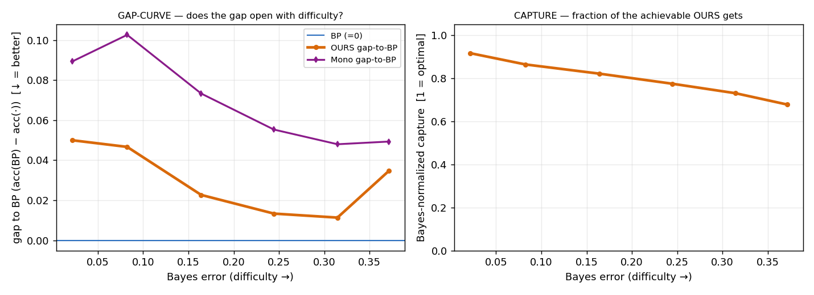
*The gap to BP does NOT open with difficulty — it *closes* (the achievable window shrinks as everyone is squeezed
toward chance), with a small uptick at the near-chance cell. So **capture** is the honest difficulty read,
declining monotonically 0.92→0.68. (n=5, overlap 0.50–1.25, Bayes 0.02–0.37.)*

The raw gap is +0.050 → +0.035 (closing, then upticking at chance) — confounded, which is exactly why
[capture](../ref-report/metrics.md#bayes-error--bayes-normalized-capture) is the read. OURS beats Mono everywhere
and generalizes best until it overfits at the near-chance cell. One more thing surfaced here: the 80/20 cost claim
is **not** supported per-pass at this shallow depth (OURS 47k vs BP 52k) — a flag we resolve at A4.

**What it said.** Capture, not raw gap, is the difficulty read. **Map tile:** TRAIL — the cost of the gap.

### P4.1 — ambient-dim (A2) — the first WIN

We hold difficulty fixed (Bayes flat at 0.108 — apparatus ✓) and grow the ambient dimension 8 → 500, with the
signal in a 2-D subspace and the rest pure nuisance. This is the substrate's native shape — analog crossbars are
wide.

**Figure — gap curve.**
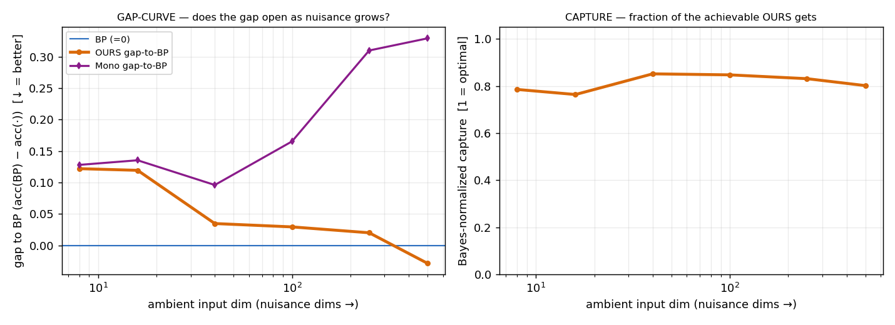
*As nuisance dimensions grow, OURS holds (~0.79) while tuned BP gently declines (its first layer is
budget-squeezed) and **Mono-Forward collapses toward chance** (0.75→0.41 — it overfits the junk, gen-gap 0.59).
**OURS crosses *above* tuned BP by dim 500** (gap −0.029, IQR all-negative) — cheaper *and* more accurate there.
(n=5, dim 8–500, Bayes 0.108.)*

The mechanism is the contrast objective plus per-sample layernorm down-weighting non-discriminative dimensions for
free — nuisance is identical across the two mask views, so it carries ~0 InfoNCE signal. This is the first axis
where the cheap brain is *strictly better* than the tuned ceiling, and it is in the substrate's native regime.

**What it said.** OURS is nuisance-robust where the substrate lives; Mono-Forward is high-D-unsafe (keep it as the
cautionary racer). **Map tile:** WIN.

### P4.2 — depth × difficulty (A3) — composition generalizes

Depth-composition is invisible to task accuracy (a good readout hides it), so we instrument the **per-layer probe
slope** on the headroom task, sweeping difficulty, with OURS w=2 vs OURS w=1 (the no-coordination control) vs
GD-hidden.

> *Baseline note:* A3 is the **representation** axis, so it reads against the **GD-hidden** probe ceiling (same
> baseline as P3.2) — *not* the genuinely-tuned BP that the task-accuracy axes (A1/A2/A4/A5) race. Two baselines for
> two different questions: "does the representation compose?" vs "what's the accuracy gap?"

**Figure — slope.**
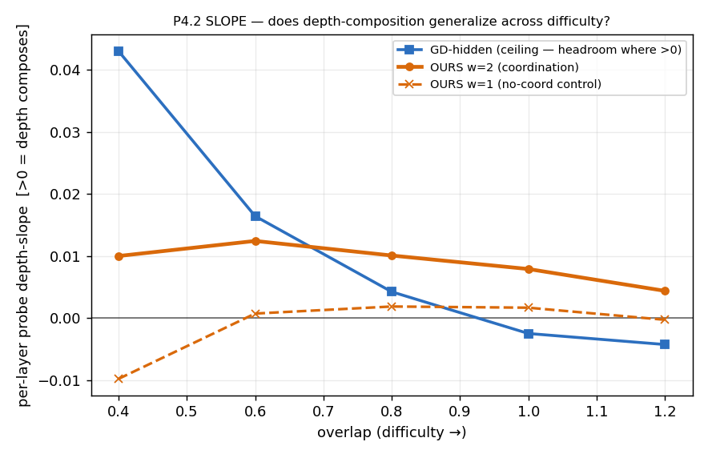
*OURS w=2 composes depth (slope > 0, IQR disjoint from 0) across the *whole* difficulty band; the w=1 control
**never composes** — coordination is the lever, robustly. (n=5, headroom, overlap 0.4–1.2.)*

**Figure — the map.**
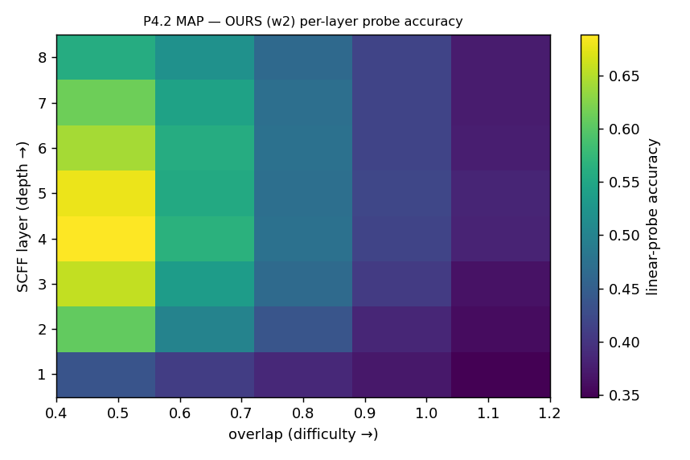
*OURS and the GD-hidden ceiling compose in *complementary* regimes: GD-hidden loses its own headroom by overlap
1.0, so it composes at easy and **OURS out-composes it in the hard / low-headroom regime** (top-layer crossover ≈
overlap 0.6). (n=5.)*

A caveat worth keeping visible: w=2 shows a mild inverted-U at easy+deep (myopic drift), which P3.2's w=4 fixes —
so window size is a Phase-5 difficulty-dependent knob (cheap w=2 in the hard regime; grow to w=4 for easy+deep
monotone composition).

**What it said.** Depth-composition *generalizes* across difficulty, and it is a *representation* win (probe), not
a task-accuracy win. **Map tile:** WIN (composes).

### P4.3 — width × depth (A4) — the Scap-collision resolved, via cost (re-run + extended)

The Phase-2 collision — SCFF likes width, the Scap likes depth — gets its real answer here. At an iso-weight budget
we sweep shape from L2/W109 (wide-shallow) to L12/W30 (narrow-deep, the substrate-native direction), in both a flat
and a headroom regime. The re-run adds three things the first pass lacked: the **OLD energy-Σh² baseline** (the
Phase-1/2 wall cell); a **last-layer readout** (the realistic position a single GD head sits — all-tap *masked the
wall* by reading the good early layers); and, to settle why OURS dips at depth, a **fixed-width W64 control** that
holds width constant so only depth varies.

**Figure — width × depth.**
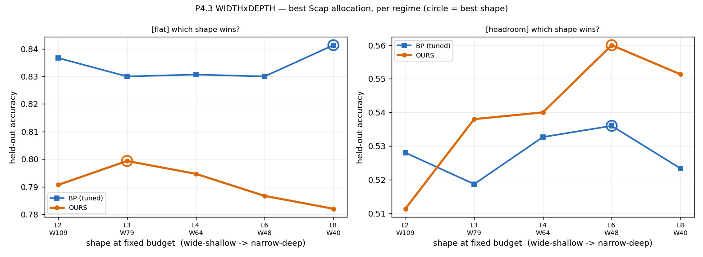
*Three racers, L2→L12. OLD energy (grey) collapses with depth in both regimes; BP (blue) is flat; OURS (orange)
sits between. On headroom OURS composes to L3–L5 (best L3: 0.559) and beats BP L2–L6, then decays below BP from L8;
on flat, depth doesn't pay (OURS declines, but stays well above OLD). (n=5, iso-budget ≈23.5k, last-layer readout.)*

**Figure — the wall.**
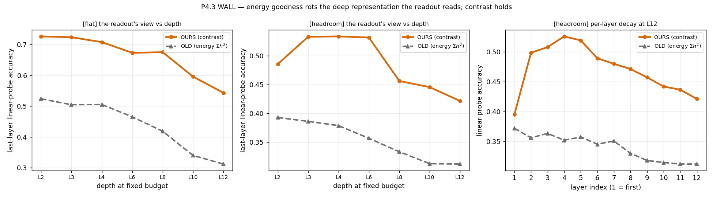
*The last-layer linear probe (what the readout reads) and the per-layer profile at L12: OURS builds useful
representation to ~layer 4–5 then declines; OLD never builds it and droops from layer 1. Contrast **flattens** the
energy wall — the OURS−OLD gap widens with depth — but does not **abolish** it. (n=5.)*

**Figure — the decay-vs-width control.**
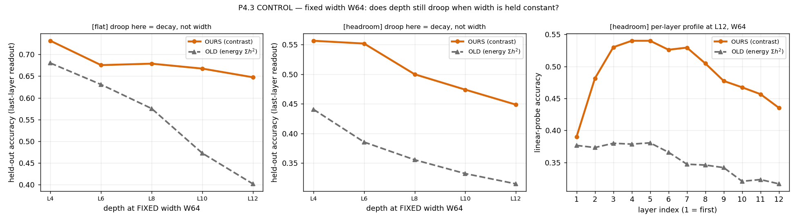
*The disambiguator. At **constant width W64**, OURS *still* droops with depth (headroom 0.557→0.449, flat
0.731→0.647 over L4→L12) — so the dip is **depth-DECAY, not the iso-budget width-shrink** (which adds only an extra
~0.02–0.03 at L8–L12). The per-layer profile at L12/W64 confirms it: OURS builds to layer ~4–5 then decays, at
constant width. (n=5.)*

**Figure — Pareto.**
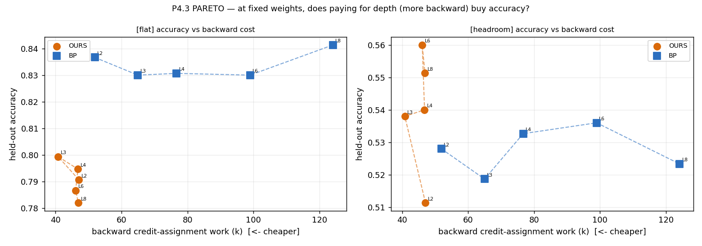
*The cost picture, unchanged and sharper: both forward-only methods' backward cost is **flat in depth** (OURS
~25–40k, OLD ~14–24k; bounded credit distance) while BP's grows **linearly** (52k → 169k). On headroom OURS owns
the cheap top-left; BP fans right for no gain; OLD is cheapest but collapses. (n=5.)*

This refines A1's cost flag into the real claim: **the 80/20 cost advantage is *depth-gated*** — ~1.3× at shallow
depth, **~6.8× at L12** — and the substrate operates deep, so it materializes in the operating regime. Depth is
OURS's to spend cheaply. **But the honest readout + control correct the accuracy story:** the cross-layer window
genuinely shares context for **~5 layers** (energy composes *zero*), but the representation then **decays — and the
W64 control proves the cause is depth, not width.** So the deployed **all-tap / boosting readout is load-bearing**
(it works around the *residual* decay; a single deep head is the wrong design), and **energy-Σh² is decisively
closed** as a depth substrate. (Honest caveat: all depths share `ep=25/lr=0.03` — depth-scaled training is an
untested P5 knob before calling the decay an intrinsic ceiling.)

**What it said.** The collision resolves in OURS's favour, via cost; the energy baseline makes the wall legible, and
the control shows contrast's bounded escape from it is depth-limited, not width-limited. **Map tile:** WIN (cost).

*Follow-up ([`exp3/experiment-3-decay.md`](exp3/experiment-3-decay.md)) — why it decays:* widening each layer (to
W240) does **not** fix it (dead-fraction ≈ 0; widen's higher rank buys no accuracy), so the cause is
**local-objective drift off the class manifold past ~layer 5**, not capacity. A mixed flat+headroom task shows the
deep layers **corrupt** the early-solved flat subtask while tuned BP holds it flat. Fix = **preservation**
(all-tap/boosting or residual skips), useful composition ≈ **5 layers**.

### P4.4 — class count (A5) — competitive-but-trails, difficulty-gated

We fix the 40-cluster geometry and only re-partition labels, sweeping class count C ∈ {2,4,10,20} (exact Bayes
preserved), and anchor with real data.

**Figure — gap curve.**
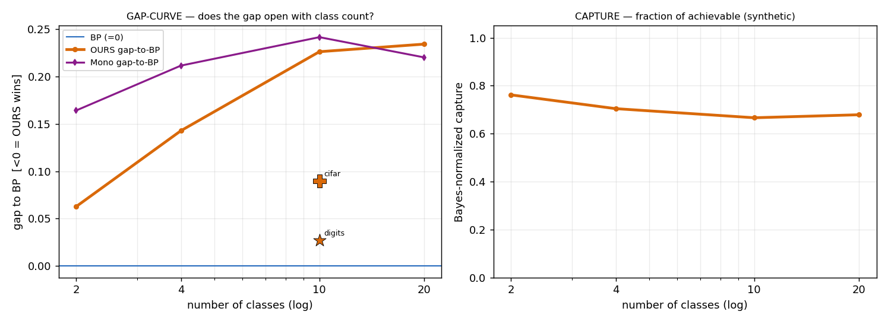
*On the harsh synthetic the gap widens with C (+0.06 → +0.23, saturating ~C10) and OURS's edge over Mono erodes
(Mono ties by C20) — **but the real anchors are far kinder**: digits (10-class) gap +0.027, CIFAR-flat +0.090. So
the synthetic widening is *discrimination hardness*, not a many-class penalty. (n=5 synth; digits n=5; CIFAR n=1.)*

**What it said.** Difficulty-gated, not count-gated; on real flat data OURS handles 10 classes fine. Not a win axis,
and Mono is the stronger reference at high C. **Map tile:** TRAIL.

### P4.5 — continual (A6) — THE win, robust across difficulty

The home turf. We reuse the validated P3.3 continual harness on a class-incremental stream (5 tasks of 2) at swept
difficulty, plus the digits anchor.

**Figure — continual profile.**
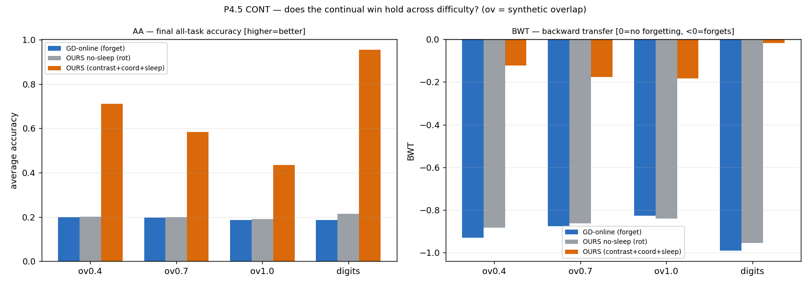
*OURS+sleep forgets almost nothing (BWT −0.02 to −0.18) at *every* difficulty while online-BP catastrophically
forgets (−0.83 to −0.99); the no-sleep control rots (sleep is the recovery mechanism — SCFF itself doesn't forget).
The largest, cleanest margin in the phase. (n=3, class-incremental.)*

**Result.**

| regime | OURS-sleep AA | OURS-sleep BWT | online-BP BWT | no-sleep BWT |
| --- | --- | --- | --- | --- |
| ov0.4 (easy) | 0.710 | −0.122 | −0.929 | −0.88 |
| ov0.7 | 0.583 | −0.176 | −0.876 | −0.86 |
| ov1.0 (hard) | 0.435 | −0.183 | −0.826 | −0.84 |
| **digits (home)** | **0.954** | **−0.017** | −0.992 | −0.95 |

The digits anchor reproduces P3.3 exactly (0.954 / −0.017). As difficulty rises OURS's AA falls (harder task), but
its BWT stays excellent — the win does not erode off the home config.

**What it said.** This is the architecture's reason for being, confirmed difficulty-robust. **Map tile:** DECISIVE
WIN.

### P4.6 — noise (A7) — an honest negative

The plan expected a win here — "forward-only is noise-robust." We tested it directly: train clean, then inject
multiplicative Gaussian weight noise at eval and sweep σ.

**Figure — noise curve.**
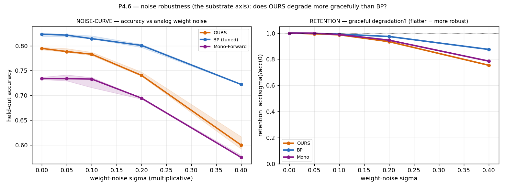
*Hypothesis REFUTED for this noise model: OURS is the *least* robust (retention 0.754 vs BP 0.875 at σ=0.4); both
forward-only methods degrade more than BP. (n=5, 5 draws/cell.)*

The likely cause is illuminating: the per-sample layernorm that *wins* A2 doesn't damp weight-*direction* noise —
so A2's robustness and A7's fragility **share a cause** (a real tradeoff, a knob, not a verdict). Crucially,
eval-time noise on a clean-trained model is **not** the substrate's regime: the literature's forward-only
robustness claim lives in *online learning with noise* (hardware-aware), which is untested — the proper Phase-5
follow-up. A caught over-optimistic assumption is a successful pre-flight check.

**What it said.** Don't claim noise-robustness yet; the real test (train-with-noise) is untested. **Map tile:**
NEGATIVE.

### P4.7 — synthesis: the map + the Phase-5 brief

We assemble the seven tiles into the [capability map](figs_summary/CAPABILITY_MAP.png) and read the Phase-5 brief
straight off it (§5). *(Labeling note: **P4.7 = the synthesis / map-assembly rung, not a 7th axis** — the seven
axes are A1–A7 = P4.0–P4.6; this report counts the synthesis rung too, so "P4.0 → P4.7." Same thing — stated once
so it doesn't read as a discrepancy.)*

## 5 · The Phase-5 brief (the hand-off)

Picked from data, not guesses:

1. **Optimize the continual mechanism** (sleep cadence + the Ch7 gate) — A6 is the validated win; tune it against
   *this* cell's measured drift. **This is Phase 5's core.**
2. **Build deep, but gate depth on headroom.** Depth is cheap (A4) and composes (A3) — invest in it — but it only
   *pays* where there's headroom. Scale the coordination window with headroom (w=2 cheap in the hard regime; grow
   to w=4 for easy+deep monotone composition).
3. **Make the cost meter depth-aware and temporal.** The 80/20 is depth-gated (A4) and the online cheapness lives
   in the gate + sleep cadence — report cost-vs-depth, and meter the gated/sleep online cost, not one per-pass number.
4. **Run the train-with-noise (hardware-aware) test** before any analog noise-robustness claim (A7), and treat
   layernorm as a tunable nuisance-robustness ↔ noise-sensitivity knob.
5. **Validate multi-class on natural data** (A5) — the synthetic overstates the static gap; benchmark vs Mono at
   high class count.
6. **Don't compete on static accuracy, many-class, or eval-time noise** — the map says that's not the
   architecture's place; the continual + substrate-native-depth regime is.

## 6 · Honest scope & caveats

- **Synthetic harshness ≠ real** — real digits is far kinder than the synthetic at the same class count (A5);
  validate on natural data before treating synthetic gaps as real limits.
- **Mono-Forward is an unreliable reference** — it collapses in high-D (A2) and catches up at high class count (A5).
  We keep it (Spyra's strongest forward-only-supervised bar) but read it in context, not as a fixed baseline.
- **A3 is *representation*-level, not task-accuracy** — depth-composition is read off the per-layer probe slope.
- **A7's real win-test is untested** — eval-time noise is a non-win; the substrate's regime is online learning
  *with* noise (train-with-noise / hardware-aware), which Phase 5 must run before any robustness claim.
- **Scale / convolution / time-series are deferred** — they need architecture (the north star), not this cell.

## Reproducibility

Every rung writes `figs_*/{manifest.json, arrays.npz, _ckpt.jsonl}`; figures regenerate with no retraining
(`python plot_p4_N.py figs_p4_N`). Seeded/deterministic. Run single-threaded (`OMP_NUM_THREADS=1` + `python -u` +
per-cell fsync checkpoint — resumable) and `PYTHONIOENCODING=utf-8` (the cp874 console gotcha). Apparatus: `p4lib`
(exact-Bayes generator, the three racers, the backward-cost meter); reuses Phase-1/2/3 (`make_tierb`,
`probe_per_layer`, the P3.3 continual harness, `SCFFContrastOLU`). Entry points: `exp0/run_p4_0.py` (difficulty) ·
`exp1/` (ambient-dim) · `exp2/` (depth×difficulty) · `exp3/` (width×depth) · `exp4/` (class+anchors) · `exp5/`
(continual) · `exp6/` (noise). The latent OOM bug (`bayes_error`'s `[n,K,dim]` tensor) was caught + fixed (the
dot-product identity) during P4.1 — the breadth-as-bug-catch working as intended.
