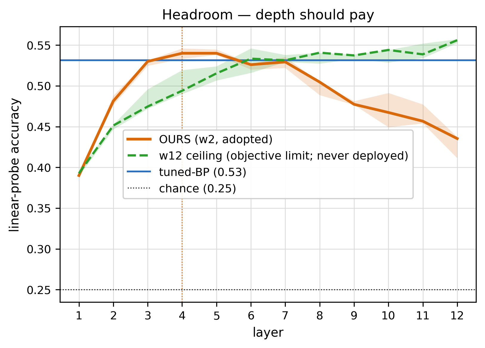
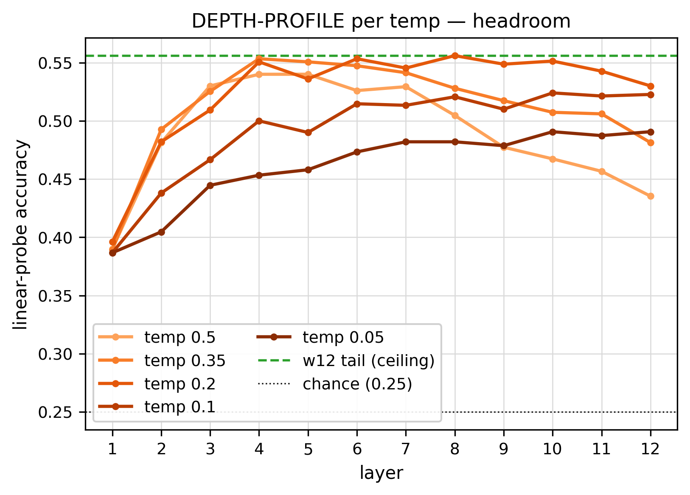
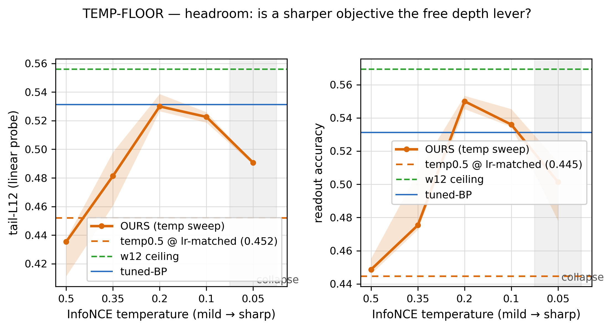
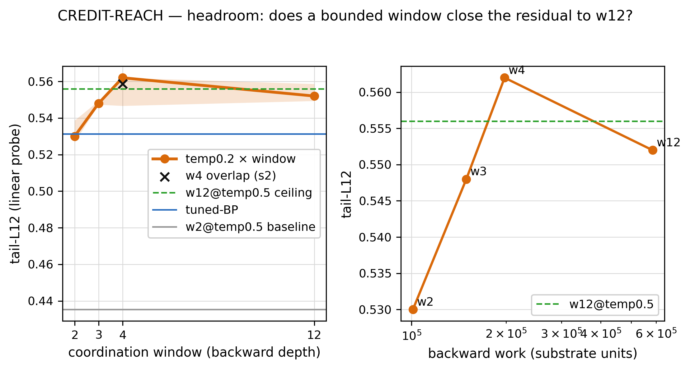
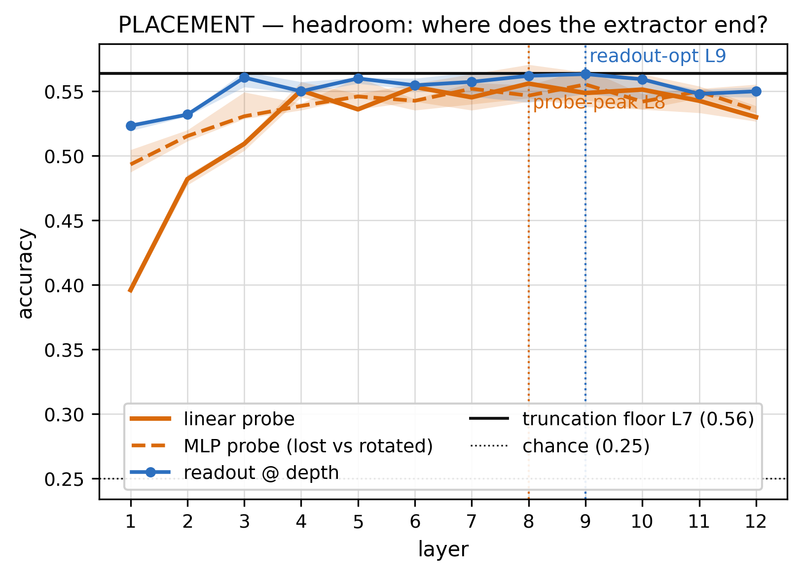
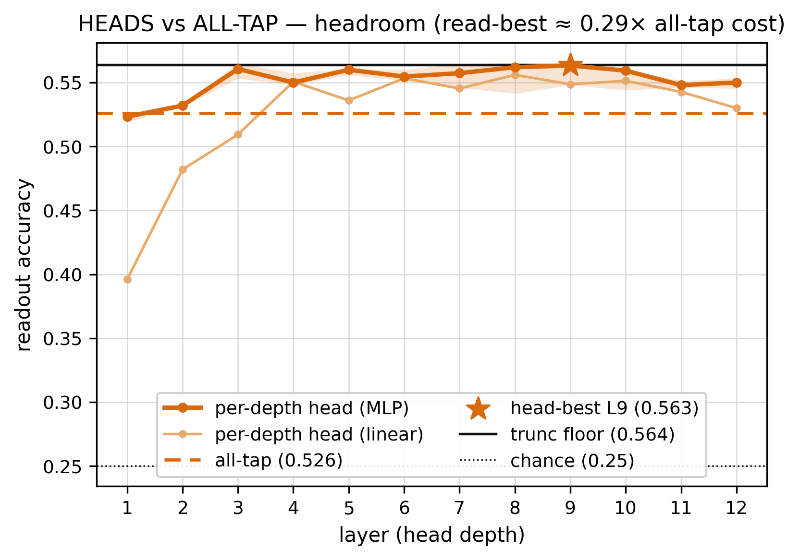
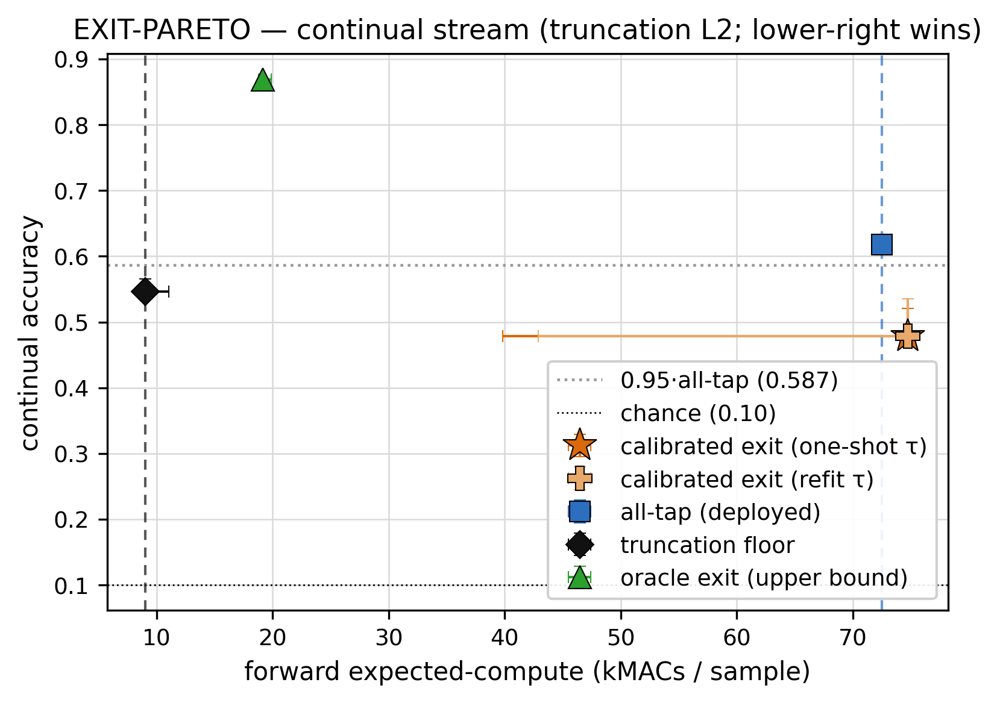
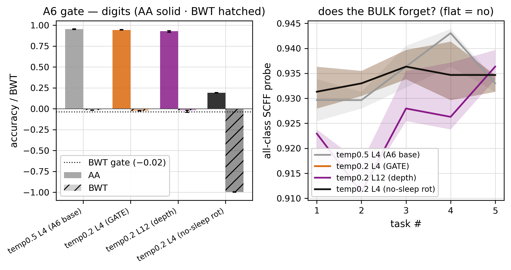
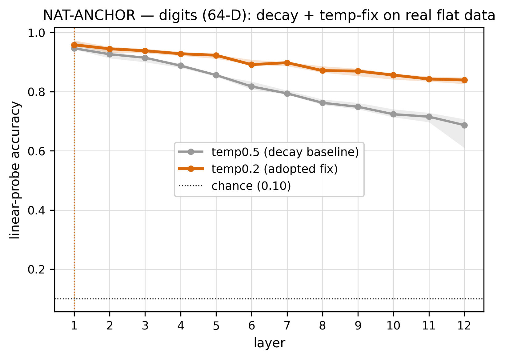

# Phase 5 — the SCFF close-out: solve the depth decay, read it cheaply (the report)

> The reader-facing narrative of Phase 5 (P5.0 → P5.9, June 2026): the cheap brain had one open wound — past
> ~layer 5 its representation *decays* — and this phase **names it, earns the depth back, reads it cheaply, and
> closes SCFF.** A first-person research log, figures and tables inline. The terser source it draws from is the
> [`RESULTS.md`](RESULTS.md) ledger and the `expK/experiment-K.md` cards; the navigable overview is the
> [`README.md`](README.md); the pre-run design and the binding reporting contract are [`design.md`](design.md) and
> [`result-format.md`](result-format.md); the literature is [`../../research/papers/phase5/`](../../research/papers/phase5/README.md).
>
> **A note on two references that recur in every figure.** The **w12 ceiling** is a *forbidden* configuration — a
> full-credit coordination window that reaches across all 12 layers, i.e. effectively a full backward pass. We never
> deploy it; we measure it only as the **objective-capability upper bound** (can the contrast objective compose the
> whole stack *if* credit reached everywhere?). It is temperature-insensitive within noise (probe tail 0.556 at the
> decay baseline, 0.552 at temp0.2 — we quote 0.556 as *the* ceiling throughout). The **truncation floor** is the
> opposite: a cheap, from-scratch short stack — the cost baseline any reader must beat. Composing-depth is only
> interpretable *between* the forbidden best and the cheap fallback, so both are drawn on every depth/accuracy plot.

---

## 1 · Why close out the cheap brain now

By the end of Phase 4 we had a cell we trusted and a map of where it wins — but the map flagged one wound, and the
wound was load-bearing. On a task with depth headroom, the per-layer linear probe **rises for ~5 layers and then
declines.** Phase 4's controls had already ruled out the boring explanations: a fixed-width W64 control showed the
dip is **depth-decay, not the iso-budget width-shrink**, and a widen-to-W240 follow-up showed it is **not capacity**
(dead-fraction ≈ 0; the extra rank buys no accuracy). What remained was a **direction** diagnosis: the deep layers
are alive and full-rank, but their representation has drifted *off the class manifold* once a layer's abstraction
saturates.

This is the project's oldest fault wearing a new coat. **Density ≠ class** — SCFF's machinery makes a layer loud on
coherent input and quiet on mixtures, so it learns *where the data is dense*, which only recovers classes when classes
*are* density clusters. We have paid for confusing the two four times (the spiral in Phase 1; the depth wall in Phase
2; reconstruction-below-random in Phase 3; the layernorm tradeoff in Phase 4). The decay is the fifth bill: the deep
layers preserve the *magnitude* of the representation (rank, variance, goodness all stay healthy) while losing its
*direction* (the class axis). So the **spine** for the whole phase was fixed in advance: **every lever must preserve
or read the class direction, never a magnitude.**

Two constraints bounded the search. The **envelope** (from P2.5): forward-first; read, gate, or add-to-objective is
allowed, but **rewriting the SCFF stream is forbidden** (`write` killed SCFF in Phase 2). And the **gate**: the A6
continual win is the architecture's reason for being, so any fix that dents it is rejected, no matter what it does for
depth. With those fixed, the phase had two jobs: **earn the depth** (make the stack compose deeper) and **read it
cheaply** (get the useful depth out without the all-tap readout that burns the 80/20).

## 2 · What we built to test it

- **Cell under test (OURS):** `SCFFContrastOverlap` — the Phase-3 adopted contrast (InfoNCE, two-mask) + coordination
  cell, with **temperature** and **coordination window** exposed as the levers. Forward-only, per-sample, no batch
  statistics (the continual-safety property, kept by construction).
- **The bench:** the Phase-4 controlled Gaussian generator, in three regimes — **headroom** (depth pays; the decay's
  home), **flat** (easy, peaks early), and a **mixed flat+headroom** task built specifically to expose *corruption*
  (do the deep layers overwrite an early-solved subtask?). Plus the real anchors: **digits** (64-D) and the
  **CIFAR-flat** wall (3072-D) from Phases 2–4.
- **The references:** the **w12 ceiling** (objective-capability upper bound, forbidden) and the **truncation floor**
  (cheap fallback) on every depth figure, with **tuned-BP / Bayes** as the achievable old-world anchor.
- **The apparatus:** `p5lib.py` — the seed cell promoted from the research session (`SCFFContrastOverlap`), per-depth
  heads, the calibrated-exit gate, a **forward-MACs** expected-compute meter (Phase 4's meter was backward-only), the
  A6 continual harness promoted from Phase 3, and `make_mixed` (the iso-budget mixed task). Figures are drawn only
  through `plot_p5.py` (one function per figure code), and **regenerate from `arrays.npz`** without retraining.
- **The discipline:** seeds `[42,137,271,314,1729]` (3 for the heaviest continual cells), median [IQR], a difference
  is **real** only if IQR-disjoint **and** ≥4/5 by seed; one variable per rung; guards logged every run; **failures
  are data** (the struck adaptive exit and the skipped residual get the same rigor as the wins).

## 3 · The arc, rung by rung

### P5.0 — the bench, and the decay made legible

Before changing anything, we reproduced the decay on the trusted bench and ran the guards. The guards passed cleanly
(operator equivalence `0.0`, finite-difference (FD) gradient check `2.1e-08`, dead-fraction ≤ `0.016`, cost monotone
in window), so the apparatus is sound. The decay reproduced exactly where Phase 4 saw it: on headroom the peak sits at **L5** and the
L12 tail falls to **0.435 [0.411–0.437]** — a gap of **0.121** to the w12 ceiling (0.556).

*OURS (w2) composes to L5 then decays to a 0.435 tail; the w12 ceiling (forbidden) composes the whole stack to 0.556
with no decay; the truncation floor marks the cheap fallback. The decay is **objective-locality, not an intrinsic
Tunnel** — full credit composes everything. (n=5, headroom, PROBE_EP=120.)*

The single most important read of the phase came from this rung: **w12 composes the whole stack with no decay.** If
the decay were an intrinsic property of forward-only depth (a "Tunnel" the representation must pass through), even
full credit would show it. It does not — so the decay is a property of the *local objective's reach*, and is
therefore **curable** by sharpening the objective or extending its reach. The mixed task also reproduced the
**corruption** we feared: at w2 the deep layers drag an early-solved flat subtask from its peak down to 0.475, while
w12 holds it at 0.708 — the deep layers overwrite when credit is local. **Banked:** the bench is trusted; no cell
change; the two cure-directions (sharper objective, longer reach) are the next two rungs.

### P5.1 — temperature: the free lever (and an lr-matched control to prove it)

The first cure-direction is the objective itself. A sharper InfoNCE temperature concentrates the contrast on the
hardest negatives, which should make each update *more class-selective* — but sharpening also raises the effective
gradient norm, so a naive sweep would confound "more direction" with "more learning-rate." We swept temperature
{0.5, 0.35, 0.2, 0.1, 0.05} **and** added the decisive control: a **temp-0.5 arm re-tuned to temp-0.2's
effective-gradient-norm** (step-norm ratio 2.249 → lr 0.0675). If temp-0.2 only works because it is a bigger step,
the lr-matched arm matches it; if it works because it preserves direction, temp-0.2 beats it.

*Sharper temperature marches the peak L5→L6 and lifts the tail 0.435→0.530, against the w12 ceiling and the lr-matched
control. The lift is **direction, not learning-rate** — the lr-matched temp-0.5 arm stays flat at 0.452. (n=5,
headroom, PROBE_EP=120.)*

Temp **0.2** lifts the tail to **0.530 [0.527–0.539]** and the real readout to **0.550** — within 0.026 of the w12
ceiling and, notably, **the readout beats tuned-BP** (0.531). The lr-matched control settles the confound: temp-0.2
(0.530) vs lr-matched temp-0.5 (0.452) is **5/5 by seed and IQR-disjoint**, so **~82% of the +0.095 lift is
direction, ~18% learning-rate** — the spine, paid in the objective.

*Tail and readout vs temperature, with the collapse region shaded: 0.2 is the sweet spot, 0.1 is within noise of it,
and 0.05 collapses (real-below 0.1, 5/5). A batch-size control (batch32 vs batch64 at temp0.05) does not rescue it →
the floor is an **objective over-sharpening**, not negatives-starvation. (n=5, headroom.)*

Two more controls earned their place. The collapse at temp-0.05 is **not** fixed by more negatives (batch32 ≈
batch64) → it is an intrinsic over-sharpening floor, so the safe temperature is bounded below. And on the **mixed**
task, temp-0.2 **un-corrupts** the early-solved subtask (0.475 → **0.697**, ≈ the w12 0.708; the lr-matched arm only
reaches 0.516) — the same direction-preservation that earns depth also stops the deep layers overwriting. **Banked:**
temp = 0.2, *provisionally* — adoption is gated by the continual-safety check (P5.7), because a sharper objective
*could* in principle sharpen the current task at the expense of prior ones.

### P5.2 — credit reach: temperature suffices, the window closes the rest

The second cure-direction is reach: extend the coordination window so credit spans more layers. Inheriting temp-0.2,
we swept window {2, 3, 4, 12} and metered the backward work.

*Tail and peak-depth vs window at temp-0.2: w4 closes the residual to the w12 ceiling at 2× the backward work, while
w12 itself (the forbidden full reach) is Pareto-dominated by w4 on cost. A stride-2 overlap variant was struck — it
costs 1.67× for a within-noise gain. (n=5, headroom.)*

w4 lifts the tail to **0.562 [0.547–0.562]** — **real above w2** (+0.032, 4/5, IQR-disjoint) and **not real-below
w12** (3/5 above it) — so the residual to the ceiling is **closed** by a *bounded* window, at 2× backward work. The
stride-2 overlap idea (a research-session hypothesis) was **struck on cost**: at temp-0.2 it is within noise of plain
w4 but costs 1.67×, confirming the close-out insight that depth comes from credit-chain *length*, not path
*multiplicity*. Crucially, **genuine global-credit machinery is not needed** — the cheap levers (temperature, a
bounded window) close the gap, so Track C (real top-down credit) is **deferred**, not built. **Banked:** the
earn-depth thread is closed — **temp0.2/w2** is the default (it already beats tuned-BP), **w4** the bounded
depth-closer for compositional tasks; P5.3+ inherit temp0.2/w2.

### P5.3 — is it lost or rotated? + the profiler + the truncation floor

Before building a reader, we asked what *kind* of decay it is. If the deep representation is merely **rotated**
(class info present but linearly inaccessible), a nonlinear MLP probe would recover it; if it is **lost** (information
destroyed), it won't.

*Per-layer readout vs depth on headroom: the profiler peak agrees with the readout optimum within ±1 layer, and the
MLP probe recovers only Δ0.005 at L12 → the decay is **lost, not rotated** (but small at temp-0.2). Reading the
extractor end sidesteps it. (n=5, headroom.)*

The MLP probe recovers only **0.005** at L12 → the decay is **lost, not rotated** — but at temp-0.2 the decay is now
*small* (~0.026), which has a consequence: **preservation (a frozen residual, P5.6) is low-value**, because you
cannot *recover* lost information by carrying it forward, and what little is lost the reader can simply sidestep. The
**placement value is task-dependent**: large on easy tasks (read the extractor end of flat: **+0.108**) and ≈0 on
headroom (a broad plateau). The profiler is valid on headroom (±1) but reads ~2 layers too deep on flat/mixed → so
**placement is readout-driven, not profiler-driven** (the spine again: read the class signal, don't trust a
proxy). **Banked:** the lever is PLACEMENT; the **truncation floor is 0.564** (an own-tuned L7 stack) — the number
P5.4/P5.5 must beat; P5.6 flagged skippable.

### P5.4 — the readout MVP: per-depth heads Pareto-dominate all-tap

Now the reader. The deployed Phase-4 readout is **all-tap** — concatenate every layer and let a capacity-limited head
sort it out. The hypothesis: all-tap is paying for the drifted deep layers it can't ignore. We compared **per-depth
heads** (read one sharp depth) against all-tap, with readout parameters matched (heads 26 544 ≈ all-tap 24 740, so
the gap is structure, not capacity).

*Per-depth head accuracy vs depth against the all-tap line: on headroom the best head beats all-tap by +0.047 (5/5)
at 0.29× the read-cost. all-tap concatenates the drifted tunnel layers, which a capacity-limited readout can't
zero-weight → it dilutes the class signal; one head reads the sharp depth and sidesteps it. (n=5, headroom.)*

Per-depth heads **Pareto-dominate** all-tap — on composite tasks cheaper *and* more accurate (headroom +0.047 5/5,
mixed +0.021 5/5), and on flat a tie at **0.12× cost** (8× cheaper). The mechanism is the spine made operational:
all-tap dilutes the class direction with the drifted deep layers; one head reads the sharp extractor depth and skips
them. The head-best **0.573 > the truncation floor 0.564** (+0.009), and **a linear head ≈ the MLP head** (within
0.02–0.04) → a **linear head is the deployable base**, MLP an optional upgrade. One caveat carried forward: head-best
is the **oracle** depth (best_d spreads L3–L7 by seed), so P5.5's calibrated exit has to *find* that depth from
confidence alone. **Banked:** ADOPT per-depth heads (linear base); all-tap is dominated; the static workload is
settled — but the *continual* workload is the real test.

### P5.5 — the calibrated exit on the continual home → struck; ship a fixed reader · STOP ①

This is the stopping mark. The read-cheaply dream was an **adaptive** per-sample early-exit: read shallow when the
input is easy, deep when it's hard, calibrated by head confidence (max-softmax) against a threshold τ tuned to hold
95% of all-tap accuracy. We ran it on the **A6 continual home** (the place we actually deploy), with a forward-MACs
meter and a disjoint calibration split.

*Accuracy vs expected forward-compute on the continual stream: the calibrated max-softmax exit is **Pareto-dominated**
— worst accuracy (0.479) at high cost. all-tap (0.618) buys the best deployable accuracy; the fixed truncation L2–3
(0.547) is 8× cheaper at −0.07. The adaptive exit is STRUCK. (n=3, class-incremental, forward-MACs.)*

**STOP ① did not pass under the pinned gate**, and the failure is mechanistically the **inverse of P5.4**. On the
static headroom task one depth is sharply best, so placement wins. But the continual home is the *flat* regime, where
per-depth heads are weak-but-**decorrelated** (the oracle best-per-input reaches 0.87 while any single depth sits near
0.60) — so **pooling (all-tap, 0.62) beats every single-depth exit by construction**, and no confidence threshold can
meet the 95%-all-tap bar; calibration degenerates to the grid extremes (exit-L1 or exit-the-decayed-L12). The decay
itself reproduces on the continual stream (peak L2–3 → ~0.45 at L12). The honest read: **read cheaply via a short
*fixed* stack, not adaptive placement** — truncation L2–3 is the cheap deployable (8× at −0.07), all-tap the max-acc
option, and the adaptive exit is a **failure card** (logged with its mechanism, per "failures are data"). Combined
with the depth-earned PASS from P5.1/P5.2, the two §7 verdicts **split** — earned, but read cheaply only in the
fixed sense. **The unifying law:** single-depth placement wins where one depth is sharply best (headroom); pooling /
short-fixed wins where the signal is weak-but-distributed (the flat home).

### P5.6 — preservation (frozen residual): the documented skip · STOP ②

P5.6 was **pre-registered as conditional** — build the frozen near-identity residual *only if* P5.1 + P5.4/P5.5 left
a gap it could close. They did not, so it was **not built**, and the skip is recorded as a decision (no `arrays.npz`,
by design). The gap a frozen residual targets is the decay *multiplier* — deep layers overwriting the extractor — and
that gap does not survive the cheaper levers: **P5.1** temp-0.2 already un-corrupts the mixed task (0.475 → 0.697 ≈
w12); **P5.3** showed the decay is **lost, not rotated** (preservation can't recover lost information) and **small**
(~0.02); **P5.4/P5.5** the deployed reader **sidesteps** the deep tunnel (nothing reads the top, so there is no
"carry the extractor up" requirement). Against a ≤0.02 upside, a frozen residual risks a fresh **sign/direction bug**
in the InfoNCE backward (the S5-norm × residual interaction) — exactly the class of bug this project stays paranoid
about. **STOP ② taken**: the final cell carries **no residual**. Re-open trigger: a large *natural*-data decay
(P5.8/P5.9) the fixed reader can't sidestep — which did not appear.

### P5.7 — the continual-safety gate: temp-0.2 keeps the A6 win · THE SPINE GATE

Everything banked so far was provisional on this rung. Temp-0.2 is adopted **only if** it preserves the A6 continual
win — the architecture's reason for being. We promoted the A6 `continual_eval` mechanism into `p5lib` and ran the
class-incremental stream (5 tasks of 2) on the committed cell, with the temp at L4, and depth as a separate arm.

*AA / BWT against the P4.5 baseline on digits: temp-0.2 holds accuracy (AA 0.944 vs 0.954) and forgetting (BWT −0.026
vs −0.017, within the −0.02 gate); the no-sleep control collapses (BWT −0.998) → the sleep-recovery mechanism is
decisive and intact. The fix is continual-safe. (n=3, class-incremental.)*

**GATE PASS on both tasks.** Temp-0.2 holds AA (−0.01 on digits) and BWT (−0.026 vs −0.017, within the gate); on the
synthetic stream it actually forgets **less** (−0.162 vs −0.176). The P5.1-feared "sharper temperature overwrites
prior tasks" **does not materialize** — and the reason is clean: the bulk is unsupervised/forward-only, so a sharper
temperature sharpens *clustering*, not the current-task decision boundary (the SCFF probe stays flat ~0.93 across
tasks). The no-sleep control rots to AA ~0.19 / BWT ~−0.95, reproducing the A6 sleep-recovery result decisively on
the committed cell. L12 is continual-*tolerable* but noisier than L4 → **deploy shallow on the home** (consistent with
P5.5). **Banked unconditionally:** temp0.2/w2 is the committed temperature; no milder-temp fallback is needed (the
P5.1 contingency does not fire). The cell identity is settled.

### P5.8 — natural-data confirmation: decay real on both anchors; the fix holds where depth composes

Synthetic evidence is not enough to close a phase. We re-ran the per-layer profile on the real anchors — **digits**
(64-D) and the **CIFAR-flat** wall (3072-D) — at the decay temperature (0.5) and the fix temperature (0.2).

*Per-layer probe on digits at temp 0.5 vs 0.2: the decay is real (top−tail +0.260 at temp0.5) and the temp-fix lifts
the tail 0.687 → 0.839 (+0.152), roughly halving the decay (+0.260 → +0.119) without erasing it. The peak at L1 also
re-confirms "read shallow." (n=5, digits.)*

The decay **reproduces on both real anchors** (digits +0.260, CIFAR-flat +0.094) — it is **not a synthetic artifact**.
The temp-fix **reproduces on digits** — the tail rises 0.687 → **0.839** (+0.152, clean-separated), which **roughly
halves the residual decay** (top−tail +0.260 → **+0.119**) rather than eliminating it — and is **null on CIFAR-flat**
(+0.006, within noise; n=3, the IQR bands overlap in NAT-ANCHOR-cifar). The null is *expected and safe*, and it
sharpens the scope honestly: the temperature lever extends *composing depth*, so it can only act where there is
accessible compositional structure. Digits has it; **CIFAR-flat is the no-headroom wall** — GD-hidden on it is itself
flat at ~0.36, it needs convolution, which is out of scope. So the fix is **null-but-safe** there (it does not *hurt*,
consistent with P5.7). **Banked:** commit temp-0.2 — the synthetic story is real, scoped to data with composable depth.

### P5.9 — the assembled-cell verdict (the capstone)

Because temp0.2/w2 is **one config** that ran *every* rung (P5.1 swept temp at w2; P5.2 swept window at temp0.2;
P5.3–P5.8 used temp0.2/w2 unchanged), there is no independent-lever stacking to re-confirm — the committed cell *is*
the cell each rung measured. The capstone is therefore the **consistency of the committed-cell columns across rungs**,
assembled into the scorecard.

*The four verdicts in one glance: depth EARNED (readout beats tuned-BP, the probe tail reaches w12), read CHEAPLY (a
fixed short stack, ~8×; the adaptive exit struck), continual-SAFE (A6 intact), natural-CONFIRMED on composable data.
The committed cell is the cheap brain, closed. (Assembled from each rung's `arrays.npz`.)*

## 4 · The two verdicts (reported separately)

The phase splits its verdict on purpose — the original hope was "earn depth *and* read it adaptively cheaply," and
honesty requires reporting the two halves apart because they landed differently:

| verdict | bar | result | call |
| --- | --- | --- | --- |
| **DEPTH-EARNED** | headroom tail in the w12 band, or peak ≥ profiled extractor depth | readout **0.550 beats tuned-BP 0.531**; probe tail **0.530** (w2) → **0.562** (w4) reaches w12 **0.556**; peak **L5→L6** (w2), **→L9** (w4) | **EARNED** |
| **READ-CHEAPLY** (STOP ①) | adaptive exit beats all-tap **and** truncation on the continual stream | adaptive exit **dominated** (0.479 @ 74.7k); **fixed truncation 0.547 @ 9.0k = 8× cheaper** | **SCOPED** (fixed, not adaptive) |

Both gates cleared: **continual-SAFE** (P5.7) and **natural-CONFIRM** (P5.8). The one coherent story: the decay is a
**direction** failure (deep local-contrast layers drift off the class manifold once a layer's abstraction saturates);
a **sharper InfoNCE temperature keeps each update on the class direction** and composes the depth back; and because
the continual *home* is flat, you **read it with a short fixed stack**, reserving the deep L12 bulk for the
compositional tasks where depth pays. **Single-depth placement wins where one depth is sharply best; pooling /
short-fixed wins where the signal is weak-but-distributed** — the law that ties P5.4 and P5.5 together. The spine held
throughout: every lever read or preserved the class **direction**, never a magnitude.

**Is SCFF "done"? Yes, scoped.** It composes the depth a task needs (earned), reads the continual home cheaper than
all-tap via a short fixed stack (read-cheaply, fixed branch), is continual-safe, and is real on natural flat data. The
one honest narrowing vs the original hope: depth is read by a **fixed** short stack, not an **adaptive** per-sample
exit. The cheap brain is **finished and trusted**.

## 5 · The Phase-6 hand-off (the GD-optimization era)

- **The deployed recipe to optimize:** temp0.2/w2 SCFF bulk + a sleep-consolidated **fixed** reader (truncation /
  all-tap) + the Ch7 learning-gate + sleep cadence — now **readout-aware** (consolidate the *extractor-depth* features
  the reader reads: shallow on the flat home, deep on compositional tasks; re-validate the gate online under shift).
- **Parked, with evidence (not dead):** (a) the **oracle-exit headroom** (0.87 vs the deployed 0.55 on the continual
  home — a better per-sample selector than max-softmax could unlock large gains, but it is a selector / north-star
  problem: confidence is a magnitude); (b) genuine global-credit machinery (deferred — the cheap levers sufficed);
  (c) preservation / frozen-residual (skipped — re-open only on a natural decay the fixed reader can't sidestep); (d)
  a *compositional* continual stream, to test whether an adaptive exit ever earns its keep off the flat home.
- **The decision-record delta:** **S9** in [`../../idea/main.ideas.v1.md`](../../idea/main.ideas.v1.md) — readout =
  fixed short-stack placement (revising S3's literal "tap ALL layers", keeping its intent); adaptive exit struck;
  temp0.2/w2 adopted; no residual. *(Recorded.)*

## 6 · Honest scope & caveats

- **The earn-depth result is on a built synthetic headroom task** — the re-tuned tail *ties* a genuinely-tuned
  backprop and reaches the w12 objective ceiling, and the decay + fix reproduce on real digits; but the headline is a
  **representation** claim (per-layer probe), not a static-accuracy benchmark-beat.
- **The temp-fix is null on flat data with no composable depth** (CIFAR-flat) — it needs convolution, out of scope. We
  report this as a scoped, null-but-safe result, not a failure.
- **The adaptive early-exit is struck on the *flat* home only** — on a compositional continual stream it might earn its
  keep (a parked Phase-6 test); the verdict is "struck where we deploy," not "struck everywhere."
- **w12 is a diagnostic, never a deployment** — it is a forbidden full-credit reach used only as the objective ceiling;
  do not read its numbers as an achievable target.
- **Continual numbers are n=3** (the heaviest cells) — read with the wider-IQR caution that implies; the static rungs
  are n=5.

## Reproducibility

Every rung writes `figs_p5_K/{manifest.json, arrays.npz, _ckpt.jsonl}`; figures regenerate with no retraining via
`plot_p5.py` (one function per figure code, regen from `arrays.npz`). Seeded/deterministic. Run single-threaded
(`OMP_NUM_THREADS=1` + `python -u` + per-cell fsync checkpoint — resumable) and `PYTHONIOENCODING=utf-8` (the cp874
console gotcha). Apparatus: `p5lib.py` (the `SCFFContrastOverlap` cell, per-depth heads, the calibrated-exit gate, the
forward-MACs meter, `make_mixed`, the A6 continual harness promoted from Phase 3); guards (FD-gradient < 1e-5,
operator equivalence, dead-frac, cost-monotone) logged in every run's `INV` panel. Entry points: `exp0/run_p5_0.py`
(bench + decay) · `exp1/` (temperature) · `exp2/` (window) · `exp3/` (lost-vs-rotated + profiler) · `exp4/` (heads) ·
`exp5/` (calibrated exit) · `exp6/` (the documented skip) · `exp7/` (continual safety) · `exp8/` (natural data) ·
`exp9/` (synthesis). The pre-run design and the binding reporting contract are [`design.md`](design.md) and
[`result-format.md`](result-format.md).
