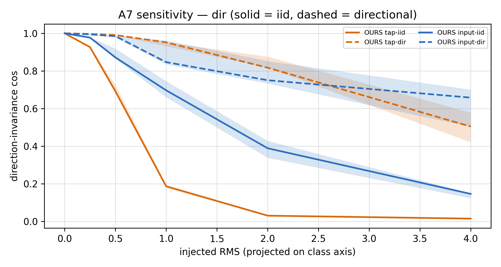
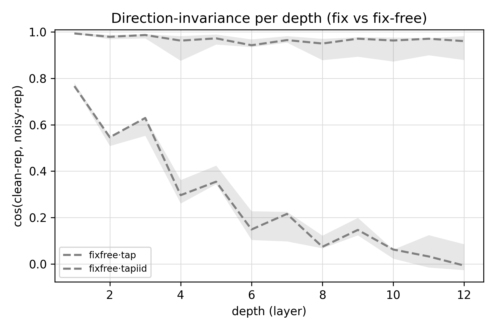
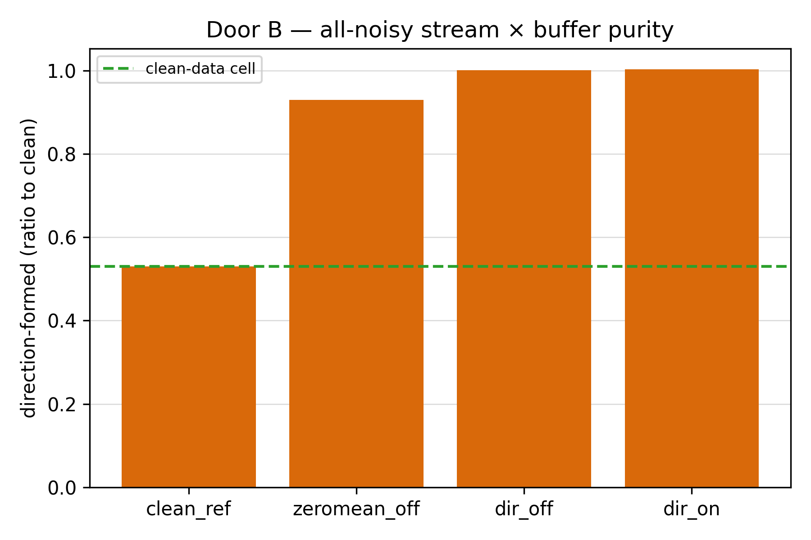
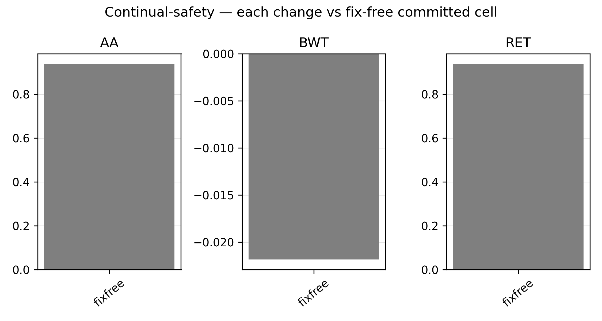
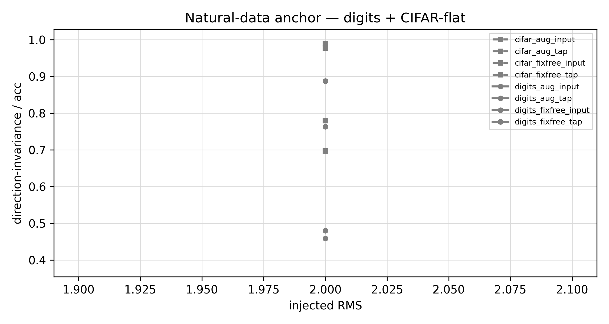
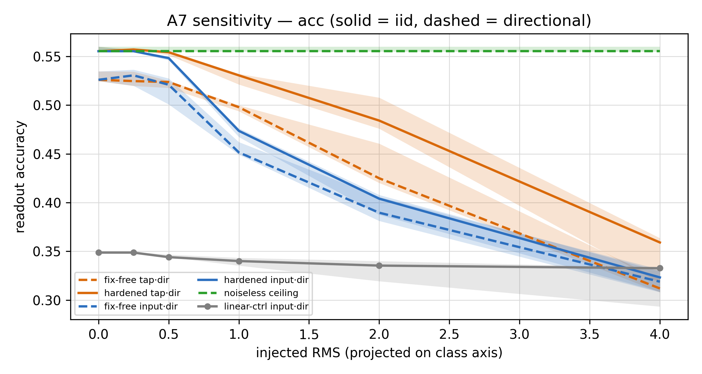

# Phase 6 — noise-robust SCFF: make the cheap brain survive the world it runs in (the report)

> The reader-facing narrative of Phase 6 (P6.0 → P6.8, 2026-07-01): the cheap brain was *finished* at the end of
> Phase 5 — but finished **in a noiseless numpy ideal.** It will run on an analog substrate and on a lifelong,
> never-clean data stream, and Phase 4 had flagged one honest **NEGATIVE**: eval-time noise (A7). This phase
> **reproduces that weakness honestly, names which channel carries it, fixes the dominant one forward-only, proves
> the fix keeps the continual win, and hands a noise-characterized cell to the GD namer — with the residual it can't
> reach named out loud.** A first-person research log, figures and tables inline. The terser sources it draws from
> are the [`RESULTS.md`](RESULTS.md) ledger and the `expK/experiment-K.md` cards; the navigable overview is the
> [`README.md`](README.md); the pre-run design and the binding reporting contract are [`design.md`](design.md) and
> [`result-format.md`](result-format.md); the literature behind every mechanism is
> [`../../research/papers/phase6/`](../../research/papers/phase6/README.md).
>
> **A note on two references that recur in every figure.** First, the **linear-readout control** — a plain linear
> map on the raw input, carried on every A7 curve. It is *not* a competitor (its clean accuracy is far below OURS);
> it is the **relative-fragility yardstick.** "Is OURS noise-sensitive?" is unanswerable in absolute terms (every
> model loses *some* accuracy to noise); the answerable question is "is OURS *specifically* fragile, more than a
> dumb baseline?" — so the decisive read of the whole phase is **OURS-vs-linear**, never OURS in isolation. Second,
> the **direction-first read.** Robustness here is **directional retention** — `acc(σ) / acc(0)` measured along the
> frozen class axis — *not* Δaccuracy, and *not* (for the enemy that matters) per-sample `cos(clean, noisy)`. Why the
> distinction is load-bearing is itself a Phase-6 finding (P6.0): the two noise enemies attack *different geometry*,
> and per-sample cosine is **blind** to the one that matters. Both references are drawn on every A7 figure, and the
> **tolerable band — directional retention ≥ 0.90 at the pinned σ\*=2.0 — was pre-registered blind** in P6.0, before
> any fix was tried.

---

## 1 · Why harden the cheap brain against noise now

Phase 5 signed off on the cheap brain: it composes the depth a task needs, reads the continual home cheaply, is
continual-safe, and reproduces on real data. But every one of those results lives in **ideal floats** — a numpy
simulation with no device mismatch, no charge drift, no ADC quantization, and a data stream we curated. The chip does
not get to live there. It will hold its weights as analog charge on capacitors, do its multiply-accumulate as physical
current through a crossbar, and read its inputs through transducers and ADCs — all of which are noisy — and it will
learn from a **lifelong stream where every datum is a single noisy real-world sample**, never a clean, curated truth
set. Phase 4's capability map had already returned one honest **NEGATIVE** against this future: the cell is sensitive
to eval-time noise (A7), and — the pointed part — the sensitivity is **directional**, while an analog substrate's
dominant mismatch is *also* directional. The weakness and the hardware's worst enemy point at the same axis: the class
direction the whole architecture exists to protect.

So the question was never *whether* to face noise — it was **when.** Fix it now, in SCFF, or later, after the precise
20% GD namer is built and could (one might hope) clean up the mess? One result settled the ordering, and it is the
whole reason this phase runs before the namer:

> **LP-FT / backbone-robustness: a trained readout *preserves* but cannot *manufacture* robustness the features
> lack.** A7's sensitivity is born in SCFF's representation — specifically in the **per-sample layernorm** that makes
> the cell nuisance-robust (Phase 4's A2 win) — so **no downstream GD readout can rescue it.** The fix has to be
> upstream, in the SCFF objective. That makes it a **Stage-1 problem**, and Phase 6 runs before Stage 2.

This is why the plan was renumbered mid-project: the undifferentiated "Phase 6 = GD optimization" split in two — noise
was pulled out into *its own* Phase 6 (a Stage-1 *extension*, this report), and the GD namer moved to Stage 2 /
Phases 7–9. Every rung here is measured against one question — **"is the cheap brain robust enough to *trust*
downstream?"** — not "does it beat backprop."

**Two doors, one crux.** "Noise" hides two distinct enemies, and the cell must survive both:

- **Door A — the analog substrate.** Capacitor charge drifts, op-amps offset, ADCs quantize. The hardware literature
  (Rasch 2023) sharpens the target: it is **input / tap / ADC** noise that dominates the accuracy loss, *not* weight
  noise, and the dangerous part is **directional** — the residual class-axis mismatch that *survives* draft-5's
  differential / auto-zero circuitry. Generic i.i.d. Gaussian is the easy enemy; structured-and-directional is A7's
  real one.
- **Door B — the data stream itself** (the author's Phase-6 insight). Because the model is online and lifelong, every
  training example is a *single noisy sample* the hippocampus banks into the LUT to replay at sleep — it never sees
  the clean signal directly. So robustness is not only "tolerate a noisy weight"; it is "**learn a stable class
  direction from a stream where every example is corrupted.**"

The 2026-07-01 research pass found the two doors share **one** hard enemy: Door A's residual (directional mismatch
surviving auto-zero), Door B's residual (structured noise surviving replay-averaging), and the spine's enemy (a
perturbation aligned with the class axis) are the *same thing* — a **directional, non-zero-mean perturbation aligned
with the class axis.** One enemy, three faces — which means one directional probe tests both doors at once.

**The spine, the envelope, the gate** — the three non-negotiables inherited into every rung:

- **The spine:** robustness is **DIRECTION-invariance, never a magnitude.** "Accuracy survived noise" is a symptom;
  the lever is whether the *class direction* is preserved. This is **density ≠ class** wearing its **sixth** coat —
  and it kills three tempting-but-wrong moves up front: measuring robustness as Δaccuracy (hides *which* axis moved);
  buying "robustness" by shrinking the representation (a flat, dead code is trivially noise-invariant and useless —
  the selectivity guard catches it); and defending the easy i.i.d. magnitude noise while the directional enemy walks
  through.
- **The envelope (P2.5, carried):** the fix lives *inside* SCFF's local forward update — noise injection, a
  noise-corrupted contrastive view, a periodic zeroth-order pass — all forward-only-native. **Rewriting the SCFF
  stream is forbidden** (`write` killed SCFF in Phase 2); explicit Jacobian regularization and SAM-proper are out *as
  methods* because they need a backward pass through the bulk.
- **The gate:** the A6 continual win is the architecture's reason for being, so any fix that dents it is rejected, no
  matter what it does for noise.

## 2 · What we built to test it

- **Cell under test (frozen, not re-derived):** the committed Phase-5 cell — `SCFFContrastOverlap`, temp 0.2 /
  window 2, L12 bulk, no residual. Phase 6 hardens *this* cell; it does not re-open its design. Forward-only,
  per-sample, no batch statistics.
- **The enemy — an honest analog-noise model.** `NoiseModel`, structured after AIHWKit: **uncorrelated mismatch**
  (i.i.d.), a **directional residual** (a *fixed device offset* along an axis — mismatch is frozen at fabrication,
  identical across samples in a pass), a **correlated common-mode**, and **k-bit ADC** quantization. The critical
  design choice: noise strength is **projected-RMS onto the class axis**, so an i.i.d. and a directional perturbation
  are matched *on the axis that matters*, not on total energy — this is the **tautology-trap guard** (matching on
  total RMS would rig the directional enemy to look artificially worse). Channels probed: **tap** and **input**
  (additive), **weight** (multiplicative, the old-A7 grid), **ADC** (bit-depth).
- **The references / controls on every A7 figure:** the **noiseless ceiling** (`acc@0`), the **linear-readout
  control** (the OURS-vs-linear relative read), and a **two-arm auto-zero** (common-mode off/on — so the layernorm's
  common-mode rejection is *measured*, not assumed).
- **The spine metric:** **directional retention** = `acc(σ) / acc(0)` along the frozen class axis (a held-out
  mean-diff axis — no per-sample-label leak). Per-sample `cos(clean, noisy)` is kept as the **rotational-enemy
  corroborator**, because P6.0 showed it is blind to the coherent-translation enemy.
- **The apparatus:** `p6lib.py` — the `NoiseModel`, the `NoiseAugContrast` fix cell, the `PurityFilter` (Door B),
  `flatness_probe` / `weight_noise_update` / `zosa_sharpness` (the forward-only flatness toolbox, built for the
  conditional P6.2), and the A6 `continual_safety` harness promoted from Phase 3/5. Figures are drawn only through
  `plot_p6.py` (one function per figure code) and **regenerate from `arrays.npz` without retraining.**
- **The discipline:** seeds `[42,137,271,314,1729]` (3 for the heavy natural-data loaders); median [IQR]; a difference
  is **real** only if IQR-disjoint **and** ≥4/5 by seed — or, for a within-seed comparison, by the stricter **paired-Δ**
  rule (the paired IQR excludes 0 **and** ≥4/5 sign); one variable per rung; guards logged every run; and **failures
  and skips are data** — the two skip-cards and the deferred measurement rung get the same rigor as the wins.

## 3 · The arc, rung by rung

### P6.0 — reproduce A7 honestly, and name the enemy's geometry

Before changing anything, we reproduced A7 on the *frozen* cell with the honest noise model and ran the guards. All
seven passed (noise-σ0 ≡ clean `0.0`, aug-σ0 ≡ plain `0.0`, projected-RMS matched `0.298/0.299`, FD-InfoNCE
`2.1e-08`, the auto-zero two-arm, FD-RINCE, overlap ≡ OLU) — the apparatus is sound and the enemy is not a plumbing
artifact.

*Directional retention vs projected-RMS on the class axis, headroom, n=5. OURS (directional, dashed) slides toward
~0.60 retention while the **linear-readout control holds ~0.96** — OURS is **specifically** directionally fragile, not
paying a cost every model pays. The read that matters is the gap between the two curves, not either alone. (Matched
projected-RMS; the decisive read is OURS-vs-linear.)*

A7 reproduced exactly where Phase 4 saw it, and the controls made it precise: at matched projected-RMS a directional
input/tap perturbation degrades OURS's class readout **~2× more than a plain linear readout** (input-directional
retention **0.596 [0.587–0.630]** @rms 4.0 vs the linear control **0.958 [0.840–0.960]**, **5/5 seeds** OURS < linear),
while the substrate's **common-mode** channel is already rejected by the per-sample layernorm (the two-arm auto-zero
reads off/on = **0.529 / 0.529**, identical). The dominant fragile channels are **tap and input** (weight is milder —
retention 0.895 @σ=0.4; ADC is fine ≥ 3-bit and only breaks at 2-bit). The *mechanism* is the A7 tradeoff made exact:
the per-sample layernorm that **won** P5 depth and A2 nuisance-robustness is the very thing that **amplifies** a
directional shift into a class-direction distortion the fixed readout can't undo — a plain linear map has no such
amplification (and cannot reach OURS's depth: clean acc 0.349 vs OURS 0.526).

*Per-depth direction-invariance `cos(clean, noisy)`, tap channel, L1→L12. The **directional** enemy barely rotates any
single representation (cos stays ≈ 0.97 across all 12 depths) yet its retention collapses — it is a **coherent
translation** that moves the whole cloud off the readout. The **i.i.d.** enemy **rotates** each rep (cos 0.767 →
−0.007 — collapses with depth). This is why per-sample cosine is the *wrong* metric for the enemy that matters.*

This second figure is the conceptual pivot of the phase. The two enemies are geometrically different: **i.i.d. noise
rotates** each representation (a magnitude perturbation — per-sample cosine catches it), while **directional noise
translates** the whole cloud coherently along the class axis (it barely rotates any single point — cosine is nearly
blind — yet it slides the cloud off a fixed readout). So for the enemy that matters, **retention *is* the direction
read** — the direction-preservation signal lives in retention-under-directional-noise, made direction-specific by the
OURS-vs-linear and dir-vs-iid contrasts, not in a per-sample angle. **Banked:** the bench is trusted; **σ\* = 2.0**
pinned (where fix-free tap-directional retention first drops to 0.90); the **band (blind) = directional retention ≥
0.90 at σ\***; the fix-free input-directional retention @σ\* is **0.733** — a real gap for P6.1 to close; and the
canonical fix-free A7 arrays are **frozen** to `figs_p6_0/` so every later rung *loads* them and never recomputes.

### P6.1 — the primary fix: noise as a contrastive augmentation · STOP ①

The hypothesis carried in from the research pass (H-aug) was the headline candidate: corrupt **one** of the two
InfoNCE views with the noise model, so the objective is trained to pull a clean view and a noisy view of the *same*
sample together — teaching the class direction to be noise-invariant, forward-only, spine-clean. The decisive control
was pre-registered: does a **directional**-specific augmentation (aug along a label-free axis) beat a **random-axis**
augmentation? If yes, the fix is a directional mechanism; if not, it is **generic smoothing**. We swept σ_aug ∈ {0,
0.5, 1.0, 2.0} across three variants — **iid**, **dir**, **randax** — with the co-trained σ_aug=0 arm as the baseline.

*Tap-directional retention (the dominant channel) vs σ_aug at σ\*=2.0, headroom, n=5. Retention rises to a peak at
σ_aug=1.0, then the **selectivity guard bites** at σ2.0 (0.530 → 0.507 — the capacity knee); σ1.0 sits safely below
it. The spine ordering across variants is **iid ≥ randax > dir** — the fix is generic, not directional-specific.*

The fix works on the dominant channel, and the control **overturned the design's own hypothesis.** iid σ1.0 lifts
tap-directional retention from the fix-free **0.841 [0.836–0.869]** to **0.946 [0.852–0.952]** (paired Δ **+0.031**
[+0.023, +0.082], **5/5 positive** — real by the paired rule), *improves* clean accuracy (0.526 → 0.555), and holds
selectivity (0.530). But **directional-specific augmentation does *not* win** — the spine ordering is **iid ≥ randax >
dir** (dir 0.876, randax 0.870, both below iid 0.946). The interpretation is clean and, honestly, more satisfying than
the guess: the directional enemy is a coherent translation along an axis that is *unknown at train time* and
*label-free*, so you **cannot bet the augmentation on one direction** — broad i.i.d. smoothing, which buys invariance
in *every* direction, generalizes best (this is the forward-only surrogate for a Jacobian/Lipschitz penalty — Bishop's
input-noise ≈ Jacobian-penalty result, without the backward pass). H-aug-directional is **overturned and logged as a
result**, not quietly dropped. One honest flag was raised here and carried to the capstone: the per-rung **0.946**
median sits at the top of a wide IQR; the assembled P6.8 run — more device draws — revises it to **0.865**, near not
above the band. The lift is real and 5/5-paired either way; the *band crossing* is **partial.** The input-transducer
channel is only marginally helped (0.812 → 0.822) → the **Scoped-YES residual**, handed to Stage-2 read-side.
**STOP ① substantially met on the dominant channel** → adopt `NoiseAugContrast` iid σ_aug=1.0, *pending the P6.6 gate*.

### P6.2 / P6.3 — the documented skips (failures/skips are data)

Both were pre-registered as conditional, and neither antecedent fired.

- **P6.2 (forward-only flatness) — SKIPPED.** It was to run *iff* the weight channel were dominant **and** P6.1 left a
  weight gap. Neither holds: P6.0 showed **tap ≫ weight** (weight is the mildest channel, retention 0.895 @σ=0.4), and
  P6.1 closed the tap gap. Flatness would harden a *non-dominant* channel at continual-scale compute — not justified by
  the verdict. The apparatus (`flatness_probe`, `weight_noise_update`, `zosa_sharpness`) is built and guard-checked,
  available if PVT realism later surfaces a weight gap.
- **P6.3 (re-tune the per-sample norm — the A7 root) — SKIPPED · STOP ②.** The dominant gap was closed *around* the
  norm (P6.1), and the only residual is the non-dominant input channel (a Stage-2 read-side concern). Crucially, the
  norm is **load-bearing for four P5/P4 properties** (tail-L12 depth, BWT, readout-vs-tuned-BP, A2 nuisance-robustness)
  — P6.0 made the tradeoff exact: the norm that *amplifies* the directional shift is the same norm that *won* depth and
  nuisance-robustness. A "noise-robust norm" risks trading A7 for A2/depth — exactly what STOP ② fences against. No
  result on the table pays on *both* axes, so the licence to touch the root is not granted. **Leave the norm, harden
  around it.**

### P6.4 — Door B: can the direction form from an all-noisy stream?

Door B is the existential continual question, and it is separate from Door A: not "tolerate a noisy weight at eval" but
"learn a stable class direction when **every training sample** is corrupted and the clean signal is never shown." We
trained the frozen cell on a stream corrupted at rms 1.0 (= σ\*/2), first **zero-mean** then **directional**, and
measured tail-L12 separability on *clean* test against a clean-data cell at **matched sample budget** ("the direction
forms" iff the ratio ≥ ~0.90). We also tested whether a **purity** filter (a small-loss buffer filter) beats naive
averaging.

*Tail-L12 separability as a ratio to the matched-budget clean-data cell, headroom, n=5. Both corruptions clear the 0.90
bar: **zero-mean 0.930 [0.918–0.935]** (Noise2Noise — a small finite-sample residual gap) and **directional 1.001
[0.982–1.030]** (forms fully). Buffer purity (on 0.530 vs off 0.525, 3/5, IQR overlaps) adds nothing at this noise
level — averaging suffices.*

The "all data is noise" fear does not bite, for two reasons that are worth separating. The **zero-mean** corruption
averages out over the replay/contrast — this is the Noise2Noise condition (the corrupted target shares the clean
target's conditional expectation), leaving only a small finite-sample residual (0.07). And the **directional**
corruption — the one that is *lethal at eval* — is essentially harmless *in training*: a coherent shift shared across
samples along a consistent axis neither breaks the unsupervised in-batch contrast nor biases the class direction (the
layernorm's per-sample centering absorbs the rest). This is the sharp asymmetry of the whole phase: **the directional
enemy is dangerous at eval (a shift off a *fixed* readout) but not in training (a consistent shift the representation
simply adapts around).** Buffer purity is therefore **not adopted now** (no benefit at σ\*/2) — it becomes an
*available* Phase-9 knob for higher-noise regimes, not a required one. Door B **strengthens the YES.**

### P6.6 — the continual-safety gate (the spine gate, un-skippable)

Everything banked so far was provisional on this rung. The adopted fix is banked **only if** it preserves the A6
continual win. We ran the validated A6 loop on the **digits home** (the exact P5.7 protocol, 5 tasks of 2 classes,
sleep-consolidated) at **full 5 seeds — never 3** — with the anti-rubber-stamp rule: a **paired-by-seed sign veto**
(a change negative in BWT for ≥4/5 paired seeds FAILS even if the IQRs overlap).

*AA / BWT / forget for the iid-aug fix vs the fix-free committed cell on the digits A6 home, n=5. The fix meets or
exceeds the fix-free win on every metric in the median; the paired veto is 1/5 (not ≥4/5) → not tripped. A noise-robust
representation is also drift-robust.*

**GATE PASS.** The fix keeps — and slightly *improves* — the A6 win: BWT **−0.022 → −0.017**, AA **0.937 → 0.944**,
each better in **4/5 paired seeds** (per-seed ΔBWT `[+0.048, −0.005, +0.002, +0.025, +0.005]`; the veto needs ≥4/5
negative and gets 1/5). The mechanism is clean and, in hindsight, obvious: **training the bulk to be invariant to
noise makes its features move *less* across the class-incremental stream, so the sleep-consolidated readout re-fits a
more stable target → less forgetting, not more.** The fear that a noise-augmented cell would worsen continual drift is
not borne out. **The iid-aug σ1.0 fix is BANKED** — the verdict survives its most dangerous gate. *(P6.5 — bulk-drift
— is a MEASUREMENT rung, pre-tagged verdict-exempt and deferred to Stage-2/Phase-9 where its only consumer, the
maintenance-loop design, lives; P6.6 already established the fix is drift-*robust*, so the drift *rate* cannot move the
Phase-6 verdict and is not worth continual-stream compute here.)*

### P6.7 — natural-data confirmation (the synthetic-artifact gate)

Synthetic evidence does not close a phase. If A7 vanishes on real data it was a synthetic artifact; if the fix works on
synthetic but not real, it is not committed. We re-ran fix-free vs the adopted cell on **digits** (64-D) and the
**CIFAR-flat** wall (3072-D), injecting the directional noise into the *real* inputs/taps.

*Tap-directional retention, fix-free vs hardened, on digits and CIFAR-flat, n=3, σ\*=2.0. Both real datasets reproduce
the A7 gap (fix-free < 0.95) **and** the fix lifts the dominant tap channel: digits 0.763 → **0.888** (near band),
CIFAR-flat 0.697 → **0.779**. Input-directional is dataset-dependent (weak on digits, robust on CIFAR); the fix does
not create input robustness — the named residual.*

A7 is **not a synthetic artifact** — the tap-directional gap reproduces on both real datasets, and the generic
augmentation hardens the tap channel on both. That the *robustness* result holds on CIFAR-flat even though its clean
accuracy is only ~0.27 (the P5 "no composable depth" regime) is itself a useful separation: **robustness and clean
accuracy are separable axes** — the fix is a property of the representation, not of the task's difficulty. The synthetic
story and its fix are **committable**; the input-transducer residual is confirmed dataset-dependent (a Scoped-YES item),
not a synthetic quirk.

### P6.8 — the assembled-cell verdict (the capstone)

Only *one* fix was adopted (generic iid noise-augmentation), so the "assembled cell" **is** that cell — there are no
levers to stack. The capstone's job is to run the fix's **full** A7 curve end-to-end (P6.1 measured only at σ\*), at
more device draws, against the frozen P6.0 fix-free arrays, and resolve the YES / Scoped-YES / NO fork — with the
combined regression *overriding* per-rung optimism by design.

*The hardened tap-directional curve (solid) sits above the fix-free curve (dashed) across the whole RMS grid, toward
the noiseless ceiling, while the input curve is unchanged. The assembled tap-directional retention @σ\*=2.0 is
**0.865 [0.851–0.915]** (fix-free 0.817, paired Δ +0.054, 5/5) — a real, reproducible lift that lands **near, not
decisively above,** the pre-registered 0.90 band.*

The combined run does exactly its job — it **overrides the per-rung optimism honestly.** Tap-directional retention is
**0.817 → 0.865** (paired Δ +0.054, **5/5**); the per-rung 0.946 sat at the top of a wide IQR, and the assembled run
lands at 0.865, *within* that IQR — real, but a **partial** band crossing, not a clean one. Clean accuracy *improves*
(0.526 → 0.555), and the tap direction-invariance holds high across all 12 depths (0.97 → 0.91). The input-transducer
residual is **not** helped (0.733 → 0.696) — the generic augmentation hardens the rep-level (tap) channel it corrupts
at train time and cannot manufacture robustness for the input channel it never touches: exactly the forward-only
envelope's reach *and* its limit.

## 4 · The verdict — Scoped-YES (the two channels, reported apart)

The phase reports its verdict per-channel on purpose — the two channels landed differently, and honesty requires
reporting them apart rather than averaging into a single misleading number.

| channel | bar | result | call |
| --- | --- | --- | --- |
| **dominant — tap-directional** (the Rasch-dominant analog read path) | directional retention ≥ 0.90 @σ\* | **0.817 → 0.865** (5/5 paired; digits 0.888, CIFAR 0.779); clean acc ↑; selectivity held; **continual-safe** (P6.6); **natural-confirmed** (P6.7) | **hardened — partial** (near, not decisively above, the band) |
| **residual — input-transducer directional** | same band | **0.733 → 0.696** (unhelped) | **not reached → Stage-2 read-side** |

**The read:** a forward-only objective change *does* reproducibly harden the dominant channel without denting depth,
selectivity, or the A6 win — the SCFF objective did **not** need to be reopened (this is why it is **not NO**). But the
fix is partial at σ\* and leaves a named residual (this is why it is **not clean-YES**). → **Scoped-YES: hand the
noise-hardened cell forward with an explicit Stage-2 brief.** Two design hypotheses were overturned or sharpened along
the way, and both are the honest science of the phase: the fix is **generic, not directional-specific** (iid ≥
randax > dir, H-aug-directional overturned), and the enemy is a **coherent translation, not a rotation** (so retention,
not per-sample cosine, is the direction read). density ≠ class, paid a sixth time.

## 5 · The Stage-2 hand-off

**The committed cell:** `NoiseAugContrast` = the frozen Phase-5 cell (`SCFFContrastOverlap` temp0.2 / w2, L12, no
residual) **+ one iid-noise-augmented InfoNCE view at σ_aug = 1.0.** Forward-only, local, no backward pass through the
bulk, no stream rewrite — the P2.5 envelope held. Clean accuracy, selectivity, depth, and the A6 continual win are all
preserved or improved; the dominant tap-directional channel is noise-robust.

**The brief the namer inherits:**

- **Assume handled:** the dominant **tap-directional** channel (the Rasch-dominant analog read path) is noise-robust in
  the base representation; the **common-mode** channel is auto-rejected by the layernorm; the **A6 continual win**
  survives the fix (and improves).
- **Must still defend (read-side, Stage 2):** the **input-transducer directional residual** (calibration under shift)
  and any **ADC quantization below ~3-bit** — the named residuals of the Scoped-YES. LP-FT says a *frozen* head can't
  manufacture base robustness, but a Stage-2 read-side *defence* (calibration, BiC-style) is a complement, not a base
  fix — and the base is now as robust as a forward-only lever can make it.
- **Owed to Phase 9 (maintenance):** the buffer-purity filter (P6.4) — measured, **not needed** at this noise level
  (≈ naive averaging); an *available* knob for higher-noise regimes. And the **bulk-drift rate** (P6.5, deferred) —
  needed only by the maintenance-loop design, which lives in Stage 2.

**The decision-record delta (S10, to bank at phase close):** *SCFF carries a noise-aware objective — one contrastive
view is corrupted by broad (iid) noise at train time; robustness is built into the base representation, not bolted onto
the readout.* This revises the implicit "the SCFF objective is noiseless" and is the Phase-6 supporting decision for
[`../../idea/main.ideas.v1.md`](../../idea/main.ideas.v1.md).

## 6 · Honest scope & caveats

- **The band crossing is partial, and we say so.** The assembled tap-directional retention is **0.865 — near, not
  decisively above, the pre-registered 0.90 band** at σ\*. The per-rung 0.946 was optimism at the top of a wide IQR;
  the combined run (more device draws) is the honest number, and it overrides. The lift is **real and 5/5-paired**;
  it is not a clean band crossing. Reported as a *partial* fix, banked as the best forward-only lever available.
- **The fix is generic smoothing, stated plainly** — not a directional-specific spine mechanism. The design predicted a
  directional augmentation would be the spine fix; the random-axis isolator overturned it (dir does not beat randax).
  We report generic Jacobian-smoothing, honestly, rather than dressing it as the directional mechanism we hoped for.
- **The input-transducer residual is real and named**, not smoothed over. The forward-only augmentation cannot reach a
  channel it doesn't corrupt at train time; that channel goes to Stage-2 read-side, and the honesty of naming it *is*
  the "scoped" in Scoped-YES.
- **The enemy is an honest *behavioral* analog model, not SPICE.** `NoiseModel` is AIHWKit-structured (common-mode +
  uncorrelated mismatch + ADC quantization + a directional residual), not device physics — the standing scope rule
  (ideal math and behavioral noise first; real silicon later). The point of Phase 6 is *where the fix lives*, decided
  cheaply before fabrication — not a silicon claim.
- **The continual gate and natural-data confirm are n=3** on the heaviest cells (the static rungs are n=5). We let the
  headline continual claim rest on the paired-sign veto at n=5 (P6.6 *did* run 5), and read the n=3 natural-data
  numbers with the wider-IQR caution that implies — the direction is consistent across seeds and datasets.
- **P6.5 is deferred, not skipped-because-negative** — it is a measurement rung, pre-tagged verdict-exempt, whose only
  consumer (the maintenance loop) lives in Stage 2. Deferring it is a scope decision, not a dodged result.

## Reproducibility

Every rung writes `figs_p6_K/{manifest.json, arrays.npz, _ckpt.jsonl}`; figures regenerate with no retraining via
`plot_p6.py` (one function per figure code, redraws from `arrays.npz`). Seeded/deterministic. Run single-threaded
(`OMP_NUM_THREADS=1` + `python -u` + per-cell fsync checkpoint — resumable) and `PYTHONIOENCODING=utf-8` (the cp874
console gotcha). The canonical fix-free A7 arrays are **frozen** to `exp0/figs_p6_0/` — later rungs *load* them, never
recompute. Apparatus: `p6lib.py` (the `NoiseModel`, `NoiseAugContrast`, `PurityFilter`, the forward-only flatness
toolbox, the A6 `continual_safety` harness); guards (noise-σ0 ≡ clean, aug-σ0 ≡ plain, projected-RMS-match, the
two-arm auto-zero, FD-InfoNCE < 1e-5, overlap ≡ OLU, FD-RINCE) logged in every run's `INV` panel. Entry points:
`exp0/run_p6_0.py` (bench + A7 + guards) · `exp1/` (the augmentation fix, STOP ①) · `exp2/` `exp3/` (the documented
skips) · `exp4/` (Door B) · `exp6/` (the continual gate) · `exp7/` (natural data) · `exp8/` (the assembled verdict).
The pre-run design and the binding reporting contract are [`design.md`](design.md) and
[`result-format.md`](result-format.md); the literature is [`../../research/papers/phase6/`](../../research/papers/phase6/README.md).

---

*Prev:* [Phase 5 — the SCFF close-out](../phase5/phase5-report.md) · *Up:* [the Stage-1 arc](../stage1-report.md) ·
*Next:* [Stage 2 / Phases 7–9 — the GD namer](../stage2-design.md).
