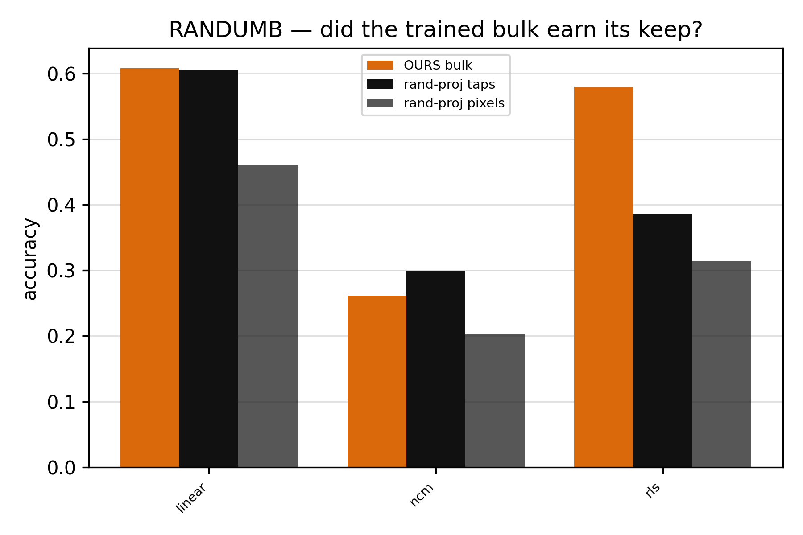
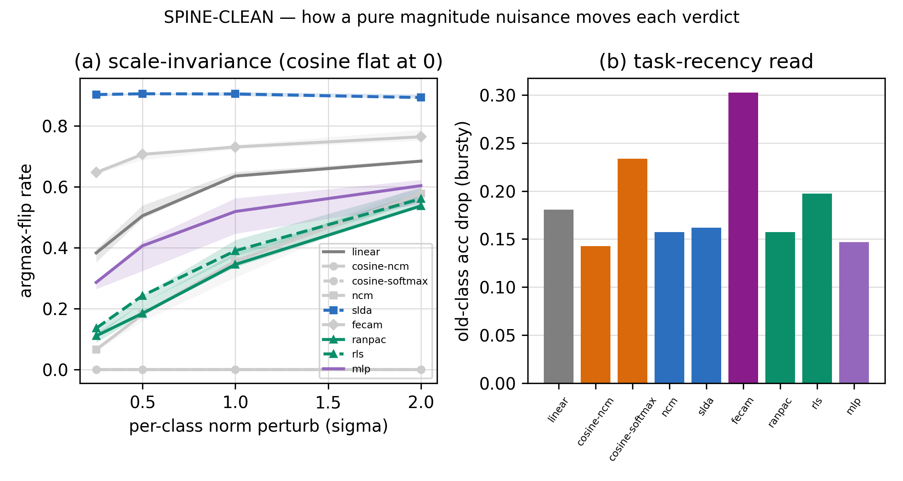
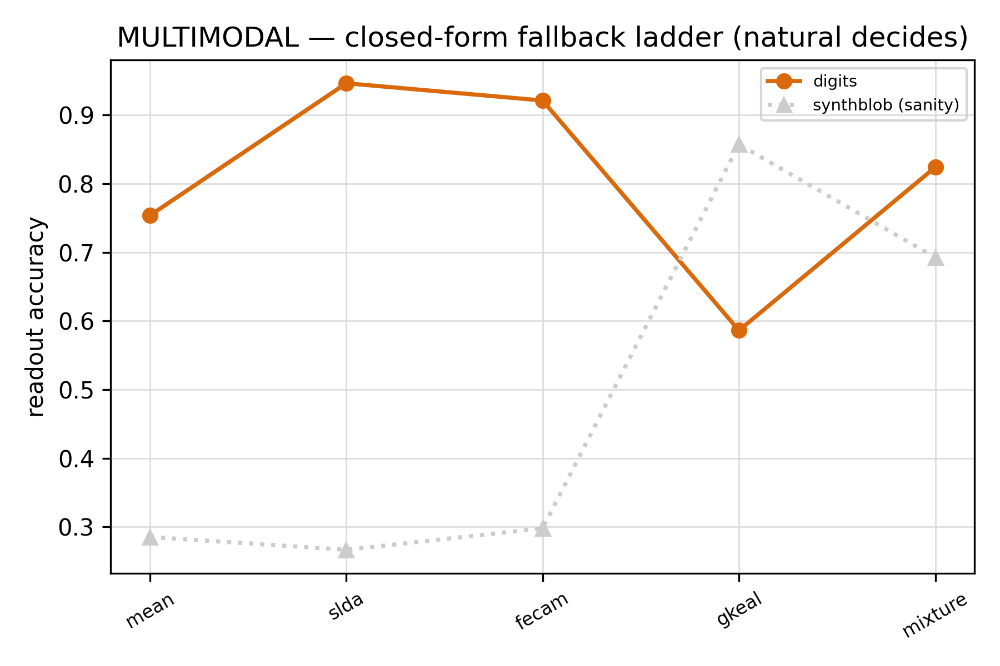
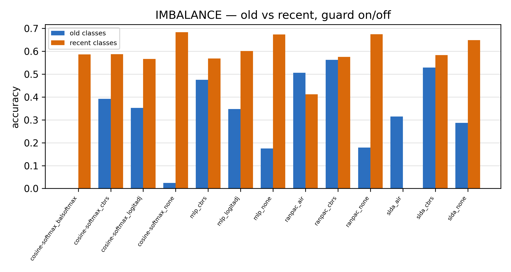
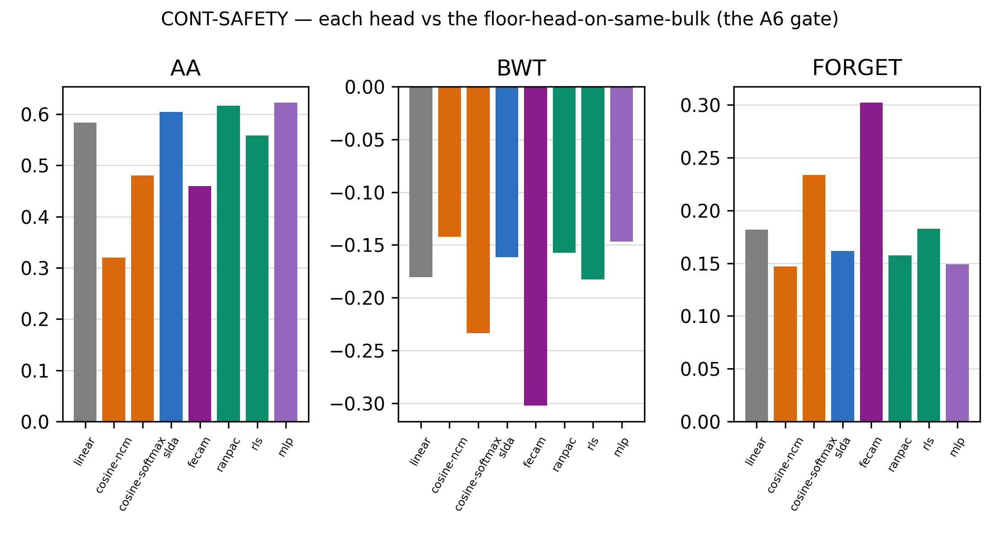
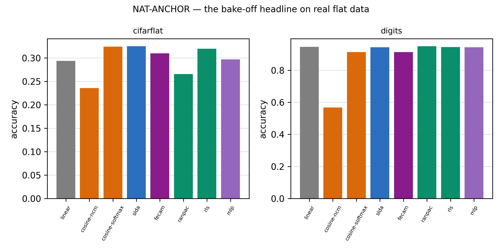
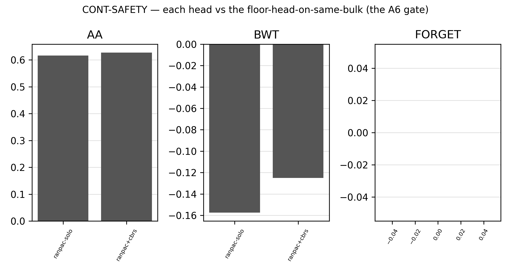
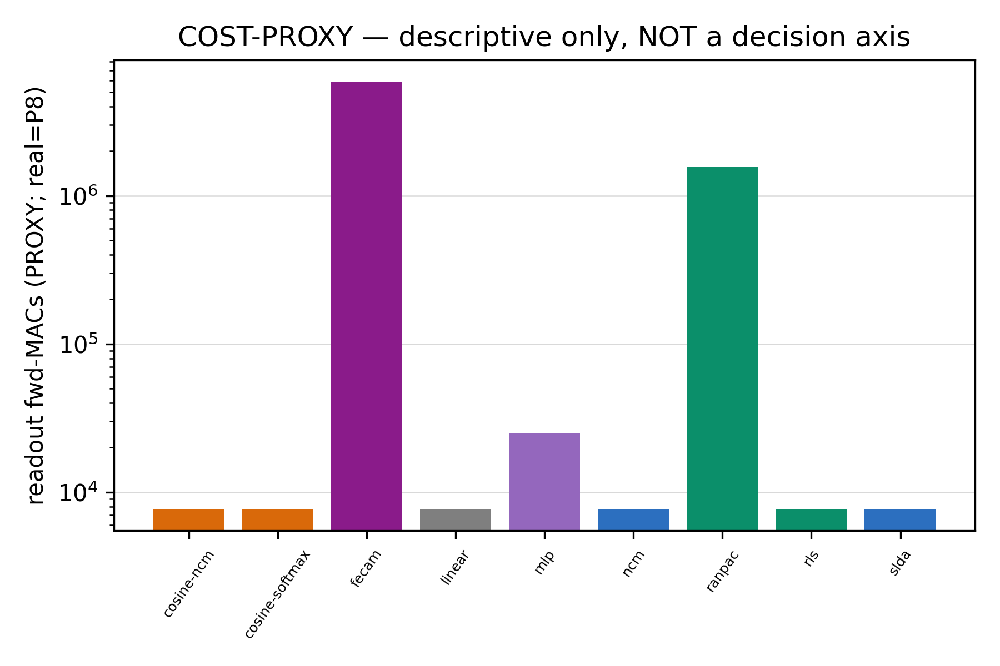

# Phase 7 — The Readout: naming the frozen SCFF bulk (the full story)

> The deep story, every figure, every rung's read. For the one-screen verdict see [`README.md`](README.md); for the
> scalar ledger [`RESULTS.md`](RESULTS.md); for the pre-run plan [`design.md`](design.md). Ran 2026-07-02, P7.0→P7.6,
> single-thread numpy, seeds `[42,137,271,314,1729]`, all guards pass. Device under test = the **frozen Phase-6 cell**
> `NoiseAugContrast` (`SCFFContrastOverlap` temp0.2/w2, L12, no residual, + one iid-noise-augmented InfoNCE view
> σ_aug=1.0). GD reads its taps, never writes them.

---

## 0. The one-breath result

Stage 1 built, characterized, and noise-hardened a **cheap, unsupervised** brain that organizes the world but never
learned our labels. **Phase 7 is the ~20% precise brain that names it** — and the headline is that the name-giver
**need not be gradient descent**. The committed namer is **RanPAC**, a closed-form analytic head (random projection →
running-Gram ridge prototype); it ties the gradient MLP anchor on accuracy×forgetting, leads on natural digits, passes
the A6 continual-safety gate, and ships with a class-balanced-reservoir imbalance guard. The project's **spine** (read
class *direction*, not magnitude) **bends here** — the direction-pure cosine head is spine-clean but sub-competitive
where the bulk has structure — but the bend **shrinks on real data** and the winner, while magnitude-based, is
recency-robust by construction. The 20% is *cheat-everything*, and here the cheat is: no backward pass.

---

## 1. The frame — the "20% GD" is a role, not a method

The architecture is 80% cheap unsupervised SCFF + 20% precise supervised naming. The author's Q1 reframe governs this
phase: **the 20% is not gradient-descent-as-religion; it is the *cheat-everything* half.** The namer may be anything
that maps frozen features → labels cheaply and continual-safely — a gradient head, a closed-form prototype, a streaming
recursive-least-squares classifier. So Phase 7 is a **bake-off of namers**, refereed by three axes:

1. **accuracy × forgetting (BWT)** — how good is the naming, and does it survive the continual stream;
2. **the spine** — does the verdict track class *direction* (cosine) or a *magnitude* (a distance / ridge / covariance),
   measured as **spine-cleanliness** (argmax-flip under a per-class norm nuisance);
3. **continual-safety (A6)** — the un-skippable gate: a namer that dents the sleep-recovery continual win is reverted.

Cost is a **descriptive-only** fourth axis (never a tie-break in Phase 7; the real substrate meter is Phase 8). Because
the bulk is *frozen to the namer*, the naming is a (near-)convex regression — no heavy-optimizer zoo is needed. The two
hedges that governed the plan held: "convex" names the *regression*, not the deployed readout's substrate cost (Phase 8);
and we are reservoir-*like*, not a reservoir proper, so the bulk's value over a random projection must be *proven* (P7.0).

---

## 2. The bench (P7.0) — floor, ceiling, and the RanDumb skeptic

Before any head scored a rung, the apparatus reproduced a readout on the frozen bulk and its references bracketed it,
behind **seven guards** (the sign/direction-bug antidote, this project's recurring silent killer): overlap≡OLU and
FD-InfoNCE (carried); the head-port equivalences (`cosine-ncm ≡ nearest-normalized-prototype`, `cosine-softmax@init ≡
cosine-ncm`, `linear head ≡ linear_probe`); the cosine-softmax finite-difference gradient (2.8e-9 < 1e-5); the
**harness equivalence** (`continual_safety_heads(MLP) ≡ the old hard-coded continual_safety` **bit-for-bit**); and the
**stream-cache equivalence** (the bake-off's shared-bulk fast path ≡ the reference harness bit-for-bit). All passed.

The references (synthetic CI home, n=5, median): the convex **floor** (linear-softmax on all-tap) = **0.608**; a small
MLP head = 0.642; the **static BP ceiling** (`race_bp`, tuned BP on the raw input) = **0.866**. The large floor-to-BP
gap is expected and *is the P4 characterization at the naming stage*: SCFF is a **continual** learner, not a static
accuracy competitor; its value shows up on the forgetting axis, not the static curve.

**The RanDumb control (the one genuine "uh-oh", not pre-excused).** OURS-bulk vs a random ReLU projection at a fair
2000-D expansion, two arms, same head:

| head | OURS-bulk | random-from-taps | random-from-pixels | read |
| --- | --- | --- | --- | --- |
| linear | 0.608 | 0.606 | 0.461 | earns keep vs pixels; **ties** a random expansion of its own taps |
| rls (ridge) | 0.579 | 0.385 | 0.314 | **earns keep on both arms** |

*The two-arm skeptic on the synthetic home, n=5: OURS-bulk vs a random ReLU expansion of the same input, for three
heads. Against **random-from-pixels** (raw input — the harsher arm) OURS wins on every head: the 80% SCFF earns its keep
vs a random projection. Against **random-from-taps** (a random remix of OURS's own features) a plain **linear** namer
ties (0.608 vs 0.606 — the expected ELM/reservoir effect, since a random expansion of good features is itself the RanPAC
mechanism), but the **ridge** head separates them (0.579 vs 0.385): the structured taps carry second-moment information a
random remix destroys. The bulk's naming-stage value is thus verified for the analytic namer and decisive vs raw pixels.*

**Both readings, honestly:** *(i)* OURS beats **random-from-pixels** for every head (the decisive skeptic — the 80%
SCFF earns its keep vs raw input); *(ii)* the **random-from-taps tie** for a plain *linear* namer is the expected
ELM/reservoir effect (a random ReLU expansion of good features is itself a good feature map — it *is* the RanPAC
mechanism, one of our own candidate heads), and it is **won** by the ridge head (0.579 vs 0.385). So the bulk's
naming-stage value over a random projection is verified for the ridge/analytic namer and unambiguous vs raw pixels.
INV: dead-frac 0.000, effective-rank 58.7 (the per-layer-normed all-tap is low-rank), feature source pinned.

---

## 3. The bake-off (P7.1) — the headline

Nine heads raced the same frozen all-tap taps, each at a val-selected knob (the `race_bp` fairness protocol), scored on
static accuracy, continual AA/BWT (via the shared stream-cache), spine-cleanliness, and cost-proxy.

**The frontier top is a statistical three-way tie — led by no-gradient heads.** On accuracy×BWT (operationalized as the
continual AA), the top three are **MLP 0.623, RanPAC 0.617, SLDA 0.604**, mutually within-noise (mlp−ranpac +0.007 not
real; ranpac−slda +0.004 not real). Two of the three are no-gradient. **RanPAC has the highest static accuracy (0.647)**
and, among the tied cluster, is the **most spine-clean** (argmax-flip 0.54 vs MLP 0.60 vs SLDA 0.89) — so the spine
tie-break selects it. **The projection earns its keep**: RanPAC (ridge on a 2000-D random expansion) beats plain RLS
(ridge, no projection) by **+0.047, real (5/5)**.

*The headline, two panels. **Left** — the accuracy×forgetting frontier (x = BWT, 0 = no forgetting; y = readout
accuracy): **RanPAC sits at the top-right**, in a statistical tie with the gradient MLP and the un-projected RLS, with
SLDA on the floor line; the direction-pure cosine-softmax and the max-magnitude FeCAM sit below, and the two prototype
heads (ncm, cosine-ncm) collapse sub-floor (greyed out). **Right** — the scorecard: RanPAC carries the **highest static
accuracy (0.647)**, while only the two **cosine** heads reach spine-clean = 1.0 (argmax-flip 0). Two of the top three
(RanPAC, SLDA) use **no gradient** — the frontier is led from the no-gradient corner.*

**The spine bends — numerically.** The pinned verdict cut: `Δ = the paired-by-seed median of [AA(RanPAC) −
AA(cosine-softmax)] = +0.128` (head medians AA 0.617 vs 0.480; the paired median differs slightly from the
difference-of-medians because the median is not linear), **real** (paired IQR excludes 0, 5/5 sign), `|Δ| > δ=0.02` →
**magnitude-wins-spine-bends**, with the mechanism condition satisfied: the winning magnitude head is **not** more
fragile than cosine under the bursty stream (RanPAC BWT −0.157 vs cosine-softmax −0.234). The two cosine heads are the
only argmax-flip-0 heads (spine-clean by construction), but they sit well below the frontier — so the tension is
**named, not resolved silently toward accuracy**.

*The spine axis, two probes. **Left** — argmax-flip rate as each class prototype's norm is randomly re-scaled: the two
**cosine** heads stay flat at **0.000** (scale-invariant by construction — the only direction-pure verdicts), while
every magnitude head flips (RanPAC 0.54, least among the competitive heads; SLDA 0.89, most). **Right** — the
task-recency read (old-class accuracy drop under the actual bursty stream). The tension is named, not hidden: cosine is
perfectly spine-clean but sub-competitive, and the committed RanPAC reads a magnitude yet is among the least
recency-fragile — recency-robust ≠ direction-reading.*

**Why the spine bends, mechanistically.** (i) The all-tap SCFF space is *anisotropic* — a tied-covariance whitening
buys +0.19 on natural data (P7.2) — so an angle-only metric leaves structure on the table. (ii) The no-gradient winners
dodge the continual *recency* bias not by reading direction but by **having no trained softmax weights to inflate**;
recency-robust ≠ direction-reading. A magnitude head can be continual-safe for the "wrong" (non-spine) reason — and here
it is.

---

## 4. The closed-form cliff (P7.2) — it is anisotropy, not multimodality

Is the frozen space multi-modal (one prototype underfits → a non-convex mixture looms), or unimodal? The decision was
made on the **natural** tap space (digits), with a synthetic multi-blob task as apparatus-sanity only. Natural per-class
features are **unimodal** (per-class n-modes = **1.0**). The accuracy lever is a
**tied covariance**: NCM (one Euclidean mean) 0.754 → **SLDA (tied cov) 0.946** (+0.19), closed-form. Per-class
covariance (FeCAM) *overfits* the limited per-class sample (0.921 < SLDA); a non-convex **mixture hurts** (−0.12). The
synth-blob sanity inverts as it must (GKEAL kernel 0.857 / mixture 0.693 rescue a *provably* multimodal task where
single-Gaussian heads fail ~0.30) — the ladder apparatus is trusted. **The convex/analytic story survives**: the rough
plan's "non-convex mixture or bust" was wrong; a shared whitening is the escape, and it stays closed-form. (This
whitening is a *magnitude* tool — whitening was rejected-as-a-lever in P5 — so P7.2 *sharpens* the spine tension rather
than dodging it.)

*The fallback ladder (mean → SLDA → FeCAM → GKEAL → mixture). On **natural digits** (the decision-bearer, orange)
accuracy jumps at the **tied-covariance** rung — NCM one-mean 0.754 → SLDA **0.946** (+0.19) — and rises no further:
per-class covariance (FeCAM) overfits and a non-convex mixture *hurts* (−0.12). On the synthetic multi-blob sanity task
(grey, provably multimodal) the pattern **inverts** — only the kernel/mixture rescue it — which confirms the ladder
apparatus works. With per-class n-modes measured at 1.0, the classes are **unimodal**: the lever is an anisotropic
metric, not multimodality, and it stays closed-form.*

---

## 5. The bursty-imbalance guard (P7.3) — cbrs, not AIR

Our A6 mechanism consolidates on a balanced replay buffer, so imbalance was **induced**: a bounded (cap=800)
recency-skewed reservoir (all classes present, recent tasks over-represented). With no guard, every head over-predicts
recent classes; the **trained cosine-softmax is worst** (recency-gap +0.659 — the classic BiC/WA/SCR magnitude bias),
the no-gradient RanPAC (+0.495) and SLDA (+0.361) less so. The guards:

| head | none | family guard | **class-balanced reservoir (cbrs)** |
| --- | --- | --- | --- |
| RanPAC (analytic) | +0.495 | AIR **−0.094 (over-corrects)** | **+0.013 (near-eliminated, old-acc 0.18→0.56)** |
| SLDA (analytic) | +0.361 | AIR −0.315 (recent→0) | +0.055 |
| cosine-softmax (trained) | +0.659 | logit-adjust +0.214 | +0.195 |
| MLP (trained) | +0.498 | logit-adjust +0.254 | +0.094 |

*Old-class (blue) vs recent-class (orange) accuracy under a bursty, recency-skewed replay buffer, for each head and
guard. With no guard every head over-predicts recent classes; the **trained cosine-softmax is worst** (gap +0.659). The
reliable fix is **class-balanced reservoir (cbrs, buffer-side)** — it collapses RanPAC's gap from +0.495 to **+0.013**
while lifting old-class accuracy 0.18 → 0.56. **AIR** — the analytic head-side guard the plan expected to ship —
**over-corrects**: it re-weights a strongly-skewed fit until SLDA's recent classes crater to 0. Re-balancing the input
beats re-weighting the output.*

**The design guess was overturned:** AIR (the analytic-family head-side guard) **over-corrects** — inverse-frequency
re-weighting a strongly-skewed fit over-shoots (SLDA's recent classes collapse to 0). The reliable fix is
**class-balanced reservoir sampling (buffer-side, family-agnostic)** — re-balancing the *input* beats re-weighting the
*output*. Shipped with the committed head: **RanPAC + cbrs**.

---

## 6. The A6 gate (P7.4) — the committed head keeps the continual win

Each candidate ran through the built `continual_safety_heads` harness under its native online+sleep rule (closed-form:
recompute statistics on the replay buffer; gradient: sleep-refit by GD), vs the **floor-head-on-the-same-bulk baseline**
(not the P5 readout, which would confound cell- and head-forgetting), 5 seeds, with a paired-sign veto:

- **RanPAC PASSES** — BWT −0.157, **+0.023 vs the floor baseline, 0/5 seeds negative** → adoption stands.
- SLDA, MLP, cosine-ncm, RLS also pass.
- **cosine-softmax STRUCK** (−0.030 vs floor, **5/5 negative**) and **FeCAM STRUCK** (−0.127, 5/5) — dent A6.

*The un-skippable gate — AA / BWT / forgetting for every head vs the linear floor-head on the *same* frozen bulk, 5
seeds with a paired-sign veto. The committed **RanPAC keeps the win** (BWT −0.157, +0.023 vs floor, 0/5 seeds negative).
The gate **strikes** the two most magnitude-inflating heads: the gradient **cosine-softmax** (−0.234, 5/5 negative) and
the per-class-covariance **FeCAM** (−0.302 BWT, worst forgetting, 5/5). Read the decisive control off the bars:
cosine-ncm passes while cosine-softmax — the *same angle metric* — is struck, so the recency dent comes from the
**trained weights**, not the readout's geometry.*

**The decisive mechanism control is cosine-ncm vs cosine-softmax:** *same angle metric*, but the no-gradient ncm variant
**passes** (+0.059) while the **gradient** softmax variant is **struck** (−0.030, 5/5). So the recency dent is caused by
the **trained weights**, not the readout's metric — the BiC/WA/SCR magnitude bias, made empirical. The no-gradient heads
are continual-safe *by construction*; the max-magnitude FeCAM is the exception (its per-class covariance overfits each
task's shape, forgetting the rest). This banks evidence **for** the no-gradient committed namer.

---

## 7. Natural-data confirmation (P7.5) — RanPAC #1 on digits; the spine bend shrinks

The head set re-ran on **digits (64-D, 5 seeds)** and **CIFAR-flat (3072-D, 3 seeds)**:

- **Digits:** the analytic/magnitude heads cluster at the top (0.94–0.95) with **RanPAC #1 (0.949)** and **near-zero
  forgetting (BWT −0.012)**; cosine-softmax is **competitive (0.913, gap −0.036)** — the synthetic spine-price shrinks
  **4×** on real data. cosine-ncm is sub-competitive (0.568).
- **CIFAR-flat:** *every* head collapses to 0.24–0.33 — SCFF has no composable depth here (the established P4/P5/P6
  "wall"), so there is little class structure to name. The ordering compresses, RanPAC's random expansion of near-useless
  features actively hurts (0.265 < SLDA 0.325), and the **spine tension vanishes** (cosine-softmax 0.324 ≈ the SLDA top
  0.325).

*The bake-off re-run on real inputs. On **digits** (left — where SCFF composes class structure) the analytic/magnitude
heads cluster at the top with **RanPAC #1 (0.949)** and near-zero forgetting, while cosine-softmax is competitive
(0.913) — the synthetic spine-price shrinks **4×** (−0.128 → −0.036). On **CIFAR-flat** (right — the established SCFF
depth-wall) *every* head collapses to ~0.3, the ordering compresses, and the spine tension vanishes: this is a **bulk**
failure, not a namer failure, and it is where the cheaper SLDA (0.325) even edges RanPAC (0.265).*

**Read:** the readout choice is *real*, not a synthetic artifact — RanPAC is confirmed on the SCFF-working natural home
(digits, #1). The CIFAR result is a **bulk** failure, not a namer failure (all heads ~0.3), but it teaches the honest
lesson: **the namer's value tracks the bulk's**, and on depth-less inputs the cheaper SLDA is more robust. This, with
the cost proxy, flags **SLDA to Phase 8** as the pragmatic alternative.

---

## 8. The assembled head (P7.6) — levers stack

The committed pipeline **RanPAC + cbrs** ran end-to-end vs RanPAC solo, against a pre-registered bar (below the P7.1
solo AA 0.617 by more than the §B band 0.02 → revert). It **HOLDS**: assembled AA **0.627** (≥ 0.597), and BWT *improves*
(−0.157 → −0.132). On the balanced A6 home the guard is near-idempotent (a slight gain from cleaner per-class balance);
under the P7.3 recency skew it is the decisive fix. The levers stack — no optimizer interaction to destabilize, because
the head is closed-form.

*The committed pipeline end-to-end on the balanced A6 home. Adding the class-balanced-reservoir guard is
**non-degrading** — AA 0.617 → 0.627 and BWT −0.157 → −0.132 both *improve* — so the levers stack. Because RanPAC is
closed-form, "consolidation" is just a re-solve on a cleaner (balanced) buffer: there is no optimizer interaction to
destabilize, so the P7.3 guard composes with the P7.1 head by construction.*

---

## 9. The verdict (pre-registered, natural-confirmed)

- **The committed readout = RanPAC + class-balanced-reservoir guard** — maximizes accuracy×BWT on the natural-confirmed
  continual home (3-way tie with MLP/SLDA, spine tie-break), passes the A6 gate, #1 on digits.
- **The spine-tension outcome = magnitude-wins-spine-bends** — `Δ = +0.128` (real 5/5, > δ=0.02) on the synthetic home;
  **annotated: the price shrinks to −0.036 on digits and ≈0 on CIFAR-flat.** The winner reads a magnitude (ridge) but is
  recency-robust by having no trained weights (P7.4).
- **The RanDumb read** — the trained bulk **earns its keep** vs a raw-pixel random projection (all heads, P7.0); the
  taps-arm tie for a linear namer is the ELM effect (flagged), and the ridge head separates OURS from the random
  expansion.
- **The cheat-everything read** — **the committed namer is closed-form/streaming analytic; the "20% GD" is a role, not a
  method. The 20% is not even gradient descent.** 🔥

---

## 10. Cost caveat + the Stage-2 brief

**Cost was descriptive-only** in Phase 7 (never a tie-break; the real substrate meter is Phase 8). By the forward-MAC +
Gram/solve-dim proxy, RanPAC's 2000-D projection is **~200× SLDA's** cost. **SLDA is a within-noise, far cheaper
no-gradient alternative** — it sits in the top-3 tie, passes the A6 gate, is *more robust on depth-less inputs* (CIFAR),
and its only weakness is spine-cleanliness (argmax-flip 0.89 vs RanPAC 0.54). **Handed to Phase 8:** if the substrate
cost meter makes RanPAC's projection prohibitive, **SLDA is the committed fallback**; the cost meter's job is to price
RanPAC's projection vs SLDA's tied-covariance solve.

*The cost proxy (readout forward-MACs, log scale). It was **never a tie-break in Phase 7** — the spine was — and the
real substrate meter is Phase 8. But it is the single reason SLDA is flagged forward: RanPAC's 2000-D random projection
makes it **~200× SLDA's** cost, and since SLDA sits within-noise of RanPAC on the frontier, passes the A6 gate, and is
more robust on depth-less inputs, it is the pragmatic fallback the moment cost stops being free.*

**Also handed forward:** the class-balanced-reservoir guard (to carry; AIR available-but-not-shipped); and — deferred
from Phase 6 on purpose — the **read-side noise residual** (input-transducer directional + ADC < 3-bit), a calibration
defense a *chosen* head adds on top of itself, now that the head is chosen (Phase 8/9).

---

## 11. The decision-record deltas (flagged; to `idea/main.ideas.v1.md`)

- **N3** ("GD = residual boosting blocks") → **superseded** by "single frozen bulk + read-only namer" (boosting dropped).
- **S4** ("two GD organs") → **collapses to one** (the namer; Interface-GD retired with the blocks).
- **S9** (fixed short-stack reader) → **extended** with the committed *head* (RanPAC / analytic), not just the placement.
- **new supporting decision:** *the namer is a closed-form/streaming analytic head, not gradient descent.*
- **N2** (EMA-view) and **S6** (the gate) stay Phase-8/9's — untouched. The frozen `phase6-final-architecture.md` is
  never retro-edited.

---

## 12. Methodology + apparatus

`p7lib.py` (built on `p6lib`, which re-exports p5/p4/p3/p2 — import, don't retype): 9 namer heads
(linear-softmax · cosine-ncm/softmax · NCM · SLDA · FeCAM · RanPAC · RLS · GKEAL · MLP), the `RandProjBulk` control, the
`continual_safety_heads` harness extension (+ the `stream_cache` shared-bulk fast path, proven ≡ bit-for-bit), the
spine/multimodality/imbalance probes, the descriptive cost meter, and the guards. Seeds `[42,137,271,314,1729]`,
median + IQR, single-threaded (the OpenMP-phantom guard), `PYTHONIOENCODING=utf-8` (the cp874 guard), no sklearn for
compute (`load_digits`/`load_cifar_flat` are data-only). "Real" = IQR-disjoint **and** ≥4/5 by sign, paired by seed; the
P7.4 gate added the paired-sign veto. Every figure is produced by a single `plot_p7.fig_*` function and regenerates from
`arrays.npz`; every run wrote `manifest.json` (git hash + config + seeds + wall-clock).

**Two design guesses the sims overturned** (logged as the honest science): AIR is *not* the no-gradient imbalance guard
(cbrs is); and the multimodality "cliff" is *anisotropy*, not multimodality (a tied covariance suffices, closed-form).

---

## 13. References

The mechanism stories: [`../../research/papers/phase7/`](../../research/papers/phase7/README.md) —
`the-convex-readout.md` (reservoir/ELM/OCO), `direction-readouts.md` (cosine/NCM/SLDA/RanPAC + the magnitude bias), the
2nd-pass audit `analytic-and-covariance-readouts.md` (the Analytic/RLS family + F-OAL + FeCAM + RanDumb + GKEAL). Key
IDs: RanPAC [2307.02251]; FeCAM [2309.14062]; Deep SLDA [1909.01520]; RanDumb [2402.08823]; F-OAL/AOCIL [2403.15751];
ACIL [2205.14922]; AIR [2408.10349]; SCR [2103.13885]; task-recency-bias survey [2010.15277]. Evaluation canon
(carried): gap-to-tuned-BP (Bartunov [1807.04587]); continual = AA/BWT/forgetting (CL survey [2302.00487], GEM
[1706.08840]). We adopt **mechanisms**, not the ViT-scale numbers. Carry-overs: the frozen cell
([`../phase6-final-architecture.md`](../phase6-final-architecture.md)); the `result-format` lineage.
