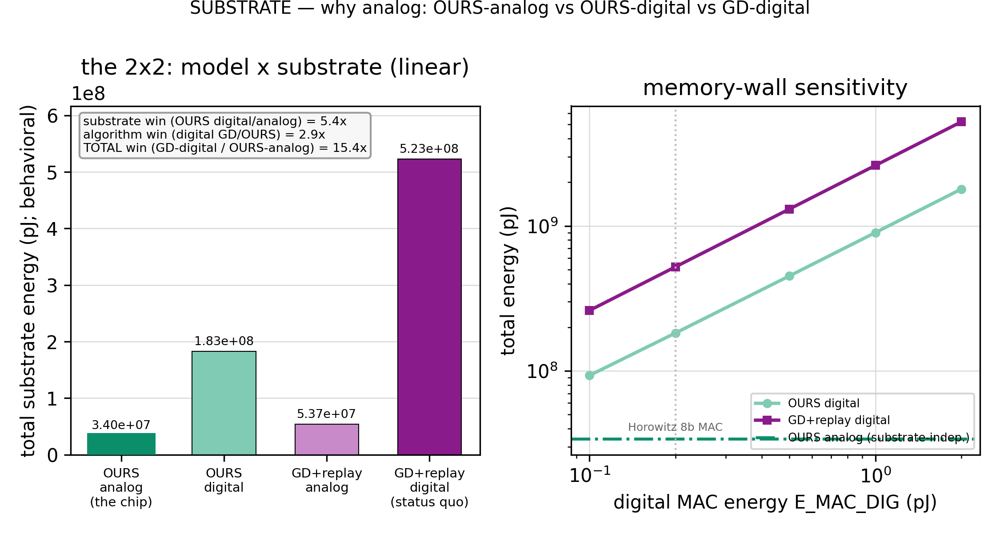

# Phase 8 — The Economy: *when* the namer fires, and *what it truly costs* — run LIVE

> **The front door.** Read this for the verdict; open [`phase8-report.md`](phase8-report.md) for the full story with
> every figure, [`RESULTS.md`](RESULTS.md) for the numbers, [`expK/experiment-K.md`](exp0/experiment-0.md) for a rung's
> story, [`design.md`](design.md) for the pre-run plan, [`result-format.md`](result-format.md) for the reporting
> contract. Phase 8 is **Stage 2's second GD phase** (P7 readout · **P8 economy+cost** · P9 maintenance). Phase 7 picked
> *what* the namer is (RanPAC + cbrs); **Phase 8 turns both brains on together for the first time**, decides *when* the
> namer fires, and puts the **first honest hardware cost number** on the founding 80/20. Ran 2026-07-02, P8.0→P8.6,
> single-thread CPU/float64, seeds `[42,137,271,314,1729]`, all seven guards bit-exact. **P8.7 (the "why analog" substrate
ablation) added 2026-07-02** — the full 2×2 {OURS, GD+replay} × {analog, digital} for the professor brief.

---

## The verdict — **the two-brain economy is real, cheaper *and* safer, run live** 🔥

The chip was always meant to run forever: the cheap SCFF cortex learns forward-only on **every** input (it never
forgets, but its feature map **drifts**), and the precise namer must keep its labels tracking that drift **without**
paying gradient descent every step. Phase 8 built the machinery that makes that loop real — a streaming `partial_fit`
namer, a drift-gated awake/sleep economy — and ran it live. Four results, all standing:

- **The gate creates the 80/20 — metered, not proxied.** With the committed gate on, the GD namer is **12.1% of total
  substrate energy** (GD-share 0.121 [0.121–0.121], ≤ 0.25); turn the gate off (fire every step) and it balloons to
  **77.8%**. The first time the "80/20" is a measured hardware number rather than an op-count tag.
- **OURS is ~half the energy of BP+replay** at matched retention on the same substrate table (bp_ratio **0.501**).
- **The precise brain got even cheaper: SLDA displaces RanPAC.** On the behavioral ADC-centred meter, SLDA names the
  world **69× cheaper** per name and — freshly measured *live* — ties or beats RanPAC's accuracy (ΔAA −0.015). Phase 7's
  ~200× cost caveat (S11) is resolved: **commit SLDA.**
- **LIVE-SAFE.** The assembled economy keeps the A6 continual win at the awake gate's **worst mid-stream point**
  (worst-BWT **0.000**, 0/5 seeds regress vs oracle). And the crux inversion: **firing *more* forgets *more*** —
  always-pay forgets (−0.137) while the disciplined economy does not. The gate is a *safety* mechanism, not just a cost
  saver.
- **WHY ANALOG — the substrate decomposition (P8.7 extension).** Priced against the *conventional* approach (real
  backprop+replay on a digital accelerator), the chip is **~15× cheaper** in energy — and that win **factors cleanly**:
  **~5.4× is the analog substrate** (compute-in-memory: the many MACs are near-free in the crossbar, only the ADC is
  taxed; a digital von-Neumann machine pays the memory wall on every MAC) and **~2.9× is the 80/20 algorithm** (our
  gated, backward-pass-free loop vs BP+replay on the *same* digital substrate). The analog advantage is a **conservative
  floor** — it holds at ≥2.7× even under the most generous (arithmetic-only) digital assumption and grows to ~50× once
  the memory wall is counted. **The 80/20 itself is substrate-independent** (GD-share 0.11–0.16 on either substrate).

**The spine, demonstrated cleanly.** The committed trigger fires on the **class direction** in the SCFF taps, not on a
magnitude. Run against a nuisance covariate shift (`g·x + α·1`, removed to ~ε by SCFF's input layernorm), the direction
signal is **invariant** (0.84× baseline) while the magnitude-of-shift null **spikes 10×** and false-fires on 94% of
nuisance steps — density ≠ class, wearing its 8th coat, and the gate reads the right side of it.

**Two design guesses the sims overturned (the honest science):**
- **The imbalance guard is buffer-side, and it is what makes always-pay's forgetting a *design choice*, not fate.** The
  economy that fires rarely + keeps class balance (cbrs) + re-consolidates from the full LUT holds worst-BWT at 0.000;
  the profligate always-pay loop, chasing the recency-skewed stream, forgets. **More GD is worse, not better.**
- **Regular cadence beats boundary-aligned sleep.** The plan implicitly favored sleeping at task boundaries; the sims
  said a *regular grid* (grid-8) holds worst-BWT at 0.000 while boundary-aligned sleep dips to −0.439 — because the worst
  mid-stream point falls *inside* a segment (accumulated drift), not at a boundary the oracle knows.

---

## The committed economy (what Phase 8 sets)

| knob | committed | why |
| --- | --- | --- |
| **deployed head** | **SLDA** (tied-covariance analytic) | 69× cheaper than RanPAC, AA ties/beats live (P8.4 → resolves S11) |
| **awake gate** | **DDM** (two-threshold error) | AA at oracle, FAR 0.000, f ≈ 0.003 (P8.1) |
| **trigger** | **class-direction tap-drift** | leads error (MTD 6 < 14), excess-FAR 0.000, spine-clean (P8.2) |
| **sleep cadence** | **grid-8, full LUT history, λ_ema 1.0** | cheapest holding A6; full history load-bearing (P8.3) |
| **imbalance guard** | **cbrs** (class-balanced reservoir) | keeps class balance → worst-BWT 0.000 vs always-pay −0.137 (P8.6) |
| **envelope** | GD reads taps, never writes SCFF | the P2.5 forward-leak wall, unbroken |

---

## The arc, rung by rung (figures inline)

**P8.0 — the bench.** Seven guards bit-exact (the new streaming `partial_fit` ≡ batch fit to 4e-15; the live loop ≡ the
frozen `continual_safety_heads` to 0.0). The bulk drifts but does not forget (bulk_drift ∈ [0.63, 1.00]). And the
detection problem is *well-posed*: at a real class onset the direction signal rises (1.38×) while error lags (1.02×); at
a nuisance shift the direction signal is flat (0.84×) while the magnitude null spikes 10×.

*Left: `bulk_drift` stays in [0.63, 1.00] across the stream — the map moves, never collapses. Right: the class-direction
signal moves at **real** onsets and is invariant to **nuisance**, while the magnitude null does the opposite — the
detection problem is well-posed and the spine is visible. (n=5, live CI+nuisance.)*

**P8.1 — the gate bake-off.** Every gate holds accuracy at the oracle's 0.448, so the frontier is decided on fire-cost ×
false-fire. DDM/ADWIN/budget sit at the clean knee (FAR 0.000); the absolute-θ gate is struck — it false-fires on the
nuisance segment (FAR 0.042, a magnitude leak). **Committed: DDM.**

*Every gate holds accuracy at the oracle level; absolute-θ is greyed (false-fires on nuisance). DDM/ADWIN/budget sit at
the clean, low-fire knee. (n=5, live CI+nuisance; oracle-cadence + always-pay references marked.)*

**P8.2 — the trigger bake-off.** The label-free class-direction tap-drift trigger detects real drift **8 steps earlier**
than the labeled error (MTD 6 vs 14) at a clean nuisance FAR — the tap-lead bet, supported. DriftLens (a purpose-built
label-free detector) lands exactly on it. The magnitude null false-fires on 94% of nuisance steps: the spine, made a
measurement.

*MTD × FAR: tap-drift-direction (candidate) leads error (reference) at low FAR; the magnitude null sits far-right
(FAR 0.938 — the spine demonstration); DriftLens confirms the direction signal. (n=5, live CI+nuisance.)*

**P8.3 — the sleep cadence.** Accuracy is flat across sleep frequency but collapses with truncated history — the LUT
must keep **full** prototype history. A regular grid (grid-8) holds worst-BWT at 0.000; boundary-aligned sleep dips to
−0.439. EMA-decay buys nothing. **Committed: grid-8, full history, λ_ema 1.0** (cheapest holding A6).

*Accuracy-held (left) is flat in frequency, collapses with history truncation; worst-point BWT (right) is 0.000 for
regular cadence on full history, −0.439 for boundary-aligned. (n=5, live CI+nuisance.)*

**P8.4 — the cost meter.** On the behavioral ADC-centred meter, SLDA names the world **69× cheaper** than RanPAC (whose
2000-dim random projection dominates its ADC + solve), and freshly measured live it ties/beats RanPAC's accuracy — robust
across 4–10 ADC bits. **Committed: SLDA** (resolves S11).

*Per-op energy: RanPAC's projection makes its namer 69× more expensive; the ADC term dominates within each head; SLDA in
the native tap space is far cheaper at tied live accuracy. (n=5; behavioral ADC-centred meter, params + citations in the
manifest.)*

**P8.5 — the metered 80/20.** With the gate on, the namer is **12.1%** of total energy (the first non-proxy 80/20); off,
it is 77.8% — the gate *creates* the split. OURS costs **half** of a fair BP+replay learner at matched retention.

*GD-share vs SCFF-share: committed 0.121 (under the 25% line) vs always-pay 0.778; bp_ratio 0.501 against BP+replay at
matched retention on the same substrate table. (n=5; behavioral ADC-centred meter.)*

**P8.6 — the assembled economy, run LIVE (the existential check).** Every committed knob, both brains live. Worst-point
BWT **0.000** (0/5 seeds regress vs oracle), AA at the oracle level — **LIVE-SAFE**. And the inversion that is the
phase's crux: always-pay forgets (−0.137) while the disciplined, cheaper economy does not.

*The committed economy holds worst-point BWT at 0.000 (= oracle) in 5/5 seeds at GD-share 0.155, while always-pay forgets
(−0.137) at GD-share 0.747 — cheaper **and** safer. (n=5, live CI+nuisance; BWT pre-sleep at the worst mid-stream point.)*

**P8.7 — why analog (the substrate ablation, extension).** P8.4/P8.5 compared OURS vs BP+replay on the *same analog*
table — the algorithm win. P8.7 adds the substrate axis: re-meter the exact committed loop and the fair BP+replay
baseline on a **digital** (von-Neumann / GPU-class) substrate — no ADC, a real digital 8-bit MAC (Horowitz-anchored,
memory-wall swept), matched 8-bit precision. The chip (OURS-analog) is **15.4× cheaper** than the conventional baseline
(GD-digital), factoring into a **5.4× substrate** win × a **2.9× algorithm** win.

*Left: the 2×2 — the OURS-analog "chip" bar (ringed teal, 3.4e7 pJ) is a sliver of the GD-digital status-quo bar
(5.2e8 pJ); substrate × algorithm = total (5.4 × 2.9 = 15.4). Right: the memory-wall sweep — OURS-analog is flat while
the digital costs rise, so the ~5× analog advantage is a floor (≥2.7× even at arithmetic-only digital). (n=5; behavioral
meter, Horowitz + NeuroSim/ISAAC anchors in the manifest.)*

---

## Honest scope (what Phase 8 does *not* settle)

- **The existential accuracy fight is still Phase 9's.** P8.5 is a fair *energy* comparison vs BP+replay; the fair
  same-budget *accuracy* baseline (matched buffer + compute) is the owed existential test — P9.
- **Absolute accuracy on the synthetic home is modest** (live AA ~0.45; block-mode frozen promise 0.614). The live-vs-
  frozen gap is **task difficulty** (the live stream is strictly harder than clean block-mode), not forgetting
  (worst-BWT 0.000). The natural multi-class number (A5) is Phase 9's.
- **The committed cadence/gate are drift-rate-conditional.** They assume P8.0's measured drift rate; if Phase 9's N2
  (EMA-view / drift-slowdown) slows the drift, re-tune (a slower drift admits a sparser sleep).
- **The meter is behavioral** (relative-pJ, ADC-centred macro-model — NeuroSim / ISAAC / PUMA level), NOT SPICE; per-op
  params + citations logged in every manifest, ADC-dominance sensitivity-checked.
- **The digital baseline (P8.7) is behavioral too** — the same accounting on a von-Neumann substrate (no ADC, digital MACs
  Horowitz-anchored, matched 8-bit). Its central `E_MAC_DIG` is *arithmetic-only* (the most generous to digital); the
  memory wall is folded into the sweep, so the ~5× substrate advantage is a **conservative floor**, not a tuned number. It
  is a *model*, not an empirical GPU measurement (which would be incomparable to a behavioral analog model).
- **The read-side noise residual** (Phase-6 brief) remains owed → Phase 9.

---

## Decision-record deltas (flagged at close; never retro-editing frozen arch files)

- **S6** (threshold-gated learning) → **resolved**: committed awake gate = **DDM**, trigger = **class-direction
  tap-drift** (spine-clean; magnitude-of-shift is the false-fire null).
- **S11** (RanPAC ~200× cost caveat) → **resolved**: metered E-ratio 69× → **commit SLDA** as the deployed namer (RanPAC
  kept as the P7 accuracy/spine reference, not deployed).
- **The metered 80/20** → **replaces every "80/20 (proxy)" tag** where the meter ran (GD-share 0.121; bp_ratio 0.501).
- **S7** (sleep) → **extended**: committed cadence = grid-8 / full LUT history / λ_ema 1.0 (was oracle-boundary).
- **New supporting decision**: *the two-brain economy is continual-safe run **live**, not only in frozen
  characterization* — and the gate is a **safety** mechanism (always-pay forgets more).
- **N2** (EMA-view / drift-slowdown) → stays **Phase 9's**; the committed cadence is conditional on it.

*Up:* [draft context](../../CLAUDE.md) · *prev:* [Phase 7 — the readout](../phase7/README.md) · *next:* Phase 9 —
maintenance + the owed BP+replay accuracy baseline.
