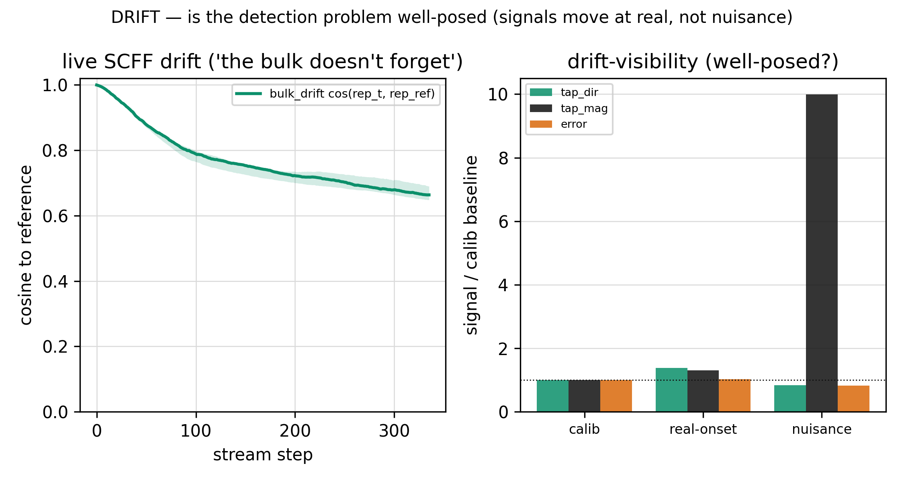
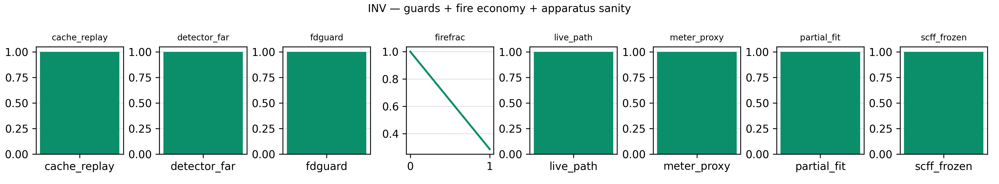
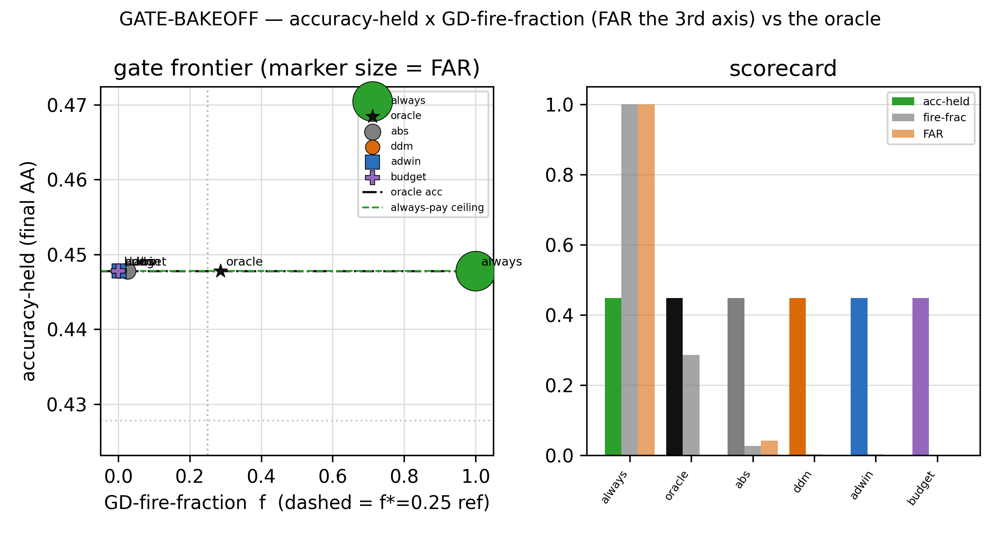
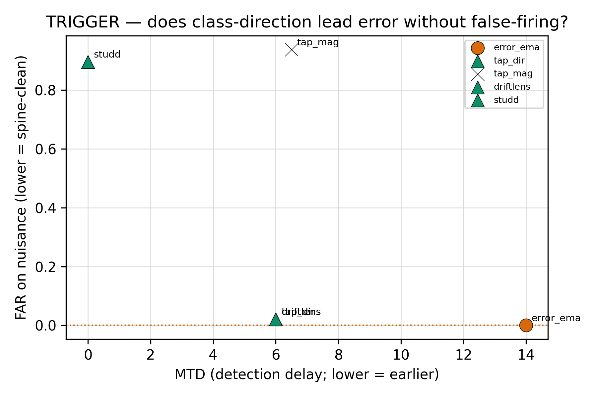
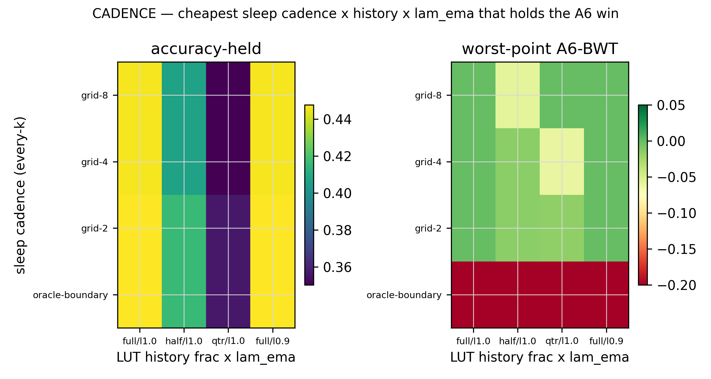
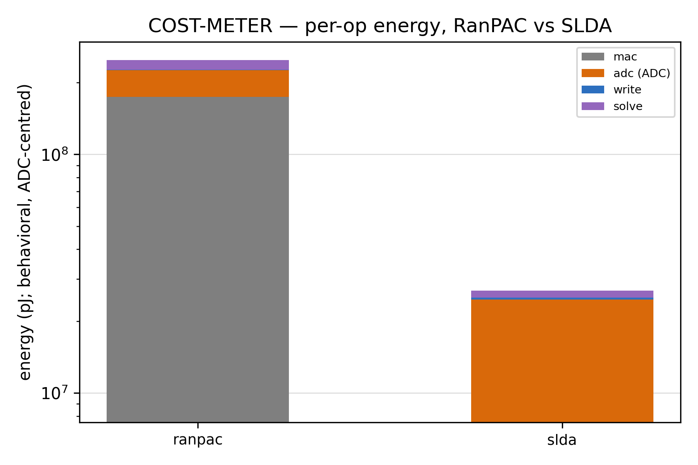
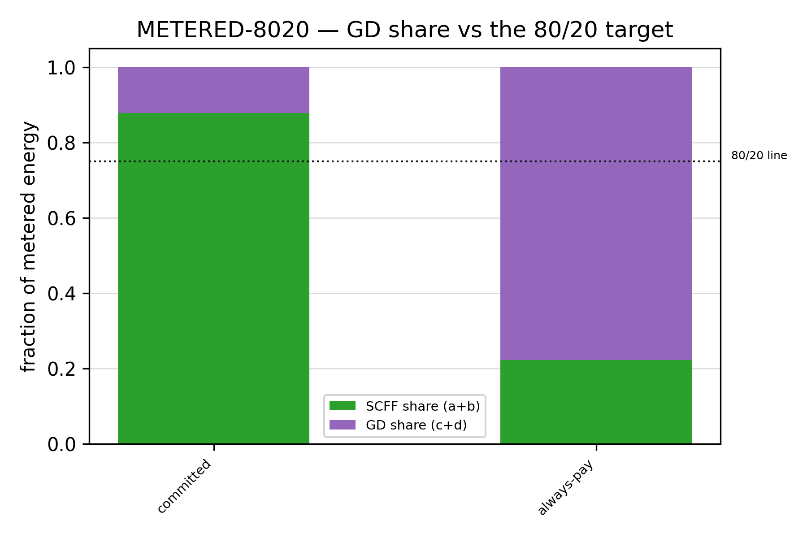
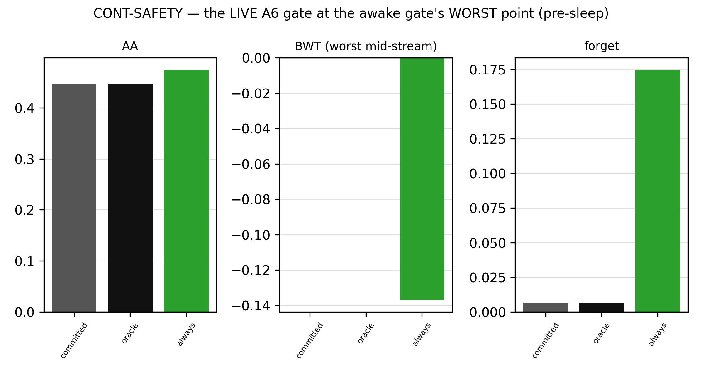
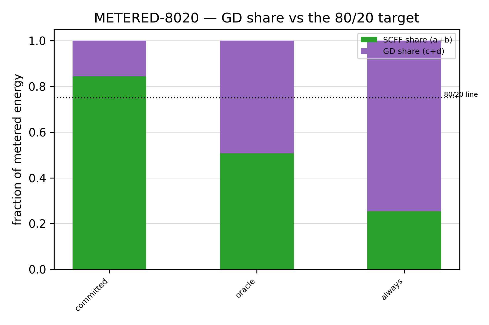

# Phase 8 — The Economy: the two-brain chip, run live (the report)

> The deep story of Phase 8 of draft 6.0 (Stage 2, the GD namer), with every figure. Front-door verdict:
> [`README.md`](README.md). Scalar ledger: [`RESULTS.md`](RESULTS.md). Per-rung cards:
> [`expK/experiment-K.md`](exp0/experiment-0.md). Pre-run plan: [`design.md`](design.md). Reporting contract:
> [`result-format.md`](result-format.md). The frozen cell it runs: [`../phase6-final-architecture.md`](../phase6-final-architecture.md).
> The namer it fires: [`../phase7/README.md`](../phase7/README.md). Ran 2026-07-02, P8.0→P8.6, single-thread CPU/float64,
> seeds `[42,137,271,314,1729]`, ≈94 min wall, all seven guards bit-exact.

---

## 1 · What Phase 8 had to prove

For seven phases the two brains were characterized *apart*. Stage 1 built and noise-hardened the cheap SCFF cortex;
Phase 7 picked the namer (RanPAC + cbrs). But both were measured on a bulk that was **frozen** for the bake-off — so the
central mechanism of the chip, *both organs live at once*, had never been switched on.

The reframe that defines the phase (the author's Q-call): **SCFF is unsupervised, so it never forgets — you can train it
forward-only on every input forever. The only problem is the GD readout: the more input SCFF sees, the more its class
representation drifts, and a namer fit against where the clusters *used to be* slides off.** Phases 1–7 dodged this by
freezing SCFF before fitting GD. Phase 8 completes the real learning mechanism: SCFF **live** (forward-only update every
input; "frozen" always meant frozen *to GD* and frozen *as a design* — the objective/knobs don't move, but the weights
learn), and the namer tracking the drifting taps through a cheap awake/sleep economy.

So Phase 8 is the end-to-end test of the founding thesis — *80% cheap unsupervised structure + 20% precise naming, paid
for only when it counts* — and the first honest cost number on it. Four questions:

1. **When does the namer fire?** (the gate + trigger — P8.1, P8.2)
2. **How often does it sleep, on how much history?** (the cadence — P8.3)
3. **What does it truly cost on the substrate?** (the meter; RanPAC vs SLDA — P8.4, P8.5)
4. **Does the live loop keep the A6 continual win?** (the existential check — P8.6)

The one genuinely new primitive the phase had to build: a **streaming `partial_fit`** for the namer (a running Gram
`(G, M)` with an EMA-decay `λ_ema`), because the chip maintains the namer's statistics as a running second moment on
capacitors — not a from-scratch re-solve. Its equivalence guard (N sequential `partial_fit` at λ=1 ≡ a batch fit,
bit-for-bit) is what turns "drift-poisoning" from a narration into a measurement.

---

## 2 · The bench is faithful, and the problem is well-posed (P8.0)

Nothing downstream is trustworthy unless the apparatus is. Seven guards, all bit-exact:

- **partial_fit_equiv** — the new streaming primitive reproduces a batch fit to 4.11e-15 (RanPAC) / 2.22e-16 (SLDA),
  zero prediction mismatches. The running Gram is exact, not approximate.
- **live_path_anchor** — the live `awake_sleep_loop` in block mode reproduces the frozen `continual_safety_heads`
  choreography to 0.0 (AA 0.3602 = 0.3602). Every A6 number downstream is on the *real* co-adapting loop.
- **scff_static_frozen** — SCFF-update-off after `train_cell` reproduces the Phase-7 static bake-off exactly (static
  RanPAC acc 0.566). "Frozen ≡ P7" is pinned, not assumed.
- **meter_proxy** (fwd-MAC ≡ `readout_cost`), **detector_far** (stationary floors clean), **fd_budget_gate** (analytic ≡
  finite-difference to 3e-8), **cache_replay** (deterministic replay to 0.0) — all green.

Then two reads that frame everything:

**The bulk drifts but does not forget.** `bulk_drift` — the cosine of fixed-probe representations across the stream —
stays in **[0.627, 1.000]** for all five seeds. The map moves (that is the whole problem), but it never collapses: the
cheapness assumption "SCFF itself doesn't forget" holds live.

**The detection problem is well-posed** — and this is where the spine first shows. Normalizing each signal to its
stationary (calibration) level, at a *real* class onset the class-direction tap signal rises **1.38×** while the
error-rate barely moves (**1.02×** — error *lags* real drift, because it needs accumulated mistakes to register). At the
*nuisance* onset (a covariate shift with no class change) the direction signal is **invariant** (0.84×) while the
magnitude-of-shift null **spikes 10×**. A detector that watches the class direction sees real drift early and ignores
nuisance; a detector that watches raw magnitude does the opposite.

*bulk_drift bounded in [0.63, 1.00]; direction moves at real onsets, invariant to nuisance; magnitude null spikes 10× on
nuisance. The detection problem is well-posed. (n=5, live CI+nuisance.)*

*partial-fit-equiv · live-path-anchor · scff-static-frozen · meter-proxy · detector-FAR-floor · cache-replay · FD — all
bit-exact; fire-counts sane.*

References set here: **always-pay ceiling** AA 0.448 (f 1.00, FAR 1.00) and **oracle-cadence** AA 0.448 (f 0.286, FAR
0.00). Every accuracy claim downstream is read against these two.

---

## 3 · When the namer fires: the gate and the trigger (P8.1, P8.2)

**The gate (P8.1).** Six gates raced, error-EMA trigger, checkpoint sleep. Every gate holds accuracy-held at the oracle's
0.448 — the accuracy axis saturates, because the sleep cadence already carries retention, so the awake gate's only job is
to catch a *harmful* mid-stream stall. That leaves the frontier to be decided on fire-cost × false-fire:

- **DDM / ADWIN / budget** sit at the clean knee: FAR **0.000** on the nuisance segment, fire-fraction f ≤ 0.003.
- **absolute-θ** is **struck**: it holds accuracy but false-fires (FAR 0.042 > its stationary floor) — the nuisance
  covariate trips a fixed loss threshold even though no class changed. A magnitude leak, exactly the spine's warning.

Committed awake gate = **DDM** (the standard two-threshold error detector; ADWIN ties it, budget-gate is spine-flagged
and only marginally cheaper). The rarely-firing gates show a worse worst-point BWT under *checkpoint* sleep (−0.439 vs
oracle −0.208) — a sleep-*placement* artifact that P8.3 and cbrs (P8.6) close.

*Every gate holds accuracy at the oracle level; absolute-θ greyed (false-fires); DDM/ADWIN/budget at the clean low-fire
knee. (n=5, live CI+nuisance.)*

**The trigger (P8.2).** Does a *label-free* class-direction tap-drift signal fire *earlier* than the labeled error,
without false-firing? Yes, decisively:

- **tap-drift-direction**: MTD **6** vs error's **14** — it leads by ~8 steps — at excess-FAR **0.000**. Earns-early.
- **DriftLens** (a purpose-built label-free embedding-distance detector) lands exactly on tap-dir (MTD 6, excess-FAR
  0.000): the home-grown signal is confirmed against the literature reference.
- **tap-drift-magnitude** (the null): MTD 6.5 but FAR **0.938** on nuisance (excess 0.906) — it fires on nearly every
  nuisance step. The spine demonstration, quantified: reading the *magnitude* of shift means reading the nuisance.
- **STUDD** degenerates here (MTD 0 — always-fires): its student mimic-loss is too conservative for this fast synthetic
  drift.

The mechanism is the spine's crown: SCFF's *representation* drifts before the readout's *error* rises, so a direction
watcher sees the onset first. And density ≠ class (8th coat): the magnitude watcher fires on nuisance because a covariate
shift is a big magnitude with no class content. Committed trigger = **class-direction tap-drift**; together with DDM this
fixes the gate as a *direction*-triggered error detector at two timescales.

*MTD × FAR: tap-drift-direction leads error at low FAR; magnitude null far-right (FAR 0.938); DriftLens confirms.
(n=5, live CI+nuisance.)*

---

## 4 · How often to sleep, on how much history (P8.3)

Sleep re-forwards the raw-prototype LUT through the *current* SCFF and re-solves the namer on fresh, consistent features.
Sweeping frequency × history × λ_ema against the committed DDM gate gives three findings:

1. **Full history is load-bearing.** Accuracy is flat across sleep frequency (0.446–0.448) but collapses with truncated
   history: full → quarter drops AA from 0.448 to 0.356. The drifting bulk means old prototypes, re-forwarded *now*, still
   define the class boundaries; throwing them away throws away classes the stream stopped showing.
2. **Regular cadence beats boundary-aligned sleep.** Worst-point BWT is **0.000** on the full-history column for every
   regular grid cadence, but **−0.439** for oracle-boundary sleep. The worst mid-stream point falls *inside* a segment
   (accumulated drift during the long settle/nuisance tail), not at a task boundary — so a grid that samples the tail
   catches the dip; boundary-aligned sleep misses it.
3. **EMA-decay buys nothing** (λ0.9 ≡ λ1.0) — the LUT re-forward already re-consolidates from scratch, consistent with
   the drift being slow relative to the sleep interval.

Committed cadence = **grid-8, full history, λ_ema 1.0** — the cheapest regular cadence that holds the A6 win (AA 0.446,
worst-BWT 0.000, sleep-cost 10.0). Flagged **drift-rate-conditional**: if Phase 9's N2 slows the drift, a sparser grid
becomes admissible.

*Accuracy flat in frequency, collapses with history truncation; worst-point BWT 0.000 for regular cadence on full
history, −0.439 for boundary-aligned. (n=5, live CI+nuisance.)*

---

## 5 · What it truly costs: the meter, and SLDA displaces RanPAC (P8.4, P8.5)

**The cost meter (P8.4).** A behavioral ADC-centred macro-model (NeuroSim / ISAAC / PUMA level, NOT SPICE):
`E = n_MAC·e_MAC + n_ADC·e_ADC(bits) + n_write·e_write + n_solve·e_digital`, params and citations logged in the manifest,
the MAC+solve sub-terms guarded to reduce to `readout_cost` under unit energies. It hands Phase 7's flagged cost caveat a
verdict:

- **SLDA names the world 69× cheaper than RanPAC** (namer E-ratio 69.1×; total 9.26×). RanPAC's cost is self-inflicted by
  its own width — a random ReLU projection to 2000 dims reads out a 2000-long vector through the ADC and solves a 2000²
  Gram every name, while SLDA works in the native 64-dim tap space.
- **Freshly measured live, SLDA ties/beats RanPAC** (ΔAA −0.015, in SLDA's favor) — the projection bought nothing on the
  live drift. Both cut conditions (E-ratio ≥ 2, |ΔAA| ≤ 0.02) met with margin.
- **Robust to the ADC assumption**: the ratio holds at 61.0–66.1× across 4–10 ADC bits, so the verdict does not hinge on
  one ADC number. The ADC term is the largest single component within each head — the CIM literature's prediction, borne
  out.

Committed deployed head = **SLDA** (RanPAC kept as the P7 accuracy/spine reference, not deployed). This resolves S11.

*Per-op energy: RanPAC's projection makes its namer 69× more expensive; ADC dominates within each head; SLDA far cheaper
at tied live accuracy. (n=5; behavioral ADC-centred meter, params + citations in manifest.)*

**The metered 80/20 (P8.5).** With the committed gate on, the GD namer is **12.1% of total energy** (GD-share 0.121,
≤ 0.25) — the first time the founding "80/20" is a metered hardware number rather than an op-count proxy. Turn the gate
off (fire every step) and the namer balloons to **77.8%**: the gate *creates* the 80/20, it is not incidental to it. And
against a fair reference — BP+replay at matched retention on the *same substrate table* (not a strawman naive-BP that
forgets) — **OURS draws 0.501× the energy**, roughly half. BP pays a 3× forward + 2× ADC backward pass *every* step plus
replay; OURS pays one forward + a rare solve.

*GD-share vs SCFF-share: committed 0.121 (under the 25% line) vs always-pay 0.778; bp_ratio 0.501 vs BP+replay at matched
retention. (n=5; behavioral ADC-centred meter.)*

*(The metered 80/20 replaces every "80/20 (proxy)" tag where the meter ran — the discharge of the arch-file's "net energy
win unquantified, deferred to Stage 2" caveat, as a behavioral number.)*

---

## 6 · The existential check: the live loop keeps the A6 win — and firing more forgets more (P8.6)

Every knob committed — SLDA head, DDM awake gate, class-direction trigger, grid-8/full sleep, cbrs — both brains live, 5
seeds, BWT measured **pre-sleep at the worst mid-stream point** (post-sleep would hide the awake gate's forgetting). The
verdict is **LIVE-SAFE**, and the mechanism inverts the naive expectation:

| mechanism | AA (live) | worst-BWT (pre-sleep) | GD-share |
| --- | --- | --- | --- |
| frozen promise (block-mode) | 0.614 [0.606–0.622] | — | — |
| **committed** (DDM+cbrs+grid-8) | **0.447 [0.426–0.448]** | **0.000 [0.000–0.000]** | **0.155** |
| oracle-cadence | 0.447 [0.426–0.448] | 0.000 [0.000–0.000] | 0.492 |
| always-pay (no gate) | 0.474 [0.474–0.485] | **−0.137 [−0.153,−0.135]** | 0.747 |

- **Paired veto: 0/5 seeds regress vs oracle → PASS.** AA-match (committed = oracle = 0.447) → OK. LIVE-SAFE.
- **The crux inversion.** Always-pay — firing the namer every step — **forgets** (worst-BWT −0.137), because it chases
  the recency-skewed stream and overwrites the prototypes for classes the stream stopped showing. The committed economy
  fires rarely (gated), keeps class balance (cbrs), and re-consolidates from the full LUT on a regular grid — so past-class
  structure is never overwritten mid-stream (worst-BWT 0.000). **More GD is worse, not better.** The gate is a *safety*
  mechanism, not merely a cost saver: the disciplined economy is cheaper (GD-share 0.155 vs 0.747) *and* safer.
- **The live-vs-frozen gap is task difficulty, not forgetting.** Live AA (0.447) sits below the block-mode frozen
  promise (0.614) because the live stream — gradual onset + covariate nuisance — is strictly harder than clean block-mode
  continual. Worst-BWT 0.000 proves no past task was regressed; the gap is the harder task, and the modest absolute AA on
  this synthetic home is by design (natural multi-class accuracy, A5, is Phase 9's).

*Committed economy holds worst-point BWT at 0.000 (= oracle) in 5/5 seeds at GD-share 0.155, while always-pay forgets
(−0.137) at GD-share 0.747 — cheaper and safer. (n=5, live CI+nuisance; BWT pre-sleep at the worst mid-stream point.)*

*The assembled committed economy at the clean knee: GD-share 0.155, worst-BWT 0.000. (n=5.)*

---

## 7 · What Phase 8 sets, and what it leaves owed

**Committed (the economy):** deployed head **SLDA** · awake gate **DDM** · trigger **class-direction tap-drift** · sleep
cadence **grid-8 / full history / λ_ema 1.0** · imbalance guard **cbrs** · envelope unchanged (GD reads taps, never writes
SCFF). **Metered 80/20: GD-share 0.121; bp_ratio 0.501.**

**Decision-record deltas (flagged, banked to `idea/main.ideas.v1.md`, never retro-editing frozen arch files):**
- **S6** → resolved (DDM gate + class-direction trigger; magnitude-of-shift is the false-fire null).
- **S11** → resolved (metered 69× → commit SLDA; RanPAC kept as reference).
- **the metered 80/20** → replaces the proxy tags where the meter ran.
- **S7** → extended (grid-8 / full history / λ_ema 1.0 detector-driven cadence).
- **new supporting decision** → the two-brain economy is continual-safe run *live*, and the gate is a *safety* mechanism.
- **N2** → stays Phase 9's; the committed cadence is conditional on it.

**Owed (→ Phase 9):** the fair same-budget **BP+replay accuracy** baseline (the existential test — P8.5 settled *energy*,
not accuracy) · the natural multi-class **A5** number · the **read-side noise residual** (Phase-6 brief) · the
**readout-aware** cadence depth · re-tune the cadence if N2 slows the drift. Behavioral simulation only; no SPICE.

**The threats carried every rung:** the meter is a behavioral model (params + citations logged, ADC-dominance
sensitivity-checked); the nuisance injector is calibrated at the raw-input level (magnitude null moves 10×) *and* the
SCFF class direction shown invariant (two measurements, so "no false fires" is not vacuous); the direction trigger
sidesteps calibration-under-shift; the oracle uses hidden boundaries the detector can't see (matching it is the win);
n=5, "real" only if IQR-disjoint and ≥4/5 by sign, the P8.6 gate uses a paired-sign veto.

---

## 8 · Reading guide

**Verdict:** [`README.md`](README.md). **Numbers:** [`RESULTS.md`](RESULTS.md). **Per-rung stories (8-slot cards):**
[`exp0`](exp0/experiment-0.md) → [`exp6`](exp6/experiment-6.md). **Pre-run plan:** [`design.md`](design.md). **Contract:**
[`result-format.md`](result-format.md). **Apparatus:** `p8lib.py` (+ `p8cfg.py`, `p8run.py`, `plot_p8.py`). **The model
this runs:** [`../phase6-final-architecture.md`](../phase6-final-architecture.md). **The Stage-2 arc:**
[`../stage2-report.md`](../stage2-report.md).

*Up:* [draft 6.0 context](../../CLAUDE.md) · *prev:* [Phase 7 — the readout](../phase7/README.md) · *next:* Phase 9 —
the maintenance loop + the owed BP+replay accuracy baseline (the existential test).
