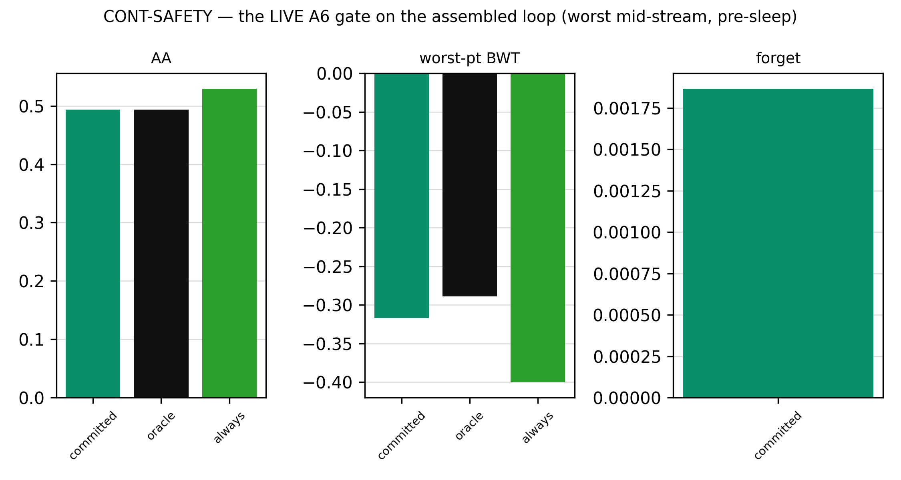
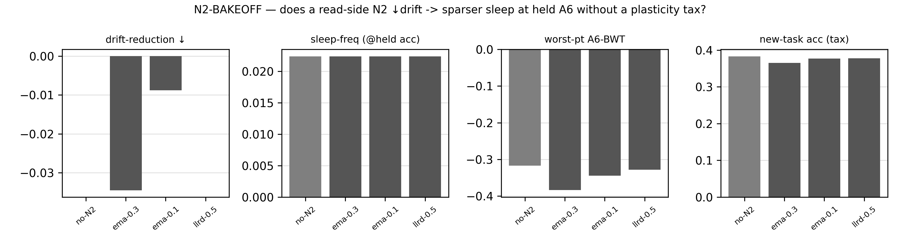
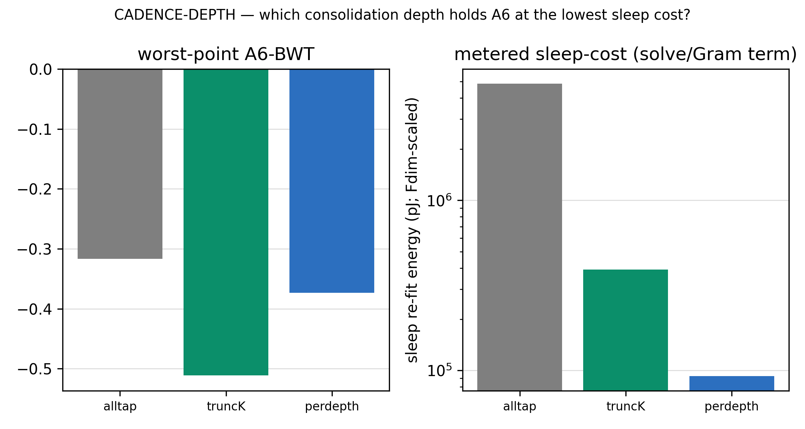
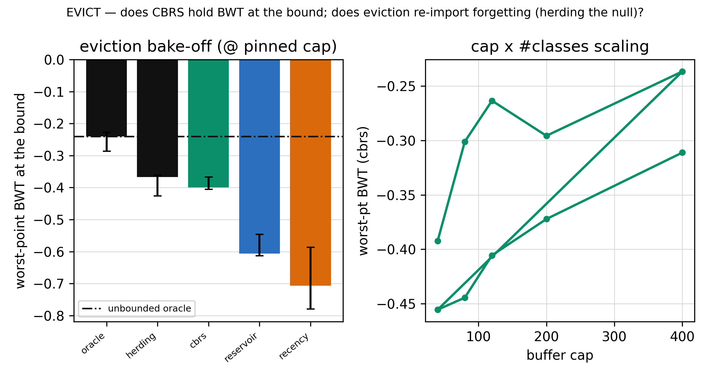
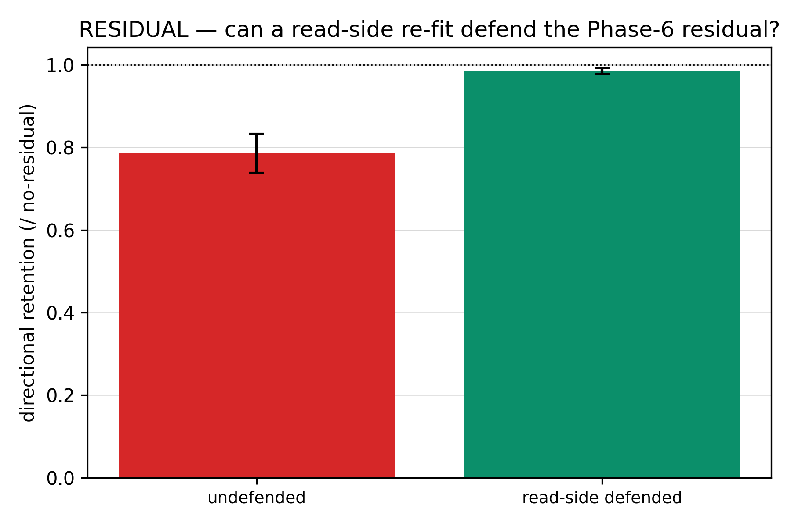
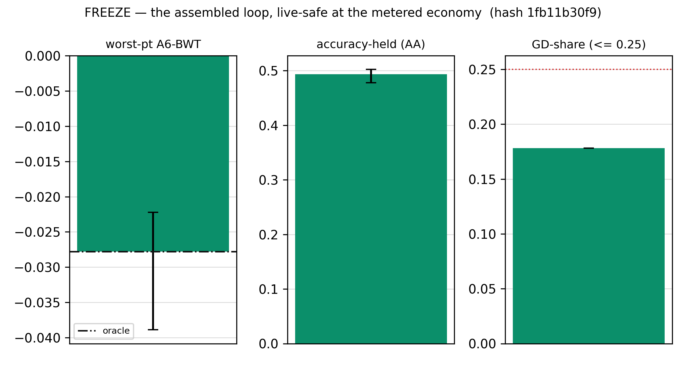
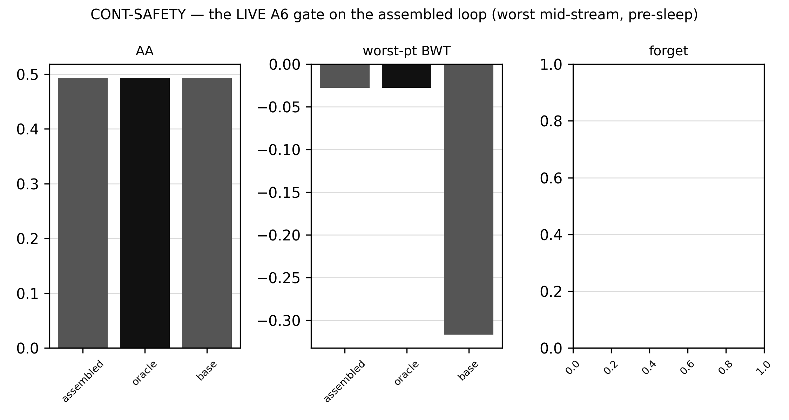

# Phase 9 — Close & *freeze* the maintenance loop: the full report

> The deep story with every figure. For the one-screen verdict read [`README.md`](README.md); for the scalar ledger
> [`RESULTS.md`](RESULTS.md); for a rung's own card [`expK/experiment-K.md`](exp0/experiment-0.md). Ran 2026-07-02,
> P9.0→P9.5, single-thread CPU/float64, seeds `[42,137,271,314,1729]`, median [IQR], δ_acc = 0.02, all nine guards
> bit-exact every rung. Every cut is against an **internal** reference (the frozen/known-boundary oracle, the always-pay
> ceiling, the measured drift, the metered energy) — **never** the Phase-10 BP+replay number. **Freeze in P9, judge in P10.**

---

## 0 · What Phase 9 had to do

Phase 8 shipped a working two-brain loop — an unsupervised SCFF cortex that drifts as it learns forward-only, and an SLDA
namer that tracks the drift through a DDM awake gate and a periodic sleep — and metered it (GD-share 0.121, OURS ≈ ½ BP+replay,
live-safe). But it shipped it on a **single-pass** stream, and it left five things measured-not-tuned or assumed. Phase 9's job
was to tune those five against internal signals on a genuinely **lifelong** stream (many revisit cycles, so drift accumulates),
then **freeze** the object so Phase 10 can race it without the accusation "you tuned against the baseline." The freeze is the
deliverable as much as the tuning: a git hash proving the loop was locked before the fight.

The five open things: (P9.0) the bulk-drift rate the whole cheap-replay story assumes; (P9.1) N2, the last open
decision-record knob; (P9.2) the sleep consolidation *depth*; (P9.3) bounded-LUT eviction; (P9.4) the read-side noise residual.
Then (P9.5) assemble and freeze.

---

## 1 · P9.0 — the risk gate: rotation, not forgetting

The founding claim "SCFF doesn't forget, it only drifts, so a periodic sleep re-solve is enough" had never been measured — and
it had to be measured with the right instrument. A *frozen* linear probe is basis-dependent: a pure rotation of the feature
frame tanks it and reads as "forgetting" even when nothing was lost. So the verdict keys on a third curve — an optimal probe
**re-fit** on the current bulk, scored on held-out early-task data (the Davari 2203.13381 protocol, which factors rotation out).

The three curves separate cleanly. The cosine to birth settles at ~0.65 (the taps rotate ~36%, never collapsing). The *frozen*
probe (staleness) rots toward 0 — a fixed head loses the rotating world, which is exactly what sleep exists to fix. But the
**re-fit** probe (destruction) stays at or above its birth score across the whole stream and ends at 2.2× (min 0.966): the
early-task information is *preserved and enriched*, not destroyed. On a lifelong stream, **the bulk rotates but does not
forget.** The founding caveat is discharged; N2 is not mandatory; the ladder proceeds to tune the loop that tracks the rotation.

The committed loop ties the oracle on accuracy but its worst-point BWT (−0.317) sits 0.028 below the oracle's (−0.289) — a gap
P9.0 flagged as "the gap the P9 knobs get to close." It would take until P9.5 to learn *which* knob closes it.

---

## 2 · P9.1 — N2 struck: the drift is already tracked

N2's only job is to make the namer chase the rotation *less often* — hold A6 at a sparser sleep cadence, or improve worst-BWT,
without a plasticity tax. Two read-side arms were raced: EMA-view (the namer reads a per-tap EMA; SCFF untouched) and LLRD-rate
(a `LLRDCell` subclass slows the late-read layers' SCFF update, rate-only only if the representation guard holds).

Every arm holds the same sparsest cadence as no-N2 (no arm sleeps sparser); no arm improves worst-BWT; EMA-view *worsens* it
(−0.383 vs −0.317) by introducing a train/eval frame mismatch — the namer consolidates in a frame the eval has already moved
past. The drift is rotation-only (P9.0) and the cadence already tracks it, so N2 has nothing to grip. LLRD is honestly rate-only
(early/mid taps move 0.00 — no Stage-1 reopen). **N2 struck** — the last open decision-record knob resolves standby → struck.

---

## 3 · P9.2 — keep all-tap: capacity is the margin under lifelong drift

Could the sleep re-fit consolidate at a *shorter* read depth — the deployed short reader P5 found reads the continual home ~8×
cheaper — and still hold A6?

The truncated readers are 12.4× / 52.5× cheaper on the sleep refit's solve/Gram term, but their worst-point A6-BWT is
materially worse (−0.511 / −0.373 vs all-tap −0.317, beyond δ_acc). At the awake gate's worst mid-stream point — right after a
revisit shifts the class emphasis — the short reader has less capacity to keep old and new classes separable under the rotating
frame, so it forgets more. All-tap's capacity is the margin that absorbs the drift. **Keep all-tap** (S7 extended: depth *does*
matter, in the direction "all-tap's capacity is needed").

---

## 4 · P9.3 — CBRS: the best-bounded policy spans the class directions

A truly lifelong stream forces a **bounded, evicting** buffer — the one thing P8 never had (its streaming sleep re-solved over
a fixed balanced probe). P9.3 built the accumulating `StreamingLUT` and raced eviction policies at a pinned pressure-point cap.

At cap 120 the bound bites hard: *no* bounded policy matches the unbounded oracle (that gap is a property of the cap — the
scaling law — not the policy). Among bounded policies **CBRS is best-bounded** — it ties the herding null (−0.400 vs −0.367,
within noise) and decisively beats reservoir/recency (−0.607 / −0.707). CBRS keeps prototypes *balanced across classes*, so it
spans the class *directions* even at a tight budget; reservoir/recency skew toward the recent bursty majority and the old class
directions narrow → forgetting. Herding ties CBRS here because on this task the raw dense-center ≈ the direction-span (density ≈
class at the buffer) — a **buffer-spine null**, not a spine win. The cap × #classes inset shows the scaling law: 6 classes hold
BWT at cap 400, 10 classes need > 400 — the bound **grows with class count**. **CBRS committed** (S13-candidate).

---

## 5 · P9.4 — the read-side residual, resolved by the sleep mechanism itself

Phase 6 hardened the SCFF tap channel against noise but scoped out one channel it could not reach forward-only: the
input-transducer **directional** offset — a coherent per-device translation along the input class axis that SCFF's per-sample
norm cannot remove. Does it actually dent the committed SLDA loop (the earn-its-place gate), and if so, can a read-side defense
recover it?

The gate fires: the residual dents retention by +0.115 in 5/5 seeds (worst seed collapses to 0.504). **Prototype re-anchoring**
— re-forwarding the raw LUT through the *current* bulk under the *same* device offset, producing prototypes that are drift-free
and shift-*consistent* with the read — restores retention to **0.986** (every seed ≥ 0.977, within δ_acc of no-residual). This
is the plan's own sleep mechanism, applied under shift; no new organ, and no covariance estimate (the planned SLDA-covariance
fallback was never needed). The calibration is direction-grounded — the prototypes move *with* the class axis — never an
entropy/confidence magnitude. **The residual is defended read-side, not named to the analog layer;** the Phase-6 "scoped-YES →
Stage-2 read-side" debt is discharged.

---

## 6 · P9.5 — assemble + FREEZE: the freeze caught the cadence

Every committed knob live at once — NoiseAugContrast bulk · SLDA · DDM-on-error-EMA gate (class-direction tap-drift validated, not deployed) ·
N2-struck · all-tap · CBRS · proto-reanchor. Four of five knobs resolved to *keep* the committed loop, so the assembled loop is
the P8.6 shipped object bit-for-bit.

**The first assemble failed the freeze — honestly.** At the inherited P8 grid-8 cadence, the assembled loop failed the
worst-point oracle-veto in **2/5 seeds** (137, 314: worst-BWT −0.517 / −0.439 vs oracle −0.317 / −0.272), though AA-held and
GD-share passed. This is a real result, not narrated away: on the lifelong **revisit** stream, sparse sleep lets the pre-sleep
state fall into deep troughs between sleeps on high-variance seeds, and the boundary oracle's onset-timed fires avoid them.

Since the gate/trigger are committed (out of P9 scope) and every P9 knob was struck/kept (assembled ≡ base, 0/5 regression vs
the shipped object), the one P9-legal lever was the sleep **cadence** — the P8 "cadence is drift-rate-conditional" debt, now
owed by the freeze. The cadence re-confirm settled it:

| cadence | neg/5 vs oracle | AA | GD-share | nsleep | worst-BWT | freeze |
| --- | --- | --- | --- | --- | --- | --- |
| grid-2 | 0 | 0.495 | 0.215 | 50 | −0.033 | passes (no safer than grid-4, costlier) |
| **grid-4 (committed, the knee)** | 0 | 0.494 | 0.178 | 25 | −0.028 | **passes (best worst-BWT of the frontier)** |
| grid-5 | 0 | 0.495 | 0.166 | 20 | −0.039 | passes (cheaper than grid-4; near-flat) |
| grid-6 | 0 | 0.495 | 0.153 | 16 | −0.087 | passes (razor tie) |
| grid-8 (P8, single-pass) | 2 | 0.494 | 0.138 | 12 | −0.317 | fails veto |
| grid-16 | 0 | 0.458 | 0.107 | 6 | −0.367 | fails AA-held |

The **freeze band is grid-2 → grid-6** — denser cadences clear the veto at held AA and GD-share ≤ 0.25, because frequent
consolidation keeps the pre-sleep state fresh, so the deep troughs never form (and the DDM-vs-onset fire-timing difference is
masked). This overturned the live diagnosis that the gap was the committed gate's fire-timing (unfixable) — the lever was
frequency, a P9-legal knob. **grid-4 is the knee**: it has the *best absolute worst-BWT of the whole frontier* (−0.028), so it
stays committed; grid-5 (−0.039, cheaper) and grid-6 (−0.087, cheaper still but a razor tie) are viable lighter options. The
two failures fall on *different* axes — a symmetry worth seeing: **grid-8 fails the veto** (too sparse → the sparse-sleep
troughs), while **grid-16 fails AA-held** (far too sparse → 6 sleeps under-consolidate, so accuracy itself drops to 0.458 and
worst-BWT collapses to −0.367). grid-16 is *not* random — it is the "paid-less-compute" cliff. (A caveat, stated: at grid-5 and
grid-16 the boundary-onset oracle hits an unlucky pre-sleep phase alignment and its own worst-BWT jumps, so the assembled loop
there *beats* the oracle — the veto passes but the load-bearing read is the assembled worst-BWT, not a ties-oracle framing.)
Committed cadence unchanged: **grid-4** (the freeze is `59d2720`).

The re-freeze at grid-4 passes all three cuts: worst-BWT **−0.028** (ties oracle, 0/5 regress), AA **0.494** (= shipped),
GD-share **0.178** ≤ 0.25. The frozen loop is an order of magnitude safer at the worst point than the shipped grid-8 loop on the
lifelong stream (−0.028 vs −0.317) — the P8 cadence, tuned on a single pass, silently under-consolidated under revisits, and P9
restored the near-flat continual-safety. **The object is frozen** (locked by the P9.5 commit; manifest records the pre-freeze
parent `1fb11b3`; every knob enumerated in the committed-knob block).

---

## 7 · The frozen object, and the seam to Phase 10

**The committed neocortex loop:** `NoiseAugContrast` bulk (temp0.2/w2, L12) · **SLDA** namer · **DDM on the namer's error-EMA** awake gate (class-direction tap-drift validated, not deployed) · **N2 struck** · **all-tap** consolidation · **CBRS** eviction · **proto-reanchor**
read-side defense · **grid-4** lifelong sleep cadence · envelope unchanged (GD reads taps, never writes SCFF). Frozen at
worst-BWT −0.028 / AA 0.494 / GD-share 0.178.

**Owed to Phase 10 (the freeze consumed none of it):** the fair same-budget **BP+replay *accuracy*** baseline (the existential
test; P8 settled *energy*), natural multi-class **A5**, the multi-domain adaptive gauntlet, and the noise showcase — the last
on a **held-out** noise battery (P9.4 tuned only on the home residual; the showcase must not reuse it). Phase 10 races the
frozen object and touches no knob.

**Caveats.** The cadence knee (grid-4) is drift-rate-conditional (revisit-density dependent). The meter is a behavioral
ADC-centred model (relative-pJ, not SPICE). Absolute live AA on the synthetic home is modest (0.494 — task difficulty, not
forgetting: worst-BWT −0.028). The oracle references cheat with hidden boundaries — matching them (0/5) is the win.

**Decision-record delta — S13** (banked to [`../../idea/main.ideas.v1.md`](../../idea/main.ideas.v1.md)): N2 resolved (struck);
S7 extended (all-tap depth + grid-4 lifelong cadence); the bulk-drift assumption measured (rotation-only); eviction = CBRS (a
new supporting decision); the read-side residual resolved (proto-reanchor); the frozen object = the Stage-2 maintenance
close-out.

*Up:* [Stage-2 map](../stage2-design.md) · *prev:* [Phase 8 — the economy](../phase8/README.md) · *next:* [Phase 10 — the
validation / the showcase](../phase10/design.md).
