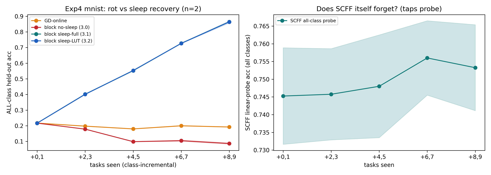
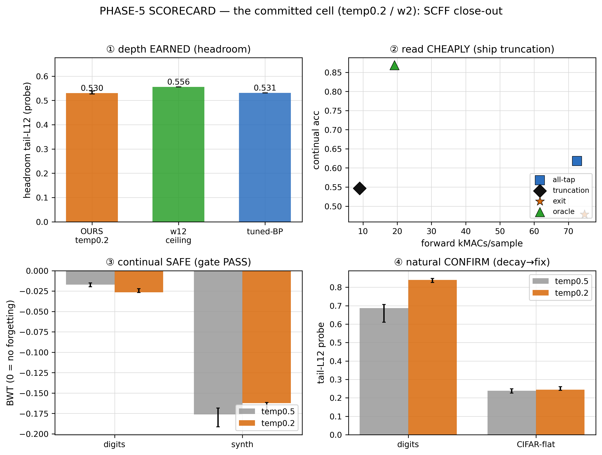

# Stage 1 — the cheap brain, built, characterized, closed out, and noise-hardened (the report)

> The executive narrative of Stage 1 of draft 6.0 (Phases 1–6, June–July 2026) — the arc that built the first organ
> (the SCFF + GD neocortex cell), found where it wins, failed to make it deep, found *how* it can be deep,
> characterized the result, closed out the cheap brain by solving its one remaining *learning* wound (the depth
> decay), and **hardened it against the noise it will meet on silicon and on a lifelong stream — before handing it to
> the GD namer.** (Phase 6 is a Stage-1 *extension*: the same cheap brain, made robust; the GD namer is Stage 2.)
> Written as a first-person research log, and written to be **self-sufficient**: each phase's section below carries
> the full story — the question it inherited, the rungs actually run, the key numbers and figures, what the sims
> overturned, and the decision it set — so you understand every phase from this one file. The six per-phase reports
> are for **auditing** (every figure, the per-experiment cards, threats-to-validity, the blind spots):
> [Phase 1](phase1/phase1-report.md) · [Phase 2](phase2/phase2-report.md) · [Phase 3](phase3/phase3-report.md) ·
> [Phase 4](phase4/phase4-report.md) · [Phase 5](phase5/phase5-report.md) · [Phase 6](phase6/phase6-report.md).
> Terms and metrics are defined in [`ref-report/`](ref-report/README.md); the committed design is the
> [decision record](../idea/main.ideas.v1.md); the project's origin is told in
> [`the-essence2`](../../docs/essence/the-essence2.md) (the soul — the grown spine; `the-essence.md` is the seed).

---

## 1 · What Stage 1 was — the one-page primer

Draft 6.0 is a bio-inspired **analog compute substrate** with on-chip learning — a chip design that tries to make
brain-like computation the *cheap* path, not a machine-learning model. The guiding method is a motto: **copy the
brain's *function*, cheat the *implementation*** — pay for each principle with whatever is cheap on this substrate.

**The substrate.** The atom of storage is the **Scap** — one synapse's weight held as analog charge on a capacitor
(magnitude) plus a digital SRAM bit (sign). Compute happens *in the wires*: a crossbar of Scaps performs the
multiply-accumulate as physical current, and hardwired op-amps do add / multiply / ReLU directly on charges. There
is no ALU shuffling data; the computation is where the weights physically are. The forward scheme is **mono-forward
dual-rail** — a single sweep carries two worlds, a positive and a negative, side by side through the *same* shared
crossbar, doubling only the cheap activation buffers, not the weights.

**The 80/20.** Two brains share that substrate. A cheap, unsupervised **SCFF cortex** (~80%) organizes the world
for free — label-free, local, forward-only, no backward pass that leaves the chip. And a small, precise
**gradient-descent namer** (~20%) maps those features to real labels. The split is principled: **direction is the
one expensive thing in learning**, so we pay for it *once*, where it counts, and get everything else for free.

**The frame.** Stage 1 is the first organ, built and characterized in **behavioral simulation** (numpy, ideal
floats; Phase 6 adds an *honest behavioral analog-noise model*, but still no SPICE / device physics) — *before* full
device realism and *before* the north star (the recurrent lifelong brain). The question Stage 1 set out to answer was
never "does this beat backprop on accuracy." It was **where does a cheap, local, forward-only learner earn its
place — and is it robust enough to trust on silicon?**

## 2 · The one arc (the spine)

Six phases, one argument. The shape of it:

> **We kept being right about *where* the cell wins (continual, substrate-native depth) and wrong about *how*
> (deep SCFF, energy-goodness) — and every correction came from a sim or a paper overruling the plan, never from
> tuning-to-pass.**

The connective tissue underneath is a single recurring fault — **density ≠ class.** SCFF's energy goodness
(`G = Σ‖h‖²`) makes a layer *loud* on coherent input and *quiet* on mixtures, so it learns *where the data is
dense*. That recovers classes only when classes *are* density clusters. Watch that one fact travel:

- **Phase 1 found it** (exp0: an equal-density spiral defeats SCFF-alone) and found the home it doesn't hurt — the
  *continual* regime, where SCFF's unsupervised features simply don't forget.
- **Phase 2 hit the wall it builds:** density doesn't compose across depth, and *no* negative-selection fixes it —
  *even a label oracle* (P2.2). We concluded, in the moment, that the wall was "intrinsic to forward-only locality."
- **Phase 3 found the door was the *objective*, not the locality.** Swap energy (preserves density) for **contrast**
  (preserves class), add a forward-only **coordination window**, and depth composes — overturning Phase 2's verdict.
- **Phase 4 drew the map**, and the map reads the whole cell exactly as the spine predicts: a *density/structure*
  learner with a cheap class-namer on top — it wins where the substrate lives and trails on static accuracy, *by
  design*. The map left **one wound open**: past ~layer 5 the deep representation *decays*.
- **Phase 5 closed it out** — and the wound was *density ≠ class* a fifth time: the decay is **direction** (deep
  layers drift *off the class manifold*), cured by a **sharper objective**, and the useful depth is read cheaply by
  a **short fixed reader.** The cheap brain's *learning* is finished.
- **Phase 6 met it a sixth time** — hardening the finished cell against noise, the dangerous enemy turned out to be
  *directional* (a coherent shift along the class axis), per-sample cosine is **blind** to it, so *retention* is the
  direction read. The fix is a noise-corrupted contrastive view — and the sims overturned the guess that it must be
  *directional*-specific: broad **generic** smoothing wins. The cheap brain is finished *and noise-hardened*
  (scoped — one named residual to Stage 2).

## 3 · Phase 1 — building the cell, finding the home → *continual*

*Ran 2026-06-20, exp0 → exp4; seeds `[42,137,271,314,1729]`, median + IQR throughout Stage 1.*

**The problem.** Draft 6.0 committed a spine on paper — the SCFF front + GD back — but not a single simulation had
run. Phase 1 stops arguing the theory and lets the behavioral sim talk. The question was deliberately **not** "does
this beat backprop on accuracy" (backprop's game, on a substrate built for it) but **where does a cheap, local,
forward-only learner actually earn its keep?**

**What we did.** Cell under test: one *block* — a 4-layer SCFF feature stack (width 64, ReLU, mandatory inter-layer
norm, mono-forward dual-rail) with a small GD readout tapping the SCFF layers. Tasks: a 2-D checkerboard
(visualization), digits (64-D), MNIST (784-D — the high-D track). Baselines: a matched-budget pure-GD MLP (the
precision ceiling) and an untrained random projection (the null). The ladder: exp0 gate → exp1 block-vs-GD → exp2
ratio/plasticity → exp3 boosting chain → exp4 continual.

**The rungs, in order:**

- **exp0 (the gate).** SCFF separates — but it clusters by **density, not class**: an equal-density spiral, where
  classes are *not* density clusters, defeats SCFF-alone. And in low-D a random projection ties it — its value is a
  *high-D* bet. The gate also forced three spec corrections that everything downstream inherits: goodness =
  **sum** `Σ‖h‖²` (not the paper's mean — the mean under-drives wide layers), threshold **θ=2.0**, **input-norm on**
  (without it, layer 1 learns the input's scale, not its shape). The through-line fault of the whole draft is named
  in the very first experiment.
- **exp1 (block vs GD).** The headline is the **memorization gap** — train-minus-test accuracy: MNIST block
  **+0.027** vs GD's **+0.062** (disjoint IQR, 5/5 seeds) at **~10% of the backward cost.** One block genuinely
  generalizes better than backprop; GD still wins raw accuracy. Two design facts fell out: SCFF features **degrade
  with depth** even here (the wound Phases 2–5 chase), and the readout must **tap ALL SCFF layers** — the spec's
  "read the last n" would read precisely the worst ones (corrects S3). Default width H=64.
- **exp2 (the interior).** There is **no free-lunch SCFF:GD ratio** — static accuracy declines monotonically as the
  SCFF fraction grows; the only real saving is the costly input layer. And the plasticity-slowdown knob (N2) is a
  *drift* fix, not a *depth* fix — a scoping that holds for the rest of the project.
- **exp3 (the boosting chain).** A chain of shallow GD-corrected blocks beats a single block and approaches GD —
  but **saturates after ~2 blocks**, and it wants *diversity* (full residual ε=1), not preserved features. "The deep
  80%-brain matches GD on static accuracy" is **not** the win; something else has to be.
- **exp4 (continual — the win).** On a class-incremental stream, online backprop **rots to chance** (digits 0.18,
  MNIST 0.19 — catastrophic forgetting). SCFF is **forgetting-robust** — new classes *add* clusters rather than
  overwrite (the all-class probe stays flat at 0.90/0.75 the whole stream) — so the forgetting lives entirely in
  the readout, and a cheap **sleep** consolidation over a prototype **LUT** fixes exactly that: recovery to
  **0.935 / 0.865** (near the static ceiling), and **0.898 even at a third of the store.**

*The figure that carries the phase: online learning ROTS to chance; a periodic sleep consolidation recovers to the
static ceiling; and the SCFF all-class probe stays flat the whole way — the features never forget. (n=5,
class-incremental stream.)*

**What it set.** goodness = sum `Σ‖h‖²` · θ=2.0 · input-norm on · **tap ALL layers** · full residual ε=1 (N3) ·
slow read-layers ρ≈0.3 (N2, a drift fix) · H=64 · **sleep (S7) + LUT (S8) confirmed.** The verdict in one line:
**a cheap, forgetting-robust continual learner — and not a deep static-accuracy competitor. That's the point.** The
wound it flags forward: SCFF degrades with depth. → [full report](phase1/phase1-report.md) ·
[front door](phase1/README.md).

## 4 · Phase 2 — depth is not SCFF's lever → *the wall, and the cheap survivor*

*Ran 2026-06-21, P2.0 → P2.6 (P2.3/P2.4 skipped as moot — the gap is intentional).*

**The problem.** Phase 1 left a sharp finding and a sharper collision. The finding: SCFF features degrade with
depth. The collision: SCFF's strength is **width**, but the Scap substrate's cheap axis is **depth** — a deep
crossbar is what the chip wants to build; a deep SCFF stack is what the algorithm seems to refuse. Phase 2 has one
job: **can we move SCFF's success onto depth?** The resolve: close *every* escape hatch before accepting the wall,
because "SCFF just can't go deep" is the kind of conclusion that is usually a tuning failure in disguise.

**What we did.** Cell under test: a deep (8-layer) SCFF stack — the wall — then the boosted-block recipe (the
survivor). Tasks: CIFAR-10-flat (3072-D, where the wall is real), a synthetic control with *no* wall, digits (the
continual veto). The decisive instrument: **selectivity** = trained probe minus an untrained random projection —
does a deep layer merely *entangle* class info (recoverable) or genuinely *lose* it?

**The rungs, in order:**

- **P2.0 (reproduce the wall).** On CIFAR-flat the per-layer probe falls 0.23 → 0.117 (slope −0.018, 5/5 seeds
  negative), dead-units climb 0 → 0.47, rank collapses 39 → 11 — and the selectivity control settles the sharp
  question: deep SCFF (0.294) ≈ a random projection (0.298). The features fall **below random — lost, not
  entangled.** The synthetic control (flat slope) proves it is a real CIFAR property, not a probe artifact.

  
  *The wall, reproduced cleanly: a deep SCFF stack ends below a random projection. (n=5, CIFAR-flat, 8 layers.)*

- **P2.1 (the transmission hatch).** The literature's DeeperForward fix (linear goodness + length-norm) works
  **mechanically** — dead-units → 0, rank restored — but class-separability *never rises with depth*: **0/7 learning
  cells reach slope ≥ 0.** Transmission is necessary but not sufficient; the signal that reaches the deep layers is
  the wrong signal. (A durable side-win: threshold-free **contrast** ≈ doubles the deep-layer probe vs the two-sided
  θ loss — the loss matters, the threshold is a liability. And a norm lesson banked for the substrate: length-norm
  survives, but **mean-zero kills** when paired with energy goodness.)
- **P2.2 (the objective hatch — the decisive rung).** If density is the wrong *question*, give the layer the right
  answer: pick each layer's negatives with a **perfect label oracle**. Even the oracle **does not bend the
  depth-slope on CIFAR** — while the same oracle *does* lift the synthetic control (+0.027, where classes really are
  density clusters), proving the mechanism works and the CIFAR null is real. A decisive negative: within the energy
  family, *no* negative-selection scheme can fix depth.
- **P2.3 / P2.4 (skipped, moot).** Both would refine a deep-SCFF stack that P2.1+P2.2 had just closed. The skip is
  part of the result — there is no `exp3/`/`exp4/`, on purpose.
- **P2.5 (the constructive survivor).** Depth from **boosted ensembles of *shallow* SCFF blocks with tiny GD
  readouts**: `read` (boost the per-block readouts) beats pure-SCFF where deep SCFF can't (+0.010, 5/5) at **~85% of
  GD's accuracy for ~17% of its backward cost**; `write` (re-inject the GD-corrected representation into the next
  block) **fails** — a class-collapsed rep destroys the rich features it feeds. Read, never write: the envelope rule
  the whole project keeps from here on.
- **P2.6 (the continual veto — closes the phase).** The boosted-read recipe + sleep recovers to 0.932 (BWT −0.034)
  ≈ single-block — and it is **continual-safe by construction** (per-sample norm, no batch statistics). The survivor
  keeps the Phase-1 win.

**What it set.** The surviving recipe `[SCFF×k → GD-readout]×N`, read not write; **depth = block-count, not
SCFF-layer-count**; contrast > two-sided θ; the healthy per-block cell = layer-norm + linear + contrast. **And the
load-bearing caveat, handed forward:** the in-the-moment conclusion — "the wall is intrinsic to forward-only
**locality**" — is *one word too strong*. Every energy-goodness result here stands, but Phase 3 narrows the wall to
the **energy objective** itself. → [full report](phase2/phase2-report.md) · [front door](phase2/README.md).

## 5 · Phase 3 — the objective reframe → *depth, won, and adopted*

*Ran 2026-06-22, P3.0 → P3.3.*

**The problem.** Phase 2 ended confident: *"the wall is intrinsic to SCFF's forward-only locality."* Then the
literature pass caught the word that was too strong. Phase 2 only ever varied the objective *inside one family* —
energy goodness `Σh²`, asking every layer the same **density** question. But a different *kind* of objective
composes with depth forward-only, gradient-isolated, *and* unsupervised: Greedy InfoMax and CLAPP train each module
to **preserve the information** of its input — and a Jan-2026 benchmark that tests SCFF *by name* shows the
predictive local-SSL family matching end-to-end backprop-SSL on CIFAR-10. So: **is the wall intrinsic to locality,
or only to the energy objective?**

**What we did.** The Phase-2 healthy cell with a **pluggable objective** — energy vs masked-reconstruction vs
**contrast (InfoNCE, two-mask views)** — plus a cross-layer **coordination window `w`** (the author's "a layer
learns to help the *next* layer" idea, supplied forward-only: each layer's loss sees a small window of the layers
above, no global backward pass). Tasks: CIFAR-flat (the wall), a **built depth-headroom synthetic task**, digits
(the continual veto). Reads: selectivity and the per-layer probe **slope**.

**The rungs, in order:**

- **P3.0 (the objective swap — make-or-break).** Three objectives split exactly along the spine's prediction.
  **Energy** decays through the random floor (the known wall). **Reconstruction** flattens but sits *below* random —
  it preserves pixel/**density** information, the density≠class trap re-incurred at the objective level —
  **rejected.** **Contrast** stays *above* random at every depth (it preserves **class** information) but still
  declines. The objective *family* is the lever; now make contrast compose.
- **P3.1 (coordination).** The window eases contrast's decline (w1 → w2, ~33% flatter) — but the real unlock was
  diagnostic: **flat-CIFAR has no depth headroom for anyone** (a GD-hidden baseline is itself flat there), so
  "slope ≥ 0 on CIFAR" was the wrong bar — we were hitting the *task's* ceiling, not the learner's. → Build a task
  with genuine depth headroom and re-ask.
- **P3.2 (the headroom confirmation — decisive).** On a task where GD-hidden *rises* with depth, contrast +
  coordination genuinely composes: w1 is myopic (+0.001, rises then drifts down), w2 rises (+0.012/layer), and
  **w4 rises monotonically (+0.022/layer) to 0.569 at L8 — above the fixed-budget GD ceiling**, selectivity +0.181,
  5/5 seeds. **P2.2 is overturned.**

  
  *Given a task with depth headroom, the contrastive objective + coordination window composes depth — the
  per-layer probe rises monotonically where energy-goodness decayed. (n=5, headroom synth, L=8.)*

- **P3.3 (the continual veto — closes the phase).** The worry: InfoNCE's in-batch negatives might bias the cell
  toward the current task and dent the continual home. It didn't — the contrastive cell is per-sample,
  continual-safe by construction, and *improves* the win: **BWT −0.017 vs energy's −0.026** (disjoint-IQR, 3/3);
  the all-class probe stays flat. **ADOPT.**

**What it set.** The SCFF objective = **contrast (InfoNCE, two-mask views, temp 0.5) + coordination window w≥2** —
**adopted; supersedes energy-goodness `Σh²` for draft 6.0.** Honest scope, kept front and center: the
depth-composition is a **rising *slope* on a built synthetic headroom task vs a fixed-budget GD baseline** — the
slope is the claim, not a GD-beat (w4 exceeding GD's ~0.52 is against *this* fixed-budget from-scratch GD, not a
tuned maximum; Phase 5 later re-earns the claim against a genuinely-tuned racer). Flat-CIFAR remains capped — no
headroom, for anyone. → [full report](phase3/phase3-report.md) · [front door](phase3/README.md).

## 6 · Phase 4 — the capability map → *a continual learner, not a static competitor*

*Ran 2026-06-22 (P4.3 re-run + extended 06-24), A1–A7 = P4.0–P4.6, P4.7 the synthesis.*

**The problem.** By the end of Phase 3 we trusted the cell on *two* axes (continual + depth-composition). Two axes
is not a map. Before any optimization is built on top of this cell, run the whole orthogonal scorecard — **for
coverage, not triage** — because a breadth sweep is the cheapest place to catch a latent algorithm bug before an
edifice stands on it. **Characterize before optimize.** (The framing earned its keep twice: the breadth caught a
latent OOM bug *and* refuted the plan's optimistic noise prediction.)

**What we did.** OURS = the Phase-3 adopted cell (contrast w2 SCFF bulk + all-tap sleep-consolidated readout), raced
against a **genuinely-tuned BP ceiling** (the gap to it is the headline — not a fixed-budget straw) and
**Mono-Forward** (the strongest forward-only *supervised* bar). The bench: a controlled Gaussian generator with
**exact Bayes error** — the difficulty dial *and* the true ceiling — plus real anchors (digits, CIFAR-flat). Seven
controlled axes.

*The Stage-1 result in one glance: the cheap forward-only brain WINS where the substrate lives (continual,
nuisance-dim, depth-cheap, depth-composition), TRAILS on static accuracy, and returns one honest NEGATIVE on
eval-time noise. (OURS vs a genuinely-tuned BP ceiling, 7 axes; the continual WIN is measured vs **naive online-BP
without replay** — the fairer same-budget BP+replay baseline is deliberately deferred, and discharged at P10. The A7
NEGATIVE is answered — Scoped-YES — by Phase 6.)*

**The axes, with their numbers:**

| axis | dial | verdict | the number |
| --- | --- | --- | --- |
| **A6 continual** | class-incr × difficulty | **DECISIVE WIN** | BWT −0.02→−0.18 vs online-BP's −0.83→−0.99, robust across difficulty |
| **A2 ambient-dim** | nuisance dim 8→500 | **WIN** | OURS crosses *above* tuned BP by dim 500 (gap −0.029); Mono-Forward collapses |
| **A4 width×depth** | iso-budget L2→L12 | **WIN (cost)** | forward-only backward cost **flat in depth** vs BP's linear (1.3× shallow → **6.8× at L12**) — the 80/20 is **depth-gated** |
| **A3 depth×difficulty** | headroom × overlap | **WIN (composes)** | w2 probe-slope > 0 at every difficulty (w1 never) — the composition generalizes |
| **A1 difficulty** | Bayes 0.02→0.37 | **TRAIL** | capture 0.92→0.68 — the gap doesn't *open*, but it never closes |
| **A5 class count** | C 2→20 | **TRAIL** | synth gap +0.23 but real digits +0.03 — the synthetic *overstates* the static gap |
| **A7 noise** | eval-time weight σ | **NEGATIVE** | retention 0.75 vs BP 0.88 — the honest negative that becomes Phase 6 |

**The A4 story, stated honestly (the corrected rung).** At iso-weight budget, both forward-only methods' backward
cost is flat in depth while BP's grows linearly — the cost claim is real but **depth-gated**. The re-run then made
the wall legible: measured at the **last-layer readout** (all-tap had *masked* the wall by quietly reading the good
early layers), contrast **flattens but does not abolish** the decay — OURS composes to ~L3–L5, beats BP on headroom
at L2–L6, then **decays**; a fixed-width control proves the dip is **depth-decay, not width-shrink**; and the
energy-Σh² baseline collapses outright (the Phase-2 wall, drawn on one axis). A follow-up named the cause:
**local-objective drift off the class manifold past ~layer 5** — not capacity; widening doesn't fix it. The all-tap
readout is load-bearing, and the wound has a name.

**The A7 story (the second honest negative).** The per-sample layernorm that *wins* A2 (nuisance-dim robustness)
*costs* A7 (eval-time weight-noise sensitivity) — a real tradeoff, not a bug; and the substrate-relevant
train-with-noise regime was untested. Flagged, not spun — it becomes Phase 6's whole brief.

**What it set (the hand-off).** The verdict in one line: **a substrate-native continual learner, not a
static-accuracy competitor** — no algorithm bug hid in the breadth. The brief it wrote: optimize the continual
mechanism (→ Stage 2's economy and freeze); build deep but gate depth on headroom, and close the decay (→ Phase 5);
run train-with-noise before any analog claim (→ Phase 6); validate multi-class on natural data (→ the P10 trial);
don't compete on static accuracy — not the architecture's place. → [full report](phase4/phase4-report.md) ·
[front door](phase4/README.md).

## 7 · Phase 5 — closing out the cheap brain → *depth solved, read cheaply*

*Ran 2026-06-30, P5.0 → P5.9, all guards pass.*

**The problem.** Phase 4 left one wound open: the representation gets *more* class-separable for ~5 layers, then
**decays**. The Phase-4 controls had already narrowed it — not dead units (dead-frac ≈ 0), not width (widening
doesn't fix it) — and a follow-up named it: a **direction failure.** The deep layers are alive and full-rank, but
their representation drifts **off the class manifold** once a layer's abstraction saturates — density ≠ class, a
fifth time. A decaying deep cell hurts on two fronts: it caps how much depth the substrate can spend, and the
deployed all-tap readout drags the drifted deep layers into the read, **diluting** the class signal and burning the
80/20 cost win. Phase 5's job: **earn the depth back, and read it cheaply** — without rewriting the SCFF stream (the
P2.5 envelope: read / gate / add-to-objective allowed, rewriting forbidden) and without denting the A6 continual win.

**What we did.** Cell under test: `SCFFContrastOverlap` (the Phase-3 cell) with **temperature** and **window** as
the levers. Every depth figure carries two references: the **w12 ceiling** — a *forbidden* full-credit
(full-backprop-reach) window, measured only as the objective-capability upper bound, never deployed — and the
**truncation floor** (a cheap from-scratch short stack), plus the tuned-BP/Bayes anchors carried from Phase 4. The
ladder: bench + decay reproduction → the two earn-depth levers → the diagnosis → the read-cheaply readout → the
conditional preservation cell → the continual gate → natural confirmation → the assembled verdict.

**The rungs, in order:**

- **P5.0 (the diagnosis that changes the phase).** The diagnostic w12 window composes the *whole* 12-layer stack
  with **no decay at all** — so the decay is **objective-locality, not an intrinsic "Tunnel."** The depth is
  *curable*; the question is only whether a *cheap, forward-only* lever cures it.
- **P5.1/P5.2 (earn it — the temperature lever).** A **sharper InfoNCE temperature (0.5 → 0.2)** makes each update
  more class-selective, holding the representation on the class *direction*: the probe peak marches L5→L6 (→L9 once
  the window opens to w4), the headroom tail lifts 0.435 → 0.530 (→0.562 at w4), and the **readout beats a
  genuinely-tuned backprop** — 0.550 [0.545–0.553] vs 0.531 [0.531–0.533], IQR-disjoint, against the tuned `race_bp`
  racer, not Phase 3's fixed-budget GD — while the probe tail reaches the w12 ceiling (0.556). The lr-matched
  control pins the mechanism: **~82% of the lift is direction, not a disguised learning-rate** (0.078 of the 0.095
  survives step-size matching). The spine, paid a fifth time.
- **P5.3–P5.5 (read it cheaply).** On the *flat* continual home, per-depth heads read by a **short fixed truncation
  stack** hit 0.547 @ 9.0k readout-MACs vs all-tap @ 72.5k — **8× cheaper** (a *readout* saving; the L12 bulk still
  runs) — because all-tap can't zero-weight the drifted deep layers a capacity-limited head drags in. The
  **adaptive per-sample early-exit was struck on evidence**: an *oracle* best-per-input selector reaches 0.87, but a
  calibrated confidence threshold can't find it — on the flat home the per-depth heads are weak-but-decorrelated, so
  **pooling beats placement** (the exact inverse of the headroom result; the oracle-exit headroom is parked for the
  north star, not dead).
- **P5.6 (preservation — skipped with evidence).** The frozen-residual cell was never needed: the cheap levers had
  already closed the gap the fixed reader reads. Skipped, documented.
- **P5.7 (the continual gate).** temp0.2 keeps the A6 win — BWT −0.026 (gate: within −0.02 of the −0.017 baseline),
  AA 0.944, the sleep-recovery mechanism intact. **PASS.**
- **P5.8 (natural confirmation).** The decay **reproduces on real data** (digits +0.260, CIFAR-flat +0.094), and
  the temp-fix is **real on digits** (tail +0.152 — roughly halving the decay) and **null-but-safe on CIFAR-flat**
  (no composable depth to earn — it needs convolution, out of scope). Not a synthetic artifact.

*The close-out in one glance: depth EARNED (readout beats tuned-BP; probe tail reaches the w12 ceiling), read
CHEAPLY (a fixed short stack, 8×; the adaptive exit lost), continual-SAFE (A6 intact), and natural-CONFIRMED. (n=5;
n=3 on the heaviest continual cells.)*

**What it set.** The committed cell: **`SCFFContrastOverlap` temp0.2 / w2, L12 bulk, NO residual, fixed-reader
deploy** — truncate ~L2–3 on the continual home, all-tap when peak accuracy is wanted, **w4** the bounded
depth-closer for compositional tasks. Delta **S9** (revises S3's literal "tap ALL layers," keeping its intent).
The earn-depth numbers are per-layer reads on a built headroom task confirmed on digits — **a representation claim,
not a benchmark-beat**, and we say so. *The cheap brain's learning is finished.* →
[full report](phase5/phase5-report.md) · [front door](phase5/README.md).

## 8 · Phase 6 — noise-hardening the cheap brain → *robust enough to trust downstream (scoped)*

*Ran 2026-07-01, P6.0 → P6.8 (P6.2/P6.3 pre-registered skips), all guards pass.*

**The problem — and why it outranks the namer.** Phase 5 finished the cell's *learning* — in a noiseless numpy
ideal, with Phase 4's honest **A7 NEGATIVE** (eval-time noise sensitivity) still open. The cell will run on an
analog substrate (drifting charge, offset op-amps, quantizing ADCs) and on a lifelong stream where **every datum is
a single noisy sample.** The ordering is not optional — **LP-FT** settles it: a trained readout *preserves* but
cannot *manufacture* the robustness a backbone lacks, and A7's sensitivity is born in SCFF's own per-sample
layernorm, so **no 20% readout can rescue it.** The fix must live upstream, in SCFF — a Stage-1 problem. (This is
why the old undifferentiated "Phase 6 = GD optimization" split: noise became its own Stage-1 extension; the namer
moved to Stage 2.) Two doors frame it: **Door A** — the analog substrate's noise channels; **Door B** — the
author's own worry, *"can a stable class direction form when every training sample is corrupted?"* Both share one
crux: a **directional, non-zero-mean perturbation aligned with the class axis.**

**The rungs, in order:**

- **P6.0 (name the enemy honestly).** On the frozen cell, under an honest behavioral noise model
  (AIHWKit-structured: common-mode + uncorrelated mismatch + ADC quantization + a directional residual), A7
  reproduces and is **OURS-specific and directional**: at matched projected-RMS a directional perturbation degrades
  OURS ~2× more than a plain linear readout (retention ~0.60 vs ~0.96, 5/5) — while the substrate's *common-mode*
  channel is already auto-rejected by the same layernorm that causes the sensitivity, ADC is fine ≥3-bit, and
  weight-noise is mild. And the two enemies attack **different geometry**: iid noise *rotates* each representation
  (per-sample cosine catches it), but the directional enemy is a **coherent translation** — it barely rotates any
  single point (cos ≈ 0.97) yet slides the whole cloud off a fixed readout — so **retention, not cosine, is the
  direction read.** density ≠ class, a sixth time; the spine metric itself had to be sharpened.
- **P6.1 (the fix — and the overturned guess).** The design predicted a *directional*-specific augmentation would
  be the spine fix. The random-axis control refuted it: **`iid ≥ randax > dir`** — because the enemy's axis is
  unknown at train time and label-free, **broad generic smoothing generalizes best.** Adopted: corrupt **one InfoNCE
  view with broad iid noise, σ_aug = 1.0.**
- **P6.2 / P6.3 (pre-registered skips).** Weight-channel flatness (tap ≫ weight, and tap already fixed) and
  re-tuning the per-sample norm (it is load-bearing — it wins A2 and rejects common-mode; harden *around* it, never
  remove it). The skips are part of the record.
- **P6.4 (Door B).** The class direction **forms from a fully-noisy stream** — zero-mean ratio 0.93 (Noise2Noise
  averaging), directional 1.00 — and buffer *purity* filtering ≈ naive averaging at this noise level (measured, not
  needed; an available knob for harsher regimes). This exposes the phase's sharp asymmetry: the directional enemy is
  lethal *at eval* (a shift off a fixed readout) but harmless *in training* (a consistent shift the representation
  adapts around).
- **P6.6 (the gate).** The fix **keeps — and slightly improves — the A6 continual win** (BWT −0.022 → −0.017, AA
  0.937 → 0.944): a noise-robust representation is also drift-robust. **Banked.**
- **P6.7 (natural).** A7 and the fix reproduce on real flat data: digits 0.763 → 0.888, CIFAR-flat 0.697 → 0.779.
  Not a synthetic artifact.
- **P6.8 (the assembled confirmation).** On the assembled cell the dominant tap-directional retention lifts
  **0.817 → 0.865** (5/5 paired), clean accuracy *improves*, selectivity holds.

*The noise-hardened cell vs the fix-free cell across the noise grid (headroom, n=5). One forward-only change —
corrupt one InfoNCE view with broad iid noise — lifts the dominant tap-directional retention 0.817→0.865 (5/5
paired), improves clean accuracy, and holds selectivity. Real, and honestly **partial**: near, not decisively above,
the pre-registered 0.90 band.*

**What it set.** The verdict is **Scoped-YES**: the dominant tap channel is hardened forward-only, continual-safe,
natural-confirmed — but the lift is partial, and the **input-transducer directional residual** (plus ADC < ~3-bit)
is not reachable forward-only → handed to Stage 2 read-side as a named brief (the "scoped"; P9.4 later discharges it
with proto-reanchor). The committed cell gains one term: **`NoiseAugContrast` = the frozen Phase-5 cell + one
iid-noise-augmented InfoNCE view (σ_aug=1.0).** Delta **S10**: *SCFF carries a noise-aware objective — robustness in
the base representation, not the readout.* → [full report](phase6/phase6-report.md) ·
[front door](phase6/README.md).

## 9 · Where the decisions came from (provenance)

The draft-6.0 spine was committed on paper as **N1–N3** (the net) + **S1–S8** (supporting structure) — the
[decision record](../idea/main.ideas.v1.md). Stage 1 set the open numbers and corrected several of the calls. This
table is the audit trail: which committed decision was set, corrected, or merely carried — and by which result.

> *Honesty note:* what was **un**tested is marked as such (e.g. S4). That candor is what makes the table credible —
> a provenance table that claims everything was validated is the one nobody should trust.

| Decision / knob | Committed as | Set / corrected / tested by | Now |
| --- | --- | --- | --- |
| SCFF = the cheap brain | **N1** | Phase 1 exp0 | _confirmed; goodness = **sum** ‖h‖² (not mean), θ=2.0, input-norm on_ |
| Middle layer = plasticity slowdown | **N2** | Phase 1 exp2c | _slow read-layers ρ≈0.3; a **drift** fix, not a **depth** fix; its coordination half effectively superseded by Phase-3's window_ |
| GD = residual boosting blocks | **N3** | Phase 1 exp3 | _confirmed; full residual ε=1 (diversity > preservation); Ch9 delta off_ |
| Path-diversity from depth, not width | **S1** | the whole depth arc (P2 → P3) | _validated indirectly: deep SCFF can't (P2), depth-via-coordination can (P3)_ |
| Mono-forward, dual-rail | **S2** | Phase 4 A4 | _cost claim **measured**: backward cost flat in depth (the 80/20 is depth-gated)_ |
| GD reads via taps | **S3** | Phase 1 exp1 | _corrected: tap **ALL** layers (not "last n")_ |
| Two GD organs (interface / output) | **S4** | — | _carried, **not separately characterized** (wasn't isolated behaviorally)_ |
| Mandatory inter-layer normalization | **S5** | Phase 1 + Phase 2.1 | _input-norm ratified (P1); length-norm survives but **mean-zero kills** → must pair with linear goodness (P2.1)_ |
| Threshold-gated learning (Ch7 gate) | **S6** | _unbuilt_ | _open → Stage 2 (GD-side, Phases 7–9)_ |
| Sleep consolidation | **S7** | Phase 1 exp4 | _confirmed; the continual recovery mechanism_ |
| LUT prototype memory | **S8** | Phase 1 exp4 | _confirmed; replays at ⅓ store (0.898 vs 0.935)_ |
| Readout = fixed short-stack placement | **S9** (Phase-5; revises S3) | Phase 5 P5.3–P5.5 | _set: read the sharp extractor depth, not literally every layer; adaptive exit struck; no residual_ |
| SCFF carries a noise-aware objective | **S10** (Phase-6) | Phase 6 P6.1/P6.6/P6.8 | _set: one InfoNCE view corrupted by broad **iid** noise (σ_aug=1.0); robustness in the base rep, not the readout; generic > directional (guess overturned); continual-safe (BWT −0.022→−0.017); input-transducer residual → Stage 2_ |
| — *emergent Stage-1 decisions* — | | | |
| Depth = block-count, not SCFF-layer-count | (Phase-2 finding) | Phase 2 P2.1/2.2/2.5 | _set: deep SCFF can't earn depth; read-not-write_ |
| SCFF objective: energy → contrast + coordination | (reframe) | Phase 3 P3.0–P3.3 | _**adopted**; supersedes energy-goodness `Σh²`_ |
| SCFF depth: earn it via a sharper objective | (Phase-5 fix) | Phase 5 P5.1/P5.2 | _set: **temp 0.2 / w2** default (readout beats tuned-BP); **w4** = bounded depth-closer; the decay was objective-locality, not an intrinsic Tunnel_ |
| SCFF depth: noise-hardened forward-only | (Phase-6 fix) | Phase 6 P6.0–P6.8 | _set: A7 is real, OURS-specific & directional; generic noise-augmentation hardens the dominant tap channel forward-only (Scoped-YES); P6.2/P6.3 skipped (norm is load-bearing); Door B answered_ |
| The committed cell (Stage-1 output) | — | Phase 3 adopt + Phase 4 char + Phase 5 close-out + Phase 6 noise-harden | _`NoiseAugContrast` = `SCFFContrastOverlap` temp0.2 / w2, L12 bulk, NO residual, fixed-reader deploy **+ one iid-noise-augmented InfoNCE view (σ_aug=1.0)**_ |

## 10 · The cell as it stands (end of Stage 1)

The committed cell is **`NoiseAugContrast` — the Phase-5 `SCFFContrastOverlap` (contrast/InfoNCE, two-mask views, at
temperature 0.2 + coordination window w=2, L12 bulk, NO residual, deployed with a fixed short-stack reader: truncate
~L2–3 on the continual home; all-tap when peak accuracy is wanted; **w4** the bounded depth-closer for compositional
tasks) plus one iid-noise-augmented InfoNCE view (σ_aug=1.0)** — forward-only, per-sample, no batch statistics,
sleep-consolidated, continual-safe by construction, and noise-hardened on its dominant analog channel. Stage 1
measured what it is, Phase 5 closed its one open *learning* wound, and Phase 6 hardened it against noise:

- **It wins continual** (the home): sleep recovers what online backprop catastrophically forgets, robustly across
  difficulty — its reason for being.
- **It composes the depth a task needs, and reads it cheaply** (Phase 5): a sharper objective earns the depth back so
  the **readout beats a genuinely-tuned backprop** and the probe tail reaches the w12 ceiling; the useful depth is then read
  **8× cheaper than all-tap** by a short fixed stack. Backward cost stays flat-in-depth where backprop's grows
  linearly, so the narrow-deep, substrate-native shape is ~free for it.
- **It is nuisance-robust:** in high ambient dimension it crosses *above* a tuned backprop, for free.
- **It trails on static accuracy** (difficulty, many synthetic classes) — the cost of being a density/structure
  learner with a cheap namer rather than a global error-minimizer.
- **It is noise-hardened, scoped** (Phase 6): A7 is real, OURS-specific, and **directional** — an analog substrate's
  dominant mismatch is directional too, so it attacks the very class-direction the design exists to protect. A
  forward-only objective change substantially hardens the dominant tap channel (0.817→0.865, 5/5 paired; near, not
  decisively above, the 0.90 band), *improves* clean accuracy, and **keeps the A6 continual win.** The
  **input-transducer directional residual** is not reachable forward-only → a named Stage-2 read-side brief. The
  sharpest silicon risk is answered on the dominant channel and honestly flagged on the residual.

## 11 · Honest scope of Stage 1 as a whole

- **Behavioral simulation only** — ideal floats, numpy; Phase 6 adds an honest *behavioral* analog-noise model
  (AIHWKit-structured: common-mode + uncorrelated mismatch + ADC quantization + a directional residual), but still
  no SPICE / device physics / fabrication.
- **Small and partly synthetic tasks** — checkerboard, digits, MNIST, CIFAR-flat, and built Gaussian generators.
  The depth-composition result in particular is on a **built synthetic headroom task** — Phase 5 hardened it (the
  re-tuned **readout now beats** a genuinely-tuned backprop, and the decay reproduces on real digits *and* CIFAR-flat
  with the fix real on digits) but the temp-fix is **null-but-safe on flat data with no composable depth** (CIFAR-flat
  stays at the wall — it needs convolution, which is out of scope). The synthetic headroom result is a representation
  claim, not a benchmark-beat.
- **Not a static-accuracy claim** — and we don't make one; the architecture trails there on purpose.
- **Key machinery is unbuilt at this point** — the Ch7 threshold gate and a tuned sleep cadence are named and
  deferred to **Stage 2** (the GD-side era; both are then built — the gate at P8, the cadence at P8/P9).
- **Open follow-ups, not blockers** — natural-data / larger-scale validation (→ the P10–11 trial), train-with-noise
  (hardware-aware), direct-feedback coordination, and anything needing architecture (convolution, time-series) — the
  north-star track.

## 12 · What came next — the namer, the freeze, and the trial

The cheap brain is finished, characterized, and noise-hardened — its *design* complete. Every remaining knob was on
the precise ~20% **namer** back, not the SCFF front, so Stage 1 handed **Stage 2** a settled, noise-characterized
cell and a precise brief. What happened next, in one breath each — the full stories are the other two volumes:

- **Stage 2 (Phases 7–9, [`stage2-report.md`](stage2-report.md)) built the namer and froze the object.** The sims
  overturned the plan again, twice: the committed namer is a **no-gradient closed-form analytic head** (SLDA
  deployed; "20% GD" is a role, not a method — **S11/S12**), and the drift-gated economy turned out to be a
  **safety** mechanism (firing more forgets more), metered at GD-share 0.121. P9 measured the bulk (**rotates but
  does not forget**), tuned the lifelong loop, and **froze the whole object** at commit `59d2720` (**S13**). Phase
  6's named read-side residual is discharged there (P9.4 proto-reanchor).
- **The validation (Phases 10–11, [`validation-report.md`](validation-report.md)) judged the frozen object.** Raced
  untouched against a fair, budgeted, tuned BP+replay baseline (**S14**: ties the continual home, trails static
  digits, **wins continual safety ≈10×** + noise on every channel; energy substrate-realized) and then taken onto
  eight real arenas + scale (**S15**: the honest **LIMIT-MAP** — wins real sensor-drift, order-invariance, and every
  scaling read; losses and floors mapped, not hidden).

After the trial, the analog-realism layer (SPICE / PVT) opens. The **recurrent lifelong brain** — a time-series
prefrontal↔hippocampus loop where "correctness is a self-generated feeling" — remains the north star, beyond the
numbered phases, deliberately not specced yet. *Simple intelligence first.*

---

## Reading guide

**If you read only one file:** for the **whole two-brain model**,
[`phase9-final-architecture.md`](phase9-final-architecture.md) (v2.0.0, self-contained — both brains, the maintenance
loop, the full arc). For **just the cheap brain this report covers** (Stage 1, noise-hardened), its frozen
snapshot is [`phase6-final-architecture.md`](phase6-final-architecture.md) (v1.1.0); the pre-noise v1.0.0 base is
[`phase5-final-architecture.md`](phase5-final-architecture.md). Each is self-contained, written for an outside
researcher to understand the architecture without opening a phase report.

**The three volumes of the report set:** **this file** (Stage 1 — the cheap brain, P1–6) →
[`stage2-report.md`](stage2-report.md) (Stage 2 — the namer + the economy + the freeze, P7–9) →
[`validation-report.md`](validation-report.md) (the trial — the frozen object raced and mapped, P10–11).

To audit any phase, descend by need: its **`README.md`** front door (the navigable synthesis + key figure) → its
**`phaseN-report.md`** (the deep story, every figure, threats) → the **`expK/experiment-K.md`** cards (the full
per-slot reads) → **[`ref-report/`](ref-report/README.md)** for any term, metric, or paper. The per-phase
**`RESULTS.md`** ledgers carry every scalar; each phase's **`design.md`** keeps the pre-run design it was built
against. The whole set is meant to read cold to an outside researcher with only `ref-report/` as the glossary.
