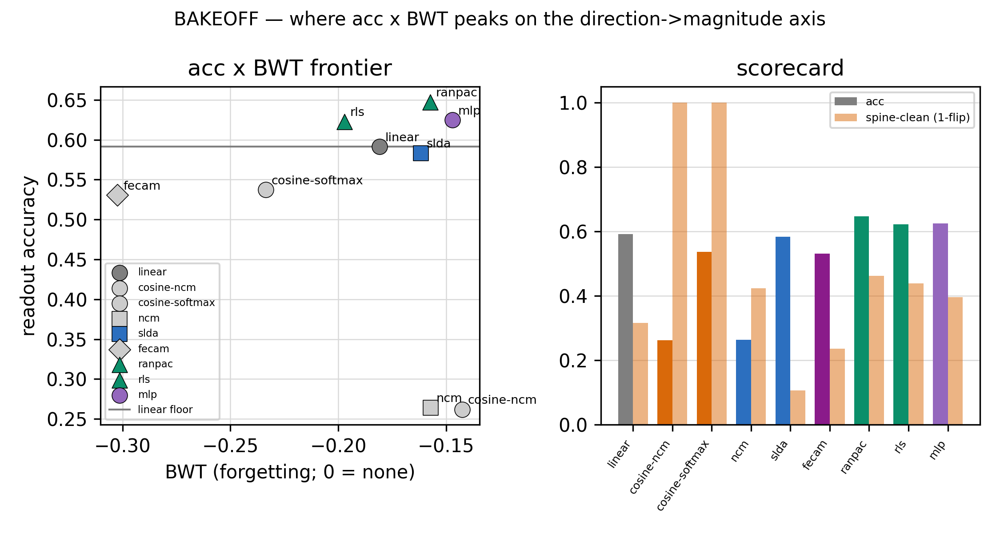

# Stage 2 — the GD namer: putting our names on the cheap brain (the report)

> The executive narrative of Stage 2 of draft 6.0 (Phases 7–10, July 2026) — the arc that takes the frozen, noise-hardened
> SCFF cheap brain and builds the **~20% gradient-descent "namer"** that maps its features to our labels. Stage 1 made a
> brain that *organizes* the world; Stage 2 makes it *answer in our language.* This is the last component of the
> neocortex brain.
>
> **✅ Stage 2 is COMPLETE (all four phases ran, July 2026).** **P7 (the readout), P8 (economy + cost), P9 (maintenance —
> the loop FROZEN), and P10 (validation / showcase — the frozen object raced against a fair BP+replay baseline) are all
> DONE.** P7 picked the namer (no gradient); P8 put the first honest hardware cost on the 80/20 and ran both brains live;
> P9 measured the bulk-drift (it **rotates**, does not forget), tuned the loop's open knobs, and **locked the object** at a
> commit hash; **P10 discharged the stage's *existential* debt** — it raced the frozen object, untouched, against a fair,
> budgeted, tuned BP+replay learner and delivered an honest **Pareto** verdict. The founding bet is **refined, not
> inflated:** a substrate-native continual learner — competitive on the continual home, decisively **safer**, far more
> **noise-robust**, its energy edge over conventional GD **substrate-realized** — exactly the P4 identity, now validated
> against the strongest fair opponent. Read this as the **closed Stage-2 arc.** (The discipline that made it honest:
> *freeze in P9, judge in P10.*)
>
> The plan this executes: [`stage2-design.md`](stage2-design.md) (the authoritative Stage-2 map). The frozen cell it
> builds on: [`phase6-final-architecture.md`](phase6-final-architecture.md). The
> committed design record: [`../idea/main.ideas.v1.md`](../idea/main.ideas.v1.md). Terms and metrics:
> [`ref-report/`](ref-report/README.md). The Stage-1 arc it inherits: [`stage1-report.md`](stage1-report.md).

---

## 1 · What Stage 2 is — the one-page primer

Draft 6.0 is two brains on one analog substrate. A cheap, unsupervised **SCFF cortex** (~80%) organizes the world for
free — label-free, local, forward-only. Stage 1 built, characterized, closed out, and noise-hardened it: the committed
cell is **`NoiseAugContrast`** (`SCFFContrastOverlap` temp0.2 / w2, L12 bulk, no residual, + one iid-noise-augmented
InfoNCE view). It composes the depth a task needs, reads it cheaply, wins the continual regime, and survives the noise it
will meet on silicon. **But it never learned our labels.** It sorts the world into "kinds of things"; it does not know
which kind is a *3* and which is a *7*.

**Stage 2 is the part that does — the precise ~20% gradient-descent namer, read-only on the frozen bulk.** Every knob
from here on is on this back, not the SCFF front (which is frozen and never re-trained). The split is the project's
founding bet: **direction is the one expensive thing in learning**, so we pay for it *once*, where it counts — putting
the names on — and get everything else for free.

**Why Stage 2 is smaller than five-phases-of-SCFF had any right to be.** Because the SCFF bulk is *frozen to GD*, the
namer's learning is **reservoir/ELM-like** — a trained readout on fixed features is a **(near-)convex regression** with
no bad local minima and no cross-layer credit chain. There is no heavy-optimizer zoo to build; the simplest thing
converges. Two hedges keep "small" from becoming "sloppy," and both are *tested*, not asserted: **(a)** "convex" names the
*regression*, not the deployed readout's **substrate cost** (the softmax / normalizer / Gram-solve is a non-free digital
block — that is Phase 8's meter, so every "80/20" number is a proxy until then); **(b)** we are reservoir-*like*, not a
reservoir proper (trained-then-frozen, not random), so we inherit the readout convexity but **not** free noise-tolerance,
and the real cost is *tracking the drift*, not solving the regression.

**One kickoff decision governs the whole stage: boosting is dead.** The old N3 plan chained `[SCFF → GD-checkpoint]`
residual boosting blocks; it is dropped. A boosting *chain* feeds each block's fast, supervised, GD-corrected residual
into the *next* block's SCFF input — SCFF sees a moving target and its stable unsupervised base is destroyed. The wall,
now across all of Stage 2: **anything between or under SCFF must be unsupervised, or slow enough not to shift everything
at once; fast + supervised + upstream-of-SCFF breaks the base.** So the committed era is **one L12 SCFF bulk + read-only
GD heads** — the "two GD organs" collapse to **one: the readout.**

**The four phases** (re-planned 2026-07-02 post-P8 — the old single "P9 maintenance + owed baselines" split into P9
*close* + P10 *validate*; run in order on the noise-hardened cell):

- **P7 — the readout.** Build and pick the namer on the frozen bulk. **✓ DONE.**
- **P8 — the economy gate + the cost meter.** The Ch7 learning-gate (cheap SCFF most steps, expensive GD only when the
  cheap path stalls) and the honest hardware-meaningful cost meter that replaces the op-count proxy. **✓ DONE.**
- **P9 — close & *freeze* the maintenance loop.** Tuned the genuinely-open knobs against *internal* signals — bulk-drift
  (rotates, doesn't forget), N2 (struck), cadence *depth* (all-tap) + frequency (grid-8→grid-4), bounded-LUT eviction
  (CBRS), the read-side noise residual (proto-reanchor) — then **locked the object**. **NOT** re-opening the Namer (SLDA
  committed). **✓ DONE — frozen.**
- **P10 — the validation / showcase.** Raced the **frozen** object: the existential fair BP+replay *accuracy* fight, the
  multi-domain adaptive gauntlet (new/1-back/all-prev acc + cost), the noise showcase, natural multi-class A5 → an honest
  **Pareto** verdict + the Stage-2 close-out. Discipline: **freeze in P9, judge in P10.** **✓ DONE — the close-out.**

---

## 2 · The arc — one thread, closed

Stage 1's arc was "we kept being right about *where* the cell wins and wrong about *how*." Stage 2 has its own thread,
and now that all four phases have run, it has a shape:

> **The "20% GD" is a role, not a method — and the economy that pays for it is a *safety* mechanism, not just a cost
> saver.** We expected to pay gradient descent for the precise brain and to pay a forgetting cost to stay direction-pure.
> The sims said neither: the best namer uses **no gradient at all** and wins by reading a *magnitude*; and when we ran
> both brains live, the disciplined drift-gated economy turned out **cheaper *and* safer** than firing the namer every
> step — because firing more chases the recency-skewed stream and forgets more. The cheap answer was also the safe one.

The connective tissue is Stage 1's recurring fault, **density ≠ class**, wearing its **7th** coat. The project's spine
says *read the class direction, never a magnitude* — and the tempting move in a readout is to declare the direction-pure
**cosine** head "the spine handed to us." Phase 7 measured it instead of assuming it, and the answer was sharp: on the
frozen bulk the cosine head is **sub-competitive**, and the committed namer (**RanPAC**) reads a *magnitude* (a ridge
prototype) — yet it is **recency-robust**, not because it reads direction, but because it has **no trained softmax
weights to inflate.** Recency-robustness ≠ direction-reading. The spine bent, honestly and numerically, and we named the
tension rather than resolving it silently toward accuracy.

And a second thread closes the stage, from Phase 10:

> **The founding bet, raced against the strongest fair opponent, is *refined* — not inflated.** We bet on an 80/20
> continual learner that beats backprop's **economics *and* accuracy.** Against a tuned, budget-matched experience replay
> the honest numbers split the bet cleanly: the **economics** win is **substrate-realized** (the 80/20 *algorithm* is
> actually 1.5× *more* than a small tuned net on the same digital substrate — the analog crossbar carries the win), and
> the **accuracy** win is **continual stability**, not static accuracy (OURS ties on the hard home, trails on easy static
> digits, and forgets ~10× less at its worst point). The claim survives, narrowed to exactly what the project always said
> it was: a **substrate-native continual learner**, safest and most noise-robust of the fair field.

**The honest status, stated plainly.** All four phases are done. The headline — *the precise brain names the world with no
backward pass* — is a real, natural-confirmed **P7** result; **P8** ran both brains live and metered the 80/20 (GD-share
0.121, no longer a proxy); **P9** measured the bulk-drift (rotation, not forgetting) and **froze** the object; and **P10**
discharged the existential debt — the fair same-budget **BP+replay accuracy** baseline that Phases 4/8/9 each carried
forward. The verdict is not a clean "beats backprop on everything" — it is the honest map (§3, Phase 10): a tie on the
continual home, a static-accuracy loss on easy natural data, a decisive continual-safety and noise-robustness win, and a
substrate-realized energy advantage. Stage 2 is **finished, and validated honestly.**

---

## 3 · Phase by phase (the synthesis)

### Phase 7 — the readout → *the 20% is NOT gradient descent* 🔥  **[DONE]**

Phase 7 raced a taxonomy of *namers* on the frozen bulk — gradient heads, direction-pure cosine heads, magnitude
prototypes, and no-gradient analytic/RLS heads — refereed by three axes: **accuracy × forgetting (BWT)**, the **spine**
(does the verdict track class *direction* or a *magnitude*, measured as argmax-flip under a per-class norm nuisance), and
the un-skippable **A6 continual-safety gate**. Cost was a descriptive-only fourth axis (never a tie-break; the real meter
is P8).

*The headline. **Left** — the accuracy×forgetting frontier: **RanPAC** sits at the top-right, in a statistical three-way
tie with the gradient MLP and the un-projected RLS, and **two of the top three use no gradient**; the direction-pure
cosine-softmax and the max-magnitude FeCAM fall below, and the bare prototype heads collapse sub-floor (greyed).
**Right** — the scorecard: RanPAC carries the highest static accuracy, while only the two **cosine** heads are perfectly
spine-clean (argmax-flip 0). The whole phase is this one picture: the frontier peaks *off* the direction-pure corner — so
the spine bends — but it bends toward a no-gradient winner.*

**The committed namer is RanPAC** — a closed-form analytic head (a frozen random ReLU projection → a running-Gram ridge
prototype `W = (G+λI)⁻¹M`, no gradient, streaming) shipped with a **class-balanced-reservoir imbalance guard**. On the
continual home it ties the gradient MLP on accuracy×BWT (a 3-way tie with SLDA, AA 0.617 / 0.623 / 0.604, mutually
within-noise), has the highest static accuracy (0.647), **passes the A6 gate** (BWT +0.023 vs the floor-head baseline,
0/5 seeds negative), and is **#1 on natural digits** (AA 0.949, near-zero forgetting). Because two of the tied top three
are no-gradient, **the precise 20% brain names the world with no backward pass at all** — the "20% GD" is a role, not a
method.

**The spine bends — numerically, and less than feared.** Only the cosine head is direction-pure (argmax-flip **0.000**),
but it is sub-competitive where the bulk has structure to exploit: on the synthetic home it trails the magnitude frontier
by **Δ = 0.128** (real, 5/5, ≫ δ=0.02) → *magnitude-wins-spine-bends*. The gate makes the mechanism empirical: the
no-gradient cosine-ncm **passes** while the trained cosine-softmax — *same angle metric* — is **struck** (5/5), so the
forgetting comes from the **trained weights**, not the readout's geometry. The winner reads a magnitude yet is
recency-robust for exactly that reason. And the price **shrinks 4× on natural digits (−0.036) and vanishes on CIFAR-flat**
(where the bulk itself has no composable depth and every head collapses to ~0.3).

**Two design guesses the sims overturned** (the honest science): **(1)** the imbalance guard is **class-balanced
reservoir (cbrs, buffer-side), not AIR** — the analytic head-side guard the plan expected *over-corrects* (it crushes
recent classes); re-balancing the input beats re-weighting the output (RanPAC's bursty recency-gap +0.495 → +0.013).
**(2)** the "multimodality cliff" is **anisotropy, not multimodality** — natural per-class features are unimodal
(n-modes 1.0); the accuracy lever is a **tied covariance** (NCM 0.754 → SLDA 0.946, +0.19), closed-form, no non-convex
mixture needed (a mixture *hurts*). Both hedges from §1 held: the naming was convex-easy, and the RanDumb skeptic control
confirmed the trained bulk earns its keep vs a raw-pixel random projection (though a random *expansion of its own taps*
ties a plain linear namer — the expected ELM effect — a flag carried forward). → [full Phase 7 report](phase7/phase7-report.md).

### Phase 8 — the economy gate + the cost meter → *the two-brain economy is real, cheaper and safer, run live* 🔥  **[DONE]**

Phase 7 picked *what* the namer is; Phase 8 turned **both brains on together for the first time** and answered *when* it
fires and *what it truly costs.* SCFF was run **live** (forward-only on every input; it never forgets but its feature map
drifts), and the namer tracked that drift through an awake gate + periodic sleep — on a new streaming **`partial_fit`**
primitive (a running Gram, guarded ≡ a batch fit to 4e-15). The bake-off settled every knob: the awake gate is **DDM**
(two-threshold error, FAR 0.000, fires ~0.3% of steps); the trigger is a **label-free class-direction tap-drift** signal
that leads the error by ~8 steps (MTD 6 vs 14) while a magnitude-of-shift null false-fires on 94% of nuisance steps — the
spine, made a measurement; the sleep cadence is **grid-8 / full LUT history** (regular cadence beats boundary-aligned;
full history is load-bearing). The honest ADC-centred meter priced the ~200× Phase-7 caveat: **SLDA names 69× cheaper**
than RanPAC and, freshly measured live, ties or beats its accuracy — **commit SLDA** (RanPAC kept as the reference).

*The headline. The committed drift-gated economy holds worst-point (pre-sleep) BWT at **0.000** — identical to the
known-boundary oracle — in 5/5 seeds at **GD-share 0.155**, while the profligate **always-pay** loop (namer every step)
**forgets** (worst-BWT −0.137) at **GD-share 0.747**. Firing more chases the recency-skewed stream and forgets more, so
the gate is a **safety mechanism**, not just a cost saver — the disciplined economy is cheaper *and* safer.*

The metered 80/20 is finally a hardware number, not a proxy: with the gate on the GD namer is **12.1% of total substrate
energy** (GD-share 0.121 ≤ 0.25); turn the gate off and it balloons to 77.8% — the gate *creates* the split. Against a
fair BP+replay learner at matched retention on the same substrate table, **OURS draws ~half the energy** (bp_ratio
0.501). And the loop is **LIVE-SAFE** — the co-adapting system keeps the A6 continual win at the awake gate's worst point
(the honest read; post-sleep would hide it). Two design guesses the sims overturned: the gate's value is **safety, not
just cost** (more GD forgets more), and **regular cadence beats boundary-aligned sleep** (the worst mid-stream point
falls inside a segment, not at a boundary). The live-vs-frozen accuracy gap (0.447 vs the 0.614 block-mode promise) is
**task difficulty**, not forgetting (worst-BWT 0.000) — the natural multi-class number (A5) and the fair BP+replay
*accuracy* fight are **Phase 10's** (the re-plan; P9 froze the loop). → [full Phase 8 report](phase8/phase8-report.md).

**Why analog (P8.7 extension — the substrate ablation for the professor brief).** The bp_ratio above compares OURS to
BP+replay on the *same analog* table — the *algorithm* win. P8.7 adds the substrate axis: re-meter the exact committed
loop and the same fair baseline on a **digital** (von-Neumann / GPU-class) substrate (no ADC, digital 8-bit MACs
Horowitz-anchored, matched precision) → the full **2×2 {OURS, GD+replay} × {analog, digital}**. The chip (OURS-analog,
3.4e7 pJ) is **15.4× cheaper** than the conventional baseline (GD-on-digital, 5.2e8 pJ), and the win factors cleanly:
**5.4× is the analog substrate** (compute-in-memory — the ~8e8 SCFF MACs are near-free in the crossbar, while a digital
machine pays the memory wall on every one, and there are ~75× more MACs than ADC reads) **× 2.9× is the 80/20 algorithm**
(our gated forward-only loop vs BP+replay on the *same* digital substrate). The 80/20 is **substrate-independent**
(GD-share 0.11–0.16 on either), and the analog advantage is a **conservative floor** — ≥2.7× even at the most-generous
arithmetic-only digital, growing past 50× once the memory wall is counted. → [Phase 8 report §7](phase8/phase8-report.md).

### Phase 9 — close & *freeze* the maintenance loop  **[DONE — the loop is frozen]**

Phase 9 tuned the five still-open knobs of the lifelong maintenance loop against *internal* signals, then **locked the
object** (a commit hash) so Phase 10 can race it fairly — the re-plan's discipline: *freeze in P9, judge in P10.* It ran
the deferred **bulk-drift** measurement the "the bulk doesn't forget" cheapness assumes and found the bulk **rotates but
does not forget** (an optimal probe re-fit on the current bulk holds ≥ its birth score on held-out early-task data
throughout — Davari 2203.13381, rotation factored out; N2 therefore *not mandatory*). Four knobs kept the committed loop —
**N2 struck**, **all-tap** consolidation, **CBRS** eviction (the guard Phase 7 already committed, now confirmed
best-bounded under a bursty, class-imbalanced *bounded* buffer — it ties the herding buffer-spine null and beats
iid/FIFO), **proto-reanchor** for the Phase-6 read-side residual (retention 0.79→0.99) — and the freeze caught the one
real gap: the P8 **grid-8** sleep cadence, tuned on a single pass, was too sparse for a lifelong revisit stream (worst-BWT
−0.317, failed the oracle-veto 2/5); the freeze-driven cadence re-confirm → **grid-4** restores near-flat
continual-safety (worst-BWT **−0.028**, ties the oracle 0/5, at held AA and metered GD-share 0.178 ≤ 0.25). Delta **S13**;
the object is locked for Phase 10. → [Phase 9 report](phase9/phase9-report.md).

### Phase 10 — the validation / showcase → *the honest Pareto: a substrate-native continual learner, refined not inflated* 🔥  **[DONE — the close-out]**

Phase 10 raced the **frozen** object (it touched no knob) against the opponent Phases 4/8/9 kept deferring — not the
*naive* online-backprop-without-replay of the old wins, but a **fair, budgeted, tuned experience replay** (Prabhu CVPR'23:
under a matched FLOPs/sample + memory-bytes budget, ER is the *strong* baseline). The object was locked before any baseline
number existed; the verdict shapes were pinned **BLIND** before the racer ran; the only dial that moved was the declared
sleep-cadence cost axis. It measured, and reported whatever the numbers said.

*The money figure. Across 5 native domain-IL digit worlds, OURS(grid-4) holds worst-pre-sleep all-prev retention at
**0.490** while the tuned ER-strong dips to **0.350** mid-stream (steadier anytime accuracy, AAA 0.519 vs 0.433); sleep
positions and domain boundaries overlaid. The bulk **rotates, does not forget** — so only the tiny namer replays, and the
sleep loop out-protects a tuned end-to-end learner across shifting worlds, at substrate-realized cost. (n=5, worst-pre-sleep
read, ER at the same convention.)*

**The verdict is an honest Pareto close-out, and it splits the founding bet into two halves banked separately.** On
**accuracy**, OURS **ties** ER-strong on the hard continual home (0.494 vs 0.498, within δ) but a tuned ER **beats** it on
recognizable natural digits by **+0.071** (0.950 vs 0.879) — OURS is **not** a static-accuracy competitor (P4, re-confirmed).
Its real accuracy edge is **continual stability**: on the honest worst-pre-sleep read it is the safest of the field —
worst-BWT **−0.028 vs ER's −0.272** (≈10× less forgetting) on the lifelong home, worst-point retention **0.490 vs 0.350**
across the gauntlet, order-robust. On **noise** (a held-out, margin-disjoint battery) OURS-hardened **≫ BP+replay on every
channel** (0.92–1.10 vs 0.23–0.61) — the Phase-6 arc cashed on the whole object; a small directional/ADC residual is
**named → the analog-realism layer.** On **economics**, the honest **R1** outcome: on the *same digital substrate* OURS's
12-layer unsupervised bulk costs **1.5× MORE** than a small tuned ER (it forwards more FLOPs/sample — pre-registered), so
the 80/20 *algorithm* does not win the same-substrate energy race; the **chip (analog crossbar) is 3.4–3.5× cheaper** than
that same GD model on a conventional digital accelerator, and *that* is the win — a **meter-structural floor**, the whole
"why analog." On an (accuracy × energy) Pareto a small tuned ER **dominates** OURS; OURS's wins live on the axes that
Pareto omits — **safety, noise, and the substrate.** Delta **S14**; the object is the Stage-2 close-out. *(A two-round
§10 extension — pre-registered, measurement-only, every carried array bit-exact — enriched the showcase: grid-12 + the
cliff probes {7,13,14,15} localized the Tier-2 break as a **plateau + two cliffs** (the worst-case-safety plunge at
cadence **6→7**; the final-accuracy cliff at **15→16**, where grids with the SAME sleep count and energy differ 0.495
vs 0.458 — at ~6 sleeps the outcome turns sleep-timing-sensitive); the per-batch **GAUNTLET-STREAM** view made the
mechanism visible (the replay learner saw-tooths at every domain switch, live-batch mean 0.273, while OURS rides flat
at 0.469) — and its **reversed-order** twin exposed a new asymmetry: **the tuned ER is order-SENSITIVE (noised-first
collapses it to 0.343 vs its forward 0.504) while OURS is order-invariant (0.494 vs 0.490)** — the committed forward
gauntlet was ER's favorable ordering; the verdict Pareto now carries every measured cadence point as the model's own
cost line, cliff edges visible on it.)* → [full Phase 10 report](phase10/phase10-report.md).

---

## 4 · The decision record (what Stage 2 has set, and what it owes)

The Stage-2 spine was sketched in [`stage2-design.md`](stage2-design.md); Phase 7's results banked the first deltas to
[`../idea/main.ideas.v1.md`](../idea/main.ideas.v1.md). Flagged, never silently applied, and never retro-editing the
frozen architecture snapshots.

| Decision / knob | Committed as | Set / owed by | Now |
| --- | --- | --- | --- |
| GD = residual boosting blocks | **N3** | superseded at P7 close | _**S11**: "single frozen bulk + read-only namer" — boosting dropped (the forward-leak wall)_ |
| Two GD organs (interface / output) | **S4** | collapsed at P7 close | _**S11**: collapses to **one** — the namer (Interface-GD retired with the blocks)_ |
| Readout = fixed short-stack placement | **S9** | extended at P7 close | _**S11**: extended with the committed *head* (**RanPAC**, analytic), not just the placement_ |
| The namer is a *method* (gradient descent) | — (implicit) | overturned at P7 | _**S11 new supporting decision**: the namer is a **closed-form/streaming analytic head** — "20% GD" is a role, not a method_ |
| Threshold-gated learning (Ch7 gate) | **S6** | **resolved at P8 close** | _**S12**: the awake gate is **DDM** on a **class-direction tap-drift** trigger (magnitude-of-shift is the false-fire null)_ |
| The committed head's cost | **S11 caveat** | **resolved at P8 close** | _**S12**: metered E-ratio 69× → **commit SLDA** as the deployed namer (RanPAC kept as the accuracy/spine reference)_ |
| Sleep consolidation cadence | **S7** | **extended at P8 close** | _**S12**: **grid-8 / full LUT history / λ_ema 1.0** detector-driven cadence (was oracle-boundary); drift-rate-conditional_ |
| The "80/20" cost number | proxy (Stage-1) | **metered at P8 close** | _**S12**: real — GD-share **0.121** with the gate on (0.778 off); replaces the proxy tag; bp_ratio 0.501 vs BP+replay_ |
| Why analog (substrate vs algorithm) | unquantified | **decomposed at P8.7** | _**S12 note**: the chip is **15.4× cheaper** than conventional GD-on-digital = **5.4× substrate (CIM)** × **2.9× algorithm (80/20)**; analog advantage is a floor (behavioral, Horowitz-anchored)_ |
| The live two-brain loop is continual-safe | — (untested) | **set at P8 close** | _**S12 new supporting decision**: LIVE-SAFE (worst-BWT 0.000, 0/5 regress); the gate is a **safety** mechanism (more GD forgets more)_ |
| EMA-view slow coordination | **N2** | **resolved at P9 close** | _**S13**: **STRUCK** — the drift is rotation-only and already tracked, so N2 has nothing to grip (EMA-view *worsens* BWT)_ |
| The bulk-drift cheapness assumption | founding (implicit) | **measured at P9 close** | _**S13**: the bulk **rotates but does not forget** (re-fit probe holds ≥ birth; Davari protocol) — cheap-replay holds_ |
| Consolidation depth + bounded-LUT eviction | — (open) | **set at P9 close** | _**S13**: **all-tap** consolidation (trunc forgets more) + **CBRS** eviction (best-bounded; cap grows with #classes)_ |
| The read-side noise residual | S10 residual | **resolved at P9 close** | _**S13**: **proto-reanchor** (re-forward the raw LUT under shift — direction-grounded, no covariance) recovers 0.79→0.99_ |
| Sleep cadence (lifelong) | **S7** / grid-8 | **re-confirmed at P9 close** | _**S13**: grid-8 was too sparse for a revisit stream (−0.317) → **grid-4** (worst-BWT −0.028, ties oracle) — the object LOCKED_ |
| The founding bet — **economics** half | the bet | **judged at P10 close** | _**S14**: **substrate-realized** — the 80/20 *algorithm* is 1.5× more same-substrate; the **chip** is 3.4× cheaper (analog floor, R1)_ |
| The founding bet — **accuracy** half | the bet | **judged at P10 close** | _**S14**: competitive-on-home (tie 0.494/0.498) / trails-on-static (−0.071 digits) / **WINS** continual-safety (−0.028 vs −0.272) + noise_ |
| The cadence cost-frontier family | — | **set at P10 close** | _**S14**: `{4,5,6,8,12,16}` a declared cost axis + §10 probes {7,13,14,15}; grid-4 headline (no swap); grid-5 the δ-eligible rep; the break = a **plateau + two localized cliffs** — the safety plunge at **6→7**, the accuracy cliff at **15→16** (equal-count sleeps turn timing-sensitive)_ |
| The final SCFF:Namer ratio | assumed ~0.12–0.18 | **characterized at P10 close** | _**S14**: metered GD-share **0.107–0.178** ≤ 0.25 across difficulty (the gate rarely fires; the loop consolidates via sleep)_ |
| The noise arc, on the assembled object | **S10** (scoped-YES) | **cashed at P10 close** | _**S14**: OURS ≫ BP on every held-out channel; the small directional/ADC residual **named → the analog-realism layer**_ |
| SCFF carries a noise-aware objective | **S10** | Phase 6 (Stage-1 ext) | _done — the frozen cell already carries it_ |

---

## 5 · The namer as it stands (end of Phase 7)

The committed namer is **RanPAC + a class-balanced-reservoir guard** — a frozen random ReLU projection φ = relu(Wr·f) → a
running-Gram ridge prototype, no gradient, streaming, A6-safe. Its value **tracks the bulk's**: it wins where SCFF
composes class structure (the synthetic tie, digits #1) and is idle where SCFF has no depth (CIFAR-flat, where all heads
collapse to ~0.3 and the cheaper SLDA edges it). What Phase 8/9 inherit:

- **The cost trade (Phase 8's call).** RanPAC's projection cost proxy is ~200× SLDA's. **SLDA is a within-noise, far
  cheaper no-gradient alternative** that also passes the A6 gate and is *more robust on depth-less inputs* — so if the
  substrate meter makes RanPAC's projection prohibitive, **SLDA is the committed fallback** (its only cost is
  spine-cleanliness: argmax-flip 0.89 vs RanPAC 0.54).
- **The imbalance guard to carry:** class-balanced reservoir sampling (buffer-side, family-agnostic). AIR is
  available-but-not-shipped (over-corrects).
- **The read-side noise residual (owed from Phase 6, deferred through Phase 7 on purpose):** the input-transducer
  directional channel + ADC < ~3-bit — a calibration-under-shift defence a *chosen* head adds on top of itself. Now that
  the head is chosen (RanPAC / SLDA), Phase 8/9 can address it read-side (LP-FT: a frozen head can't manufacture *base*
  robustness, but it can defend a channel the base can't reach forward-only).
- **The RanDumb flag (not benign):** on the *flat* home a plain linear namer gains ~nothing from the trained taps over a
  random expansion of them (the ELM effect) — verified value for the ridge/analytic namer, a tie for a linear one. The
  bulk's naming-stage value on the flat home is thus head-dependent, handed forward as a flag, not a footnote.

---

## 6 · Honest scope of Stage 2 so far

- **All four phases are done.** P7 (the readout) is complete and natural-confirmed; P8 (economy + cost) ran both brains
  live, metered the 80/20, and confirmed live continual-safety; P9 (maintenance) measured the bulk-drift, tuned the loop's
  open knobs, and **froze the object**; P10 (validation / showcase) raced the frozen object against a fair BP+replay
  baseline and delivered the honest **Pareto** close-out. **The stage is closed.**
- **The existential *accuracy* test is discharged — and the honest answer is a *refined* claim.** P10 ran the fair
  same-budget **BP+replay accuracy** fight the re-plan owed (freeze in P9, judge in P10). Against a tuned, budget-matched
  ER, OURS **ties** on the continual home (0.494 vs 0.498) and **trails** on easy natural digits (0.879 vs 0.950) — so
  "beats backprop accuracy" is **not supported** on static accuracy. But it **wins continual safety decisively** (worst-BWT
  −0.028 vs −0.272, ≈10× less forgetting; gauntlet retention 0.490 vs 0.350) and **noise** on every held-out channel. The
  80/20 continual claim is **validated as *stability*, not static accuracy** — exactly the P4 identity. We say so plainly.
- **The cost claim is metered — and the honest energy verdict is *substrate-realized*.** P8's ADC-centred behavioral meter
  (GD-share 0.121; bp_ratio 0.501) is not SPICE. P10's fair fight sharpened it (R1): on the **same digital substrate** the
  80/20 *algorithm* is 1.5× *more* than a small tuned ER (OURS forwards a 12-layer bulk every step); the **chip** is
  3.4–3.5× cheaper via the analog crossbar (a meter-structural floor). "Less energy than modern GD" holds **for the chip**
  — the win is the substrate, reported plainly, never the contestable claim. The absolute-Joule + PVT layer is later.
- **Behavioral simulation only** — numpy ideal floats plus Phase 6's behavioral analog-noise model; no SPICE, no device
  physics, no fabrication.
- **Small, partly synthetic tasks** — the continual home, digits, CIFAR-flat, and P10's transformed-digit gauntlet.
  Synthetic **overstates** static gaps both ways (P10.5's natural digits are the honest read — they *reveal* the ER edge
  the hard synthetic home masked); the gauntlet depends on its domain set + order (the reversed-order control is
  order-robust, AA Δ −0.014). The behavioral meter's analog factor is meter-structural, never the contestable claim.
- **The maintenance loop is built, frozen, and validated.** What is committed is the *readout family* (P7) + the *economy*
  (P8: gate, trigger, cadence, deployed head, meter) + the *frozen neocortex maintenance loop* (P9) + its *honest Pareto
  verdict* (P10). The named residual (directional/ADC noise) hands to the analog-realism layer; the static-accuracy gap on
  natural data is flagged to a future draft (a convolutional / larger bulk), never a Stage-2 re-run.

---

## 7 · The north-star hand-off (threaded, not a phase)

Stage 2 touches the north star — the recurrent, lifelong-learning prefrontal↔hippocampus loop where *correctness is a
self-generated feeling* — only as a **tie-break bias**, so the later brain can reuse Stage-2 signals instead of tearing
them out. The design's seed was: the gate is the *halt*, and the readout's **cosine margin** (a direction, not a
confidence or distance magnitude) is *the feeling.* Phase 7 sharpened this honestly. The committed namer (RanPAC) reads a
**magnitude**, and the direction-pure cosine head turned out sub-competitive as a *classifier* — so the "feeling" is **not**
the deployed head. But the cosine margin survives as an **available, perfectly spine-clean direction signal** (argmax-flip
0), decoupled from the classifier: the recurrent brain can read the *angle* for its self-generated confidence even while
the *names* come from the magnitude head. The gate half of the seed was carried into Phase 8 and
**built exactly that way**: the committed trigger is a **class-direction tap-drift** signal, never a confidence magnitude
(why P5 struck the adaptive exit) — a confidence gate would be torn out later; the direction gate is the seed, and the
sims confirmed it both *leads* the error and stays invariant to nuisance while the magnitude null false-fires. Light
touch, held to a tie-break — **simple intelligence first.**

---

## 8 · What's next

**Stage 2 is done.** The neocortex brain — cheap unsupervised structure (SCFF) + a precise, gradient-free, continual-safe
namer (SLDA) + a metered economy (the DDM gate) + a frozen lifelong maintenance loop (grid-4) — is built, frozen, and
**validated honestly** against the strongest fair opponent. Phase 10 discharged the existential debt Phases 4/8/9 carried:
raced against a tuned, budget-matched BP+replay learner, the object is a **substrate-native continual learner** — it ties
on the continual home, trails on easy static data, and wins decisively on continual safety, noise robustness, and the
substrate energy floor. The founding bet survives, refined into exactly what the project always said it was, with two
remainders **named, not hidden**: a small directional/ADC noise residual → the analog-realism layer, and a static-accuracy
gap on easy natural data → a future draft (a convolutional / larger bulk). Both drafts, never a Stage-2 re-run.

**What's next, beyond Stage 2:** the **analog-realism layer** (SPICE / PVT — the absolute-Joule and device-physics the
behavioral meter cannot give, and the read-side noise residual it must reach); and, beyond the numbered phases, the
recurrent, lifelong-learning prefrontal↔hippocampus **thinking loop** where *correctness is a self-generated feeling* —
the north star. Stage 2 touched it only as a tie-break bias (a spine-clean cosine direction, a drift gate that is the
*halt*), so the later brain can reuse these signals instead of tearing them out. *Simple intelligence first.*

---

## Reading guide

**If you read only one file for the model:** [`phase9-final-architecture.md`](phase9-final-architecture.md) — the v2.0.0
self-contained account of the **complete two-brain neocortex, frozen** (both brains + the maintenance loop; the
cheap-brain-only snapshot is [`phase6-final-architecture.md`](phase6-final-architecture.md)). **For the plan Stage 2
executes:** [`stage2-design.md`](stage2-design.md) (the authoritative Stage-2 map). **For the closed result:** this file
(the arc) → [Phase 7](phase7/README.md) → [Phase 8](phase8/README.md) → [Phase 9](phase9/README.md) →
[Phase 10](phase10/README.md) front doors → the `phaseN/phaseN-report.md` deep stories (every figure) →
`phaseN/RESULTS.md` (the scalar ledgers) → the `phaseN/expK/experiment-K.md` cards. **For the professor meeting:**
[`phase10/professor-brief.md`](phase10/professor-brief.md). Terms, metrics, and papers are defined in
[`ref-report/`](ref-report/README.md); the committed decisions (through **S14**) in
[`../idea/main.ideas.v1.md`](../idea/main.ideas.v1.md).

*Prev:* [the Stage-1 arc](stage1-report.md) · *Up:* [draft 6.0 context](../CLAUDE.md) · *Next:* the analog-realism layer
(SPICE / PVT), and beyond the numbered phases, the recurrent lifelong brain — the north star.
