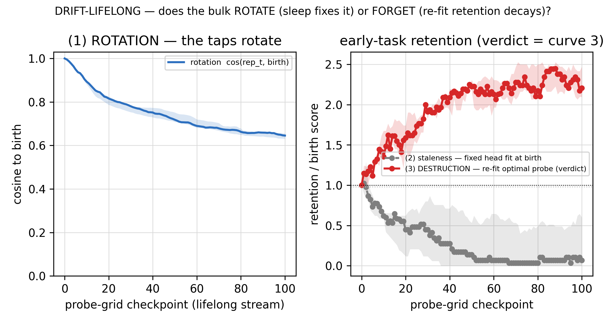

# Stage 2 — the GD namer: putting our names on the cheap brain (Phases 7–9, the report)

> The executive narrative of Stage 2 of draft 6.0 — the arc that takes the frozen, noise-hardened SCFF cheap brain
> and builds the **~20% "namer"** that maps its features to our labels: **P7** picks *what* the namer is (and it is
> **not gradient descent**), **P8** turns both brains on together for the first time and meters *when it fires and
> what it truly costs*, and **P9** tunes the lifelong maintenance loop against internal signals only and **freezes
> the object** at a commit hash. Stage 1 made a brain that *organizes* the world; Stage 2 makes it *answer in our
> language* — and then locks it. This is the last component of the neocortex brain.
>
> **✅ The Stage-2 build is COMPLETE and the object is FROZEN** (P7–P9 ran 2026-07-02; freeze commit `59d2720`).
> What happened *after* the freeze — the fair race against a tuned BP+replay baseline (Phase 10, **S14**) and the
> real-data + scale limit map (Phase 11, **S15**) — is deliberately **not this document**: those phases decide
> nothing; they *judge* the frozen object, and they are told as one arc in
> [`validation-report.md`](validation-report.md). This report is the **decision record in story form** — every
> section below ends in a committed knob, an overturned guess, or a struck alternative. The discipline that splits
> the two documents: **freeze in P9, judge in P10.**
>
> Written for the same reader as [`stage1-report.md`](stage1-report.md): each phase's section here carries the full
> story — the question, the rungs actually run, the key numbers and figures, what the sims overturned, and the
> decision — so the per-phase reports are for *auditing* (every figure, threats, cards), not for basic
> understanding. The plan this executes: [`stage2-design.md`](stage2-design.md). The frozen cell it builds on:
> [`phase6-final-architecture.md`](phase6-final-architecture.md). The committed design record:
> [`../idea/main.ideas.v1.md`](../idea/main.ideas.v1.md). Terms and metrics: [`ref-report/`](ref-report/README.md).

---

## 1 · What Stage 2 is — the one-page primer

Draft 6.0 is two brains on one analog substrate. A cheap, unsupervised **SCFF cortex** (~80%) organizes the world for
free — label-free, local, forward-only. Stage 1 built, characterized, closed out, and noise-hardened it: the committed
cell is **`NoiseAugContrast`** (`SCFFContrastOverlap` temp0.2 / w2, L12 bulk, no residual, + one iid-noise-augmented
InfoNCE view). It composes the depth a task needs, reads it cheaply, wins the continual regime, and survives the noise
it will meet on silicon. **But it never learned our labels.** It sorts the world into "kinds of things"; it does not
know which kind is a *3* and which is a *7*.

**Stage 2 is the part that does — the precise ~20% namer, read-only on the frozen bulk.** Every knob from here on is
on this back, not the SCFF front (which is frozen *to GD* and never re-trained by it). The split is the project's
founding bet: **direction is the one expensive thing in learning**, so we pay for it *once*, where it counts — putting
the names on — and get everything else for free.

**Why Stage 2 is smaller than five-phases-of-SCFF had any right to be.** Because the SCFF bulk is frozen to GD, the
namer's learning is **reservoir/ELM-like** — a trained readout on fixed features is a **(near-)convex regression**
with no bad local minima and no cross-layer credit chain. There is no heavy-optimizer zoo to build; the simplest thing
converges. Two hedges keep "small" from becoming "sloppy," and both are *tested*, not asserted: **(a)** "convex" names
the *regression*, not the deployed readout's **substrate cost** (the softmax / normalizer / Gram-solve is a non-free
digital block — that is Phase 8's meter, so every "80/20" number is a proxy until then); **(b)** we are
reservoir-*like*, not a reservoir proper (trained-then-frozen, not random), so we inherit the readout convexity but
**not** free noise-tolerance — and the bulk's value over a random projection must be *proven*, not assumed (P7.0's
RanDumb control exists for exactly this).

**One kickoff decision governs the whole stage: boosting is dead.** The old N3 plan chained `[SCFF → GD-checkpoint]`
residual boosting blocks; it is dropped. A boosting *chain* feeds each block's fast, supervised, GD-corrected residual
into the *next* block's SCFF input — SCFF sees a moving target and its stable unsupervised base is destroyed. The
wall, now across all of Stage 2: **anything between or under SCFF must be unsupervised, or slow enough not to shift
everything at once; fast + supervised + upstream-of-SCFF breaks the base.** So the committed era is **one L12 SCFF
bulk + read-only heads** — the "two GD organs" collapse to **one: the readout.**

**The three build phases** (re-planned 2026-07-02 post-P8 — the old single "P9 maintenance + owed baselines" split
into P9 *close* + P10 *validate*, precisely so no tuning ever sees the baseline):

- **P7 — the readout.** Bake off every candidate namer on the frozen bulk; commit one. **✓ §3.**
- **P8 — the economy gate + the cost meter.** Both brains live for the first time; the Ch7 learning-gate; the honest
  hardware-meaningful cost meter that replaces the op-count proxy. **✓ §4.**
- **P9 — close & *freeze* the maintenance loop.** Tune the genuinely-open lifelong knobs against *internal* signals
  only, then lock the object. **✓ §5 — frozen.**

---

## 2 · The arc — one thread

Stage 1's arc was "we kept being right about *where* the cell wins and wrong about *how*." Stage 2 has its own
thread, and it has a shape:

> **The "20% GD" is a role, not a method — and the economy that pays for it is a *safety* mechanism, not just a cost
> saver.** We expected to pay gradient descent for the precise brain and to pay a forgetting cost to stay
> direction-pure. The sims said neither: the best namer uses **no gradient at all** and wins by reading a
> *magnitude*; and when we ran both brains live, the disciplined drift-gated economy turned out **cheaper *and*
> safer** than firing the namer every step — because firing more chases the recency-skewed stream and forgets more.
> The cheap answer was also the safe one.

The connective tissue is Stage 1's recurring fault, **density ≠ class**, wearing its 7th, 8th, and 9th coats. The
project's spine says *read the class direction, never a magnitude* — and Stage 2 kept meeting places where the
tempting move was a magnitude and the honest move was to measure which one actually works:

- **P7 (7th coat):** the direction-pure **cosine** head — the head the spine seemed to hand us — is *sub-competitive*
  on the frozen bulk; the committed namer reads a magnitude yet is recency-robust **because it has no trained softmax
  weights to inflate.** Recency-robustness ≠ direction-reading. The spine bent, numerically, and we named the tension
  rather than resolving it silently toward accuracy.
- **P8 (8th coat):** the drift *trigger* is the spine's crown — the class-**direction** tap-drift signal leads the
  labeled error by ~8 steps and stays invariant to a nuisance covariate, while the magnitude-of-shift null false-fires
  on 94% of nuisance steps. Here direction *wins*, measurably.
- **P9 (9th coat):** eviction keeps class *directions* (CBRS) not the dense mean; the read-side calibration re-anchors
  a *direction* (prototypes re-forwarded under shift), never an entropy/confidence magnitude.

The spine is not a slogan that always wins; it is a measurement axis that sometimes bends — and saying *which* is
what makes the record credible.

---

## 3 · Phase 7 — the readout → *the 20% is NOT gradient descent* 🔥

*Ran 2026-07-02, P7.0→P7.6; seeds `[42,137,271,314,1729]`; device under test = the frozen Phase-6 cell; GD reads its
taps, never writes them.*

**The frame.** The author's kickoff reframe governs the phase: the 20% is not gradient-descent-as-religion; it is the
***cheat-everything* half.** The namer may be anything that maps frozen features → labels cheaply and
continual-safely — a gradient head, a closed-form prototype, a streaming recursive-least-squares classifier. So Phase
7 is a **bake-off of namers** — nine heads (linear-softmax · cosine-ncm / cosine-softmax · NCM · SLDA · FeCAM ·
RanPAC · RLS · GKEAL · MLP), each at a val-selected knob — refereed by three axes: **(1) accuracy × forgetting
(BWT)**; **(2) the spine** — does the verdict track class *direction* or a *magnitude*, measured as argmax-flip under
a per-class norm nuisance; **(3) the un-skippable A6 continual-safety gate** — a namer that dents the sleep-recovery
continual win is reverted, whatever its accuracy. Cost is **descriptive-only** (never a tie-break; the real substrate
meter is Phase 8).

**The bench (P7.0) — floor, ceiling, and the skeptic.** Seven guards passed (head-port equivalences, a
finite-difference gradient check, the harness and stream-cache proven bit-for-bit against the old hard-coded paths —
the sign/direction-bug antidote, this project's recurring silent killer). References on the synthetic continual home:
convex floor (linear on all-tap) **0.608**, small MLP 0.642, tuned static-BP ceiling 0.866 — the large floor-to-BP gap
*is* the P4 identity at the naming stage (a continual learner, not a static competitor). Then the **RanDumb skeptic
control**, the one genuine "uh-oh" run un-pre-excused: OURS-bulk vs a fair 2000-D random ReLU expansion. Against
**random-from-pixels** (raw input) OURS wins on every head — the 80% earns its keep. Against **random-from-taps** (a
random remix of OURS's own features) a plain *linear* namer **ties** (0.608 vs 0.606 — the expected ELM/reservoir
effect: a random expansion of good features is itself a good feature map) while the **ridge** head separates them
decisively (0.579 vs 0.385 — the structured taps carry second-moment information a random remix destroys). Both
readings banked honestly; the linear-namer tie is carried forward as a flag, not a footnote.

**The bake-off (P7.1) — the headline.**

*The headline, two panels. **Left** — the accuracy×forgetting frontier: **RanPAC** sits at the top-right in a
statistical three-way tie with the gradient MLP and the un-projected RLS (continual AA 0.617 / 0.623 / 0.604,
mutually within-noise) — and **two of the top three use no gradient**; the direction-pure cosine-softmax and the
max-magnitude FeCAM fall below, and the bare prototype heads collapse sub-floor (greyed). **Right** — the scorecard:
RanPAC carries the highest static accuracy (0.647), while only the two **cosine** heads are perfectly spine-clean
(argmax-flip 0). The whole phase is this one picture: the frontier peaks *off* the direction-pure corner — the spine
bends — but it bends toward a **no-gradient** winner.*

The frontier top is a statistical three-way tie **led from the no-gradient corner**; RanPAC — a frozen random ReLU
projection → running-Gram ridge prototype `W = (G+λI)⁻¹M`, no gradient, streaming — takes it on the spine tie-break
(most spine-clean of the tied cluster, argmax-flip 0.54 vs MLP 0.60 vs SLDA 0.89) and the highest static accuracy.
The projection earns its keep over plain RLS (+0.047, 5/5). **Because two of the tied top three are no-gradient, the
precise 20% brain names the world with no backward pass at all — the "20% GD" is a role, not a method.**

**The spine bends — numerically, with the mechanism named.** The pinned cut: Δ = paired-median[AA(RanPAC) −
AA(cosine-softmax)] = **+0.128** (real, 5/5, ≫ δ=0.02) → *magnitude-wins-spine-bends*. Only the cosine heads are
direction-pure (argmax-flip **0.000**), but they sit below the frontier. Why: **(i)** the all-tap SCFF space is
*anisotropic* — an angle-only metric leaves structure on the table (P7.2 measures exactly this); **(ii)** the
no-gradient winners dodge the continual recency bias not by reading direction but by **having no trained softmax
weights to inflate** — a magnitude head can be continual-safe for the "wrong" (non-spine) reason, and here it is.

**The closed-form cliff (P7.2) — anisotropy, not multimodality.** Is the frozen tap space multi-modal (one prototype
underfits → a non-convex mixture looms)? Decided on the *natural* tap space (digits): per-class features are
**unimodal** (n-modes 1.0), and the accuracy lever is a **tied covariance** — NCM (one Euclidean mean) 0.754 →
**SLDA 0.946** (+0.19), closed-form; per-class covariance (FeCAM) *overfits* (0.921), and a non-convex mixture
*hurts* (−0.12). The synthetic multi-blob sanity task inverts as it must (only kernel/mixture rescue a provably
multimodal task), so the ladder apparatus is trusted. **The convex/analytic story survives** — the plan's "non-convex
mixture or bust" guess was wrong; a shared whitening is the escape, and it stays closed-form.

**The imbalance guard (P7.3) — cbrs, not AIR (a design guess overturned).** Under an induced bursty, recency-skewed
bounded buffer, every head over-predicts recent classes (the trained cosine-softmax worst, recency-gap +0.659 — the
classic BiC/WA magnitude bias). The guard the plan expected to ship — **AIR**, the analytic head-side re-weighting —
**over-corrects** (SLDA's recent classes crater to 0). The reliable fix is **class-balanced reservoir sampling
(cbrs, buffer-side, family-agnostic)**: RanPAC's gap collapses +0.495 → **+0.013** while old-class accuracy lifts
0.18 → 0.56. **Re-balancing the input beats re-weighting the output.**

**The A6 gate (P7.4) — the mechanism made empirical.** Every candidate ran the continual-safety harness vs a
floor-head-on-the-same-bulk baseline, paired-sign veto: **RanPAC PASSES** (+0.023 vs floor, 0/5 negative); SLDA, MLP,
cosine-ncm, RLS pass; **cosine-softmax STRUCK** (5/5) and **FeCAM STRUCK** (5/5). The decisive control:
**cosine-ncm passes while cosine-softmax — the *same angle metric* — is struck**, so the recency dent comes from the
**trained weights**, not the readout's geometry. The no-gradient heads are continual-safe *by construction* — evidence
banked for the committed namer.

**Natural confirmation (P7.5) — real, and honestly graded.** On digits the analytic heads cluster at the top with
**RanPAC #1 (0.949, BWT −0.012)** and the spine-price shrinks **4×** (−0.128 → −0.036; cosine-softmax competitive at
0.913). On CIFAR-flat *every* head collapses to ~0.3 — the established SCFF depth-wall: a **bulk** failure, not a
namer failure — the ordering compresses, RanPAC's projection of near-useless features actively hurts (0.265 < SLDA
0.325), and the spine tension vanishes. The honest lesson: **the namer's value tracks the bulk's**, and on depth-less
inputs the cheaper SLDA is more robust.

**The assembled head (P7.6) + the verdict.** RanPAC + cbrs end-to-end **holds** vs solo (AA 0.617 → 0.627, BWT
−0.157 → −0.132 — both improve; closed-form heads have no optimizer interaction to destabilize, so the levers stack
by construction). **Committed: RanPAC + class-balanced-reservoir guard.** One caveat flagged forward with teeth: by
the cost proxy, RanPAC's 2000-D projection is **~200× SLDA's cost**, and SLDA sits within-noise on the frontier,
passes the gate, and is more robust on depth-less inputs — **if the substrate meter makes the projection prohibitive,
SLDA is the committed fallback.** (Phase 8 prices it — and takes the fallback.) Decision-record deltas: **N3
superseded** (single frozen bulk + read-only namer), **S4 collapses to one organ**, **S9 extended** with the
committed head, plus the new supporting decision — *the namer is a closed-form/streaming analytic head.* **(S11.)**
→ [full Phase 7 report](phase7/phase7-report.md) · [front door](phase7/README.md).

---

## 4 · Phase 8 — the economy → *both brains live: cheaper AND safer, metered* 🔥

*Ran 2026-07-02, P8.0→P8.6 + the P8.7 substrate extension; all seven guards bit-exact.*

**What Phase 8 had to prove.** For seven phases the two brains were characterized *apart* — every namer number so far
was on a bulk frozen for the bake-off. The reframe that defines the phase (the author's call): **SCFF is
unsupervised, so it never forgets — you can train it forward-only on every input forever. The only problem is the
readout: the more input SCFF sees, the more its class representation drifts, and a namer fit against where the
clusters *used to be* slides off.** So Phase 8 turns **both brains on together for the first time** — SCFF live
(learning forward-only on every input), the namer tracking the drifting taps through a cheap awake/sleep economy —
and answers four questions: when does the namer fire (gate + trigger), how often does it sleep and on how much
history (cadence), what does it truly cost (the meter), and does the live loop keep the A6 win (the existential
check). The one genuinely new primitive: a **streaming `partial_fit`** for the namer (a running Gram `(G, M)`),
guarded ≡ a batch fit to 4e-15 — the chip maintains the namer's statistics as a running second moment, not a
from-scratch re-solve.

**The bench (P8.0) — the problem is well-posed.** Seven guards bit-exact (the live loop reproduces the frozen
harness choreography to 0.0; "frozen ≡ P7" pinned, not assumed). Two framing reads: **the bulk drifts but does not
collapse** (fixed-probe cosine stays in [0.63, 1.00] — the map moves, which is the whole problem, but never dies);
and **the detection problem is well-posed, and the spine is visible in it** — at a real class onset the
class-direction tap signal rises 1.38× while the error barely moves (1.02× — error *lags*, it needs accumulated
mistakes); at a *nuisance* onset (covariate shift, no class change) the direction signal is invariant (0.84×) while
the magnitude-of-shift null **spikes 10×.**

**The gate (P8.1).** Six gates raced. Every gate holds accuracy at the oracle level (the sleep cadence already
carries retention; the awake gate's job is catching harmful mid-stream stalls), so the frontier is decided on
fire-cost × false-alarm: **DDM** (the standard two-threshold error detector) sits at the clean knee — FAR **0.000**
on the nuisance segment, firing ~0.3% of steps (ADWIN ties it). **absolute-θ is struck**: it false-fires on the
nuisance covariate (FAR 0.042) — a fixed loss threshold is a magnitude leak, exactly the spine's warning.

**The trigger (P8.2) — the spine's crown.** Does a *label-free* class-direction tap-drift signal beat the labeled
error? Decisively:

*Mean-time-to-detect × false-alarm rate. **tap-drift-direction**: MTD **6** vs the error's **14** — it leads by ~8
steps — at excess-FAR **0.000** (DriftLens, the literature's label-free reference, lands exactly on it). The
**magnitude null**: MTD 6.5 but FAR **0.938** — it fires on nearly every nuisance step. Reading the magnitude of
shift means reading the nuisance; reading the class direction sees real drift early and ignores it. (n=5.)*

SCFF's *representation* drifts before the readout's *error* rises, so a direction watcher sees the onset first —
density ≠ class, made a measurement. **Committed: DDM gate on the class-direction tap-drift trigger** — a
*direction*-triggered error detector at two timescales. (This is also the north-star seed built for real: the gate is
the *halt*, and it is a direction, never a confidence magnitude — a confidence gate would be torn out later.)

**The cadence (P8.3).** Sleep re-forwards the raw-prototype LUT through the *current* SCFF and re-solves on fresh,
consistent features. Three findings: **full history is load-bearing** (truncate to a quarter and AA collapses
0.448 → 0.356 — old prototypes re-forwarded *now* still define class boundaries); **regular cadence beats
boundary-aligned sleep** (a design guess overturned: worst-point BWT 0.000 on every regular grid vs **−0.439** for
oracle-boundary sleep — the worst mid-stream point falls *inside* a segment, where a grid samples and a boundary
sleep misses); **EMA-decay buys nothing** (the re-forward already re-consolidates from scratch). Committed:
**grid-8 / full history / λ_ema 1.0** — flagged *drift-rate-conditional*, a flag that comes due in P9.

**The meter (P8.4) — SLDA displaces RanPAC.** A behavioral ADC-centred macro-model (NeuroSim / ISAAC / PUMA level,
params + citations logged, **not SPICE**) prices Phase 7's caveat: **SLDA names the world 69× cheaper than RanPAC**
— RanPAC's cost is self-inflicted by its own width (a 2000-D projection read through the ADC + a 2000² Gram solve,
vs SLDA in the native tap space) — and, freshly measured live, **SLDA ties/beats RanPAC's accuracy** (ΔAA −0.015 in
SLDA's favor; the projection bought nothing on the live drift). Robust across 4–10 ADC bits (61–66×); the ADC term
dominates within each head, as the CIM literature predicts. **Committed deployed head: SLDA** (RanPAC kept as the
accuracy/spine reference). The P7 fallback, taken on the meter's word.

**The metered 80/20 (P8.5).** With the gate on, the GD namer is **12.1% of total metered energy** (GD-share 0.121 ≤
0.25) — the first time the founding "80/20" is a hardware number, not an op-count proxy. Turn the gate off and the
namer balloons to **77.8%**: **the gate *creates* the split.** Against BP+replay at matched retention on the same
substrate table, OURS draws **0.501×** the energy — BP pays a 3× forward + 2× ADC backward *every* step plus replay;
OURS pays one forward + a rare solve.

**The existential check (P8.6) — firing more forgets more.** Every committed knob live at once, BWT measured
**pre-sleep at the worst mid-stream point** (post-sleep would hide the awake gate's forgetting):

*The committed drift-gated economy holds worst-point (pre-sleep) BWT at **0.000** — identical to the known-boundary
oracle — in 5/5 seeds at GD-share **0.155**, while the profligate **always-pay** loop (namer every step) **forgets**
(worst-BWT −0.137) at GD-share 0.747. Firing more chases the recency-skewed stream and overwrites prototypes for
classes the stream stopped showing. The gate is a **safety mechanism**, not just a cost saver — the disciplined
economy is cheaper *and* safer. (n=5, live CI+nuisance.)*

**LIVE-SAFE** (0/5 seeds regress vs oracle, AA matches oracle). The crux inversion is the phase's second overturned
guess: **more GD is worse, not better.** The live-vs-frozen accuracy gap (0.447 vs the 0.614 block-mode promise) is
**task difficulty, not forgetting** (worst-BWT 0.000) — the live stream with gradual onsets + nuisance is strictly
harder than clean block-mode continual.

**Why analog (P8.7 — the substrate ablation, for the professor's bluntest question: *why not a GPU?*).** Re-meter the
exact committed loop and the same fair BP+replay baseline on a **digital** (von-Neumann / GPU-class) substrate — no
ADC, real 8-bit digital MACs (Horowitz-anchored, arithmetic-only: the *most generous* assumption to digital), matched
precision. The full 2×2: **the chip (OURS-analog, 3.4e7 pJ) is 15.4× cheaper than the conventional baseline
(GD-on-digital, 5.2e8 pJ)**, and the win factors cleanly — **5.4× is the substrate** (compute-in-memory: the ~8e8
SCFF MACs are near-free in the crossbar while a digital machine pays for every one, and there are ~75× more MACs than
ADC reads) **× 2.9× is the algorithm** (the gated forward-only loop vs BP+replay on the *same* digital substrate).
Two honesty checks: the 80/20 is **substrate-independent** (GD-share 0.11–0.16 on either — the economy is a property
of the op-schedule, not the physics), and the analog advantage is a **floor, not a knife-edge** (≥2.7× even below
Horowitz arithmetic-only; grows past 50× once the memory wall is counted).

**Committed (the economy):** deployed head **SLDA** · awake gate **DDM** · trigger **class-direction tap-drift** ·
sleep **grid-8 / full history / λ_ema 1.0** · guard **cbrs** · envelope unchanged (GD reads taps, never writes SCFF).
Deltas: **S6 resolved** (the gate), **S11's cost caveat resolved** (SLDA), the **metered 80/20** replaces every proxy
tag, **S7 extended** (the cadence), plus the new supporting decision — *the live two-brain economy is continual-safe,
and the gate is a safety mechanism.* **(S12.)** → [full Phase 8 report](phase8/phase8-report.md) ·
[front door](phase8/README.md).

---

## 5 · Phase 9 — close & *freeze* the maintenance loop 🔒

*Ran 2026-07-02, P9.0→P9.5; all nine guards bit-exact; every cut against an **internal** reference (the
known-boundary oracle, the always-pay ceiling, the measured drift) — never the Phase-10 baseline. That is the
phase's whole discipline: **freeze in P9, judge in P10.***

**What Phase 9 had to do.** Phase 8 shipped a working live loop — but on a **single-pass** stream, with five things
measured-not-tuned or outright assumed. Phase 9 tunes them on a genuinely **lifelong** stream (many revisit cycles,
so drift accumulates), then **freezes the object** so Phase 10 can race it without the accusation "you tuned against
the baseline." The freeze is the deliverable as much as the tuning: a commit hash proving the loop was locked before
the fight.

**P9.0 — the risk gate: rotation, not forgetting.** The founding claim "SCFF doesn't forget, it only drifts, so a
periodic sleep re-solve is enough" had never been measured — and it needs the right instrument, because a *frozen*
linear probe is basis-dependent: a pure rotation of the feature frame tanks it and reads as "forgetting" even when
nothing was lost. The verdict keys on an optimal probe **re-fit** on the current bulk, scored on held-out early-task
data (the Davari protocol, rotation factored out):

*The three curves separate cleanly. The cosine-to-birth settles at ~0.65 (the taps rotate ~36%, never collapsing);
the **frozen** probe (staleness) rots toward 0 — a fixed head loses a rotating world, which is exactly what sleep
exists to fix; but the **re-fit** probe (destruction) stays at or above its birth score across the whole stream
(min 0.966, final 2.2×) — the early-task information is *preserved and enriched*, not destroyed. **On a lifelong
stream the bulk rotates but does not forget.** (n=5.)*

The founding cheap-replay assumption is discharged as a *measurement*; N2 is *not mandatory*; and P9.0 flags one gap
for the ladder to close: the committed loop's worst-BWT (−0.317) sits 0.028 below the oracle's.

**P9.1 — N2 struck.** The last open decision-record knob (EMA-view slow coordination). Its only job would be to make
the namer chase the rotation less often — sleep sparser, or improve worst-BWT, without a plasticity tax. Neither arm
does: no arm sleeps sparser, no arm improves worst-BWT, and EMA-view *worsens* it (−0.383 vs −0.317) by introducing a
train/eval frame mismatch — the namer consolidates in a frame the eval has already moved past. The drift is
rotation-only and the cadence already tracks it, so **N2 has nothing to grip. Struck.**

**P9.2 — keep all-tap consolidation.** Could the sleep re-fit run at the P5 short reader's depth (12–52× cheaper on
the solve)? No: truncated readers forget materially more at the worst point (−0.511 / −0.373 vs all-tap −0.317) —
at the worst mid-stream moment, right after a revisit shifts class emphasis, the short reader lacks the capacity to
keep old and new classes separable under the rotating frame. **All-tap's capacity is the margin that absorbs the
drift** (S7 extended — depth *does* matter, in the direction "keep it").

**P9.3 — CBRS eviction.** A truly lifelong stream forces a **bounded, evicting** LUT — the one thing P8 never had.
At a pressure-point cap, no bounded policy matches the unbounded oracle (a property of the *cap*, not the policy —
the scaling law: the holding cap grows with class count). Among bounded policies **CBRS is best-bounded**: it ties
the herding null (within noise) and decisively beats reservoir/recency (−0.400 vs −0.607 / −0.707) — CBRS keeps
prototypes balanced across classes, so it spans the class *directions* even at a tight budget, while recency-skewed
policies narrow the old directions and forget. (Herding's tie is a *buffer-spine null* — density ≈ class at the
buffer on this task — named as such, not claimed as a spine win.)

**P9.4 — the read-side residual, resolved by the sleep mechanism itself.** Phase 6's one scoped-out channel — the
input-transducer **directional** offset SCFF's per-sample norm cannot remove — really dents the committed loop (the
earn-its-place gate fires: retention −0.115, 5/5; worst seed 0.504). The defense is **prototype re-anchoring**:
re-forward the raw LUT through the *current* bulk under the *same* device offset, producing prototypes that are
drift-free and shift-*consistent* with the read. Retention recovers to **0.986** (every seed ≥ 0.977). Two things
worth savoring: it is the plan's **own sleep mechanism applied under shift** — no new organ; and the planned
SLDA-covariance fallback was **never needed** (a design guess overturned). The calibration is direction-grounded —
the prototypes move *with* the class axis, never an entropy/confidence magnitude. The Phase-6 "scoped-YES →
Stage-2 read-side" debt is **discharged.**

**P9.5 — assemble + FREEZE: the freeze caught the cadence.** Four of five knobs resolved to *keep* the committed
loop, so the assembled object is the P8.6 shipped loop bit-for-bit — and **the first assemble failed the freeze,
honestly**: at the inherited P8 grid-8 cadence it failed the worst-point oracle-veto in **2/5 seeds** (worst-BWT
−0.517 / −0.439). On a lifelong **revisit** stream, sparse sleep lets the pre-sleep state fall into deep troughs the
single-pass P8 stream never formed. The live diagnosis blamed the committed gate's fire-timing — unfixable in P9
scope; the cadence re-confirm **overturned that too**: the lever was *frequency*, a P9-legal knob (frequent
consolidation keeps the pre-sleep state fresh, so the troughs never form and fire-timing is masked).

| cadence | veto (neg/5) | AA | GD-share | worst-BWT | freeze |
| --- | --- | --- | --- | --- | --- |
| grid-2 | 0 | 0.495 | 0.215 | −0.033 | passes (no safer than grid-4, costlier) |
| **grid-4 (committed — the knee)** | **0** | **0.494** | **0.178** | **−0.028** | **passes — best worst-BWT of the frontier** |
| grid-5 | 0 | 0.495 | 0.166 | −0.039 | passes (cheaper, near-flat) |
| grid-6 | 0 | 0.495 | 0.153 | −0.087 | passes (razor tie) |
| grid-8 (P8, single-pass) | 2 | 0.494 | 0.138 | −0.317 | **fails veto** |
| grid-16 | 0 | 0.458 | 0.107 | −0.367 | **fails AA-held** |

The freeze band is grid-2 → grid-6; **grid-4 is the knee** (best absolute worst-BWT of the whole frontier); the two
failures fall on *different* axes — grid-8 fails the *veto* (sparse-sleep troughs), grid-16 fails *AA-held*
(under-consolidation, the "paid-less-compute" cliff). The re-freeze passes all three cuts: worst-BWT **−0.028**
(ties oracle, 0/5), AA **0.494**, GD-share **0.178 ≤ 0.25** — an order of magnitude safer at the worst point than
the shipped grid-8 loop on the lifelong stream.

**The object is FROZEN** (commit `59d2720`): `NoiseAugContrast` bulk (temp0.2/w2, L12) · **SLDA** namer ·
**DDM / error-EMA** gate on the **class-direction tap-drift** trigger · **N2 struck** · **all-tap** consolidation ·
**CBRS** eviction · **proto-reanchor** read-side defense · **grid-4** lifelong cadence · envelope unchanged (GD reads
taps, never writes SCFF). Deltas: N2 resolved (struck), S7 extended, the bulk-drift assumption *measured*, eviction =
CBRS, the residual resolved. **(S13.)** → [full Phase 9 report](phase9/phase9-report.md) ·
[front door](phase9/README.md).

---

## 6 · The decision record (what Stage 2 set)

The Stage-2 spine was sketched in [`stage2-design.md`](stage2-design.md); the deltas are banked to
[`../idea/main.ideas.v1.md`](../idea/main.ideas.v1.md) — flagged, never silently applied, and never retro-editing the
frozen architecture snapshots. *(The trial deltas — **S14** from Phase 10 and **S15** from Phase 11 — are banked in
[`validation-report.md`](validation-report.md), where the measurements live.)*

| Decision / knob | Committed as | Set / owed by | Now |
| --- | --- | --- | --- |
| GD = residual boosting blocks | **N3** | superseded at P7 close | _**S11**: "single frozen bulk + read-only namer" — boosting dropped (the forward-leak wall)_ |
| Two GD organs (interface / output) | **S4** | collapsed at P7 close | _**S11**: collapses to **one** — the namer (Interface-GD retired with the blocks)_ |
| Readout = fixed short-stack placement | **S9** | extended at P7 close | _**S11**: extended with the committed *head* (**RanPAC**, analytic), not just the placement_ |
| The namer is a *method* (gradient descent) | — (implicit) | overturned at P7 | _**S11 new supporting decision**: the namer is a **closed-form/streaming analytic head** — "20% GD" is a role, not a method_ |
| Threshold-gated learning (Ch7 gate) | **S6** | **resolved at P8 close** | _**S12**: the awake gate is **DDM** on a **class-direction tap-drift** trigger (magnitude-of-shift is the false-fire null)_ |
| The committed head's cost | **S11 caveat** | **resolved at P8 close** | _**S12**: metered E-ratio 69× → **commit SLDA** as the deployed namer (RanPAC kept as the accuracy/spine reference)_ |
| Sleep consolidation cadence | **S7** | **extended at P8, re-confirmed at P9** | _**S12/S13**: grid-8 (single-pass) → **grid-4** (lifelong revisit; the freeze caught it); full LUT history load-bearing; λ_ema 1.0_ |
| The "80/20" cost number | proxy (Stage-1) | **metered at P8 close** | _**S12**: real — GD-share **0.121** with the gate on (0.778 off); bp_ratio 0.501 vs BP+replay_ |
| Why analog (substrate vs algorithm) | unquantified | **decomposed at P8.7** | _**S12 note**: the chip is **15.4× cheaper** than conventional GD-on-digital = **5.4× substrate (CIM)** × **2.9× algorithm (80/20)**; the analog advantage is a floor (behavioral, Horowitz-anchored)_ |
| The live two-brain loop is continual-safe | — (untested) | **set at P8 close** | _**S12 new supporting decision**: LIVE-SAFE (worst-BWT 0.000, 0/5 regress); the gate is a **safety** mechanism (more GD forgets more)_ |
| EMA-view slow coordination | **N2** | **resolved at P9 close** | _**S13**: **STRUCK** — the drift is rotation-only and already tracked, so N2 has nothing to grip (EMA-view *worsens* BWT)_ |
| The bulk-drift cheapness assumption | founding (implicit) | **measured at P9 close** | _**S13**: the bulk **rotates but does not forget** (re-fit probe holds ≥ birth; Davari protocol) — cheap-replay holds_ |
| Consolidation depth + bounded-LUT eviction | — (open) | **set at P9 close** | _**S13**: **all-tap** consolidation (trunc forgets more) + **CBRS** eviction (best-bounded; cap grows with #classes)_ |
| The read-side noise residual | S10 residual | **resolved at P9 close** | _**S13**: **proto-reanchor** (re-forward the raw LUT under shift — direction-grounded, no covariance) recovers 0.79→0.99_ |
| SCFF carries a noise-aware objective | **S10** | Phase 6 (Stage-1 ext) | _done — the frozen cell already carries it_ |

---

## 7 · The frozen object (end of the Stage-2 build)

The committed neocortex loop, locked at `59d2720`:

- **The cheap brain (80%):** `NoiseAugContrast` — the Stage-1 SCFF cell (contrast/InfoNCE temp 0.2, window w2, L12
  bulk, noise-augmented view), learning **live, forward-only, on every input.** It rotates; it does not forget
  (P9.0, measured).
- **The namer (20%):** **SLDA** — closed-form, streaming (`partial_fit` running Gram), no gradient, no backward
  pass. Reads all taps; never writes SCFF.
- **The economy:** the **DDM** awake gate on the **class-direction tap-drift** trigger (label-free, leads the error,
  nuisance-invariant); metered GD-share **0.121–0.178 ≤ 0.25** — and the gate is a *safety* mechanism (always-pay
  forgets, −0.137).
- **The maintenance loop:** **grid-4** sleep over a bounded **CBRS** prototype LUT (full history, all-tap re-fit)
  + **proto-reanchor** as the read-side noise defense. Worst-point BWT **−0.028** (ties the boundary oracle) at AA
  0.494 on the lifelong home.

Every piece is there because a measurement put it there, and three of the plan's own guesses died on the way (AIR,
boundary-aligned sleep, the covariance re-fit) — the record of *which* guesses died is in §3–§5, and it is what makes
the surviving object credible.

---

## 8 · Honest scope of the Stage-2 build

- **All three build phases are done and the object is frozen.** What Stage 2 does **not** contain is its own
  judgment: the fair same-budget **BP+replay accuracy** fight that Phases 4/8/9 each carried forward as a debt, the
  natural multi-class number, the noise showcase, real data, and scale — all of it is the trial, told in
  [`validation-report.md`](validation-report.md) (P10 → **S14**, P11 → **S15**). The one-line spoiler, so this report
  is honest about where its story lands: the verdict is a **substrate-native continual learner** — ties the tuned ER
  on the continual home, trails on easy static data, wins continual safety ≈10×, noise on every channel, real
  sensor-drift (gas), and the substrate energy floor — *refined, not inflated.*
- **Every number here is pre-trial.** P8's bp_ratio (0.501) is vs BP+replay at matched *retention* on the energy
  axis — the *accuracy* fight was deliberately deferred to the frozen-object trial. P9's cuts are against internal
  oracles only. **And the headline energy numbers in §4 (15.4× vs GD-on-digital, ≈half the energy vs the BP+replay it
  was metered on) are re-measured in Phase 10 against a *smaller, harder-tuned* ER — which turns the *same-substrate*
  comparison into a 1.5× *loss*, so the energy edge is banked as *substrate-realized*, not algorithmic.** Don't leave
  this stage with "15.4× / ≈half" as the last word; the honest close-out is in [`validation-report.md`](validation-report.md).
- **The meter is behavioral** — relative-pJ, ADC-centred, Horowitz-anchored; **not SPICE.** The analog factor is a
  meter-structural floor; the load-bearing energy cut is same-substrate.
- **Small, partly synthetic tasks** — the continual home, digits, CIFAR-flat. The trial (P10–11) is where natural
  data, real streams, and scale enter.
- **Behavioral simulation only** — numpy ideal floats + Phase 6's behavioral analog-noise model; no SPICE, no device
  physics, no fabrication.
- **The committed cadence is drift-rate-conditional** — grid-4 is the knee *for this revisit density*; the cadence
  cost-frontier becomes a declared axis in the trial.

---

## 9 · The north-star hand-off (threaded, not a phase)

Stage 2 touches the north star — the recurrent, lifelong-learning prefrontal↔hippocampus loop where *correctness is a
self-generated feeling* — only as a **tie-break bias**, so the later brain can reuse Stage-2 signals instead of
tearing them out. The design's seed was: the gate is the *halt*, and the readout's **cosine margin** (a direction,
not a confidence magnitude) is *the feeling.* Phase 7 sharpened this honestly: the committed namer reads a
**magnitude**, and the direction-pure cosine head is sub-competitive as a *classifier* — so the "feeling" is **not**
the deployed head. But the cosine margin survives as an **available, perfectly spine-clean direction signal**
(argmax-flip 0), decoupled from the classifier: the recurrent brain can read the *angle* for its self-generated
confidence even while the *names* come from the magnitude head. The gate half of the seed was **built exactly as
seeded** in Phase 8: the committed trigger is a class-direction tap-drift signal, never a confidence magnitude (why
P5 struck the adaptive exit) — and the sims confirmed it both *leads* the error and stays nuisance-invariant while
the magnitude null false-fires. Light touch, held to a tie-break — **simple intelligence first.**

---

## 10 · What came next

**The build is done; the trial came next.** The frozen object walked into two courtrooms untouched: **Phase 10**
raced it against a fair, budgeted, tuned BP+replay field and banked the honest Pareto (**S14**); **Phase 11** took it
onto eight real arenas and scale and drew the **LIMIT-MAP** (**S15**). Both are told in
[`validation-report.md`](validation-report.md). After the trial: the **analog-realism layer** (SPICE / PVT — the
absolute-Joule and device-physics the behavioral meter cannot give, inheriting the named directional/ADC residual),
and, beyond the numbered phases, the recurrent lifelong brain — the north star. *Simple intelligence first.*

---

## Reading guide

**If you read only one file for the model:** [`phase9-final-architecture.md`](phase9-final-architecture.md) — the
v2.0.0 self-contained account of the complete two-brain neocortex, frozen (the cheap-brain-only snapshot is
[`phase6-final-architecture.md`](phase6-final-architecture.md)). **For the plan Stage 2 executed:**
[`stage2-design.md`](stage2-design.md). **For the trial of the object this stage froze:**
[`validation-report.md`](validation-report.md). **To audit a phase:** its front door
([Phase 7](phase7/README.md) · [Phase 8](phase8/README.md) · [Phase 9](phase9/README.md)) → the deep report
(`phaseN/phaseN-report.md`, every figure + threats) → `RESULTS.md` (the scalar ledger) → the
`expK/experiment-K.md` cards. Terms, metrics, and papers: [`ref-report/`](ref-report/README.md); the committed
decisions: [`../idea/main.ideas.v1.md`](../idea/main.ideas.v1.md).

*Prev:* [the Stage-1 arc](stage1-report.md) · *Next:* [the validation — the frozen object on trial](validation-report.md)
· *Up:* [draft 6.0 context](../CLAUDE.md).
