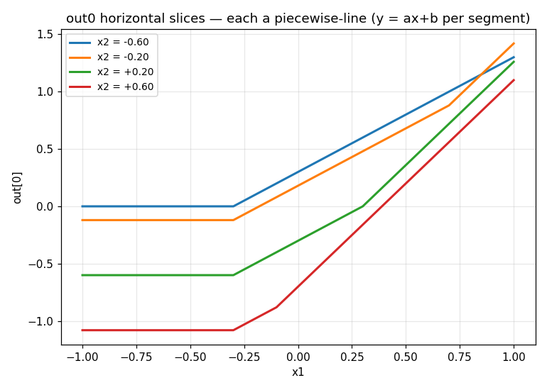
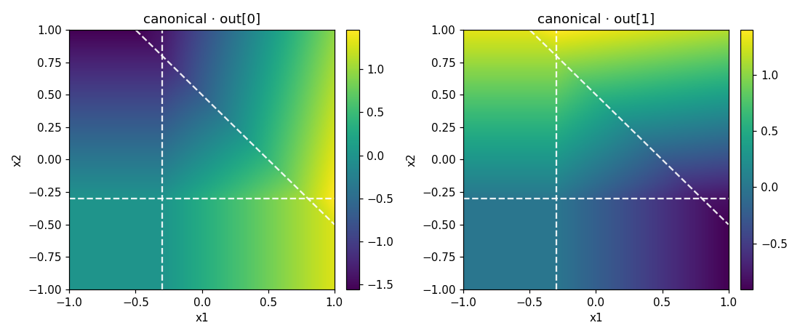
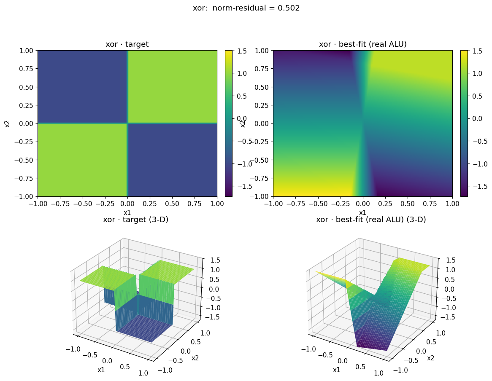
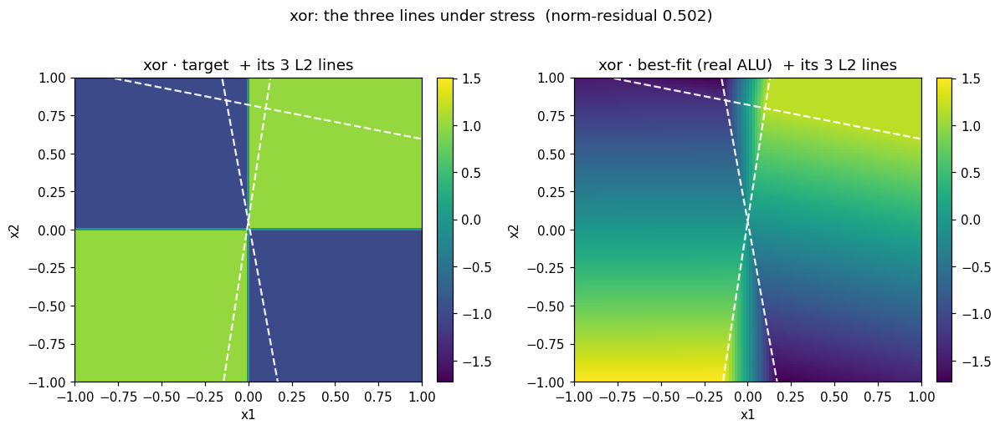

# Rung 0 — What *is* one Ganglion? (the `y = ax + b` story)

> A walkthrough of what one Ganglion can and can't do, told with pictures. Read it top to bottom —
> no background needed.

## The 30-second setup

Our chip is built out of little compute blocks called **Ganglions**. One Ganglion is tiny: it takes
**2 numbers in** (call them `x1`, `x2`) and produces **2 numbers out**. Inside, the important part is
a middle layer with exactly **three little switch-units** (these are the `ReLU`s). Everything after
them is just plain weighted sums. That's it. No magic.

Before we ask the big question of the whole project — *can this chip learn?* — we have to answer a
smaller one first:

> **What shape can one Ganglion even make?** What's the *most* it can do, and where does it give up?

This page answers that in three steps. Each step is one idea and one picture.

---

## Step 1 — A Ganglion is three lines and a flat ramp in each piece

Here's the single most important idea, and it's simpler than it sounds.

That middle layer has **three switch-units, and each one draws a single straight line across the
input square.** On one side of its line the unit is **silent** (outputs 0). On the other side it
**switches on** and ramps up. That's the whole job of this layer: **cut the input space with three
lines.** (The later layers don't cut anything — they just amplify what these three found.)

Here are the three lines of one example Ganglion, one unit per panel — black where it's silent,
bright where it's ramping:


Read the titles: unit 0 is a **vertical** line (it cares about `x1`), unit 1 is **horizontal** (it
cares about `x2`), unit 2 is **diagonal** (it cares about `x1 + x2`). Three units, three lines,
pointing three different ways.

Now stack the three lines on the same square. Where they cross, they chop the space into a few
**zones**. Color each point by *how many of the three are switched on there*:


Bottom-left corner: nobody's on (cream). Walk up and right and you cross the lines one at a time —
1 on (green), 2 on (blue), all 3 on (navy). **That's the Ganglion segmenting its input** — the only
"decision-making" it does happens at these three lines.

> *Aside:* three lines crossing with no symmetry chop the square into as many as **7 little cells.**
> But don't bother counting cells — the cell count is a side-effect. The **three lines** are the real
> knobs: where they sit and which way they point *is* the Ganglion's personality.

So what does the actual output do across these zones? Inside any one zone, it's just a **flat tilted
ramp** — `y = a·x1 + b·x2 + c` — and it only **bends** when you cross a line. Slice the output and
you can see it directly:



Every line here is **straight segments joined at sharp kinks** — never a curve. Each segment is one
`y = ax + b`. The slope changes only at a kink, and a kink is exactly where the slice crosses one of
the three lines. (Move the cut up and watch the kink slide — the lines are fixed, so a higher cut
meets them somewhere else.)

**That's a Ganglion: three lines that segment the input, with a flat ramp in each piece.** Hold that
picture — everything else follows from it.

**One cut, two voices.** Remember a Ganglion has *two* outputs — and they're read off the **same
three lines**. Here are both, with the same three cuts drawn on each:



The bends line up on the same lines, but the ramps differ: `out0` is bright bottom-right, `out1`
bright top-left. The space is segmented **once**; the two outputs are just two different reads of it.

---

## Step 2 — So what can it actually *draw*?

Now the payoff question. A handful of flat pieces can *approximate* a curved shape — the way a
low-poly 3-D model fakes a smooth one. So which target shapes can one Ganglion match, and which beat
it?

We tried six target shapes and let a generic optimizer find the **best** flat-piece fit for each
(free weights — this is *not* the chip learning yet, it's "the best this hardware could ever do").
Each picture is **target on the left, the Ganglion's best try on the right**, as a flat map on top
and the real 3-D shape underneath.

Easy one first. A simple valley (`x1²`) — the pieces fold into a clean trough, basically perfect:


A round bump (a gaussian) — now you can *see* the flat pieces. The Ganglion can't do "round," so it
fakes the dome with a few straight facets. Close, but faceted:


And then **the wall.** XOR — a checkerboard, opposite corners high, the other two low. This needs
**two independent decisions**, and one Ganglion only gets **one** set of three lines. So it can't do
it. Look how the best try just gives up and smears a single ramp across the board:



Lined up, the six shapes make a clean difficulty ladder (lower = better fit, `0` = perfect):

| shape | how well it fits | what it means |
| --- | --- | --- |
| plane | `0.04` | trivial — a single tilted plane needs zero bending |
| parabola `x1²` | `0.13` | easy — one fold makes a clean valley |
| paraboloid | `0.14` | easy — same valley, on the diagonal |
| saddle `x1·x2` | `0.20` | half — gets the tilt, can't make the full twist |
| gaussian bump | `0.24` | half — fakes "round" with flat facets |
| **xor** | **`0.50`** | **the wall — needs two decisions, the atom has one** |

**One-line summary: a Ganglion can bend the plane along one family of cuts.** One valley, any angle —
easy. Anything that needs two genuinely separate boundaries (XOR) — impossible for a single one.
*That's why the chip stacks many of them.*

### Why those limits? Look at the lines.

Step 1 said the only thing a Ganglion really *decides* is **where its three lines go**. So when a fit
fails, the lines tell us why. Here's the best fit's three lines drawn on the two most telling shapes.

**XOR — the wall, seen as lines:**



The optimizer bunches all three lines near the center, straining to split the quadrants apart. But
three lines plus one readout can *carve* regions — it can't make them **alternate** high/low/high/low.
So the best it manages is a single left-right gradient (right panel). The checkerboard needs two
independent decisions; the Ganglion has one. *That's* the wall.

**Gaussian — three lines, used well:**


Here the three lines pass through **one point**, fanning out into **6 wedges** that tile the round
dome. (Compare Step 1, where the lines were in "general position" and chopped up to 7 cells — here
they're *concurrent*, the symmetric case, so 6 wedges.) The dome ends up faceted but clearly there:
this is one Ganglion using its three lines about as well as three lines can be used.

---

## Step 3 — The catch: a fresh chip starts asleep

Steps 1–2 used a hand-placed Ganglion so the three lines always landed nicely inside the square. But
a **real** chip doesn't start hand-tuned — it starts from small **random** weights. Do the three
lines actually fall where we can use them?

Sometimes. Here are three random Ganglions, drawn the same way as Step 1:


Two of them cut the space into several pieces (good — the three lines landed in-square). But the
third (`seed271`) is **one flat piece** — all three of its lines happened to fall *outside* the
square, so nothing gets cut. It's a Ganglion that was **born asleep.**

This is the honest catch, and it's the whole reason the next phase exists. The ability to cut is
**built in** — but whether a *random* start places the lines somewhere useful is luck. The job of
**learning** (the chip's real update rule, tested in Phase 2) is to take a sleepy random Ganglion
like `seed271` and slide its three lines into the useful arrangement we placed by hand in Step 1.
Whether it can is the project's first real open question.

---

## The takeaway (what rung 0 nailed down)

1. **What one Ganglion *is*:** three lines that segment the input, with a flat ramp in each piece. The
   three lines are the knobs; the later layers only amplify.
2. **What it *can do*:** match any single-fold shape (a valley, a ramp) well; fake round shapes with
   flat facets; and **hit a hard wall at XOR**, which needs two decisions it can't make alone.
3. **Where the next question lives:** the cutting is built-in, but a random start may leave the lines
   useless (asleep) — sliding them into place is what learning has to prove.

That's the atom, fully characterized at its simplest ("rung 0", ideal) — and because everything here
is noise-free, our fast stand-in matches the real circuit exactly, which is the clean baseline the
next rungs perturb. Rung 1 onward adds the real chip's physical limits (a weight ceiling, then charge
saturation) **and the first noise/variance tests**, asking how each one bends this picture.

---

## Run it yourself

From the repo root:

```bash
python -m src.experiment.phase1_new.rung0.step1_structure   # the three lines + slices (Step 1)
python -m src.experiment.phase1_new.rung0.step2_capacity     # reachability ladder    (Step 2)
python -m src.experiment.phase1_new.rung0.step3_init         # random-init luck       (Step 3)
```

Figures land in `figures/step1|2|3/` (each folder also has a `gallery.md` that embeds every image so
you can scroll one file). The shared building blocks live one level up: `harness.py` (drives the real
Ganglion), `metrics.py` (reads the pieces off a surface), `plots.py` (the pictures), `reach.py` (the
best-fit search).
