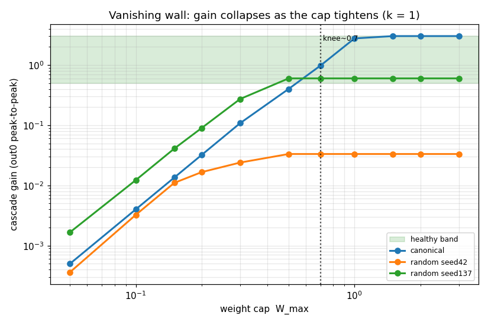
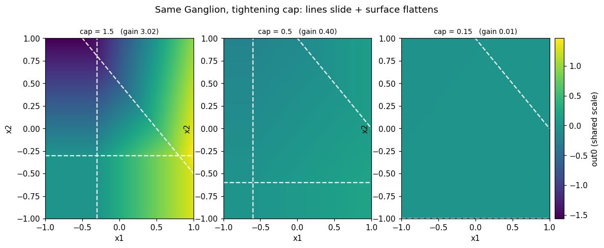
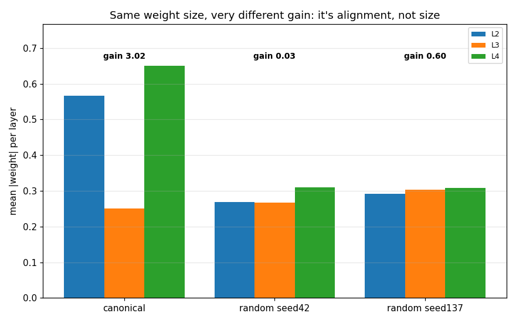
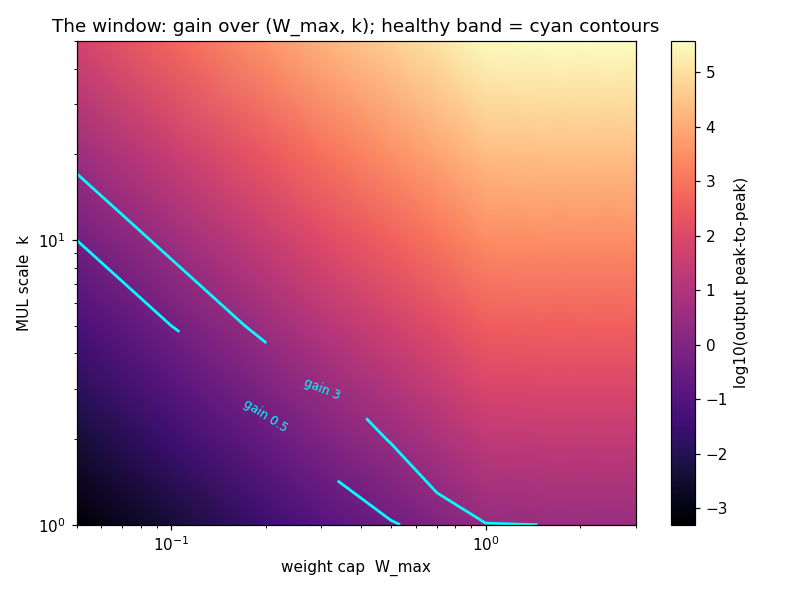
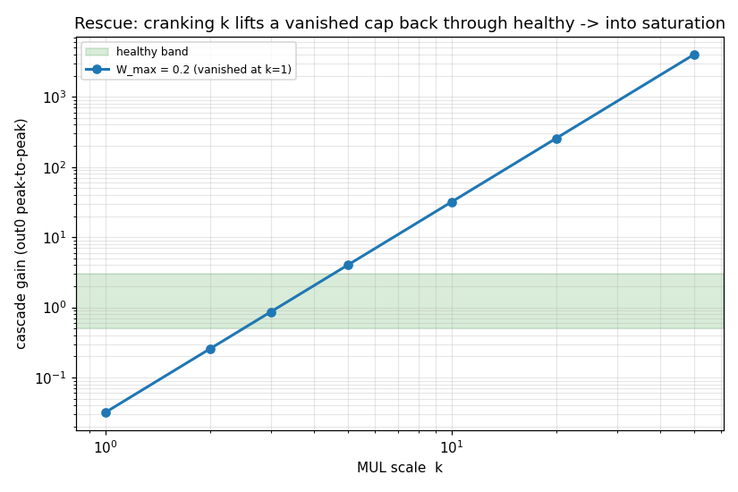
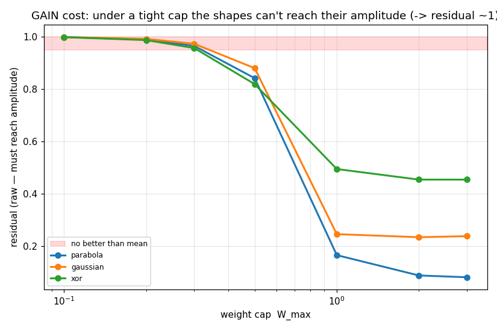
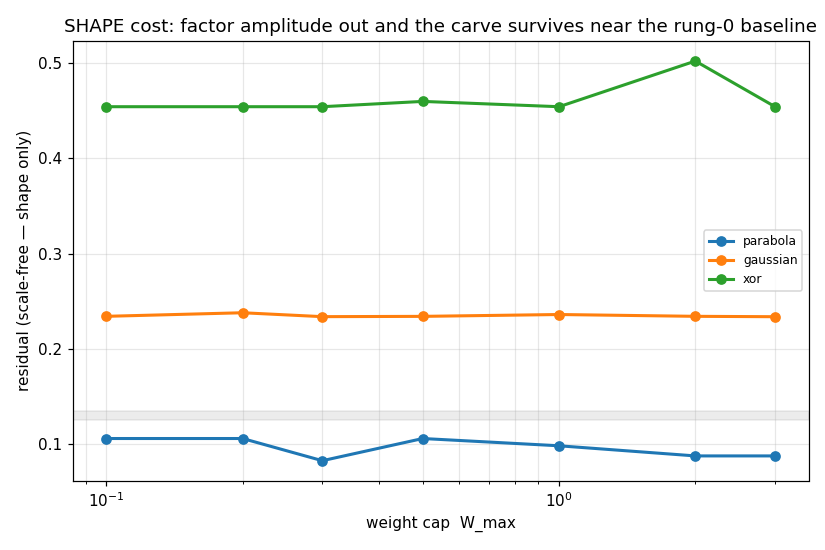
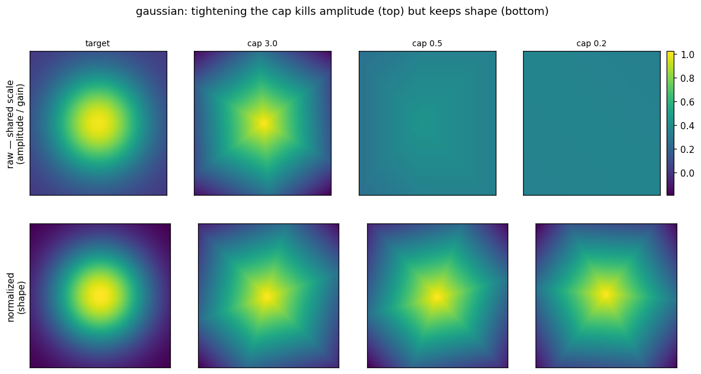
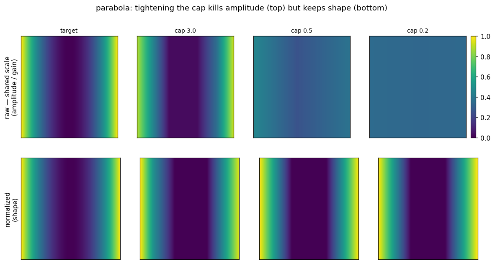

# Rung 1 — The weight ceiling (why a cap can vanish the whole signal)

> Read rung 0 first if you haven't — it shows what one Ganglion *is* (three lines, a flat ramp in
> each piece). This page adds the first piece of real-chip physics and finds where it bites.

## What changed since rung 0

Rung 0 let weights be any size. A real chip can't: a weight is a charge on a tiny capacitor, and a
capacitor has a **voltage ceiling** (~0–3V). So weights are **capped**. The obvious guess is "a cap
just squashes the output a bit." The real story is sharper, and it comes from one fact about
multiplication.

## Step 1 — Multiply shrinks below 1, and three layers make it brutal

Here's the whole intuition. Addition is gentle; **multiplication is not**:

```
2 × 2 = 4     (grows)
0.2 × 0.2 = 0.04   (shrinks — and it's 0.04, not 0.4!)
```

A Ganglion pushes its signal through **three** layers, each a multiply-and-sum. So the output is
roughly the **weight size cubed**. If the cap forces every weight below 1, the signal doesn't just
dim — it **collapses cubically** with depth. Three layers, gone.

We measured it directly — sweep the cap, watch the output amplitude (the "gain"):



That's a log-log plot, so the straight collapsing line **is** the cube law (slope ≈ 3). The canonical
Ganglion (blue) is fine while the cap is loose, then falls off a cliff around a cap of **~0.6** — the
*knee*. Below it, the signal is gone.

Two things worth staring at:

- The green band is the "healthy" gain zone. **Below the knee you drop out the bottom of it.**
- The orange line is a **random fresh Ganglion** (rung 0's `seed42`). It sits at gain ≈ 0.03 *at every
  cap* — it never even reaches the healthy band. A small-random start is **already** in the vanished
  zone, cap or no cap. (That's rung 0's "fresh draws whisper," now with a number on it.)

And here's the same Ganglion as the cap tightens — the three lines slide inward **and** the surface
flattens to a dead, uniform color at the same time:



So the ceiling does two things at once: it **moves the lines** (it clips big weights, which shifts the
`−b/w` ratios that set line positions) and it **crushes the amplitude**. Below the knee, only the
crush matters — there's nothing left to see.

### Why do two fresh chips get wildly different gain?

Look back at that gain curve: `seed42` sits at 0.03, `seed137` at 0.60 — a **20× gap** between two
random draws. You'd guess `seed42` just drew smaller weights. It didn't:



Their per-layer weight **sizes are nearly identical** (the orange/blue/green bars are the same height
for both) — yet one is 20× louder. The gain isn't set by weight *size*, it's set by **alignment**:
whether the signed products line up (reinforce) or fight (cancel) as they pass through the three
layers, plus whether the ReLU lines sit so signal actually flows. Same budget, different luck.
(`canonical`, the hand-built one, has both bigger *and* aligned weights → gain 3.0.)

The lesson for later: a fresh chip's loudness is a coin-flip even when the weights look the same — so
gain is something **learning will have to actively fix**, not something a good init guarantees.

## Step 2 — The fix: the multiplier's own scale knob (and why it's not free)

Real analog multipliers always carry a built-in scale `k` — a "decimal shift." Store `0.2`, let the
multiply do `0.2 × 0.2 × 10 = 0.4`. Physically that's just choosing the transconductance; it moves
where "unity gain" sits. Since gain grows like **(k · W_max)³**, cranking `k` pulls a vanished
Ganglion right back up.

But it's a knob with two ends — too little `k` vanishes, too much `k` **saturates** (every signal
slams the rail and you lose all resolution). There's a **window** between. We swept both knobs:



Dark = vanished, bright = saturated, and the cyan contours are the edges of the healthy band. Notice
they're **straight diagonals** — that's `k · W_max = constant`, the cube law drawn as a map. The
practical reading: **it's not the cap alone that matters, it's the product `k · W_max`.** Pick a
physical cap, then set `k` to land on the healthy diagonal.

Seen as a single rescue — take a cap that's dead at `k=1` and turn `k` up:



It climbs up through the healthy band and then keeps going into saturation. You want to stop in the
green.

## Step 3 — So what does the cap actually cost? (the rung-0 shapes again)

We brought back parabola, gaussian, and xor from rung 0 and re-fit them with the weights **bounded by
the cap**, asking two different questions.

**Can the output reach the target's height?** (amplitude — the "gain cost")



Below the knee, *every* shape flatlines at "no better than the mean" — a too-tight cap can't
represent **anything**, because there's no amplitude left.

**Can it still carve the right shape, if we ignore height?** (the "shape cost")



Flat lines — and they sit right at rung 0's scores (parabola ~0.1, gaussian ~0.23, xor ~0.45). Even a
brutally tight cap keeps the **shape**; it just can't make it **loud**.

Put those two pictures together and you get the headline of the whole rung:

> **The weight ceiling is a gain limit, not a shape limit. It makes the Ganglion quiet, not dumb.**

Which is exactly what the architecture expects: the later layers are *amplifiers*, and a sub-1 cap is
an attack on their volume, not on the three lines that do the deciding.

And here it is as the **real shape**, not a residual number — the capped hardware's actual best attempt
at the gaussian, then the parabola, as the cap tightens left to right:





Read each as two rows. **Top** is real units on one shared color scale: the dome (and the valley) fade
to a flat, dead wash as the cap tightens — **the gain dying, with your eyes**. **Bottom** rescales each
panel on its own: the *same* dome and valley are still there at every cap — **the shape surviving**.
Top row quiet, bottom row intact: gain limit, not shape limit, in one picture.

## The takeaway (what rung 1 nailed down)

1. **The danger is cascade collapse.** A sub-knee cap (~0.6 here) vanishes the signal cubically through
   the three layers — and a random fresh Ganglion is already down there.
2. **Loudness is luck, not weight size.** Two fresh draws with the same weight sizes differ 20× in gain
   on alignment alone — so gain is something learning must fix, not something init hands you.
3. **The cure is the multiplier scale `k`,** and the thing to control is the **product `k · W_max`** —
   land it on the healthy diagonal (gain ~0.5–3). The "right ceiling" isn't one number; it's a product.
4. **The cap costs volume, not smarts.** Shape reachability is nearly cap-proof; only amplitude dies —
   seen as a number (Step 3 curves) and as the real shapes above.

Next rung adds **soft saturation** (the cap charges gently toward the rail instead of a hard clip) and,
now that we have a clean operating window, brings in the **noise / variance tests** — asking how both
reshape this picture.

## Run it yourself

From the repo root:

```bash
python -m src.experiment.phase1_new.rung1.step1_vanishing   # the cascade collapse  (Step 1)
python -m src.experiment.phase1_new.rung1.step2_window       # the k window          (Step 2)
python -m src.experiment.phase1_new.rung1.step3_cost         # cost on the trio      (Step 3)
```

Figures land in `figures/step1|2|3/` (each with a `gallery.md`). The cap and the scale `k` are config
switches on the shared `harness.GanglionProbe` one level up — no library change; they're the ALU's
forward behavior as a harness stand-in (clamp-then-scale is identical to a per-multiply `k`).
